# 银行四项问题和3D银行需检查资源客户经理和理财经理清除成绩

### <font style="color:rgb(51, 51, 51);">1. 银行四项8套题学校安装版\login\index.htm</font>


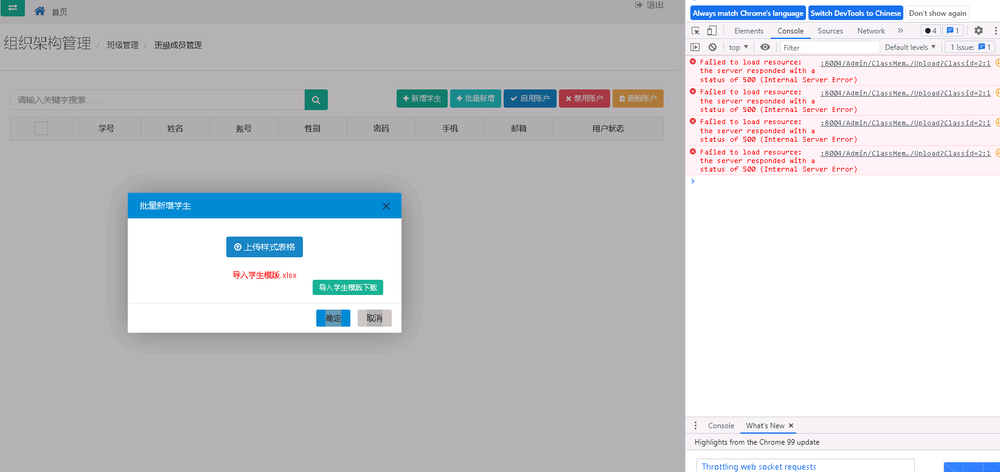

```dockerfile
导入表格需要添加权限everyone权限
大堂经理和综合柜员需要加上everyone权限、
```


### 2. 综合柜台题目解析第二页无法显示剔除逗号的问题
```dockerfile
update tb_TaskResultDesc set SysDesc=(REPLACE(SysDesc,',1','1'))
update tb_TaskResultDesc set SysDesc=(REPLACE(SysDesc,',0','0'))
update tb_TaskResultDesc set SysDesc=(REPLACE(SysDesc,',2','2'))
update tb_TaskResultDesc set SysDesc=(REPLACE(SysDesc,',3','3'))
update tb_TaskResultDesc set SysDesc=(REPLACE(SysDesc,',4','4'))
update tb_TaskResultDesc set SysDesc=(REPLACE(SysDesc,',5','5'))
update tb_TaskResultDesc set SysDesc=(REPLACE(SysDesc,',6','6'))
update tb_TaskResultDesc set SysDesc=(REPLACE(SysDesc,',7','7'))
update tb_TaskResultDesc set SysDesc=(REPLACE(SysDesc,',8','8'))
update tb_TaskResultDesc set SysDesc=(REPLACE(SysDesc,',9','9'))

update bi_SerialNo set Serial_Value='0000' 
```


```dockerfile
更改密码
update [DTJL_20220413].[dbo].[tb_User] set Password='dysoft' where Type='1'
 update [KHJL_20220413].[dbo].[tb_System_User] set User_Password='dysoft2021' where  IsDefault='1'
```

###  3. 综合柜台无法导入学生账号问题，需要清除tb_user学生信息
清除tb_student学生信息才能导入

delete [ZHGT20220428].[dbo].[tb_User] where Type='3';

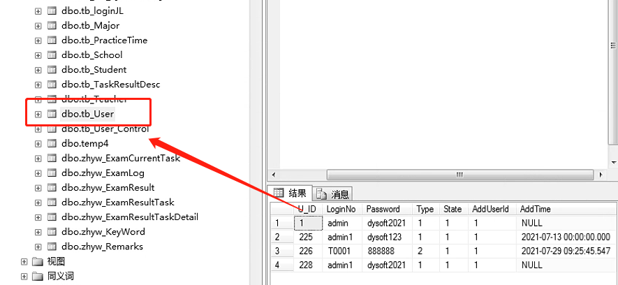


### <font style="color:rgb(0, 0, 0);">4. 银行核心四项安装检查步骤</font>
<font style="color:rgb(0, 0, 0);"></font>

<font style="color:rgb(0, 0, 0);">1、</font><font style="color:rgb(0, 0, 0);">安装四项比赛站点</font>

<font style="color:rgb(0, 0, 0);"></font>

<font style="color:rgb(0, 0, 0);">2、</font><font style="color:rgb(0, 0, 0);">还原四项比赛数据库</font>

<font style="color:rgb(0, 0, 0);"></font>

<font style="color:rgb(0, 0, 0);">3、</font><font style="color:rgb(0, 0, 0);">打开综合柜员后台，系统管理</font><font style="color:rgb(0, 0, 0);">->数据库配置，设置四项数据库配置</font>

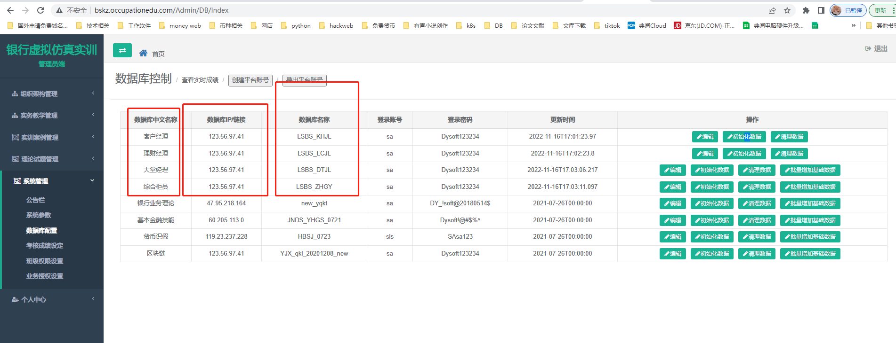

<font style="color:rgb(0, 0, 0);"></font>

<font style="color:rgb(0, 0, 0);"></font>

### <font style="color:rgb(0, 0, 0);">5、打开综合柜员后台，系统管理->考核成绩设定，设置需要导出成绩的核心四项考核ID</font>
<font style="color:rgb(0, 0, 0);"></font>

<font style="color:rgb(0, 0, 0);">大堂经理/综合柜员   select  from bsi_PracticeAssessment</font>

<font style="color:rgb(0, 0, 0);">理财经理/客户经理   select  from dal_ComplexPlan</font>

<font style="color:rgb(0, 0, 0);"></font>

### <font style="color:rgb(0, 0, 0);">6、初始化四项数据</font>
<font style="color:rgb(0, 0, 0);"></font>

### <font style="color:rgb(0, 0, 0);">7、导入比赛账号</font>
<font style="color:rgb(0, 0, 0);"></font>

### <font style="color:rgb(0, 0, 0);">8、设置综合柜员和大堂经理的比赛开始时间，以便进行倒计时处理</font>
<font style="color:rgb(0, 0, 0);">\Views\StuHome\Index.cshtml   修改比赛开始时间</font>

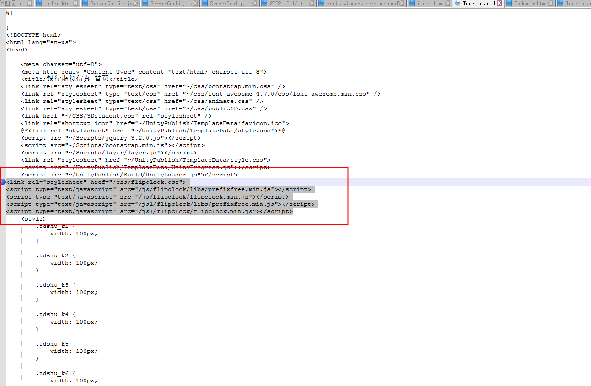

```shell
<link rel="stylesheet" href="/css/flipclock.css">
<script type="text/javascript" src="/js/flipclock/libs/prefixfree.min.js"></script>
<script type="text/javascript" src="/js/flipclock/flipclock.min.js"></script>
<script type="text/javascript" src="/js1/flipclock/libs/prefixfree.min.js"></script>
<script type="text/javascript" src="/js1/flipclock/flipclock.min.js"></script>
```

<font style="color:rgb(0, 0, 0);"></font>

### <font style="color:rgb(0, 0, 0);">9、理财经理跟客户经理比赛模式确认表（考核:1  练习:0）Bi_Verify ；大堂及柜员是手动设置模式</font>
<font style="color:rgb(0, 0, 0);"></font>

### <font style="color:rgb(0, 0, 0);">10、客户经理提交后不能继续作答：bi_BankTeller /触发器</font>
<font style="color:rgb(0, 0, 0);"></font>

### <font style="color:rgb(0, 0, 0);">11、实时成绩修改ip路径 D:\2022银行核心\2022银行国赛程序\综合柜员2\show</font>
### <font style="color:rgb(0, 0, 0);">控制站点综合柜员2里面的</font>
```dockerfile
<!-- 图表 -->
<div class="centerBox">
<div id="main"></div>
</div>
</body>
<script>
let baseUrl = 'http://10.10.1.137:5003/';
let myChart = echarts.init(document.getElementById('main'));
let timer;
let blocking;
let type = getParam()['type'];
```

<font style="color:rgb(0, 0, 0);"></font>

### <font style="color:rgb(0, 0, 0);">12、客户经理数据清理：</font>
```dockerfile
truncate table lock_Individual_Customer
truncate table Lock_Customer
```

<font style="color:rgb(0, 0, 0);"></font>

### <font style="color:rgb(0, 0, 0);">13、首页登陆采用抽岗版本、账号岗位抽签后绑定当前机器ip，无法更换设备使用</font>
<font style="color:rgb(0, 0, 0);"></font>

<font style="color:rgb(23, 26, 29);">D:\2022银行核心20220418\综合柜员\Scripts 综合柜员、大堂经理</font>  
<font style="color:rgb(23, 26, 29);">D:\2022银行核心20220418\客户经理\Content\scripts 客户经理、理财经理</font>

<font style="color:rgb(0, 0, 0);">客户经理和理财经理login.js</font>

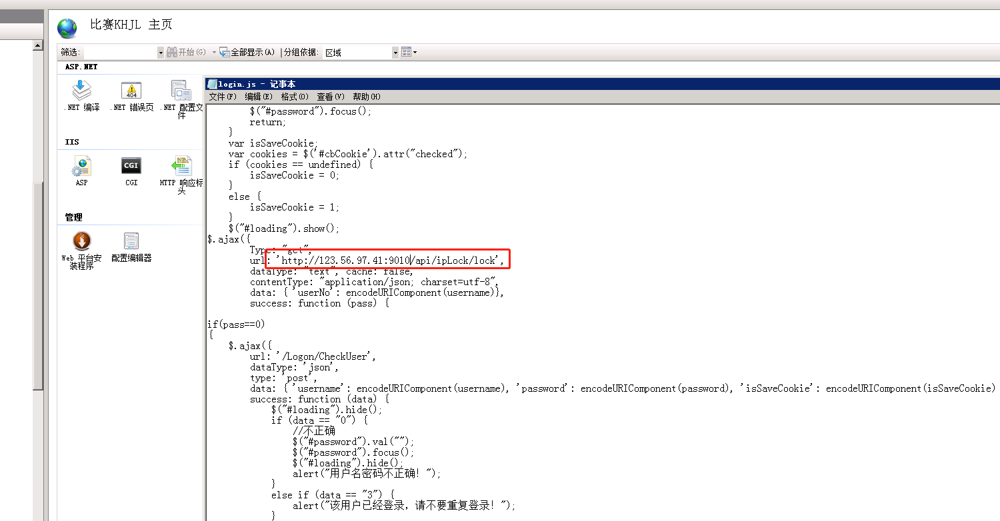

大堂经理和综合柜台

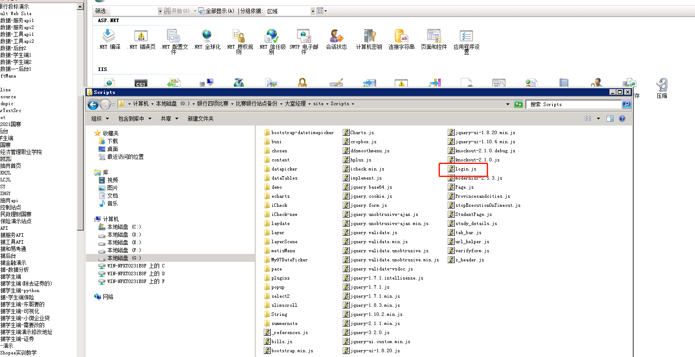

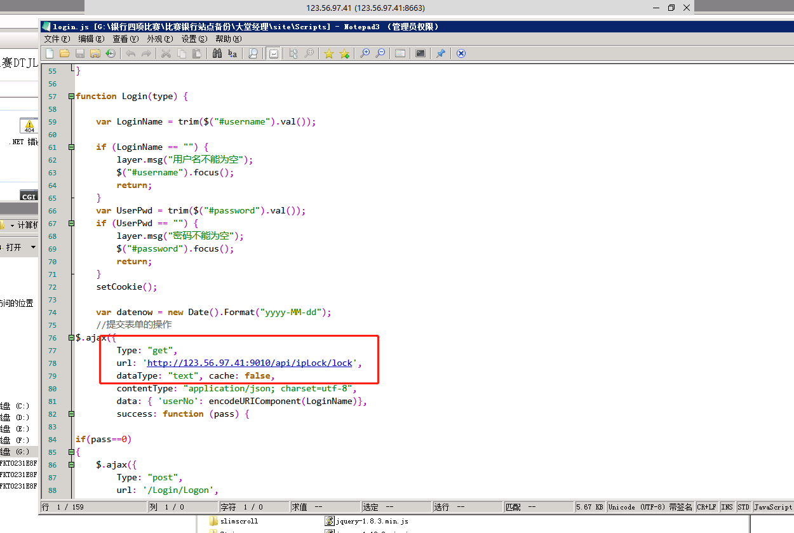


#### 客户经理和理财经理倒计时设置
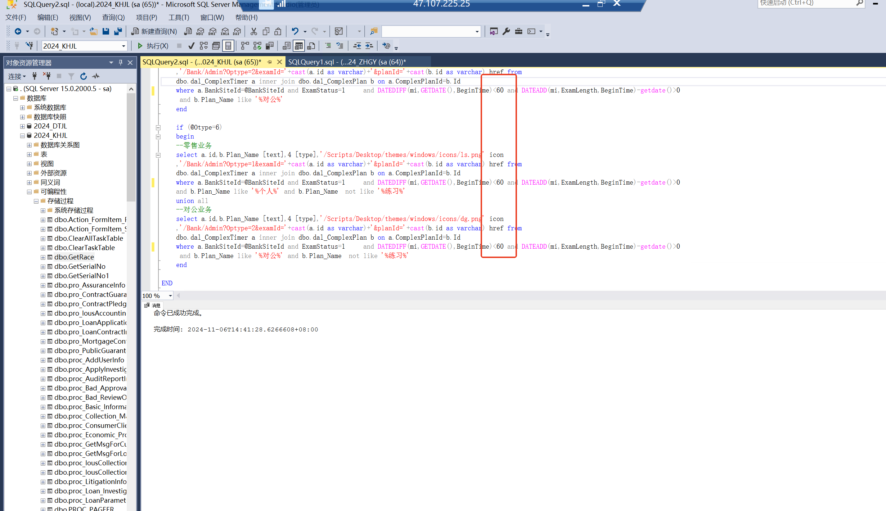


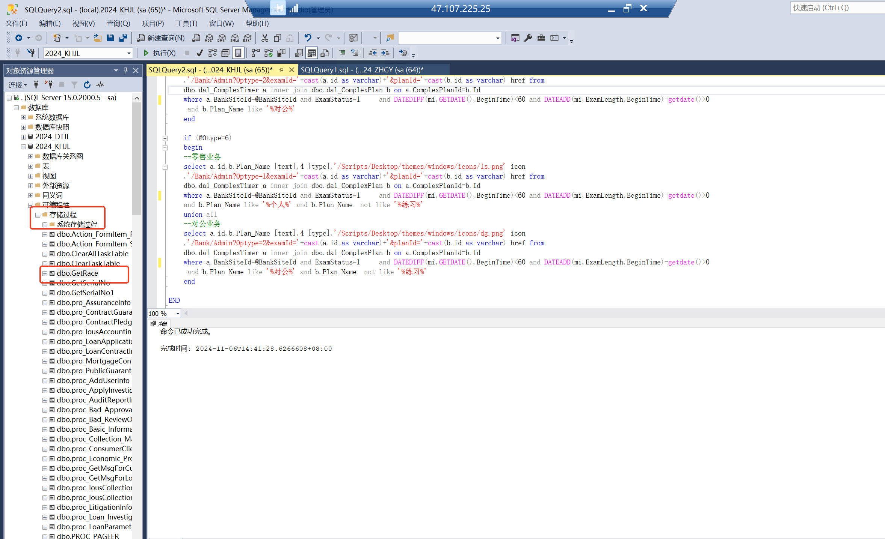

### <font style="color:rgb(0, 0, 0);">14、登陆测试结束后，需清理iplock数据库。清理数据前查询SELECT TOP 1000 [id]</font>
<font style="color:rgb(0, 0, 0);">,[UserNo]</font>

<font style="color:rgb(0, 0, 0);">,[IpAddress]</font>

<font style="color:rgb(0, 0, 0);">,[AddTime]</font>

<font style="color:rgb(0, 0, 0);">FROM [iplock].[dbo].[IP_table]</font>

<font style="color:rgb(0, 0, 0);"></font>

<font style="color:rgb(0, 0, 0);">后truncate table [IP_table]删除表</font>

<font style="color:rgb(0, 0, 0);"></font>

<font style="color:rgb(0, 0, 0);">理财计算打开设</font>

<font style="color:rgb(0, 0, 0);"></font>

<font style="color:rgb(0, 0, 0);"></font>

<font style="color:rgb(0, 0, 0);">大堂经理连接到本地资源</font>

```sql
update bsi_TaskCustomerInquiry set QuestionVideo='/video/'+REVERSE(SUBSTRING(REVERSE(QuestionVideo),0,CHARINDEX('/',REVERSE(QuestionVideo)))) where QuestionVideo<>'' and taskid=
+案列ID
####案例ID###查询bsi_task

select * from bsi_TaskCustomerInquiry where CustomerId=41

select * from bsi_Task


/video/题干.mp4
/video/英语第6题.mp4
/video/11----题干.mp4
/video/第七题 题干.mp4
/video/手语第6题.mp4
/video/第三题题干.mp4
/video/第十二题题干.mp4
大堂和柜员客户名称表格:bsi_taskcustorm
```


### 查询资源
```plsql
select QuestionVideo,* from bsi_TaskCustomerInquiry 
SELECT 
    '/video/' + REVERSE(SUBSTRING(REVERSE(QuestionVideo),0,CHARINDEX('/',REVERSE(QuestionVideo)))) as NewQuestionVideo,
    QuestionVideo as OldQuestionVideo
FROM bsi_TaskCustomerInquiry 
WHERE QuestionVideo <> ''
```

遇到无法播放视频文件的问题需要检查MIME类型里面是否添加mp4格式

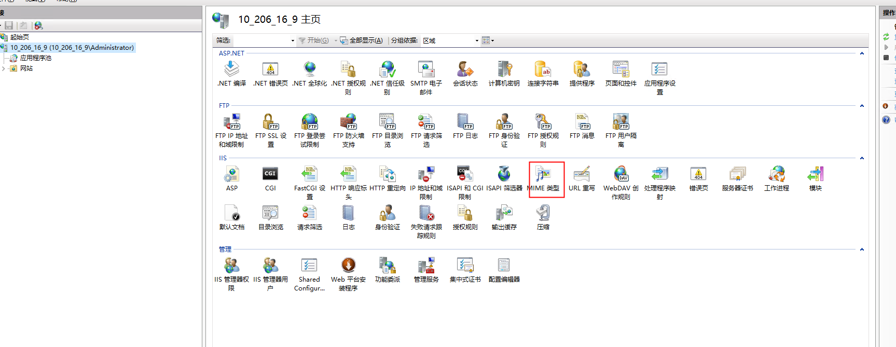

拷贝客户经理和理财经理的webconfig后可以正常编译大堂经理和理财经理后在webconfig需要添加配置 <add key="StudentAttachmentPath" value="/ExcelTemplate/"/>  

否则学生管理报错

### 关闭浏览器复制拖动功能
DTJL和ZHGY路径

D:\20230203银行四项\site\ZHGY\Views\ServiceRecord\Index.cshtml

ZHGY\Views\Shared\_StutentLayoutIsNull.cshtml

```json
<script>
        $('body').on('paste', e => { e.preventDefault() })
    $("#form1").attr("autocomplete", "off");
document.ondragstart = function () { return false; }         
</script>
```

```json
<script src="https://code.jquery.com/jquery-3.6.0.min.js"></script> <!-- 确保jQuery已加载 -->
<script>
    // 禁用粘贴
    $(document).on('paste', 'input, textarea, [contenteditable]', function(e) {
        e.preventDefault();
    });

    // 禁用复制/剪切
    $(document).on('copy cut', 'input, textarea, [contenteditable]', function(e) {
        e.preventDefault();
    });

    // 禁用右键菜单（防止通过右键复制）
    $(document).on('contextmenu', function(e) {
        e.preventDefault();
    });

    // 禁用文本选择（CSS方式）
    $('body').css({
        'user-select': 'none',
        '-moz-user-select': 'none',
        '-webkit-user-select': 'none',
        '-ms-user-select': 'none'
    });

    // 原有其他代码
    $("#form1").attr("autocomplete", "off");
    document.ondragstart = function () { return false; };
</script>
```

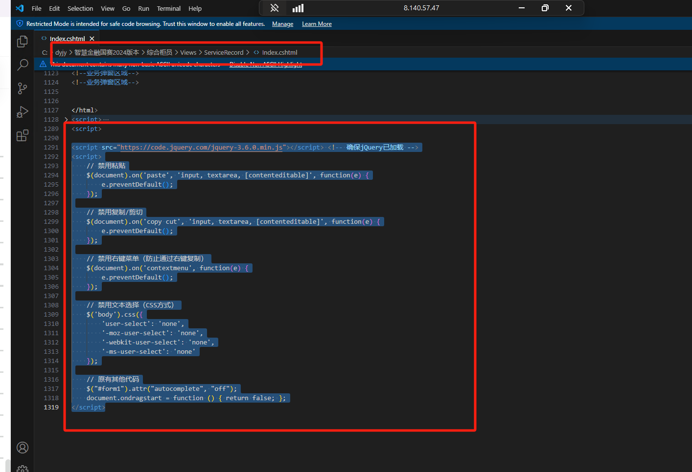

添加代码：document.onselectstart = function () { return false; }

```csharp
document.ondragstart=funtion() {return false;}
document.onselectstart=funtion() {return false;}
```

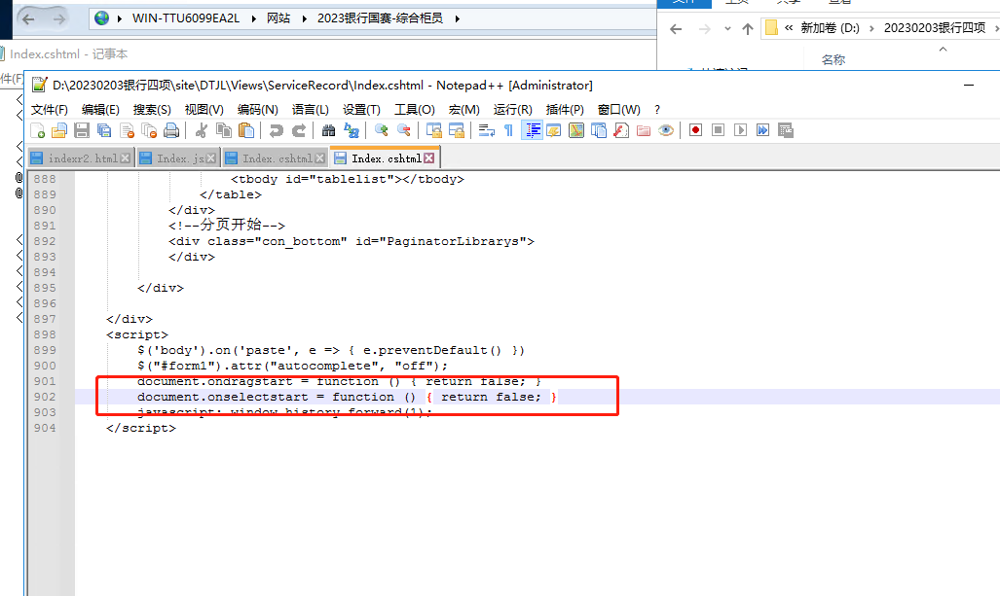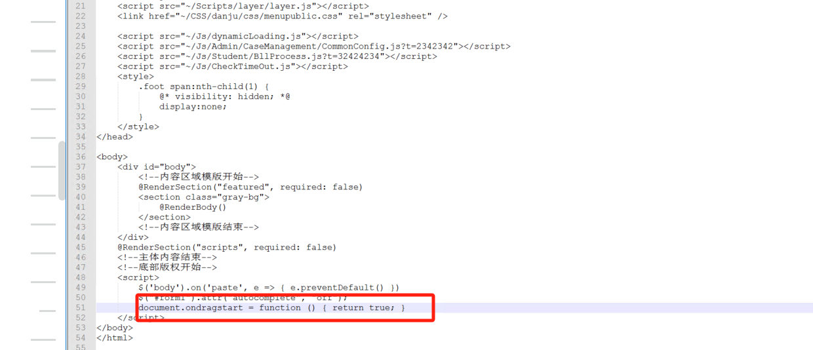

客户经理和理财经理关闭复制张贴功能

D:\2022高校比赛\银行四项比赛（旧规程）\理财经理\Areas\Bank\Views


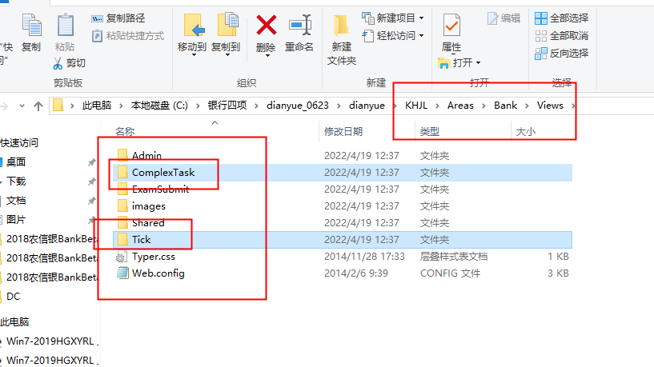

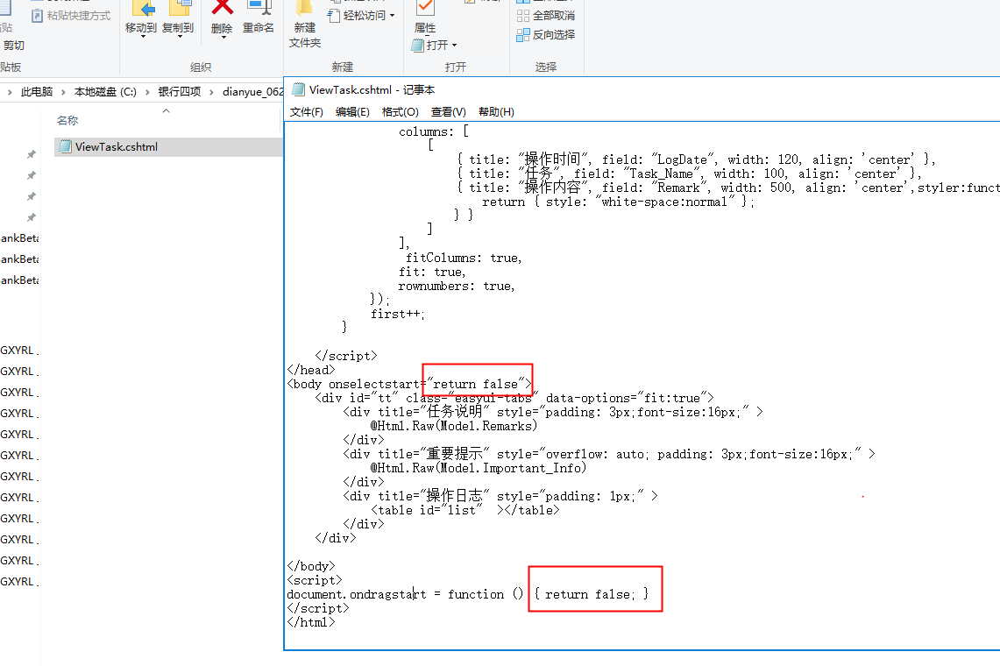

大堂经理复制张贴

```json
C:\dyjy\智慧金融国赛2024版本\大堂经理\Views\Shared
```

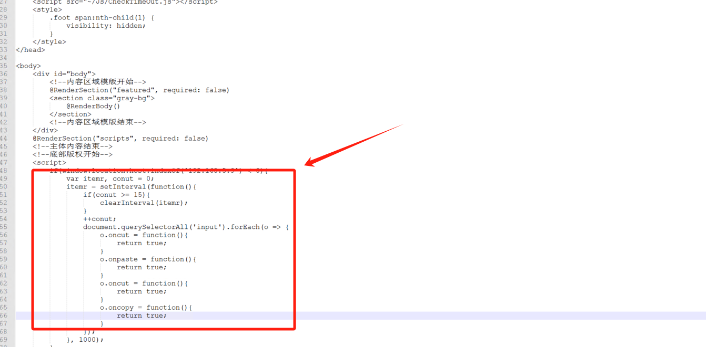

### 理财经理和客户经理表单无法复制张贴
C:\dyjy\智慧金融国赛2024版本\理财经理\Form

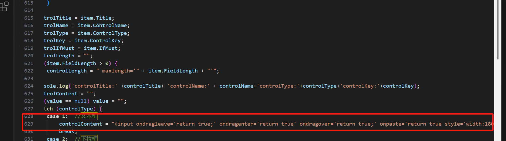

### 控制站点综合柜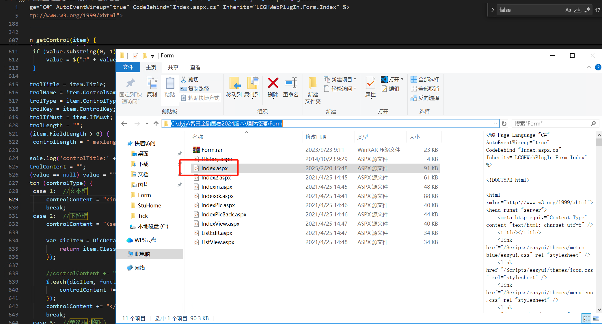员里面出现无法编辑，表格dbConfig
### 需要增加字段GoUrl字段类型varchar(200)，可以编辑
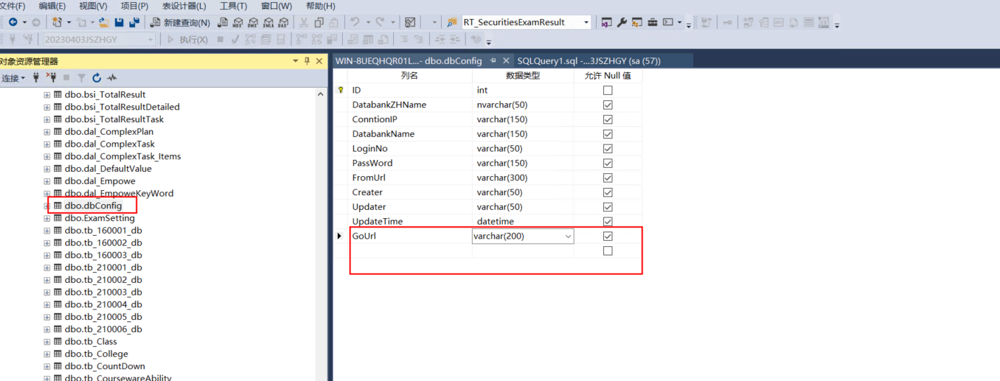

理财经理数据初始化

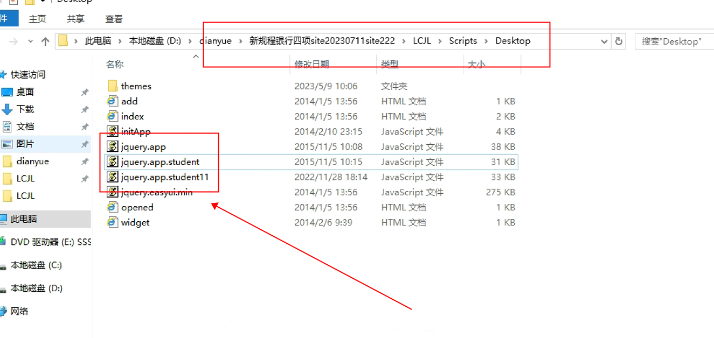


### 保险sc关闭复制张贴关联三个表格
```csharp

```


### 手机银行没有教师账号无法开题
```plsql
select * from P2P_Users where U_UserType=2

select * from P2P_UserInfo where 


update P2P_UserInfo set ui_uid=68 where uiid=3321


select * from P2P_ClassAssign 

select * from P2P_ClassInfo

update P2P_ClassAssign set CA_TeacherID=3321


select * from P2P_UserInfo where UI_UserType=1
```

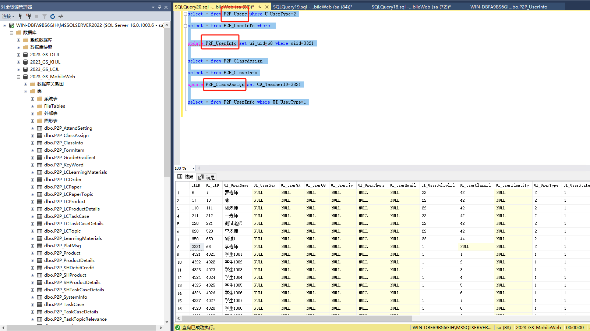

金融机具

vtm，stm，手机银行配置


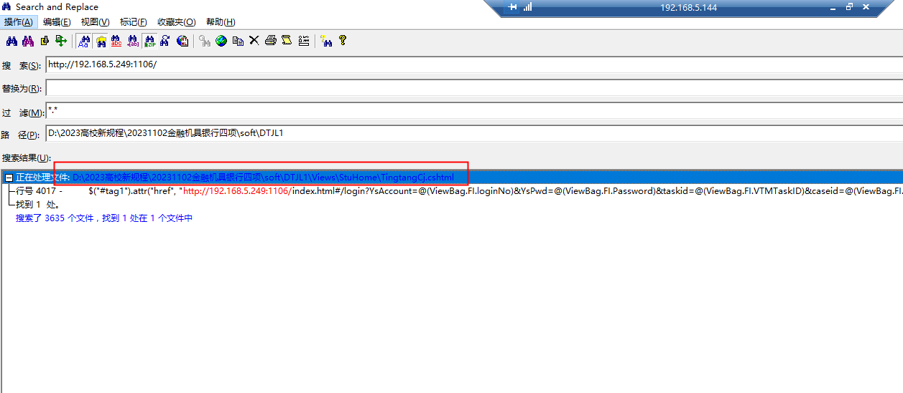


```plsql
<div id="zhongduan" style="display: none;">
	<div class="gb_layer">
        <div class="box">
            <div class="closeBtn"></div>
            <div class="item item_vtm">
                <a id="tag1" class="img" href="http://192.168.5.144:8996/index.html#/login?YsAccount=@(ViewBag.FI.loginNo)&YsPwd=@(ViewBag.FI.Password)&taskid=@(ViewBag.FI.VTMTaskID)&caseid=@(ViewBag.FI.VTMCaseID)&type=@(ViewBag.FI.TypeID)&endTime=@(ViewBag.FI.VTMEndTime)" target="_blank"></a>
                <p>VTM</p>
                <div class="btn" onclick="chongzhi(1)">重置</div>
            </div>
            <div class="item item_stm">
                <a id="tag2" class="img" href="http://192.168.5.144:8997/index.html#/login?YsAccount=@(ViewBag.FI.loginNo)&YsPwd=@(ViewBag.FI.Password)&taskid=@(ViewBag.FI.STMTaskID)&caseid=@(ViewBag.FI.STMCaseID)&type=@(ViewBag.FI.TypeID)&endTime=@(ViewBag.FI.STMEndTime)" target="_blank"></a>
                <p>STM</p>
                <div class="btn" onclick="chongzhi(2)">重置</div>
            </div>
            <div class="item item_phone">
                <a id="tag3" class="img" href="http://192.168.5.144:9001/#/pages/exam/examList/examList?account=@(ViewBag.FI.loginNo)&password=@(ViewBag.FI.Password)&caseId=@(ViewBag.FI.MobilePhoneCaseID)" target="_blank"></a>
                <p>手机银行</p>
                <div class="btn" onclick="chongzhi(3)">重置</div>
            </div>
        </div>
	</div>
```

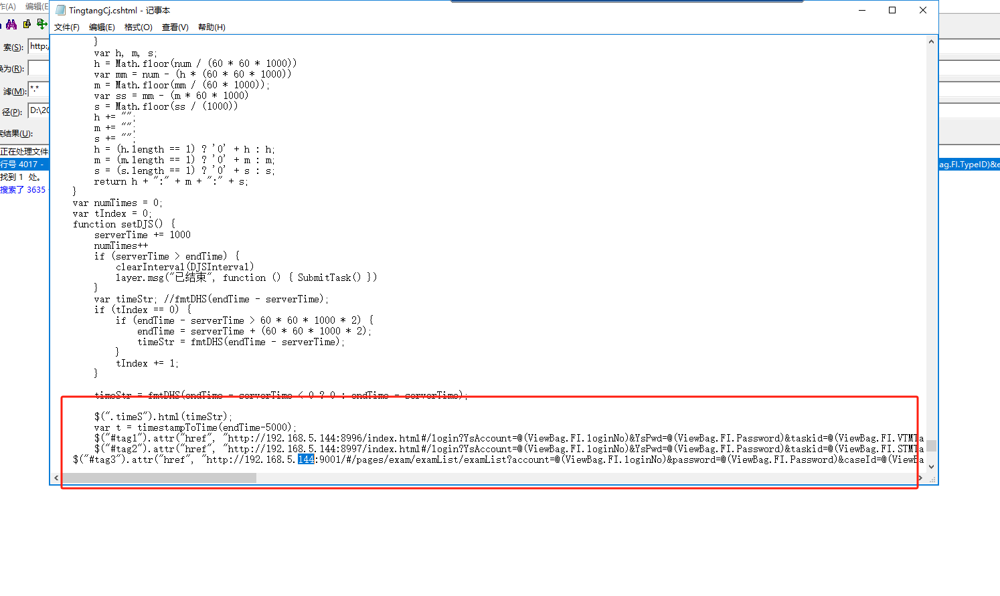


```json
var t = timestampToTime(endTime-5000);
$("#tag1").attr("href", "http://192.168.5.144:8996/index.html#/login?YsAccount=@(ViewBag.FI.loginNo)&YsPwd=@(ViewBag.FI.Password)&taskid=@(ViewBag.FI.VTMTaskID)&caseid=@(ViewBag.FI.VTMCaseID)&type=@(ViewBag.FI.TypeID)&endTime=" + t);
$("#tag2").attr("href", "http://192.168.5.144:8997/index.html#/login?YsAccount=@(ViewBag.FI.loginNo)&YsPwd=@(ViewBag.FI.Password)&taskid=@(ViewBag.FI.STMTaskID)&caseid=@(ViewBag.FI.STMCaseID)&type=@(ViewBag.FI.TypeID)&endTime=" + t);
$("#tag3").attr("href", "http://192.168.5.144:9001/#/pages/exam/examList/examList?account=@(ViewBag.FI.loginNo)&password=@(ViewBag.FI.Password)&caseId=@(ViewBag.FI.MobilePhoneCaseID)&endTime=" + t);
```

手机银行配置

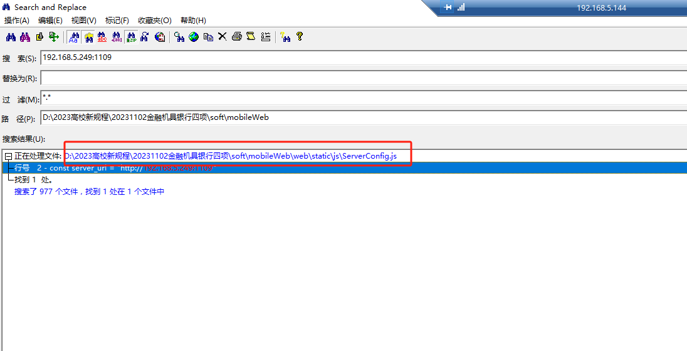

路径

```json
 D:\2023高校新规程\20231102金融机具银行四项\soft\mobileWeb\web\static\js\ServerConfig.js

```

#### 手机银行更改配置显示学生
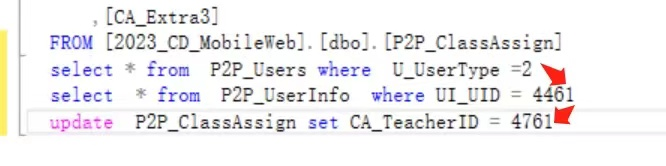


#### 智慧金融开题以及导出成绩
##### 大堂经理和综合柜员
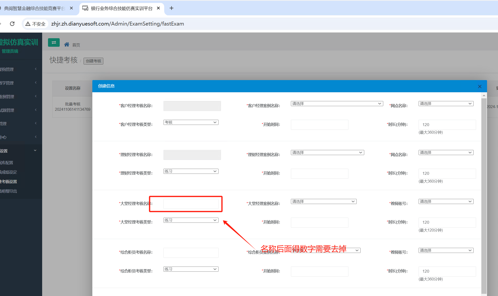


##### 开完题目后需要绑定 ID
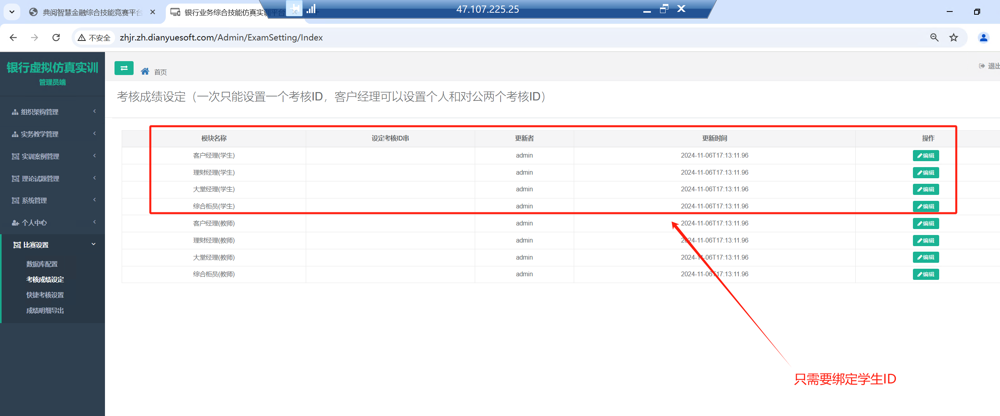

##### 绑定 ID 后才能导出成绩
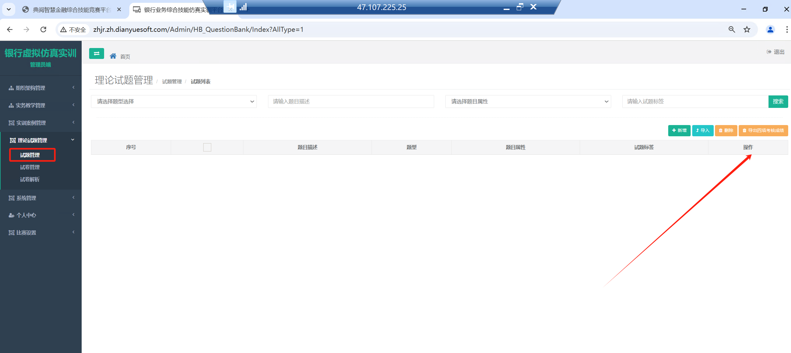


### 3D 银行检查资源配置
检查\Views\StuHome下面所有页面


### 比赛全部数据库备份脚本
```sql
DECLARE @backupPath NVARCHAR(255) = 'C:\dbBank\江苏省赛\制作账号' -- 修改为你的备份路径
DECLARE @timestamp VARCHAR(20) = CONVERT(VARCHAR(20), GETDATE(), 112) + REPLACE(CONVERT(VARCHAR(20), GETDATE(), 108), ':', '')
DECLARE @dbName NVARCHAR(255)
DECLARE @sqlCommand NVARCHAR(MAX)

DECLARE db_cursor CURSOR FOR
SELECT name 
FROM sys.databases 
WHERE name NOT IN ('master', 'model', 'msdb', 'tempdb')  -- 排除系统数据库
AND state = 0  -- 只处理在线数据库

OPEN db_cursor
FETCH NEXT FROM db_cursor INTO @dbName

WHILE @@FETCH_STATUS = 0
BEGIN
    SET @sqlCommand = '
    BACKUP DATABASE [' + @dbName + '] 
    TO DISK = ''' + @backupPath + @dbName + '_' + @timestamp + '.bak''
    WITH COMPRESSION,  -- 启用压缩（需要企业版/标准版）
    CHECKSUM,          -- 验证校验和
    STATS = 5;         -- 显示进度（每5%更新）
    '

    PRINT 'Backing up: ' + @dbName
    EXEC(@sqlCommand)
    
    FETCH NEXT FROM db_cursor INTO @dbName
END

CLOSE db_cursor
DEALLOCATE db_cursor

PRINT 'All user databases backup completed.'
```

### 客户经理和理财经理清除成绩
```json
truncate table dzs_ExamResult  /**--考核业务成绩管理表--**/
truncate table dzs_ExamResult_Detail
truncate table dbo.zhyw_ExamLog
truncate table dbo.zhyw_ExamCurrentTask
truncate table dbo.zhyw_ExamResult
truncate table dbo.zhyw_ExamResultTask
truncate table dbo.zhyw_ExamResultTaskDetail
```


> 更新: 2026-01-26 13:01:32  
> 原文: <https://www.yuque.com/lixinsi/hntyk2/rstf0b>