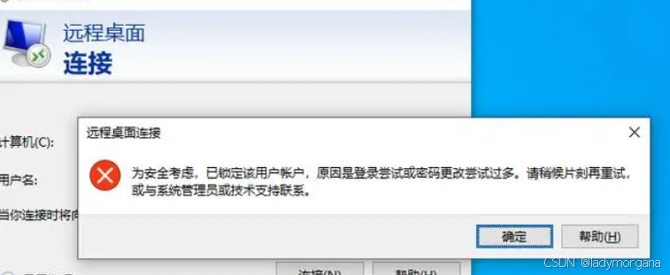
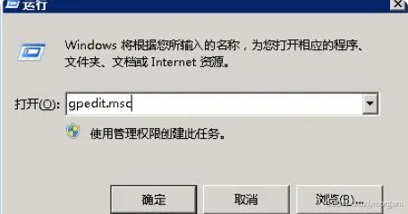
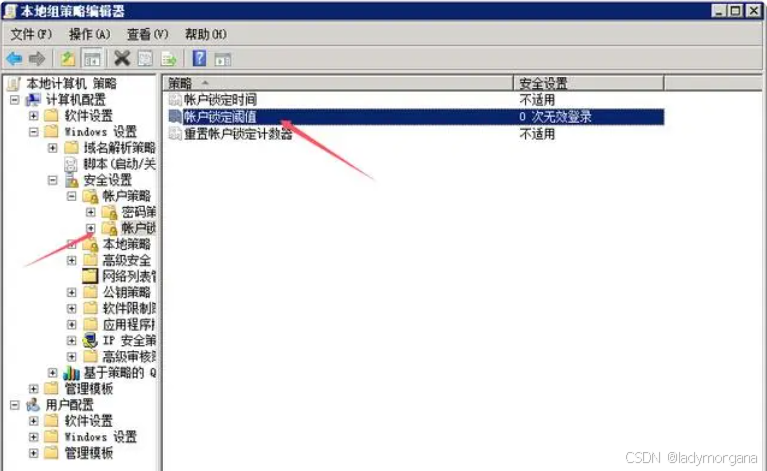

# 阿里云ECS：windows server 已锁定该用户账户，原因是登录尝试或密码更改尝试过多

## 场景

* 阿里云 : ESC
* 系统：windows server 2022

## 问题

已锁定该用户账户，原因是登录尝试或密码更改尝试过多

## 原因

密码尝试次数过多

## 解决方案

修改密码策略：<code>设置密码失败次数不受限制</code>

### Step 1: 打开“本地安全策略”编辑器：<code>win+r -> 运行 gpedit.msc</code>

### Step 2: 账户锁定阈值：<code>设置为0，不受限制</code>

依次双击：[计算机配置](https://so.csdn.net/so/search?q=%E8%AE%A1%E7%AE%97%E6%9C%BA%E9%85%8D%E7%BD%AE\&spm=1001.2101.3001.7020) —>Windows设置 —> 安全设置 —> 账户策略 —> 账户锁定策略，然后右侧可以看到“账户锁定阈值”，双击或是右键属性，将值设置大一点或是设置为0,0表示不限制。

## 注意事项

<code>这里windows，窗口错位导致设置账户锁定阈值值后--点应用无法确认，解决方案：按回车键即可</code>

> 更新: 2025-05-17 13:44:20  
> 原文: <https://www.yuque.com/lixinsi/hntyk2/sorr4qvenuaexenc>