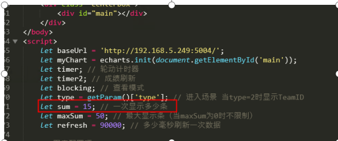
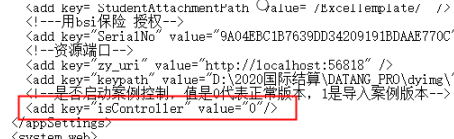
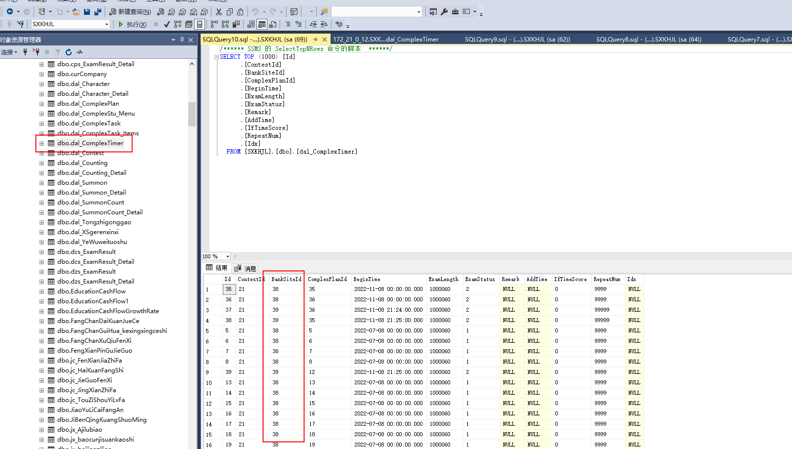
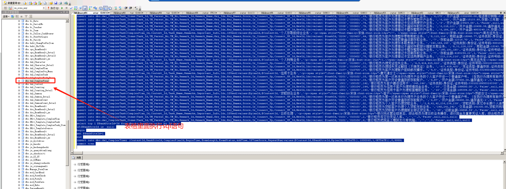
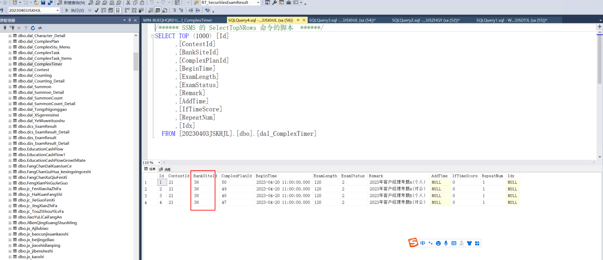
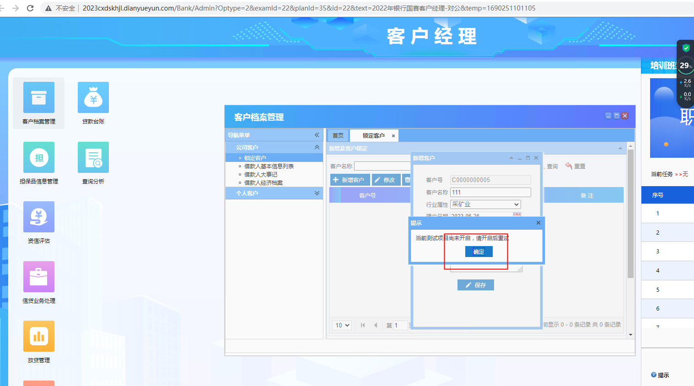
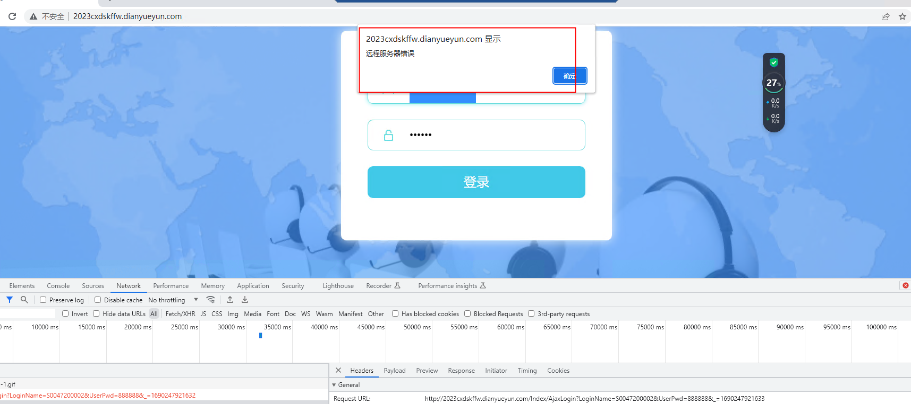

# 高校大赛实施文档

## 实施流程
1.比赛需提前到达指定学校，跟主办学校获取联系电话，赛项指南或者赛项说明书。

2.去主办学校了解熟悉学校网络环境，服务器架设地点，服务器IP地址以及配置好IP地址。

3.测试好配置好的网址是否能正常访问，包括站点配置，数据库配置，实时成绩配置。

4.配置好单项成绩实施成绩设置，根据案列的taskid进行配置

5.组织学生进行压力测试，打印并且检查鼠标，键盘，execl或者wps，以及电脑的计算器。大堂经理需要配备耳机，理财经理需要配备德州计算器。

6.打印正式账号，进行剪裁并且封装在信封里面，信封外层贴上相对应的序列号。交给裁判长，准备题目，一般是有三套题。进行封装，A,B,C或者1，2，3.

7.确定无误后把封装的账号交予裁判长，封装的题目让裁判长抽签。

8.现场导入题目并且设置题目，题目设置时间为120分钟，切记理财经理和客户经理不能时间是否加分，填写否。

9.考试完毕之后现场导出成绩，核对成绩无误，整理四项成绩并且核对总成绩，确定没有错误。

10.讲考核成绩交给裁判长，并且等待成绩公示，拍照给区域经理，确定考核没有申诉，返程。直至大赛顺利结束。

## 线下比赛实际问题
1.比赛延时问题，单人无法加时，建议增加控件来控制单人加时时间。厦门市赛仲裁长提出。

2.比赛双热备问题，江苏省赛比赛没有一个成熟测试过方案，需要备用一个成熟方案。

3.实时成绩显示，备用代表队可以页面隐藏。

4.导入功能是否可以真正导入。

5.大堂经理题目无法达到2小时考试时常，和其他三岗有明显区别。

6.能否实现一键开题，一键激活避免重复性工作。

7.题目简单错误，修改常态，考前多次修改。研究院是否可以有对应方案。


## 相关配置


```dockerfile
C:\dyjy\智慧金融国赛2024版本\综合柜员\show\indexr2.html
```

### 1. 控制实时成绩显示代表队，indexr2.html页面配置显示代表队。



### 2. 大堂经理和综合柜员
0表示公开所有案列1表示隐藏所有案例



导入题目大堂经理和综合柜员打开管理员端激活考试题目案列，然后去教师端添加激活案列，添加后案列是未激活状态，设置好考试时间，考试分钟，添加好代表队，大堂经理设置时间120分钟，在教师端激活案列。即可

综合柜员然后去教师端添加激活案列，添加后案列是未激活状态，设置好考试时间，selec

考试分钟，添加好代表队，大堂经理设置时间7200秒，在教师端激活案列


### 大堂经理和综合柜员查询题目sql


```sql
--大堂经理题目导出
/****** SSMS 的 SelectTopNRows 命令的脚本  ******/
SELECT TOP (1000) [ID]
      ,[TaskName]
      ,[TaskDescribe]
      ,[TaskImportant]
      ,[OperManualUrl]
      ,[OperManualName]
      ,[TaskExplain]
      ,[PublicState]
      ,[CaseType]
      ,[EnabledState]
      ,[StartScene]
      ,[HallScene]
      ,[CounterScene]
      ,[EndScene]
      ,[IsAccessibility]
      ,[AddUserId]
      ,[AddTime]
      ,[UpdateTime]
      ,[startTime]
      ,[endTime]
      ,[modelState]
  FROM [20230403JSDTJL].[dbo].[bsi_Task]
```

```sql
select t1.TaskName as '案例名称',t2.CustomerName as '客户名称',t3.OperationName as '环节',(select CustomerQuestion from bsi_TaskCustomerInquiry where id=t3.InquiryId) as '题目描述'
,(select OptionA from bsi_TaskCustomerInquiry where id=t3.InquiryId) as '选项A'
,(select OptionB from bsi_TaskCustomerInquiry where id=t3.InquiryId) as '选项B'
,(select OptionC from bsi_TaskCustomerInquiry where id=t3.InquiryId) as '选项C'
,(select OptionD from bsi_TaskCustomerInquiry where id=t3.InquiryId) as '选项D'
,(select OptionE from bsi_TaskCustomerInquiry where id=t3.InquiryId) as '选项E'
,(select OptionF from bsi_TaskCustomerInquiry where id=t3.InquiryId) as '选项F'
,(select RightKey from bsi_TaskCustomerInquiry where id=t3.InquiryId) as '答案'
from bsi_Task as t1
inner join bsi_TaskCustomer as t2 on t1.ID=t2.TaskId
inner join bsi_TaskDetail as t3 on t1.ID=t3.TaskId and t2.ID=t3.CustomerId
order by t1.ID,t2.ID,t3.LinkId

---联合查询---
---记录集句柄=外部数据库1.查询("select * from (a表 inner join b表 on a 表.id=b表.id)inner join c 表 on a 表.id=c表.id")+"where 表格+字段"
---查询某个案列的全部题目---
select * from (bsi_Task inner join bsi_TaskCustomer on bsi_Task.id=bsi_TaskCustomer.TaskId)inner join   bsi_TaskCustomerInquiry on bsi_Task.ID=bsi_TaskCustomerInquiry.TaskId where bsi_Task.ID=4
```

--综合柜员题目导出

```sql
--综合柜员题目导出


select t2.TaskName,t1.CustomerName,t1.TaskDescribe,t1.TaskImportant  from bsi_TaskCustomer as t1 inner join bsi_Task as t2
on t1.TaskId=t2.ID
```


### 3.客户经理和理财经理导入题目
先要添加考试计划，设置好考试时间，考试时长，考试次数为1，是否追加时长为否。然后

更改ID数值。就可以隐藏题目，隐藏题目后导入题目id会自动变成38



导入文件必须题目名称和计划名称一致。可以提前设置考试时间以及考试时长。




### 4.客户经理和理财经理延长比赛时间
```sql
select * from dal_ComplexTimer
大堂经理和综合柜员
  select * from bsi_PracticeAssessment
```

客户经理先设置好比赛然后导题



### 5.理财经理客户经理保险实操显示项目未开启


```plsql
ALTER TABLE zhyw_ExamCurrentTask  alter column  BRNO varchar(50)
ALTER TABLE zhyw_ExamCurrentTask alter column USID varchar(50)


ALTER TABLE zhyw_ExamLog  alter column  BRNO varchar(50)
ALTER TABLE zhyw_ExamLog alter column USID varchar(50)
```

### 6.客服服务岗显示远程服务器错误


```plsql
  update P2P_UserInfo set UI_MajorId=0
```


> 更新: 2025-02-21 14:19:55  
> 原文: <https://www.yuque.com/lixinsi/hntyk2/wf9hwykp8etowbb4>