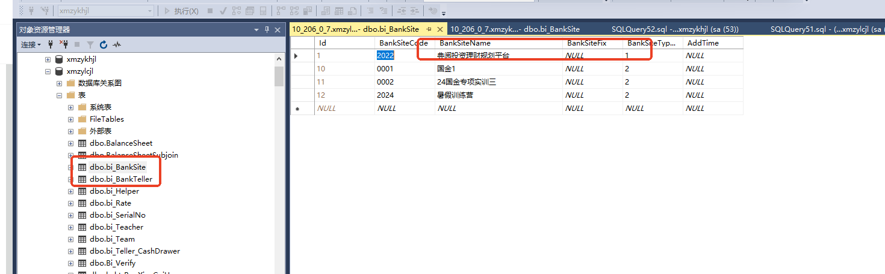
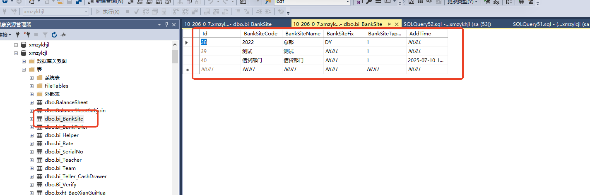

# 高校比赛需要检查的问题

1.检查设置考核题目<综合柜员7200s>

2.检查题目是否激活，大堂经理和综合柜员激活管理员端和教师端，理财经理和客户经理检查个人和对公。

3.检查实时成绩是否显示正常，控制网点绑定是否正确。

4.检查案列id和考核id

5检查大堂经理岗的耳机是否有声音。

客户经理和理财经理网点信息核对  

> 更新: 2025-07-10 18:31:54  
> 原文: <https://www.yuque.com/lixinsi/hntyk2/kuz1krlby5nqenoa>