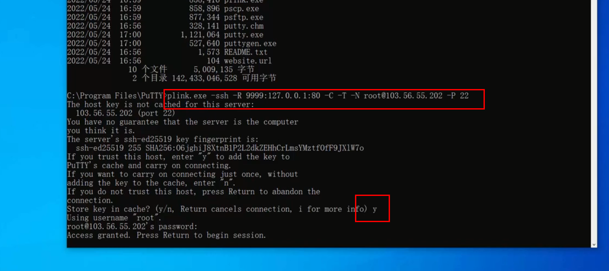

# ssh内网穿透

1.公网IP的Linux服务器

```shell
#配置服务器端口转发功能
echo "GatewayPorts yes" >> /etc/ssh/sshd_config

#重新启动ssh服务器
systemctl restart sshd
```

2.配置客户端

下载免费工具

[https://putty.be/latest.html](https://putty.be/latest.html)

安装putty

记录安装目录

D:\软件安装目录\putty

```shell
D:\软件安装目录\putty>plink.exe -ssh -R 9999:127.0.0.1:80 -C -T -N root@103.56.55.202 22
```



```shell
plink.exe -ssh -R 9999:127.0.0.1:80 -C -T -N root@103.56.55.202 22
```

bat文件复制到D:\软件安装目录\putty目录下创建快捷启动


> 更新: 2022-11-14 14:52:53  
> 原文: <https://www.yuque.com/lixinsi/gve2qv/efe454ctn33oot0k>