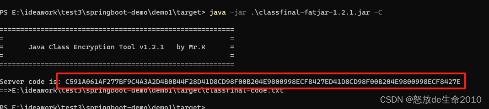
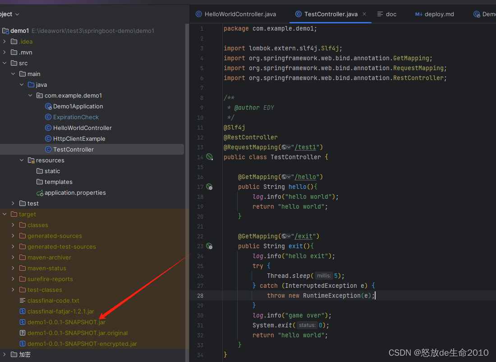
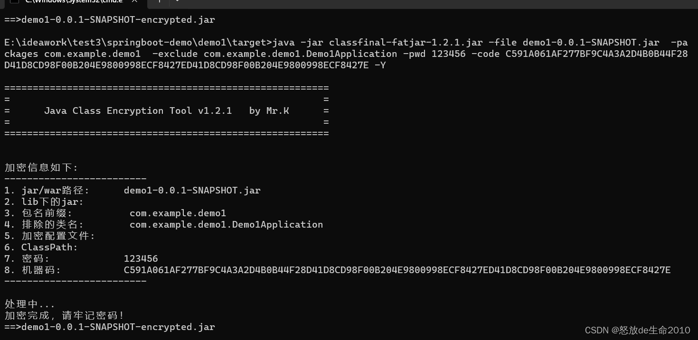
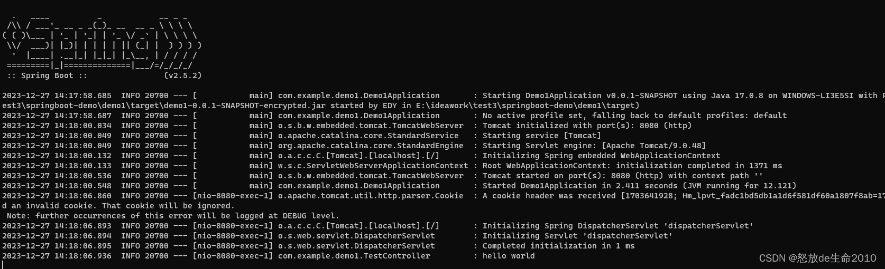
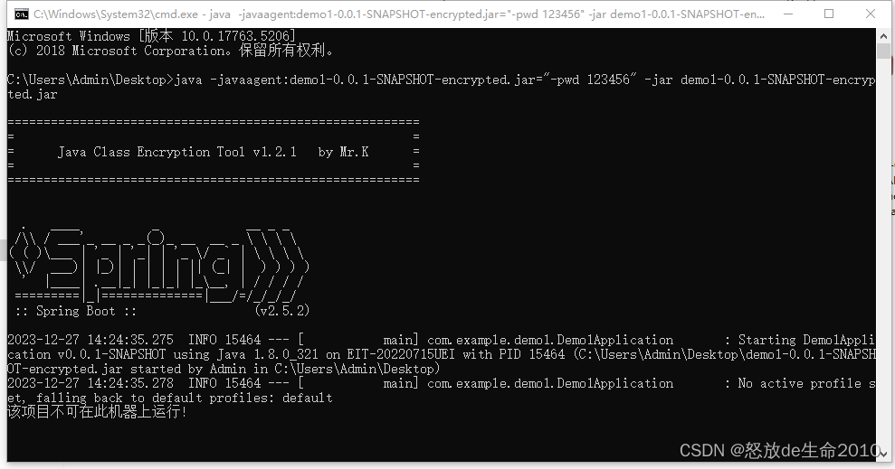
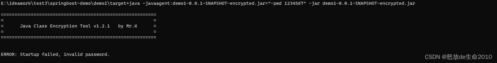

# 推荐一款加密工具: 加密jar包+设置机器码+使用demo

> 推荐一款java加密工具:ClassFinal是一款java class文件安全加密工具，支持直接加密jar包或war包，无需修改任何项目代码，兼容spring-framework；可避免源码泄漏或字节码被反编译。
>
> [https://gitee.com/roseboy/classfinal](https://gitee.com/roseboy/classfinal?spm=a2c6h.12873639.article-detail.7.1dbf713dVgdlKx)
>

## 加密
### 生成机器码
```plain
java -jar classfinal-fatjar-1.2.1.jar -C
```



### 生成原始的jar包
mvn package -DskipTests=true



### 生成加密的jar包
注意: 指定密码，指定机器码

```plain
java -jar classfinal-fatjar-1.2.1.jar -file demo1-0.0.1-SNAPSHOT.jar  -packages com.example.demo1  -exclude com.example.demo1.Demo1Application -pwd 123456 -code C591A061AF277BF9C4A3A2D4B0B44F28D41D8CD98F00B204E9800998ECF8427ED41D8CD98F00B204E9800998ECF8427E -Y
```

-pwd 指定密码

-code 指定机器码



### 运行程序
```plain
java -XX:+DisableAttachMechanism -javaagent:demo1-0.0.1-SNAPSHOT-encrypted.jar="-pwd 123456" -jar demo1-0.0.1-SNAPSHOT-encrypted.jar
```



最好不写密码，在控制台中写:

```plain
java -XX:+DisableAttachMechanism -javaagent:demo1-0.0.1-SNAPSHOT-encrypted.jar -jar demo1-0.0.1-SNAPSHOT-encrypted.jar
```

在其他机器上运行效果 :



输错密码的情况下:



## 有效期设置
思路: 可以通过定时器的形式进行判断，如果超过有效期就退出程序（基于程序已经启动的情况下）

```plain
@Component
public class ExpirationCheck {
    //出厂时间
    private static final LocalDateTime expirationTime = LocalDateTime.of(2023, 12, 27, 14, 55);
    // @Scheduled(cron = "0 0 0 * * ?") // 指定每天的固定时间点（0点）
    @Scheduled(cron = "0 * * * * *") // 每分钟的第0秒执行一次
    public void checkExpiration() {
        System.out.println("-----进入定时任务中----");
        LocalDateTime currentTime = LocalDateTime.now();
        if (currentTime.isAfter(expirationTime)) {
            System.out.println("当前时间已超过有效期，程序即将退出");
            System.exit(0); // 退出程序
        }
    }
}
```

### 总结:
本文主要根据是根据开源加密工具: 实现jar包通过机器码限制机器启动，以及设置密码启动，并且可设置个有效期，限制程序的使用时间。

具体的内容去看请看看开源项目介绍。


> 更新: 2024-10-20 10:10:04  
> 原文: <https://www.yuque.com/lixinsi/twkls1/ggu72iy4magvszdx>