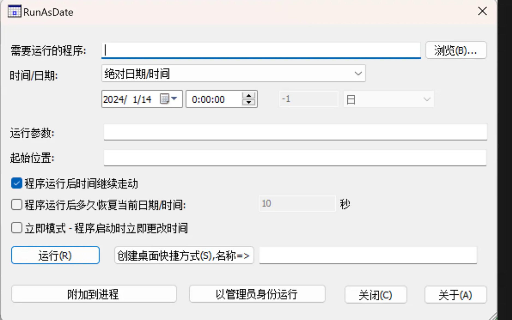

# 无限延长软件试用时间小工具 RunAsDate v1.41

# 
2024-01-14 来源：[Nir Sofer](http://www.nirsoft.net/utils/run_as_date.html) 分类：[Windows](https://www.luochenzhimu.com/archives/category/windows) / [系统工具](https://www.luochenzhimu.com/archives/category/windows/system-tools) 阅读(27287) 评论(5)

**RunAsDate** 可以让你的应用程序在你指定的日期和时间范围内运行，它并不会更改当前的系统日期和时间，只用于一些有特定时间要求的软件。你可以同时运行多个应用程序，让每个应用程序使用不同的日期和时间，而系统真正的日期和时间并不会变化。

RunAsDate是一个用来有时间限制软件的小工具，简单点说RunAsDate的作用就是让收费或者共享软件保持在免费试用期内运行的时间，从而实现免费使用的功效。该软件的使用那是相当的简单，甚至还可以建立运行在特定日期时间的快捷方式，方便以后的使用。RunAsDate不是更改系统的时间，而是更改指定软件的时间，那么你就可以不停的使用任何具有使用时间限制的软件了。

RunAsDate是一个实用的试用软件日期修改器，可让您以指定的时间运行某程序，而并不会更改您的电脑时间，只是注入指定的日期时间到运行的程序中，你可以同时运行多个程序，每个程序以不同的日期和时间工作。  
RunAsDate最实用的地方是，让试用软件永不过期，比如您安装了一个试用版软件，试用期是30天，那么在试用期过后，您可以用 RunAsDate 来给这个软件指定运行时间，设置的时间在试用期内，软件就不会过期，可以继续试用。

[https://www.nirsoft.net/x64_download_package.html](https://www.nirsoft.net/x64_download_package.html)

[https://www.luochenzhimu.com/archives/1888.html](https://www.luochenzhimu.com/archives/1888.html)

> 更新: 2024-10-21 14:54:29  
> 原文: <https://www.yuque.com/lixinsi/twkls1/xoi0semnnga3ocgp>