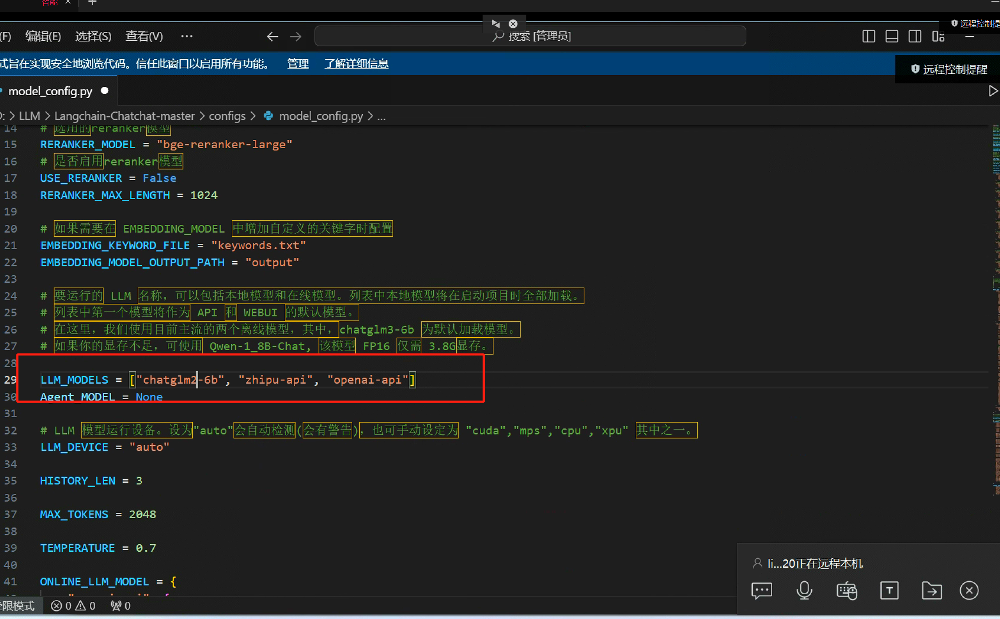
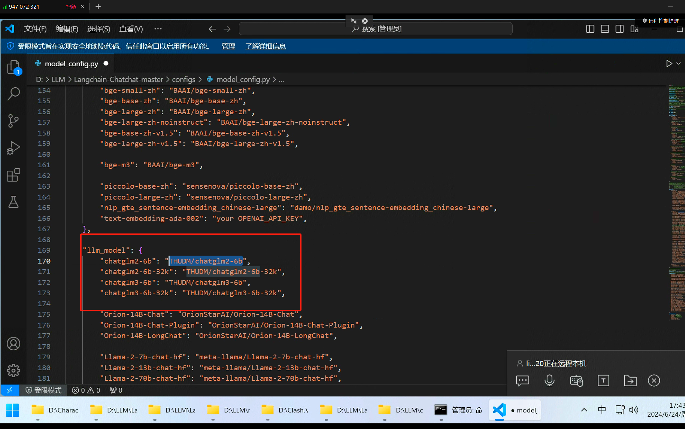
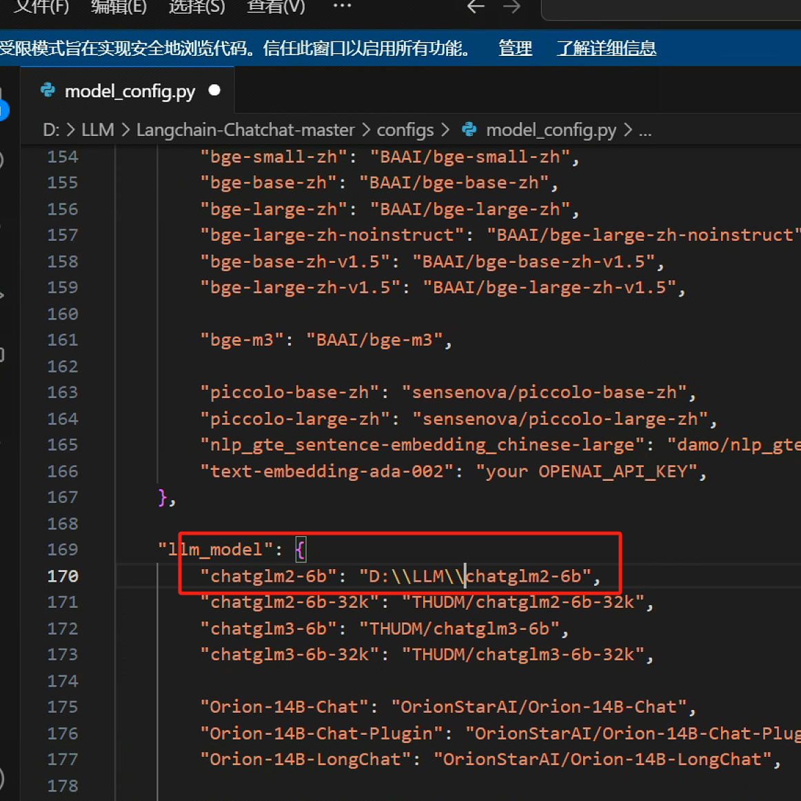
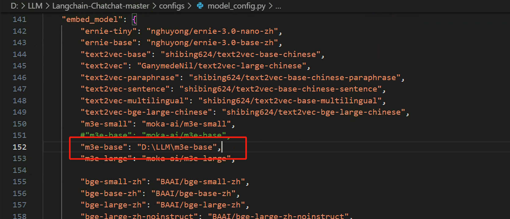
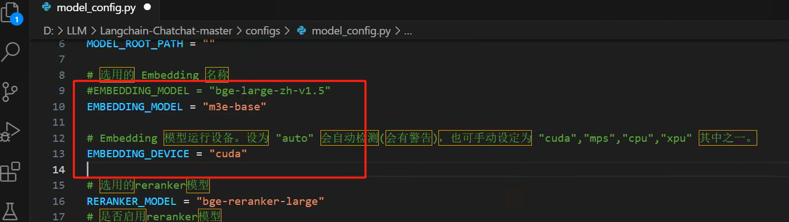

# ChatGLM-6B

#### 1.[https://github.com/THUDM/ChatGLM-6B](https://github.com/THUDM/ChatGLM-6B)
```bash
git clone https://github.com/THUDM/ChatGLM-6B
```

<font style="color:rgb(77, 77, 77);">报错：AttributeError: 'ChatGLMTokenizer' object has no attribute 'tokenizer'. Did you mean: 'tokenize'?</font>

<font style="color:rgb(77, 77, 77);">解决办法：报错的transformers版本 transformers==4.34.0</font>

<font style="color:rgb(77, 77, 77);">修改后的transformers版本transformers==4.33.2</font>

```python
pip uninstall transformers
pip install transformers==4.33.2
```


#### 2.本地安下载对应版本的 torch
```python
pip install  C:\torch-2.3.1+cu118-cp310-cp310-win_amd64.whl

pip3 install torch torchvision torchaudio --index-url https://download.pytorch.org/whl/cu118
```


#### 安装 torch 时出错 - 包与需求文件中的哈希值不匹配。
[问题 | 帮助](https://www.reddit.com/r/StableDiffusion/?f=flair_name%3A%22Question%20%7C%20Help%22)

找到答案：删除缓存文件。我花了很长时间才找出哪些文件，但现在说得通了。我删除了 C:\Users\USERID\AppData\Local\pip\cache 中的整个文件夹。之后，全新安装成功了。下载所有内容花了一段时间，但成功了。谢谢大家。

##### 下载包
```python
pip uninstall gradio
pip install gradio==3.50.0
```

#### 3.torch 版本不兼容报错解决
```python
pip uninstall torch

pip install torch torchvision torchaudio --index0url https://download.pytorch.org/whl/cu117
```

ChatGLM-6B 模型

[https://huggingface.co/THUDM/chatglm2-6b/tree/main](https://huggingface.co/THUDM/chatglm2-6b/tree/main)

[https://huggingface.co/moka-ai/m3e-base](https://huggingface.co/moka-ai/m3e-base)

```python
https://huggingface.co/THUDM/chatglm2-6b/tree/main
https://huggingface.co/moka-ai/m3e-base
```

#### 4.指定源安装
```python
pip install -r requirements.txt -i https://pypi.tuna.tsinghua.edu.cn/simple/
```


model_config.py














启动:

```python
pip install -r requirements.txt -i https://pypi.tuna.tsinghua.edu.cn/simple/ 
python copy_config_example.py 
python init_database.py --recreate-vs database talbes reseted recreating all vector stores
pip install pwd 
python startup.py --all-webui
```


```python
pip list
检查pwd是否安装
```


[https://blog.csdn.net/wkchaha673/article/details/134748307](https://blog.csdn.net/wkchaha673/article/details/134748307)


> 更新: 2024-07-29 22:27:26  
> 原文: <https://www.yuque.com/lixinsi/nyg25m/xihqtr5pg5mhotlk>