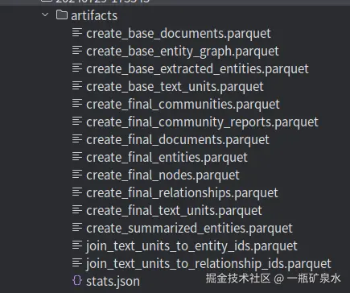
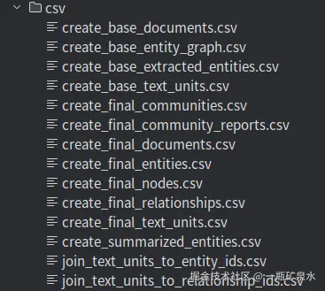
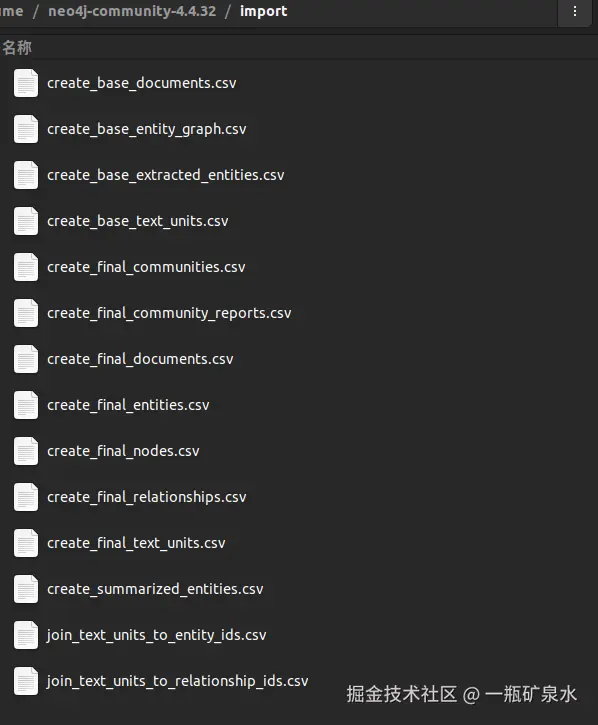
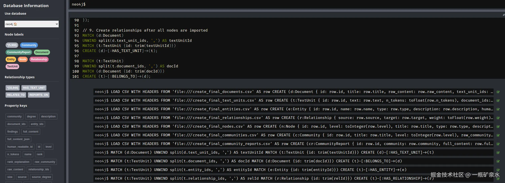
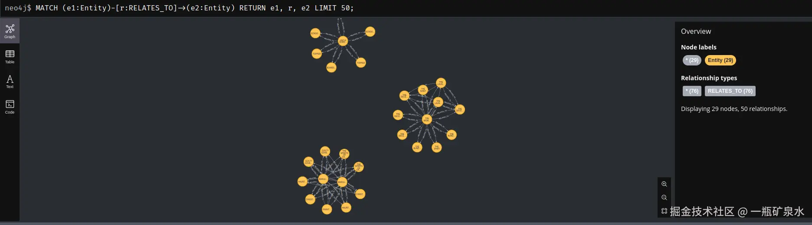

# GraphRAG部署流程及Neo4j展示

<https://juejin.cn/post/7397291768234000403>

<font style="color:rgb(37, 41, 51);background-color:rgb(247, 248, 250);">文主要介绍了 GraphRAG 的部署流程及 Neo4j 展示。包括源码准备、环境创建、依赖下载与初始化，修改配置文件，构建索引和进行查询，还涉及将生成的.parquet 文件转换为.csv 并导入 Neo4j，以及知识图谱的可视化查询示例。</font>

<font style="color:rgb(81, 87, 103);background-color:rgb(247, 248, 250);">关联问题:</font><font style="color:rgb(30, 128, 255);background-color:rgb(247, 248, 250);">如何优化部署流程</font><font style="color:rgb(30, 128, 255);background-color:rgb(247, 248, 250);">Neo4j展示注意啥</font><font style="color:rgb(30, 128, 255);background-color:rgb(247, 248, 250);">国产模型能替代吗</font>

<font style="color:rgb(89, 89, 89);">主要参考：\ </font>[<font style="color:rgb(89, 89, 89);">微软开源GraphRAG的使用教程（最全，非常详细）</font>](https://link.juejin.cn/?target=https%3A%2F%2Fblog.csdn.net%2Fgaotianhao123%2Farticle%2Fdetails%2F140493640)<font style="color:rgb(89, 89, 89);">\ </font>[<font style="color:rgb(89, 89, 89);">微软开源GraphRAG的使用教程-使用自定义数据测试GraphRAG</font>](https://link.juejin.cn/?target=https%3A%2F%2Fblog.csdn.net%2Fluxinfeng666%2Farticle%2Fdetails%2F140253451)<font style="color:rgb(89, 89, 89);"> </font>[<font style="color:rgb(89, 89, 89);">GraphRAG + GPT-4o mini 低成本构建 AI 图谱知识库</font>](https://link.juejin.cn/?target=https%3A%2F%2Fsspai.com%2Fpost%2F90665)<font style="color:rgb(89, 89, 89);">\ </font>[<font style="color:rgb(89, 89, 89);">GraphRAG+Ollama实现本地部署（最全，非常详细，保姆教程）</font>](https://link.juejin.cn/?target=https%3A%2F%2Fblog.csdn.net%2Fgaotianhao123%2Farticle%2Fdetails%2F140640415%3Fspm%3D1001.2014.3001.5501)

<font style="color:rgb(89, 89, 89);">(OPENAI Models)</font>[<font style="color:rgb(89, 89, 89);">platform.openai.com/docs/models</font>](https://link.juejin.cn/?target=https%3A%2F%2Fplatform.openai.com%2Fdocs%2Fmodels)<font style="color:rgb(89, 89, 89);">\ </font><font style="color:rgb(89, 89, 89);">(neo4j可视化)</font>[<font style="color:rgb(89, 89, 89);">neo4j.com/developer-b…</font>](https://link.juejin.cn/?target=https%3A%2F%2Fneo4j.com%2Fdeveloper-blog%2Fglobal-graphrag-neo4j-langchain%2F)<font style="color:rgb(89, 89, 89);">\ </font><font style="color:rgb(89, 89, 89);">(部署Qwen)</font>[<font style="color:rgb(89, 89, 89);">segmentfault.com/a/119000004…</font>](https://link.juejin.cn/?target=https%3A%2F%2Fsegmentfault.com%2Fa%2F1190000045103380)<font style="color:rgb(89, 89, 89);">\ </font><font style="color:rgb(89, 89, 89);">(中文文档)</font>[<font style="color:rgb(89, 89, 89);">graphragcn.com/get\_started</font>](https://link.juejin.cn/?target=https%3A%2F%2Fgraphragcn.com%2Fget_started)<font style="color:rgb(89, 89, 89);">\ </font><font style="color:rgb(89, 89, 89);">(官方操作文档)</font>[<font style="color:rgb(89, 89, 89);">microsoft.github.io/graphrag/po…</font>](https://link.juejin.cn/?target=https%3A%2F%2Fmicrosoft.github.io%2Fgraphrag%2Fposts%2Fget_started%2F)

## <font style="color:rgb(19, 92, 224);">源码准备</font>

<font style="color:rgb(102, 102, 102);background-color:rgb(255, 249, 249);">官方Github：</font>[<font style="color:rgb(102, 102, 102);background-color:rgb(255, 249, 249);">github.com/microsoft/g…</font>](https://link.juejin.cn/?target=https%3A%2F%2Fgithub.com%2Fmicrosoft%2Fgraphrag)

<font style="color:rgb(89, 89, 89);">下载项目</font>

```plain
git clone https://github.com/microsoft/graphrag.git
```

<font style="color:rgb(89, 89, 89);">进入目录</font>

```plain
cd graphrag
```

## <font style="color:rgb(19, 92, 224);">环境准备</font>

<font style="color:rgb(89, 89, 89);">(已安装好anaconda）创建虚拟环境，使用python3.11:</font>

```plain
conda create -n GraphRAG python=3.11
conda activate GraphRAG
```

## <font style="color:rgb(19, 92, 224);">下载依赖及初始化</font>

<font style="color:rgb(89, 89, 89);">由于graphrag是通过poetry进行管理，需要安装poetry资源包管理工具及相关依赖</font>

### <font style="color:rgb(19, 92, 224);">安装poetry</font>

```plain
pip install poetry 
poetry install
```

### <font style="color:rgb(19, 92, 224);">初始化</font>

```plain
poetry run poe index --init --root .
```

<font style="color:rgb(102, 102, 102);background-color:rgb(255, 249, 249);">正确运行后，此处会在graphrag目录下生成output、prompts、.env、settings.yaml文件</font>

## <font style="color:rgb(19, 92, 224);">检索的文档放入./input/目录下</font>

<font style="color:rgb(102, 102, 102);background-color:rgb(255, 249, 249);">注意目前GraphRAG仅支持txt和csv文件，其他格式需要先转换</font>

<font style="color:rgb(89, 89, 89);">官方给出的文档是查尔斯・狄更斯创作的一部著名小说《圣诞颂歌》</font>

```plain
curl https://www.gutenberg.org/cache/epub/24022/pg24022.txt > ./ragtest/input/book.txt
```

## <font style="color:rgb(19, 92, 224);">修改配置文件</font>

<font style="color:rgb(89, 89, 89);">修改文件主要有两个</font><font style="color:rgb(89, 89, 89);"> </font>**<font style="color:rgb(3, 106, 202);">.env</font>**<font style="color:rgb(89, 89, 89);"> </font><font style="color:rgb(89, 89, 89);">和</font><font style="color:rgb(89, 89, 89);"> </font>**<font style="color:rgb(3, 106, 202);">settings.yaml</font>**

<code><font style="color:rgb(255, 80, 44);background-color:rgb(255, 245, 245);">.env</font></code><font style="color:rgb(89, 89, 89);"> 文件，里面需要填入一些配置。这些配置通常包括 API 密钥、模型选择等重要参数。\ </font><font style="color:rgb(89, 89, 89);">官方指定的是使用GPT-4 Turbo preview，将OPENAI提供的 API 密钥填入 GRAPHRAG\_API\_KEY 即可</font>


<font style="color:rgb(102, 102, 102);background-color:rgb(255, 249, 249);">修改后是全局配置，后续不需要再次修改</font>

<code><font style="color:rgb(255, 80, 44);background-color:rgb(255, 245, 245);">settings.yaml</font></code><font style="color:rgb(89, 89, 89);"> </font><font style="color:rgb(89, 89, 89);">文件是针对GraphRAG的流程进行配置，修改使用的llm模型和对应的api\_base</font>

<font style="color:rgb(102, 102, 102);background-color:rgb(255, 249, 249);">GraphRAG需要多次调用大模型和Embedding，默认使用的是openai的GPT-4费用昂贵，可以使用其他模型或国产大模型的api</font>

<font style="color:rgb(89, 89, 89);">这里使用的是</font>[<font style="color:rgb(89, 89, 89);">agicto</font>](https://link.juejin.cn/?target=https%3A%2F%2Fagicto.com%2F)<font style="color:rgb(89, 89, 89);">提供的APIkey(新用户注册可以免费获取到10元的调用额度)。\ </font><font style="color:rgb(89, 89, 89);">主要修改yaml文件中的API地址和调用模型（这里使用deepseek），修改完成后的settings文件完整内容如下：</font>

<font style="color:rgb(102, 102, 102);background-color:rgb(255, 249, 249);">用</font>**<font style="color:rgb(3, 106, 202);background-color:rgb(255, 249, 249);">agicto</font>**<font style="color:rgb(102, 102, 102);background-color:rgb(255, 249, 249);">调用deepseek可以直接使用以下settings.yaml</font>

```plain
encoding_model: cl100k_base
skip_workflows: []
llm:
  api_key: ${GRAPHRAG_API_KEY}
  type: openai_chat # or azure_openai_chat
  model: deepseek-chat  #修改
  model_supports_json: false # recommended if this is available for your model.
  api_base: https://api.agicto.cn/v1 #修改
  # max_tokens: 4000
  # request_timeout: 180.0
  # api_version: 2024-02-15-preview
  # organization: <organization_id>
  # deployment_name: <azure_model_deployment_name>
  # tokens_per_minute: 150_000 # set a leaky bucket throttle
  # requests_per_minute: 10_000 # set a leaky bucket throttle
  # max_retries: 10
  # max_retry_wait: 10.0
  # sleep_on_rate_limit_recommendation: true # whether to sleep when azure suggests wait-times
  # concurrent_requests: 25 # the number of parallel inflight requests that may be made

parallelization:
  stagger: 0.3
  # num_threads: 50 # the number of threads to use for parallel processing

async_mode: threaded # or asyncio

embeddings:
  ## parallelization: override the global parallelization settings for embeddings
  async_mode: threaded # or asyncio
  llm:
    api_key: ${GRAPHRAG_API_KEY}
    type: openai_embedding # or azure_openai_embedding
    model: text-embedding-3-small #修改
    api_base: https://api.agicto.cn/v1 #修改
    # api_base: https://<instance>.openai.azure.com
    # api_version: 2024-02-15-preview
    # organization: <organization_id>
    # deployment_name: <azure_model_deployment_name>
    # tokens_per_minute: 150_000 # set a leaky bucket throttle
    # requests_per_minute: 10_000 # set a leaky bucket throttle
    # max_retries: 10
    # max_retry_wait: 10.0
    # sleep_on_rate_limit_recommendation: true # whether to sleep when azure suggests wait-times
    # concurrent_requests: 25 # the number of parallel inflight requests that may be made
    # batch_size: 16 # the number of documents to send in a single request
    # batch_max_tokens: 8191 # the maximum number of tokens to send in a single request
    # target: required # or optional
  

chunks:
  size: 300
  overlap: 100
  group_by_columns: [id] # by default, we don't allow chunks to cross documents
    
input:
  type: file # or blob
  file_type: text # or csv
  base_dir: "input"
  file_encoding: utf-8
  file_pattern: ".*\\.txt$"

cache:
  type: file # or blob
  base_dir: "cache"
  # connection_string: <azure_blob_storage_connection_string>
  # container_name: <azure_blob_storage_container_name>

storage:
  type: file # or blob
  base_dir: "output/${timestamp}/artifacts"
  # connection_string: <azure_blob_storage_connection_string>
  # container_name: <azure_blob_storage_container_name>

reporting:
  type: file # or console, blob
  base_dir: "output/${timestamp}/reports"
  # connection_string: <azure_blob_storage_connection_string>
  # container_name: <azure_blob_storage_container_name>

entity_extraction:
  ## llm: override the global llm settings for this task
  ## parallelization: override the global parallelization settings for this task
  ## async_mode: override the global async_mode settings for this task
  prompt: "prompts/entity_extraction.txt"
  entity_types: [organization,person,geo,event]
  max_gleanings: 0

summarize_descriptions:
  ## llm: override the global llm settings for this task
  ## parallelization: override the global parallelization settings for this task
  ## async_mode: override the global async_mode settings for this task
  prompt: "prompts/summarize_descriptions.txt"
  max_length: 500

claim_extraction:
  ## llm: override the global llm settings for this task
  ## parallelization: override the global parallelization settings for this task
  ## async_mode: override the global async_mode settings for this task
  # enabled: true
  prompt: "prompts/claim_extraction.txt"
  description: "Any claims or facts that could be relevant to information discovery."
  max_gleanings: 0

community_report:
  ## llm: override the global llm settings for this task
  ## parallelization: override the global parallelization settings for this task
  ## async_mode: override the global async_mode settings for this task
  prompt: "prompts/community_report.txt"
  max_length: 2000
  max_input_length: 8000

cluster_graph:
  max_cluster_size: 10

embed_graph:
  enabled: false # if true, will generate node2vec embeddings for nodes
  # num_walks: 10
  # walk_length: 40
  # window_size: 2
  # iterations: 3
  # random_seed: 597832

umap:
  enabled: false # if true, will generate UMAP embeddings for nodes

snapshots:
  graphml: false
  raw_entities: false
  top_level_nodes: false

local_search:
  # text_unit_prop: 0.5
  # community_prop: 0.1
  # conversation_history_max_turns: 5
  # top_k_mapped_entities: 10
  # top_k_relationships: 10
  # max_tokens: 12000

global_search:
  # max_tokens: 12000
  # data_max_tokens: 12000
  # map_max_tokens: 1000
  # reduce_max_tokens: 2000
  # concurrency: 32
```

## <font style="color:rgb(19, 92, 224);">构建GraphRAG的索引</font>

<font style="color:rgb(89, 89, 89);">构建索引耗时较长，取决于document的长度</font>

```plain
poetry run poe index --root .
```

<font style="color:rgb(89, 89, 89);">或者</font>

```plain
python -m graphrag.index --root .
```

## <font style="color:rgb(19, 92, 224);">进行查询</font>

### <font style="color:rgb(19, 92, 224);">全局查询 ：更侧重全文理解</font>

```plain
poetry run poe query --root . --method global "本文主要讲了什么"
```

<font style="color:rgb(89, 89, 89);">运行成功后可以看到输出结果</font>

### <font style="color:rgb(19, 92, 224);">局部查询：更侧重细节</font>

```plain
poetry run poe query --root . --method local "本文主要讲了什么"
```

<font style="color:rgb(89, 89, 89);">运行成功后可以看到输出结果</font>

## <font style="color:rgb(19, 92, 224);">Neo4j可视化</font>

<font style="color:rgb(102, 102, 102);background-color:rgb(255, 249, 249);">注：Neo4j的安装可以参考文章</font>[<font style="color:rgb(102, 102, 102);background-color:rgb(255, 249, 249);">juejin.cn/post/715718…</font>](https://juejin.cn/post/7157182561389641758)

### <font style="color:rgb(19, 92, 224);">将.parquet转换为.csv</font>

<font style="color:rgb(89, 89, 89);">上述流程运行成功后会在output的文件夹下生成.parquet文件</font>



<font style="color:rgb(89, 89, 89);">为了可以顺利导入neo4j，需要先将其转换为csv文件，这里给出转换脚本</font>

```plain
import os
import pandas as pd
import csv

# Define the directory containing Parquet files
parquet_dir = 'graphrag/output/20240729-173545/artifacts'
csv_dir = 'graphrag/output/20240729-173545/csv'


# Function to clean and properly format the string fields
def clean_quotes(value):
    if isinstance(value, str):
        # Remove extra quotes and strip leading/trailing spaces
        value = value.strip().replace('""', '"').replace('"', '')
        # Ensure proper quoting for fields with commas or quotes
        if ',' in value or '"' in value:
            value = f'"{value}"'
    return value


# Convert all Parquet files to CSV
for file_name in os.listdir(parquet_dir):
    if file_name.endswith('.parquet'):
        parquet_file = os.path.join(parquet_dir, file_name)
        csv_file = os.path.join(csv_dir, file_name.replace('.parquet', '.csv'))

        # Load the Parquet file
        df = pd.read_parquet(parquet_file)

        # Clean quotes in string fields
        for column in df.select_dtypes(include=['object']).columns:
            df[column] = df[column].apply(clean_quotes)

        # Save to CSV
        df.to_csv(csv_file, index=False, quoting=csv.QUOTE_NONNUMERIC)
        print(f"Converted {parquet_file} to {csv_file} successfully.")

print("All Parquet files have been converted to CSV.")
```

<font style="color:rgb(89, 89, 89);">运行成功后会生成对应的csv文件</font>



### <font style="color:rgb(19, 92, 224);">将csv文件导入neo4j</font>

<font style="color:rgb(89, 89, 89);">将所有的生成的csv文件复制到neo4j安装目录的import文件夹下</font>



<font style="color:rgb(89, 89, 89);">启动neo4j，执行以下导入指令：</font>

```plain
Import Documents
LOAD CSV WITH HEADERS FROM 'file:///create_final_documents.csv' AS row
CREATE (d:Document {
    id: row.id,
    title: row.title,
    raw_content: row.raw_content,
    text_unit_ids: row.text_unit_ids
});

// 2. Import Text Units
LOAD CSV WITH HEADERS FROM 'file:///create_final_text_units.csv' AS row
CREATE (t:TextUnit {
    id: row.id,
    text: row.text,
    n_tokens: toFloat(row.n_tokens),
    document_ids: row.document_ids,
    entity_ids: row.entity_ids,
    relationship_ids: row.relationship_ids
});

// 3. Import Entities
LOAD CSV WITH HEADERS FROM 'file:///create_final_entities.csv' AS row
CREATE (e:Entity {
    id: row.id,
    name: row.name,
    type: row.type,
    description: row.description,
    human_readable_id: toInteger(row.human_readable_id),
    text_unit_ids: row.text_unit_ids
});

// 4. Import Relationships
LOAD CSV WITH HEADERS FROM 'file:///create_final_relationships.csv' AS row
CREATE (r:Relationship {
    source: row.source,
    target: row.target,
    weight: toFloat(row.weight),
    description: row.description,
    id: row.id,
    human_readable_id: row.human_readable_id,
    source_degree: toInteger(row.source_degree),
    target_degree: toInteger(row.target_degree),
    rank: toInteger(row.rank),
    text_unit_ids: row.text_unit_ids
});

// 5. Import Nodes
LOAD CSV WITH HEADERS FROM 'file:///create_final_nodes.csv' AS row
CREATE (n:Node {
    id: row.id,
    level: toInteger(row.level),
    title: row.title,
    type: row.type,
    description: row.description,
    source_id: row.source_id,
    community: row.community,
    degree: toInteger(row.degree),
    human_readable_id: toInteger(row.human_readable_id),
    size: toInteger(row.size),
    entity_type: row.entity_type,
    top_level_node_id: row.top_level_node_id,
    x: toInteger(row.x),
    y: toInteger(row.y)
});

// 6. Import Communities
LOAD CSV WITH HEADERS FROM 'file:///create_final_communities.csv' AS row
CREATE (c:Community {
    id: row.id,
    title: row.title,
    level: toInteger(row.level),
    raw_community: row.raw_community,
    relationship_ids: row.relationship_ids,
    text_unit_ids: row.text_unit_ids
});

// 7. Import Community Reports
LOAD CSV WITH HEADERS FROM 'file:///create_final_community_reports.csv' AS row
CREATE (cr:CommunityReport {
    id: row.id,
    community: row.community,
    full_content: row.full_content,
    level: toInteger(row.level),
    rank: toFloat(row.rank),
    title: row.title,
    rank_explanation: row.rank_explanation,
    summary: row.summary,
    findings: row.findings,
    full_content_json: row.full_content_json
});

// 8. Create indexes for better performance
CREATE INDEX FOR (d:Document) ON (d.id);
CREATE INDEX FOR (t:TextUnit) ON (t.id);
CREATE INDEX FOR (e:Entity) ON (e.id);
CREATE INDEX FOR (r:Relationship) ON (r.id);
CREATE INDEX FOR (n:Node) ON (n.id);
CREATE INDEX FOR (c:Community) ON (c.id);
CREATE INDEX FOR (cr:CommunityReport) ON (cr.id);

// 9. Create relationships after all nodes are imported
MATCH (d:Document)
UNWIND split(d.text_unit_ids, ',') AS textUnitId
MATCH (t:TextUnit {id: trim(textUnitId)})
CREATE (d)-[:HAS_TEXT_UNIT]->(t);

MATCH (t:TextUnit)
UNWIND split(t.document_ids, ',') AS docId
MATCH (d:Document {id: trim(docId)})
CREATE (t)-[:BELONGS_TO]->(d);

MATCH (t:TextUnit)
UNWIND split(t.entity_ids, ',') AS entityId
MATCH (e:Entity {id: trim(entityId)})
CREATE (t)-[:HAS_ENTITY]->(e);

MATCH (t:TextUnit)
UNWIND split(t.relationship_ids, ',') AS relId
MATCH (r:Relationship {id: trim(relId)})
CREATE (t)-[:HAS_RELATIONSHIP]->(r);

MATCH (e:Entity)
UNWIND split(e.text_unit_ids, ',') AS textUnitId
MATCH (t:TextUnit {id: trim(textUnitId)})
CREATE (e)-[:MENTIONED_IN]->(t);

MATCH (r:Relationship)
MATCH (source:Entity {name: r.source})
MATCH (target:Entity {name: r.target})
CREATE (source)-[:RELATES_TO]->(target);

MATCH (r:Relationship)
UNWIND split(r.text_unit_ids, ',') AS textUnitId
MATCH (t:TextUnit {id: trim(textUnitId)})
CREATE (r)-[:MENTIONED_IN]->(t);

MATCH (c:Community)
UNWIND split(c.relationship_ids, ',') AS relId
MATCH (r:Relationship {id: trim(relId)})
CREATE (c)-[:HAS_RELATIONSHIP]->(r);

MATCH (c:Community)
UNWIND split(c.text_unit_ids, ',') AS textUnitId
MATCH (t:TextUnit {id: trim(textUnitId)})
CREATE (c)-[:HAS_TEXT_UNIT]->(t);

MATCH (cr:CommunityReport)
MATCH (c:Community {id: cr.community})
CREATE (cr)-[:REPORTS_ON]->(c);
```

<font style="color:rgb(89, 89, 89);">运行成功后有以下显示</font>



## <font style="color:rgb(19, 92, 224);">知识图谱可视化</font>

<font style="color:rgb(89, 89, 89);">可以针对不同的标签查询其相关关系,以下为相关查询cypher</font>

```plain
// 1. Visualize Document to TextUnit relationships
MATCH (d:Document)-[r:HAS_TEXT_UNIT]->(t:TextUnit)
RETURN d, r, t
LIMIT 50;

// 2. Visualize Entity to TextUnit relationships
MATCH (e:Entity)-[r:MENTIONED_IN]->(t:TextUnit)
RETURN e, r, t
LIMIT 50;

// 3. Visualize Relationships between Entities
MATCH (e1:Entity)-[r:RELATES_TO]->(e2:Entity)
RETURN e1, r, e2
LIMIT 50;

// 4. Visualize Community to Relationship connections
MATCH (c:Community)-[r:HAS_RELATIONSHIP]->(rel:Relationship)
RETURN c, r, rel
LIMIT 50;

// 5. Visualize Community Reports and their Communities
MATCH (cr:CommunityReport)-[r:REPORTS_ON]->(c:Community)
RETURN cr, r, c
LIMIT 50;

// 6. Visualize the most connected Entities (Updated)
MATCH (e:Entity)
WITH e, COUNT((e)-[:RELATES_TO]->(:Entity)) AS degree
ORDER BY degree DESC
LIMIT 10
MATCH (e)-[r:RELATES_TO]->(other:Entity)
RETURN e, r, other;

// 7. Visualize TextUnits and their connections to Entities and Relationships
MATCH (t:TextUnit)-[:HAS_ENTITY]->(e:Entity)
MATCH (t)-[:HAS_RELATIONSHIP]->(r:Relationship)
RETURN t, e, r
LIMIT 50;

// 8. Visualize Documents and their associated Entities (via TextUnits)
MATCH (d:Document)-[:HAS_TEXT_UNIT]->(t:TextUnit)-[:HAS_ENTITY]->(e:Entity)
RETURN d, t, e
LIMIT 50;

// 9. Visualize Communities and their TextUnits
MATCH (c:Community)-[:HAS_TEXT_UNIT]->(t:TextUnit)
RETURN c, t
LIMIT 50;

// 10. Visualize Relationships and their associated TextUnits
MATCH (r:Relationship)-[:MENTIONED_IN]->(t:TextUnit)
RETURN r, t
LIMIT 50;

// 11. Visualize Entities of different types and their relationships
MATCH (e1:Entity)-[r:RELATES_TO]->(e2:Entity)
WHERE e1.type <> e2.type
RETURN e1, r, e2
LIMIT 50;

// 12. Visualize the distribution of Entity types
MATCH (e:Entity)
RETURN e.type AS EntityType, COUNT(e) AS Count
ORDER BY Count DESC;

// 13. Visualize the most frequently occurring relationships
MATCH ()-[r:RELATES_TO]->()
RETURN TYPE(r) AS RelationshipType, COUNT(r) AS Count
ORDER BY Count DESC
LIMIT 10;

// 14. Visualize the path from Document to Entity
MATCH path = (d:Document)-[:HAS_TEXT_UNIT]->(t:TextUnit)-[:HAS_ENTITY]->(e:Entity)
RETURN path
LIMIT 25;
```

<font style="color:rgb(102, 102, 102);background-color:rgb(255, 249, 249);">举例展示：执行命令3</font>

```plain
// 3. Visualize Relationships between Entities
MATCH (e1:Entity)-[r:RELATES_TO]->(e2:Entity)
RETURN e1, r, e2
LIMIT 50;
```

<font style="color:rgb(89, 89, 89);">运行结果： </font>


> 更新: 2024-12-19 08:37:05  
> 原文: <https://www.yuque.com/lixinsi/nyg25m/hgxgogt91godlbvn>