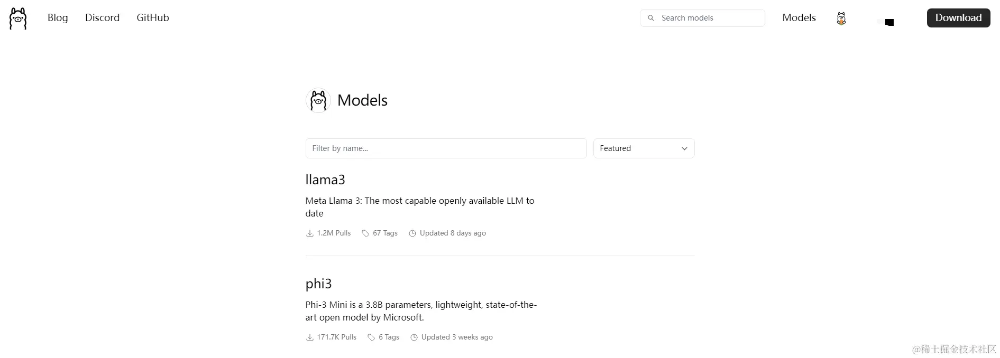
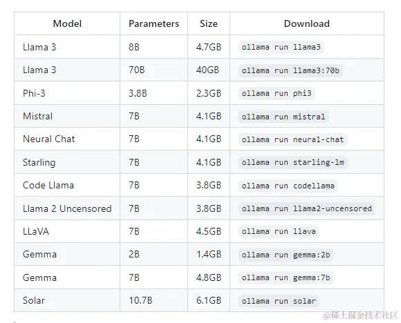
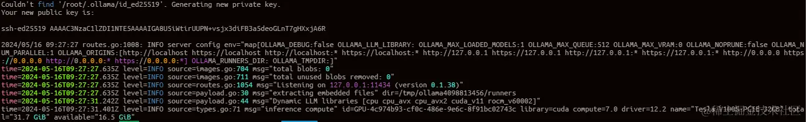

# Ollama部署、运行大型语言模型

## 概述
Ollama是一个专为在本地机器上便捷部署和运行大型语言模型（LLM）而设计的工具。

官方网站：https://ollama.com/

Github：https://github.com/ollama/ollama

## 安装
<font style="color:rgb(140, 140, 140);background-color:rgb(240, 253, 255);">Ollama支持macOS、Linux和Windows多个平台运行</font>

<font style="color:rgb(53, 53, 53);">macOS：</font>[下载Ollama](https://link.juejin.cn/?target=https%3A%2F%2Follama.com%2Fdownload%2FOllama-darwin.zip)

<font style="color:rgb(53, 53, 53);">Windows：</font>[下载Ollama](https://link.juejin.cn/?target=https%3A%2F%2Follama.com%2Fdownload%2FOllamaSetup.exe)

<font style="color:rgb(53, 53, 53);">Docker：可在Docker Hub上找到</font>[Ollama Docker镜像](https://link.juejin.cn/?target=https%3A%2F%2Fhub.docker.com%2Fr%2Follama%2Follama)

<font style="color:rgb(53, 53, 53);">Linux：因为使用服务器，这里便以Linux操作系统使用为例记录说明</font>

<font style="color:rgb(53, 53, 53);"></font>

<font style="color:rgb(53, 53, 53);">其中Linux通过命令直接安装如下</font>

```shell
root@master:~/work# curl -fsSL https://ollama.com/install.sh | sh
>>> Downloading ollama...
######################################################################## 100.0%##O#-#                                                                        
>>> Installing ollama to /usr/local/bin...
>>> Creating ollama user...
>>> Adding ollama user to render group...
>>> Adding ollama user to video group...
>>> Adding current user to ollama group...
>>> Creating ollama systemd service...
>>> Enabling and starting ollama service...
Created symlink /etc/systemd/system/default.target.wants/ollama.service → /etc/systemd/system/ollama.service.
>>> NVIDIA GPU installed.


```

<font style="color:rgb(53, 53, 53);">查看ollama的状态</font>

```shell
root@master:~/work# systemctl status ollama
● ollama.service - Ollama Service
     Loaded: loaded (/etc/systemd/system/ollama.service; enabled; vendor preset: enabled)
     Active: active (running) since Thu 2024-05-16 07:48:52 UTC; 19s ago
   Main PID: 1463063 (ollama)
      Tasks: 19 (limit: 120679)
     Memory: 488.7M
        CPU: 6.848s
     CGroup: /system.slice/ollama.service
             └─1463063 /usr/local/bin/ollama serve

May 16 07:48:52 master ollama[1463063]: Couldn't find '/usr/share/ollama/.ollama/id_ed25519'. Generating new private key.

```

<font style="color:rgb(53, 53, 53);">安装成功后执行</font>ollama -v<font style="color:rgb(53, 53, 53);">命令，查看版本信息，如果可以显示则代表已经安装好</font>

```shell
root@master:~# ollama -v
ollama version is 0.1.38
```

## 配置
<font style="color:rgb(140, 140, 140);background-color:rgb(240, 253, 255);">编辑</font>vim /etc/systemd/system/ollama.service<font style="color:rgb(140, 140, 140);background-color:rgb(240, 253, 255);">文件来对ollama进行配置</font>

<font style="color:rgb(140, 140, 140);background-color:rgb(240, 253, 255);"></font>

**1.更改HOST**

<font style="color:rgb(53, 53, 53);">由于Ollama的默认参数配置，启动时设置了仅本地访问，因此需要对HOST进行配置，开启监听任何来源IP</font>

```plain
[Service]
# 配置远程访问
Environment="OLLAMA_HOST=0.0.0.0"
```

**2.更改模型存储路径**

<font style="color:rgb(53, 53, 53);">默认情况下，不同操作系统大模型存储的路径如下</font>

```shell
macOS: ~/.ollama/models

Linux: /usr/share/ollama/.ollama/models

Windows: C:\Users.ollama\models
```

<font style="color:rgb(53, 53, 53);">官方提供设置环境变量</font>OLLAMA_MODELS<font style="color:rgb(53, 53, 53);">来更改模型文件的存储路径</font>

```shell
[Service]
# 配置OLLAMA的模型存放路径
Environment="OLLAMA_MODELS=/data/ollama/models"
```

<font style="color:rgb(53, 53, 53);">注意：</font>

由于当时使用root账号，同时目录权限也属于root，配置好后导致服务无法正常启动


<font style="color:rgb(53, 53, 53);">此时，可以查看Ollama的运行日志，特别是在遇到问题需要调试时，可以使用以下命令：</font>

```python
journalctl -u ollama
```

<font style="color:rgb(53, 53, 53);">解决问题：</font>

因为指定的目录ollama用户及用户组没有相应权限，导致服务不能启动。通过授权给相应的目录权限解决问题。

```python
chown ollama:ollama ollama/models
```

**3.更改运行GPU**

<font style="color:rgb(53, 53, 53);">配置环境变量</font>CUDA_VISIBLE_DEVICES<font style="color:rgb(53, 53, 53);">来指定运行Ollama的GPU，默认不需要改动，适用于多卡环境。</font>

```python
Environment="CUDA_VISIBLE_DEVICES=0,1"
```

**4.应用配置**<font style="color:rgb(53, 53, 53);"> 重载systemd并重启Ollama</font>

```python
systemctl daemon-reload

systemctl restart ollama
```

**5.访问测试**

<font style="color:rgb(53, 53, 53);">浏览器访问</font>http://IP:11434/<font style="color:rgb(53, 53, 53);">，出现</font>Ollama is running<font style="color:rgb(53, 53, 53);">代表成功。</font>


## Ollama命令
<font style="color:rgb(53, 53, 53);">Shell窗口输入</font>ollama<font style="color:rgb(53, 53, 53);">，打印ollama相关命令说明</font>

```shell
root@master:~/work# ollama
Usage:
  ollama [flags]
  ollama [command]

Available Commands:
  serve       Start ollama
  create      Create a model from a Modelfile
  show        Show information for a model
  run         Run a model
  pull        Pull a model from a registry
  push        Push a model to a registry
  list        List models
  ps          List running models
  cp          Copy a model
  rm          Remove a model
  help        Help about any command

Flags:
  -h, --help      help for ollama
  -v, --version   Show version information

Use "ollama [command] --help" for more information about a command.
```

<font style="color:rgb(53, 53, 53);">ollama的操作命令跟docker操作命令非常相似</font>

```python
ollama serve	# 启动ollama
ollama create	# 从模型文件创建模型
ollama show		# 显示模型信息
ollama run		# 运行模型
ollama pull		# 从注册仓库中拉取模型
ollama push		# 将模型推送到注册仓库
ollama list		# 列出已下载模型
ollama cp		# 复制模型
ollama rm		# 删除模型
ollama help		# 获取有关任何命令的帮助信息
```

<font style="color:rgb(53, 53, 53);">Ollama的</font>[Library](https://link.juejin.cn/?target=https%3A%2F%2Follama.com%2Flibrary)<font style="color:rgb(53, 53, 53);">，类似Docker的Docker Hub，在这里可以查找受Ollama支持的大模型。</font>




<font style="color:rgb(53, 53, 53);">以下是一些可以下载的示例模型：</font>

注意：Ollama支持8 GB的RAM可用于运行7B型号，16 GB可用于运行13B型号，32 GB可用于运行33B型号。当然这些模型是经过量化过的。



## 使用示例
<font style="color:rgb(53, 53, 53);">下载llama3-8b模型</font>

```python
root@master:~# ollama pull llama3:8b
pulling manifest 
pulling 00e1317cbf74... 100% ▕██████████████████████████████████████████████████████████████████████████████████████████████████████████████████████████████████████▏ 4.7 GB                         
pulling 4fa551d4f938... 100% ▕██████████████████████████████████████████████████████████████████████████████████████████████████████████████████████████████████████▏  12 KB                         
pulling 8ab4849b038c... 100% ▕██████████████████████████████████████████████████████████████████████████████████████████████████████████████████████████████████████▏  254 B                         
pulling 577073ffcc6c... 100% ▕██████████████████████████████████████████████████████████████████████████████████████████████████████████████████████████████████████▏  110 B                         
pulling ad1518640c43... 100% ▕██████████████████████████████████████████████████████████████████████████████████████████████████████████████████████████████████████▏  483 B                         
verifying sha256 digest 
writing manifest 
removing any unused layers 
success
```

<font style="color:rgb(53, 53, 53);">下载成功查看模型</font>

```python
root@master:~# ollama list
NAME            ID              SIZE    MODIFIED      
llama3:8b       a6990ed6be41    4.7 GB  3 minutes ago
```

<font style="color:rgb(53, 53, 53);">运行模型并进行对话</font>

```python
root@master:~# ollama run llama3:8b
>>> hi
Hi! How's your day going so far? I'm here to chat and help with any questions or topics you'd like to discuss. What's on your mind?

>>> Send a message (/? for help)
```

## 自定义模型
<font style="color:rgb(53, 53, 53);">所谓自定义模型就是不适用Ollama官方模型库中的模型，理论可以使用其他各类经过转换处理的模型</font>

### 从GGUF导入
Ollama支持在Modelfile文件中导入GGUF模型

<font style="color:rgb(53, 53, 53);">创建一个名为 Modelfile的文件，其中包含一条FROM指令，其中包含要导入的模型的本地文件路径。</font>

```python
FROM ./Llama3-FP16.gguf
```

<font style="color:rgb(53, 53, 53);">在Ollama中创建模型</font>

```python
ollama create llama3 -f Modelfile
```

<font style="color:rgb(53, 53, 53);">运行模型 </font>

```python
ollama run llama3 
```

<font style="color:rgb(53, 53, 53);">完整执行日志如下：</font>

<font style="color:rgb(53, 53, 53);"></font>

```python
root@master:~/work# touch Modelfile
root@master:~/work# mv /root/work/jupyterlab/models/Llama3-FP16.gguf ./
root@master:~/work# ollama create llama3 -f Modelfile
transferring model data 
using existing layer sha256:547c95542e3fa5cc232295ea3cbd49fc14b4f4489ca9b465617076c1f55d4526 
creating new layer sha256:81834e074ec2a24086bdbf16c3ba70eb185f5883cde6495e95f5141e4d325456 
writing manifest 
success
root@master:~/work# ollama run llama3
>>> Send a message (/? for help)
```

### 自定义提示
<font style="color:rgb(53, 53, 53);">Ollama库中的模型可以通过提示进行自定义。</font>

```plain
FROM llama3

# 设置温度参数
PARAMETER temperature 1

# 设置SYSTEM 消息
SYSTEM """
作为AI智能助手，你将竭尽所能为员工提供严谨和有帮助的答复。
"""
```

### 从PyTorch或Safetensors导入
所谓从从PyTorch或Safetensors导入Ollama，其实就是使用llama.cpp项目，对PyTorch或Safetensors类型的模型进 行转换、量化处理成GGUF格式的模型，然后再用Ollama加载使用 。

<font style="color:rgb(53, 53, 53);">上述</font>从GGUF导入<font style="color:rgb(53, 53, 53);">使用的模型：</font>Llama3-FP16.gguf<font style="color:rgb(53, 53, 53);">便是经过</font>llama.cpp<font style="color:rgb(53, 53, 53);">项目处理得到的。</font>

<font style="color:rgb(53, 53, 53);">llama.cpp的使用参考：</font>[使用llama.cpp实现LLM大模型的格式转换、量化、推理、部署](https://link.juejin.cn/?target=https%3A%2F%2Fcodedev.blog.csdn.net%2Farticle%2Fdetails%2F139006498)

<font style="color:rgb(53, 53, 53);">官方文档参考：</font>[导入模型指南](https://link.juejin.cn/?target=https%3A%2F%2Fgithub.com%2Follama%2Follama%2Fblob%2Fmain%2Fdocs%2Fimport.md)


## 开启服务
运行模型后，执行ollama serve命令启动Ollama服务，然后就可以通过API形式进行模型调用

ollama serve会自动启动一个http服务，可以通过http请求模型服务

<font style="color:rgb(53, 53, 53);">首次启动会自动生成ssh私钥文件，同时打印公钥内容。</font>

```shell
root@master:/usr/local/docker# ollama serve
Couldn't find '/root/.ollama/id_ed25519'. Generating new private key.
Your new public key is: 

ssh-ed25519 AAAAC3NzaC1lZDI1NTE5ssssssxxxxxxxxxxjx3diFB3a5deoGLnT7gHXxjA6R

2024/05/16 09:27:27 routes.go:1008: INFO server config env="map[OLLAMA_DEBUG:false OLLAMA_LLM_LIBRARY: OLLAMA_MAX_LOADED_MODELS:1 OLLAMA_MAX_QUEUE:512 OLLAMA_MAX_VRAM:0 OLLAMA_NOPRUNE:false OLLAMA_NUM_PARALLEL:1 OLLAMA_ORIGINS:[http://localhost https://localhost http://localhost:* https://localhost:* http://127.0.0.1 https://127.0.0.1 http://127.0.0.1:* https://127.0.0.1:* http://0.0.0.0 https://0.0.0.0 http://0.0.0.0:* https://0.0.0.0:*] OLLAMA_RUNNERS_DIR: OLLAMA_TMPDIR:]"
time=2024-05-16T09:27:27.635Z level=INFO source=images.go:704 msg="total blobs: 0"
time=2024-05-16T09:27:27.635Z level=INFO source=images.go:711 msg="total unused blobs removed: 0"
time=2024-05-16T09:27:27.635Z level=INFO source=routes.go:1054 msg="Listening on 127.0.0.1:11434 (version 0.1.38)"
time=2024-05-16T09:27:27.635Z level=INFO source=payload.go:30 msg="extracting embedded files" dir=/tmp/ollama4098813456/runners
time=2024-05-16T09:27:31.242Z level=INFO source=payload.go:44 msg="Dynamic LLM libraries [cpu cpu_avx cpu_avx2 cuda_v11 rocm_v60002]"
time=2024-05-16T09:27:31.401Z level=INFO source=types.go:71 msg="inference compute" id=GPU-4c974b93-cf0c-486e-9e6c-8f91bc02743c library=cuda compute=7.0 driver=12.2 name="Tesla V100S-PCIE-32GB" total="31.7 GiB" available="16.5 GiB"

```



## REST API
<font style="color:rgb(53, 53, 53);">更多、具体API，请参阅</font>[API文档](https://link.juejin.cn/?target=https%3A%2F%2Fgithub.com%2Follama%2Follama%2Fblob%2Fmain%2Fdocs%2Fapi.md)

**1.生成回复**

```shell
curl http://IP:11434/api/chat -d '{
  "model": "llama3:8b",
  "messages": [
    { "role": "user", "content": "你好啊" }
  ]
}'
```

<font style="color:rgb(53, 53, 53);">请求参数示例：</font>

```powershell
{
    "model": "llama3",
    "prompt": "你好啊",
    "stream": false
}
```

**2.与模型聊天**

```shell
curl http://IP:11434/api/chat -d '{
  "model": "llama3",
  "messages": [
    { "role": "user", "content": "你好啊" }
  ]
}'
```

[https://juejin.cn/post/7372445124754276371?searchId=202406071511111243F0431E06EC9518B6](https://juejin.cn/post/7372445124754276371?searchId=202406071511111243F0431E06EC9518B6)


> 更新: 2024-06-24 10:38:57  
> 原文: <https://www.yuque.com/lixinsi/nyg25m/hd0xy64a2kgfm5ga>