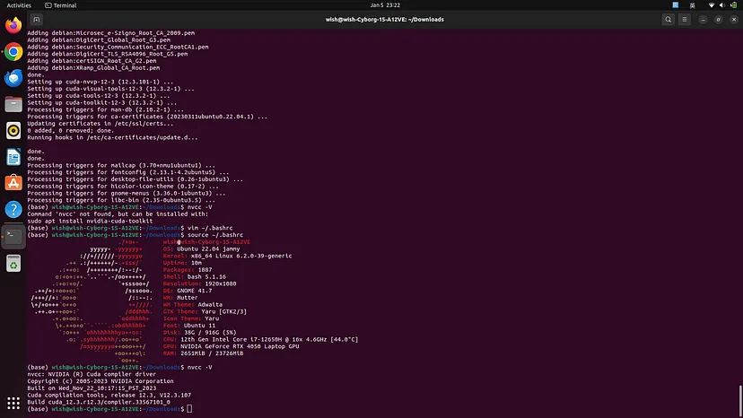
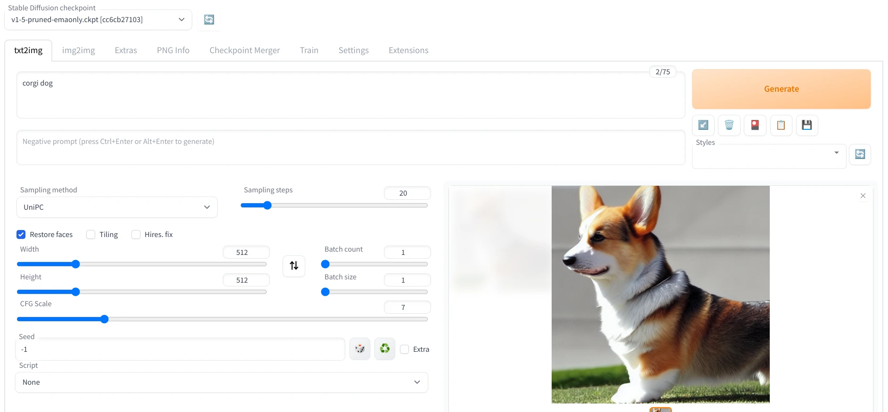

# Stable Diffusion WebUI系列 | 在docker上安装


<font style="color:rgb(21, 21, 21);">Docker容器技术可以方便在多个平台部署Stable Diffusion WebUI。程序容器化以后，在不同Linux发行版跑Stable Diffusion WebUI就容易多了。本文以Ubuntu 22.04为例，采用AbdBarho维护的docker-compose，仅支持nVidia显示卡。</font>

## <font style="color:rgb(17, 17, 17);">1. 安装docker</font>

```plain
# Add Docker's official GPG key: 
sudo apt-get update sudo apt-get install ca-certificates curl sudo install -m 0755 -d /etc/apt/keyrings sudo curl -fsSL https://download.docker.com/linux/ubuntu/gpg -o /etc/apt/keyrings/docker.asc sudo chmod a+r /etc/apt/keyrings/docker.asc
# Add the repository to Apt sources: 
echo \ "deb [arch=$(dpkg --print-architecture) signed-by=/etc/apt/keyrings/docker.asc] https://download.docker.com/linux/ubuntu \ $(. /etc/os-release && echo "$VERSION_CODENAME") stable" | \ sudo tee /etc/apt/sources.list.d/docker.list > /dev/null sudo apt-get update
sudo apt-get install docker-ce docker-ce-cli containerd.io docker-buildx-plugin docker-compose docker-compose-plugin
```

## <font style="color:rgb(17, 17, 17);">2. 安装nVidia驱动和CUDA</font>

<font style="color:rgb(21, 21, 21);">安装 专有Nvidia驱动。</font>

```plain
sudo apt-get update
ubuntu-drivers devices
```

<font style="color:rgb(21, 21, 21);">选择系统推荐的nVidia驱动并安装。</font>

```plain
== /sys/devices/pci0000:00/0000:00:01.0/0000:01:00.0 ==
modalias : pci:v000010DEd00002684sv00001043sd000088E2bc03sc00i00
vendor   : NVIDIA Corporation
driver   : nvidia-driver-535-server-open - distro non-free
driver   : nvidia-driver-535-open - distro non-free
driver   : nvidia-driver-525 - distro non-free
driver   : nvidia-driver-545 - distro non-free
driver   : nvidia-driver-535 - distro non-free recommended
driver   : nvidia-driver-545-open - distro non-free
driver   : nvidia-driver-535-server - distro non-free
driver   : nvidia-driver-525-open - distro non-free
driver   : nvidia-driver-525-server - distro non-free
driver   : xserver-xorg-video-nouveau - distro free builtin
```

```plain
sudo apt install nvidia-driver-535
```

<font style="color:rgb(21, 21, 21);">重启后确认nVidia驱动是否正常安装</font>

```plain
nvidia-smi
nvcc --version
```

<font style="color:rgb(21, 21, 21);">安装CUDA 12.3</font>

```plain
$ wget https://developer.download.nvidia.com/compute/cuda/repos/ubuntu2204/x86_64/cuda-ubuntu2204.pin
$ sudo mv cuda-ubuntu2204.pin /etc/apt/preferences.d/cuda-repository-pin-600
$ wget https://developer.download.nvidia.com/compute/cuda/12.3.2/local_installers/cuda-repo-ubuntu2204-12-3-local_12.3.2-545.23.08-1_amd64.deb
$ sudo dpkg -i cuda-repo-ubuntu2204-12-3-local_12.3.2-545.23.08-1_amd64.deb
$ sudo cp /var/cuda-repo-ubuntu2204-12-3-local/cuda-*-keyring.gpg /usr/share/keyrings/
$ sudo apt-get update
$ sudo apt-get -y install cuda-toolkit-12-3
$ vim ~/.bashrc
>> export PATH=/usr/local/cuda/bin:$PATH
>> export LD_LIBRARY_PATH=/usr/local/cuda/lib64:$LD_LIBRARY_PATH
$ source ~/.bashrc
```



## <font style="color:rgb(17, 17, 17);">3. 安装nVidia Container Toolkit套件</font>

```plain
# Add Docker's official GPG key:
sudo apt-get update
sudo apt-get install ca-certificates curl
sudo install -m 0755 -d /etc/apt/keyrings
sudo curl -fsSL https://download.docker.com/linux/ubuntu/gpg -o /etc/apt/keyrings/docker.asc
sudo chmod a+r /etc/apt/keyrings/docker.asc

# Add the repository to Apt sources:
echo \
  "deb [arch=$(dpkg --print-architecture) signed-by=/etc/apt/keyrings/docker.asc] https://download.docker.com/linux/ubuntu \
  $(. /etc/os-release && echo "$VERSION_CODENAME") stable" | \
  sudo tee /etc/apt/sources.list.d/docker.list > /dev/null
sudo apt-get update
```

```plain
sudo apt-get install docker-ce docker-ce-cli containerd.io docker-buildx-plugin docker-compose docker-compose-plugin
```

## <font style="color:rgb(17, 17, 17);">4. 复制AbdBarho的代码仓库</font>

```plain
git clone https://github.com/AbdBarho/stable-diffusion-webui-docker.git
cd stable-diffusion-webui-docker
```

## <font style="color:rgb(17, 17, 17);">5. 安装依赖套件，过程中会自动下载一个Stable Diffusion的模型。</font>

```plain
docker compose --profile download up --build
```

## <font style="color:rgb(17, 17, 17);">6. 启动容器，选取auto代表启动AUTOMATIC1111开发的WebUI</font>

```plain
docker compose --profile auto up --build
```

<font style="color:rgb(21, 21, 21);">等待启动完成，用瀏览器开启</font><code><font style="color:rgb(51, 51, 51);background-color:rgb(239, 240, 241);">http://127.0.0.1:7860</font></code><font style="color:rgb(21, 21, 21);">进入WebUI。要停止执行就是在Terminal按Ctrl＋C。</font>

<font style="color:rgb(21, 21, 21);">此docker-compose启动的Stable Diffusion WebUI，资料会掛载至同一目录下的</font><code><font style="color:rgb(51, 51, 51);background-color:rgb(239, 240, 241);">data</font></code><font style="color:rgb(21, 21, 21);">目录。自定义模型放到</font><code><font style="color:rgb(51, 51, 51);background-color:rgb(239, 240, 241);">data/Stable-diffusion</font></code><font style="color:rgb(21, 21, 21);">，生图的输出文件夹则是</font><code><font style="color:rgb(51, 51, 51);background-color:rgb(239, 240, 241);">data/output</font></code><font style="color:rgb(21, 21, 21);">。扩充功能请从网页界面装，或是在</font><code><font style="color:rgb(51, 51, 51);background-color:rgb(239, 240, 241);">data</font></code><font style="color:rgb(21, 21, 21);">新建</font><code><font style="color:rgb(51, 51, 51);background-color:rgb(239, 240, 241);">extensions</font></code><font style="color:rgb(21, 21, 21);">目录再於该处放入扩充功能的目录。若要修改WebUI启动时的命令行参数，编辑此目录下的</font><code><font style="color:rgb(51, 51, 51);background-color:rgb(239, 240, 241);">docker-compose.yml</font></code><font style="color:rgb(21, 21, 21);">，修改</font><code><font style="color:rgb(51, 51, 51);background-color:rgb(239, 240, 241);">CLI_ARGS</font></code><font style="color:rgb(21, 21, 21);">这一行：</font>

```plain
auto: &automatic
    <<: *base_service
    profiles: ["auto"]
    build: ./services/AUTOMATIC1111
    image: sd-auto:51
    environment:
      - CLI_ARGS=--allow-code --medvram --xformers --enable-insecure-extension-access --api
```

<font style="color:rgb(21, 21, 21);">以后更新docker镜像请使用如下命令：</font>

```plain
docker compose pull
```


> 更新: 2024-08-16 15:18:52  
> 原文: <https://www.yuque.com/lixinsi/nyg25m/mfdipnhmwvr0eqq7>