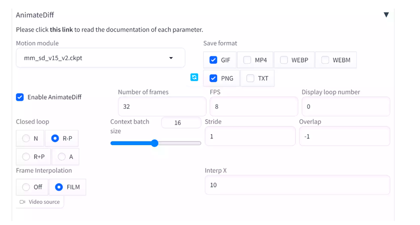
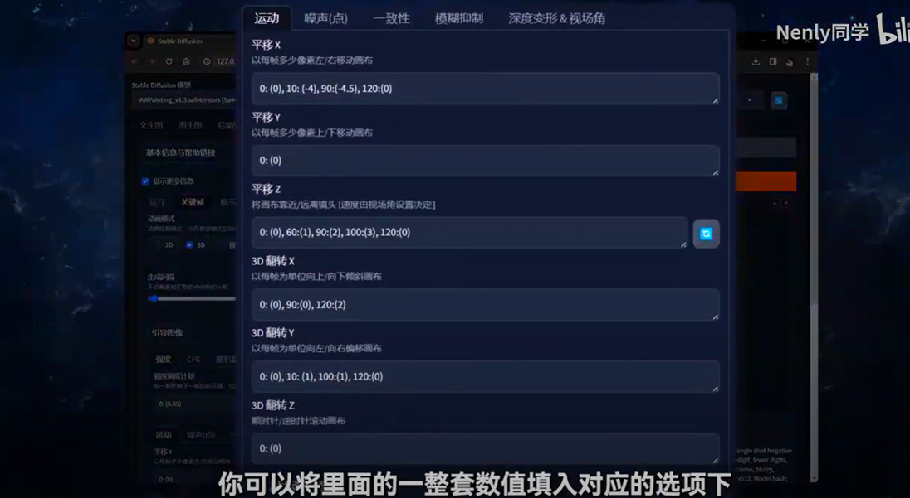

# Stable Diffusion 一句话生成视频！ 本地运行，最稳定的方法！


20240623：[https://www.youtube.com/watch?v=jyKN-_ztPxM](https://www.youtube.com/watch?v=jyKN-_ztPxM)

### <font style="color:rgb(68, 68, 68);">1.下载最新版的 Stable-diffusion ：【</font>[点击下载](https://github.com/AUTOMATIC1111/stable-diffusion-webui)<font style="color:rgb(68, 68, 68);">】</font>
<font style="color:rgb(68, 68, 68);">安装所需的依赖项：</font>[Python 3.10.6](https://www.python.org/downloads/release/python-3106/)<font style="color:rgb(68, 68, 68);"> 和 </font>[Git](https://git-scm.com/)

<font style="color:rgb(68, 68, 68);">如果你无法全局科学上网，就下载有网友提供的整合包，无需手动配置环境：【</font>[链接](https://pan.baidu.com/s/1n743_sCxQMydU1iDm19IZA)<font style="color:rgb(68, 68, 68);">】提取码：sdcn</font>

### <font style="color:rgb(68, 68, 68);">2.安装中文语言：【</font>[开源](https://github.com/VinsonLaro/stable-diffusion-webui-chinese)<font style="color:rgb(68, 68, 68);">】</font>
```bash
https://github.com/VinsonLaro/stable-diffusion-webui-chinese
```

### <font style="color:rgb(68, 68, 68);">3.安装 SD AnimateDiff  和 adetailer 插件</font>
```bash
https://github.com/continue-revolution/sd-webui-animatediff.git
https://github.com/Bing-su/adetailer.git
```

<font style="color:rgb(68, 68, 68);">注意: 如果你在大陆，请先做好科学上网，否则无法在线安装。</font>

### <font style="color:rgb(68, 68, 68);">4.下载 mm_sd_v15_v2 模型 【</font>[点击下载](https://huggingface.co/guoyww/animatediff/resolve/main/mm_sd_v15_v2.ckpt)<font style="color:rgb(68, 68, 68);">】</font>
<font style="color:rgb(68, 68, 68);">下载后把模型文件放在 stable-diffusion-webui/extensions/sd-webui-animatediff/model/ 文件夹下</font>

### <font style="color:rgb(68, 68, 68);">5.下载大模型 majicmixRealistic_v6  【</font>[点击下载](https://huggingface.co/casque/majicmixRealistic_v6/blob/main/majicmixRealistic_v6.safetensors)<font style="color:rgb(68, 68, 68);">】</font>
<font style="color:rgb(68, 68, 68);">下载后把大模型文件放入 stable-diffusion-webui-1.7.0\models\Stable-diffusion 文件夹下</font>

### <font style="color:rgb(68, 68, 68);">6.重启 Stable-diffusion  UI 界面 并选择模型 majicmixRealistic_v6</font>
### <font style="color:rgb(68, 68, 68);">7.正向提示词:</font>
```bash
((pure white background )),Best quality,masterpiece,ultra high res,raw photo,beautiful and aesthetic,(photorealistic:1.4),1girl,full-body composition,striking perspective,Danceing,high-waisted shorts,ruffled blouse
```

<font style="color:rgb(68, 68, 68);">反向提示词:</font>

<font style="color:rgb(68, 68, 68);">  
</font>

```bash
FastNegativeV2 EasyNegative
```

### <font style="color:rgb(68, 68, 68);">8.配置AnimateDiff ，如下图所示：</font>


<font style="color:rgb(68, 68, 68);">Enable AnimateDiff：启用</font>

<font style="color:rgb(68, 68, 68);">Number of frames  就是总帧数， 总帧数/FPS = 视频的长度，上面的例子最后就会生成4秒钟的视频，你可以根据自己需要生成视频的长度。</font>

<font style="color:rgb(68, 68, 68);">Frame Interpolation 细节优化 ，将</font><font style="color:rgb(68, 68, 68);">Frame Interpolation</font><font style="color:rgb(68, 68, 68);">设置为 FILM，把</font><font style="color:rgb(68, 68, 68);">Interp X</font><font style="color:rgb(68, 68, 68);">设置为 FPS 的倍数。比如把它设置为 10 会使 8 FPS 视频达到 80 FPS</font>

<font style="color:rgb(68, 68, 68);">提醒：提示词不要超过75个，否则生成的视频会不完整！</font>

[https://www.freedidi.com/11215.html](https://www.freedidi.com/11215.html)

[https://www.freedidi.com/12706.html](https://www.freedidi.com/12706.html)





<font style="color:rgb(68, 68, 68);"></font>


> 更新: 2024-06-24 08:47:22  
> 原文: <https://www.yuque.com/lixinsi/nyg25m/im0cxhvbmb5vpgn4>