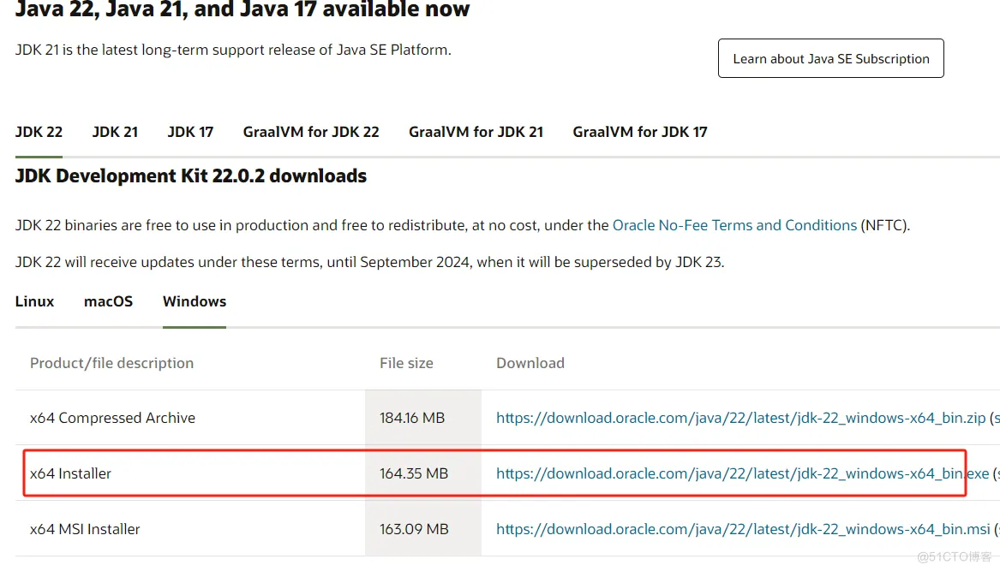
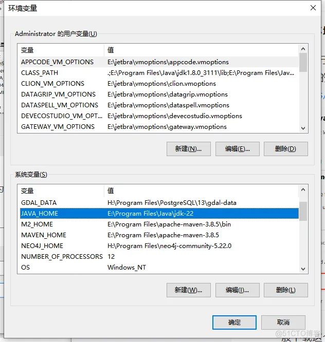
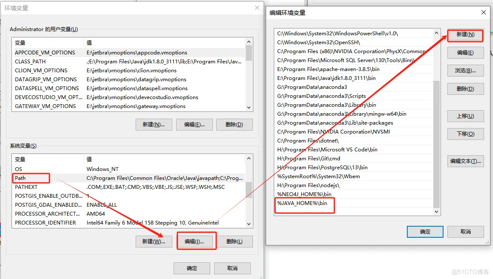
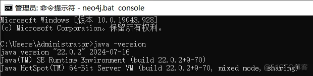
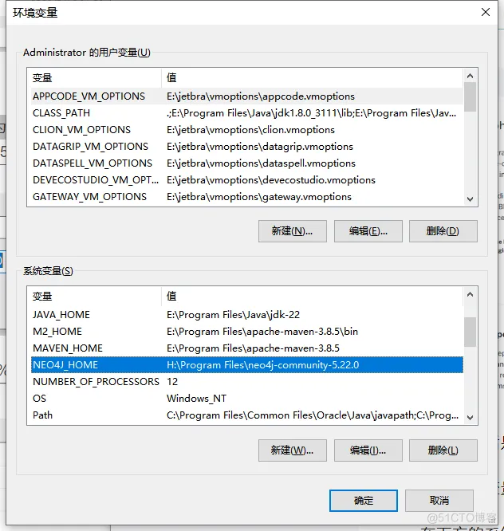
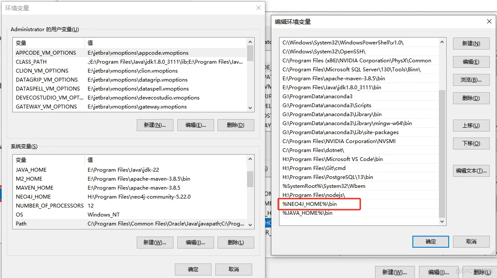
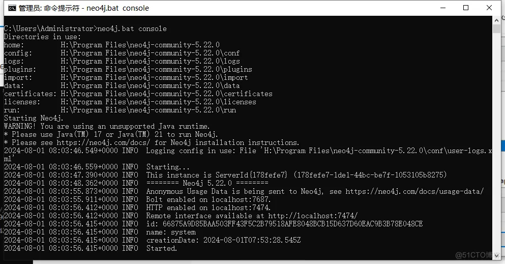
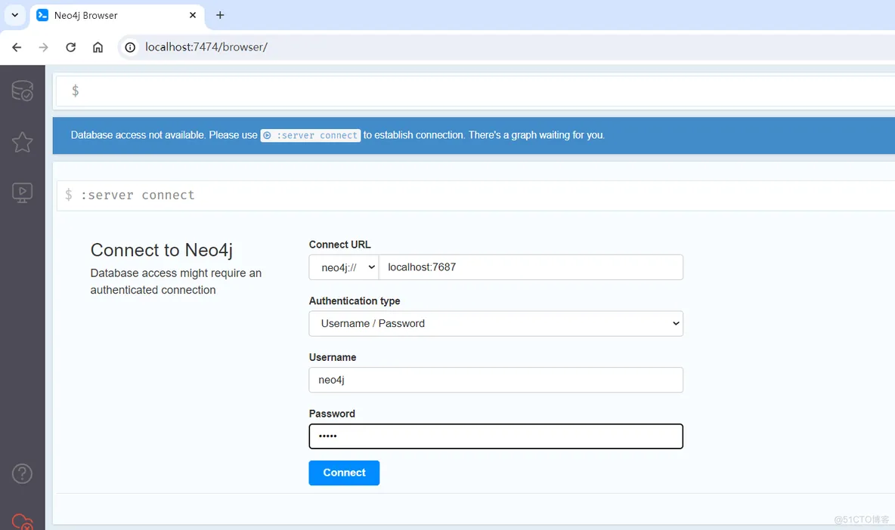
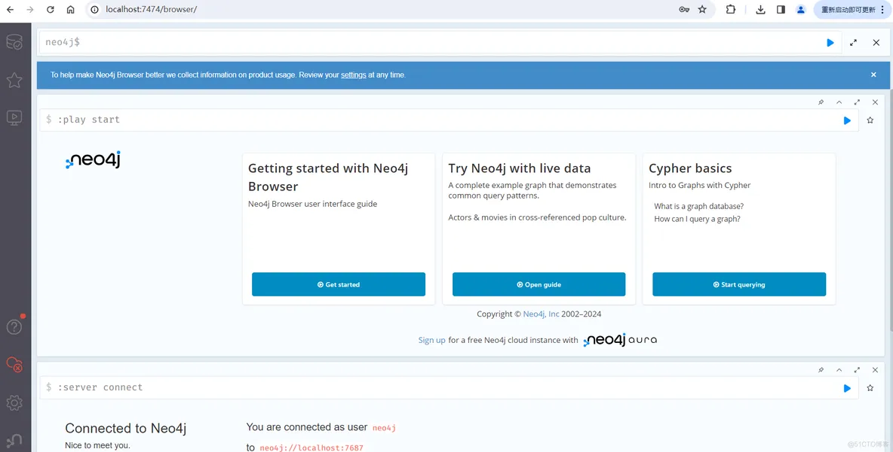

# Windows下Neo4j图数据库安装部署

**一、基础环境安装**

Neo4j是基于Java的图形数据库，运行Neo4j需要启动JVM进程，因此必须安装JAVA SE的JDK。从Oracle官方网站下载：[https://www.oracle.com/java/technologies/downloads/?er=221886#jdk22-windows](https://www.oracle.com/java/technologies/downloads/?er=221886#jdk22-windows)

一般下载这个，安装到电脑。

配置环境变量，在系统变量区域，新建环境变量，命名为JAVA_HOME，变量值设置为刚才JAVA的安装路径：

编辑系统变量区的Path，点击新建，然后输入 %JAVA_HOME%\bin

打开命令提示符CMD（WIN+R,输入cmd)，输入 java -version，若提示Java的版本信息，则证明环境变量配置成功。

**二、neo4j安装**

通过官网下载，可以选Community社区版：[https://neo4j.com/deployment-center/](https://neo4j.com/download/)

下载完成后是一个压缩包，直接解压缩到合适的路径就可以，不需要安装。

配置环境变量，打开方式与配置java环境相同。

在下方的系统变量区域，新建环境变量，命名为NEO4J_HOME，变量值设置为刚才NEO4J的安装路径：

编辑系统变量区的Path，点击新建，然后输入 %NEO4J_HOME%\bin

进入cmd，输入命令neo4j.bat console，出现下面的界面，则证明neo4j启动成功。

**三、访问数据库**

上面的cmd窗口不用关闭，界面中展示有数据库访问地址。

在浏览器中输入[http://localhost:7474](http://localhost:7474/)，进入登录界面，初始默认用户名和密码都是neo4j：

登录进去默认会提示修改密码（8位以上），改完就可以进入数据库：

> 更新: 2024-12-18 17:02:33  
> 原文: <https://www.yuque.com/lixinsi/nyg25m/kyam2rgcth6s93tf>