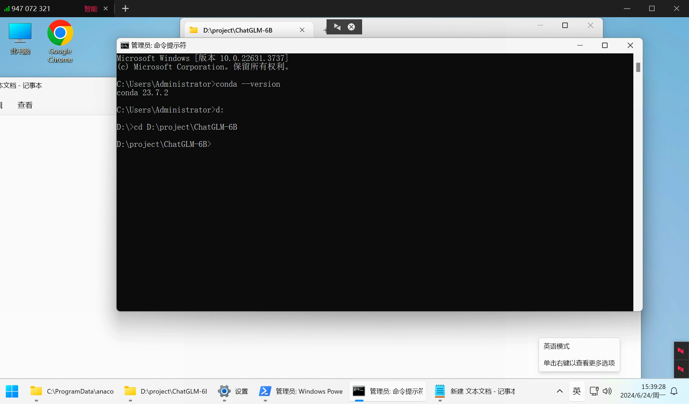
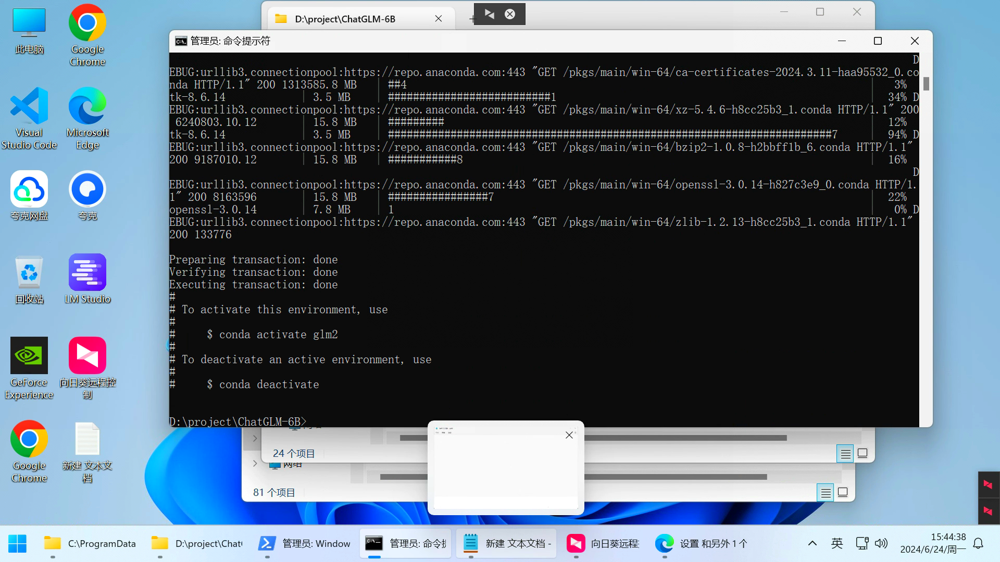

# chatlm安装

#### 1.安装 anaconda
#### 2.把 anaconda 添加到环境变量
[https://blog.csdn.net/u013211009/article/details/78437098](https://blog.csdn.net/u013211009/article/details/78437098)



```python
conda create -n glm2 python=3.10.12 
```




#### 3.下载 torch
```python
安装torch
pip3 install torch torchvision torchvision torchaudio --index-url

pip install torch-1.10.1+cu113-cp37-cp37m-win_amd64.whl
```

#### 4.安装 torch 哈希值不匹配


```python
python -m pip cache purge
pip cache purge
python -m pip install --upgrade pip
```

pip 安装指定版本命令

```bash
python -m pip install pip==19.2.3 安装指定版本
python install --upgrade pip
```

```bash
pip install langchain-chatchat -U
```

[https://www.freedidi.com/9921.html](https://www.freedidi.com/9921.html)


> 更新: 2024-06-24 16:13:00  
> 原文: <https://www.yuque.com/lixinsi/nyg25m/qibr0dm0t922wwmg>