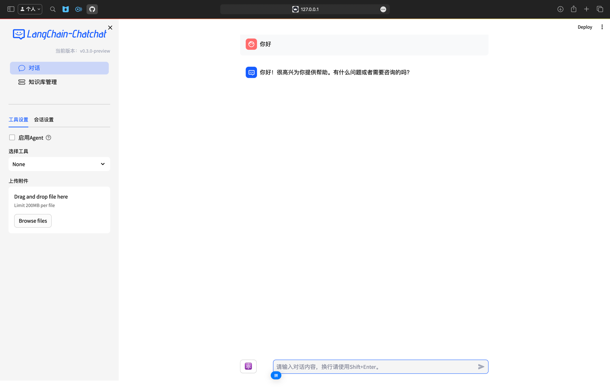

# langchain

github 地址：<https://github.com/chatchat-space/Langchain-Chatchat>

先把推理服务搞起来，然后初始化配置，然后初始化文档库，然后再启动chatchat

#### <font style="color:rgb(31, 35, 40);">1. 安装 Langchain-Chatchat</font>

<font style="color:rgb(31, 35, 40);">从 0.3.0 版本起，Langchain-Chatchat 提供以 Python 库形式的安装方式，具体安装请执行</font>

<font style="color:rgb(31, 35, 40);">使用 pip：</font>

```python
pip install langchain-chatchat -U
```

<font style="color:rgb(31, 35, 40);"></font>

Important

<font style="color:rgb(31, 35, 40);">为确保所使用的 Python 库为最新版，建议使用官方 Pypi 源或清华源。</font>

Note

<font style="color:rgb(31, 35, 40);">因模型部署框架 Xinference 接入 Langchain-Chatchat 时需要额外安装对应的 Python 依赖库，因此如需搭配 Xinference 框架使用时，建议使用如下安装方式：</font>

```python
pip install "langchain-chatchat[xinference]" -U
```

#### <font style="color:rgb(31, 35, 40);">2. 模型推理框架并加载模型</font>

<font style="color:rgb(31, 35, 40);">从 0.3.0 版本起，Langchain-Chatchat 不再根据用户输入的本地模型路径直接进行模型加载，涉及到的模型种类包括 LLM、Embedding、Reranker 及后续会提供支持的多模态模型等，均改为支持市面常见的各大模型推理框架接入，如</font><font style="color:rgb(31, 35, 40);"> </font>[<font style="color:rgb(31, 35, 40);">Xinference</font>](https://github.com/xorbitsai/inference)<font style="color:rgb(31, 35, 40);">、</font>[<font style="color:rgb(31, 35, 40);">Ollama</font>](https://github.com/ollama/ollama)<font style="color:rgb(31, 35, 40);">、</font>[<font style="color:rgb(31, 35, 40);">LocalAI</font>](https://github.com/mudler/LocalAI)<font style="color:rgb(31, 35, 40);">、</font>[<font style="color:rgb(31, 35, 40);">FastChat</font>](https://github.com/lm-sys/FastChat)<font style="color:rgb(31, 35, 40);">、</font>[<font style="color:rgb(31, 35, 40);">One API</font>](https://github.com/songquanpeng/one-api)<font style="color:rgb(31, 35, 40);"> </font><font style="color:rgb(31, 35, 40);">等。</font>

<font style="color:rgb(31, 35, 40);">因此，请确认在启动 Langchain-Chatchat 项目前，首先进行模型推理框架的运行，并加载所需使用的模型。</font>

<font style="color:rgb(31, 35, 40);">这里以 Xinference 举例, 请参考</font><font style="color:rgb(31, 35, 40);"> </font>[<font style="color:rgb(31, 35, 40);">Xinference文档</font>](https://inference.readthedocs.io/zh-cn/latest/getting_started/installation.html)<font style="color:rgb(31, 35, 40);"> </font><font style="color:rgb(31, 35, 40);">进行框架部署与模型加载。</font>

Warning

<font style="color:rgb(31, 35, 40);">为避免依赖冲突，请将 Langchain-Chatchat 和模型部署框架如 Xinference 等放在不同的 Python 虚拟环境中, 比如 conda, venv, virtualenv 等。</font>

#### <font style="color:rgb(31, 35, 40);">3. 初始化项目配置与数据目录</font>

<font style="color:rgb(31, 35, 40);">从 0.3.1 版本起，Langchain-Chatchat 使用本地</font><font style="color:rgb(31, 35, 40);"> </font><code><font style="color:rgb(31, 35, 40);">yaml</font></code><font style="color:rgb(31, 35, 40);"> </font><font style="color:rgb(31, 35, 40);">文件的方式进行配置，用户可以直接查看并修改其中的内容，服务器会自动更新无需重启。</font>

1. <font style="color:rgb(31, 35, 40);">设置 Chatchat 存储配置文件和数据文件的根目录（可选）</font>

# on linux or macos

export CHATCHAT\_ROOT=/path/to/chatchat\_data

# on windows

set CHATCHAT\_ROOT=/path/to/chatchat\_data

<font style="color:rgb(31, 35, 40);">若不设置该环境变量，则自动使用当前目录。</font>

1. <font style="color:rgb(31, 35, 40);">执行初始化</font>

   chatchat init

<font style="color:rgb(31, 35, 40);">该命令会执行以下操作：</font>

* <font style="color:rgb(31, 35, 40);">创建所有需要的数据目录</font>
* <font style="color:rgb(31, 35, 40);">复制 samples 知识库内容</font>
* <font style="color:rgb(31, 35, 40);">生成默认</font><font style="color:rgb(31, 35, 40);"> </font><code><font style="color:rgb(31, 35, 40);">yaml</font></code><font style="color:rgb(31, 35, 40);"> </font><font style="color:rgb(31, 35, 40);">配置文件</font>

1. <font style="color:rgb(31, 35, 40);">修改配置文件</font>

* <font style="color:rgb(31, 35, 40);">配置模型（model\_settings.yaml）\ </font><font style="color:rgb(31, 35, 40);">需要根据步骤 </font>**<font style="color:rgb(31, 35, 40);">2. 模型推理框架并加载模型</font>**<font style="color:rgb(31, 35, 40);"> 中选用的模型推理框架与加载的模型进行模型接入配置，具体参考 </font><code><font style="color:rgb(31, 35, 40);">model_settings.yaml</font></code><font style="color:rgb(31, 35, 40);"> 中的注释。主要修改以下内容：</font>

# 默认选用的 LLM 名称

DEFAULT\_LLM\_MODEL: qwen1.5-chat

# 默认选用的 Embedding 名称

DEFAULT\_EMBEDDING\_MODEL: bge-large-zh-v1.5

# 将 `LLM_MODEL_CONFIG` 中 `llm_model, action_model` 的键改成对应的 LLM 模型

# 在 `MODEL_PLATFORMS` 中修改对应模型平台信息

<font style="color:rgb(31, 35, 40);">配置知识库路径（basic\_settings.yaml）（可选）</font>\ <font style="color:rgb(31, 35, 40);">默认知识库位于 </font><code><font style="color:rgb(31, 35, 40);">CHATCHAT_ROOT/data/knowledge_base</font></code><font style="color:rgb(31, 35, 40);">，如果你想把知识库放在不同的位置，或者想连接现有的知识库，可以在这里修改对应目录即可。</font>

<font style="color:rgb(31, 35, 40);"># 知识库默认存储路径</font>

<font style="color:rgb(31, 35, 40);"> KB\_ROOT\_PATH: D:\chatchat-test\data\knowledge\_base</font>

<font style="color:rgb(31, 35, 40);"></font>

<font style="color:rgb(31, 35, 40);"> # 数据库默认存储路径。如果使用sqlite，可以直接修改DB\_ROOT\_PATH；如果使用其它数据库，请直接修改SQLALCHEMY\_DATABASE\_URI。</font>

<font style="color:rgb(31, 35, 40);"> DB\_ROOT\_PATH: D:\chatchat-test\data\knowledge\_base\info.db</font>

<font style="color:rgb(31, 35, 40);"></font>

<font style="color:rgb(31, 35, 40);"> # 知识库信息数据库连接URI</font>

<font style="color:rgb(31, 35, 40);"> SQLALCHEMY\_DATABASE\_URI: sqlite:///D:\chatchat-test\data\knowledge\_base\info.db\ </font>

* <font style="color:rgb(31, 35, 40);">配置知识库（kb\_settings.yaml）（可选）</font>

<font style="color:rgb(31, 35, 40);">默认使用</font><font style="color:rgb(31, 35, 40);"> </font><code><font style="color:rgb(31, 35, 40);">FAISS</font></code><font style="color:rgb(31, 35, 40);"> </font><font style="color:rgb(31, 35, 40);">知识库，如果想连接其它类型的知识库，可以修改</font><font style="color:rgb(31, 35, 40);"> </font><code><font style="color:rgb(31, 35, 40);">DEFAULT_VS_TYPE</font></code><font style="color:rgb(31, 35, 40);"> </font><font style="color:rgb(31, 35, 40);">和</font><font style="color:rgb(31, 35, 40);"> </font><code><font style="color:rgb(31, 35, 40);">kbs_config</font></code><font style="color:rgb(31, 35, 40);">。</font>

#### <font style="color:rgb(31, 35, 40);">4. 初始化知识库</font>

Warning

<font style="color:rgb(31, 35, 40);">进行知识库初始化前，请确保已经启动模型推理框架及对应 </font><code><font style="color:rgb(31, 35, 40);">embedding</font></code><font style="color:rgb(31, 35, 40);"> 模型，且已按照上述</font>**<font style="color:rgb(31, 35, 40);">步骤3</font>**<font style="color:rgb(31, 35, 40);">完成模型接入配置。</font>

<font style="color:rgb(31, 35, 40);">chatchat kb -r</font>

<font style="color:rgb(31, 35, 40);">更多功能可以查看</font><font style="color:rgb(31, 35, 40);"> </font><code><font style="color:rgb(31, 35, 40);">chatchat kb --help</font></code>

<font style="color:rgb(31, 35, 40);">出现以下日志即为成功:</font>

<font style="color:rgb(31, 35, 40);">----------------------------------------------------------------------------------------------------</font>

<font style="color:rgb(31, 35, 40);">知识库名称      ：samples</font>

<font style="color:rgb(31, 35, 40);">知识库类型      ：faiss</font>

<font style="color:rgb(31, 35, 40);">向量模型：      ：bge-large-zh-v1.5</font>

<font style="color:rgb(31, 35, 40);">知识库路径      ：/root/anaconda3/envs/chatchat/lib/python3.11/site-packages/chatchat/data/knowledge\_base/samples</font>

<font style="color:rgb(31, 35, 40);">文件总数量      ：47</font>

<font style="color:rgb(31, 35, 40);">入库文件数      ：42</font>

<font style="color:rgb(31, 35, 40);">知识条目数      ：740</font>

<font style="color:rgb(31, 35, 40);">用时            ：0:02:29.701002</font>

<font style="color:rgb(31, 35, 40);">----------------------------------------------------------------------------------------------------</font>

<font style="color:rgb(31, 35, 40);"></font>

<font style="color:rgb(31, 35, 40);">总计用时        ：0:02:33.414425</font>

Note

<font style="color:rgb(31, 35, 40);">知识库初始化的常见问题</font>

#### <font style="color:rgb(31, 35, 40);">5. 启动项目</font>

<font style="color:rgb(31, 35, 40);">chatchat start -a</font>

<font style="color:rgb(31, 35, 40);">出现以下界面即为启动成功:</font>



Warning

<font style="color:rgb(31, 35, 40);">由于 chatchat 配置默认监听地址</font><font style="color:rgb(31, 35, 40);"> </font><code><font style="color:rgb(31, 35, 40);">DEFAULT_BIND_HOST</font></code><font style="color:rgb(31, 35, 40);"> </font><font style="color:rgb(31, 35, 40);">为 127.0.0.1, 所以无法通过其他 ip 进行访问。</font>

<font style="color:rgb(31, 35, 40);">如需通过机器ip 进行访问(如 Linux 系统), 需要到</font><font style="color:rgb(31, 35, 40);"> </font><code><font style="color:rgb(31, 35, 40);">basic_settings.yaml</font></code><font style="color:rgb(31, 35, 40);"> </font><font style="color:rgb(31, 35, 40);">中将监听地址修改为 0.0.0.0。</font>

### <font style="color:rgb(31, 35, 40);">其它配置</font>

1. <font style="color:rgb(31, 35, 40);">数据库对话配置请移步这里</font><font style="color:rgb(31, 35, 40);"> </font>[<font style="color:rgb(31, 35, 40);">数据库对话配置说明</font>](https://github.com/chatchat-space/Langchain-Chatchat/blob/master/docs/install/README_text2sql.md)

### <font style="color:rgb(31, 35, 40);">源码安装部署/开发部署</font>

<font style="color:rgb(31, 35, 40);">源码安装部署请参考</font><font style="color:rgb(31, 35, 40);"> </font>[<font style="color:rgb(31, 35, 40);">开发指南</font>](https://github.com/chatchat-space/Langchain-Chatchat/blob/master/docs/contributing/README_dev.md)

### <font style="color:rgb(31, 35, 40);">Docker 部署</font>

```plain
docker pull chatimage/chatchat:0.3.1.2-2024-0720

docker pull ccr.ccs.tencentyun.com/chatchat/chatchat:0.3.1.2-2024-0720 # 国内镜像
```

Important

<font style="color:rgb(31, 35, 40);">强烈建议: 使用 docker-compose 部署, 具体参考</font><font style="color:rgb(31, 35, 40);"> </font>[<font style="color:rgb(31, 35, 40);">README\_docker</font>](https://github.com/chatchat-space/Langchain-Chatchat/blob/master/docs/install/README_docker.md)

### <font style="color:rgb(31, 35, 40);">旧版本迁移</font>

* <font style="color:rgb(31, 35, 40);">0.3.x 结构改变很大,强烈建议您按照文档重新部署. 以下指南不保证100%兼容和成功. 记得提前备份重要数据!</font>
* <font style="color:rgb(31, 35, 40);">首先按照</font><font style="color:rgb(31, 35, 40);"> </font><code><font style="color:rgb(31, 35, 40);">安装部署</font></code><font style="color:rgb(31, 35, 40);"> </font><font style="color:rgb(31, 35, 40);">中的步骤配置运行环境，修改配置文件</font>
* <font style="color:rgb(31, 35, 40);">将 0.2.x 项目的 knowledge\_base 目录拷贝到配置的</font><font style="color:rgb(31, 35, 40);"> </font><code><font style="color:rgb(31, 35, 40);">DATA</font></code><font style="color:rgb(31, 35, 40);"> </font><font style="color:rgb(31, 35, 40);">目录下</font>

<font style="color:rgb(31, 35, 40);">  
</font><font style="color:rgb(31, 35, 40);"> </font>


> 更新: 2024-07-29 22:29:34  
> 原文: <https://www.yuque.com/lixinsi/nyg25m/dw4fapqb75oq8evu>