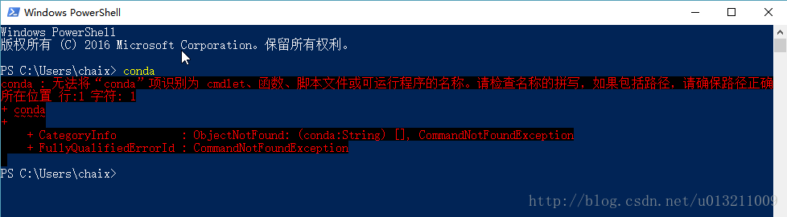
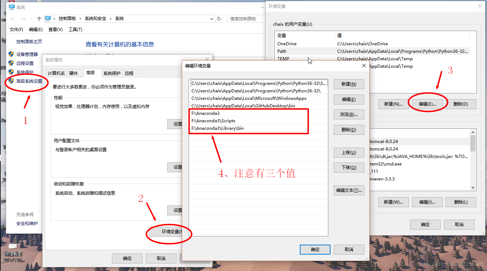
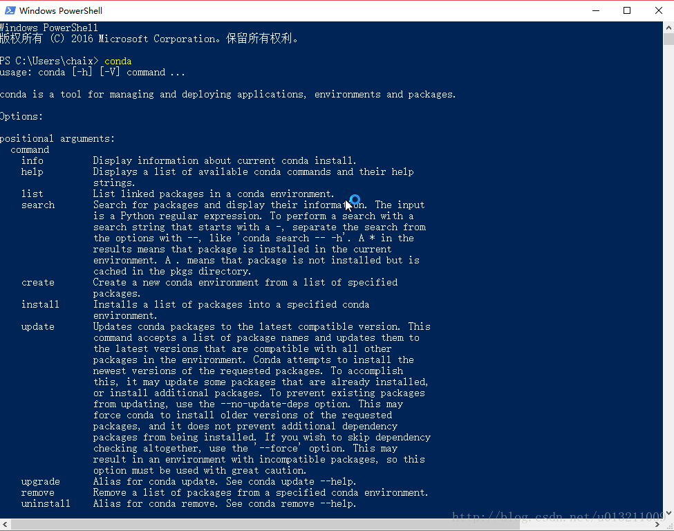

# win10+python3下Anaconda的安装及环境变量配置

## <font style="color:rgb(79, 79, 79);">问题描述</font>
<font style="color:rgb(77, 77, 77);">先安装的python3，然后正常安装了Anaconda（直接从清华镜像 </font>[index of/anaconda/archive](https://mirrors.tuna.tsinghua.edu.cn/anaconda/archive/)<font style="color:rgb(77, 77, 77);"> 下载安装包双击安装）。除了选择装在了F盘，其他我都是一直点next...所以忘了勾选Add path to your environment，以致安装完之后cmd根本用不了，显示如下图的错误：conda：无法将“conda”项识别为cmdlet、函数、脚本文件或可运行程序的名称。请检查……</font>

<font style="color:rgb(77, 77, 77);"></font>




## <font style="color:rgb(79, 79, 79);">解决办法</font>
<font style="color:rgb(77, 77, 77);">没有添加系统变量，所有系统根本识别不了conda命令，找不到位置，所以添加以下系统变量：</font>

<font style="color:rgb(77, 77, 77);">添加对应Anaconda环境变量：（以自己的安装路径为准）</font>

```bash
F:\Anaconda3
F:\Anaconda3\Scripts
F:\Anaconda3\Library\bin
```




<font style="color:rgb(77, 77, 77);">然后重启命令行就好了（快捷键：win+x，i => Windows PowerShell），输入conda，然后等灯等灯~   yeah~</font>

<font style="color:rgb(77, 77, 77);"></font>




> 更新: 2024-06-18 17:48:08  
> 原文: <https://www.yuque.com/lixinsi/nyg25m/ogauu8tq50qr7u8w>