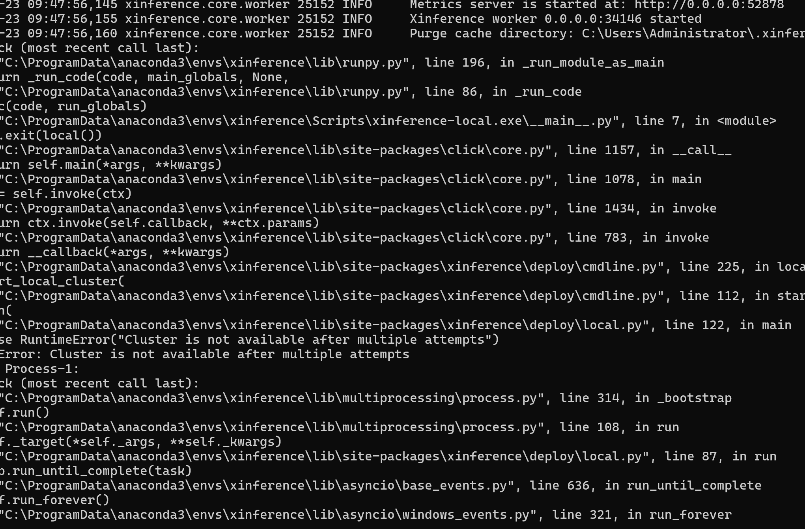
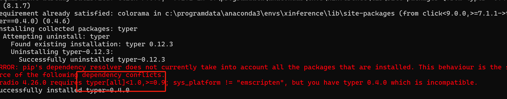
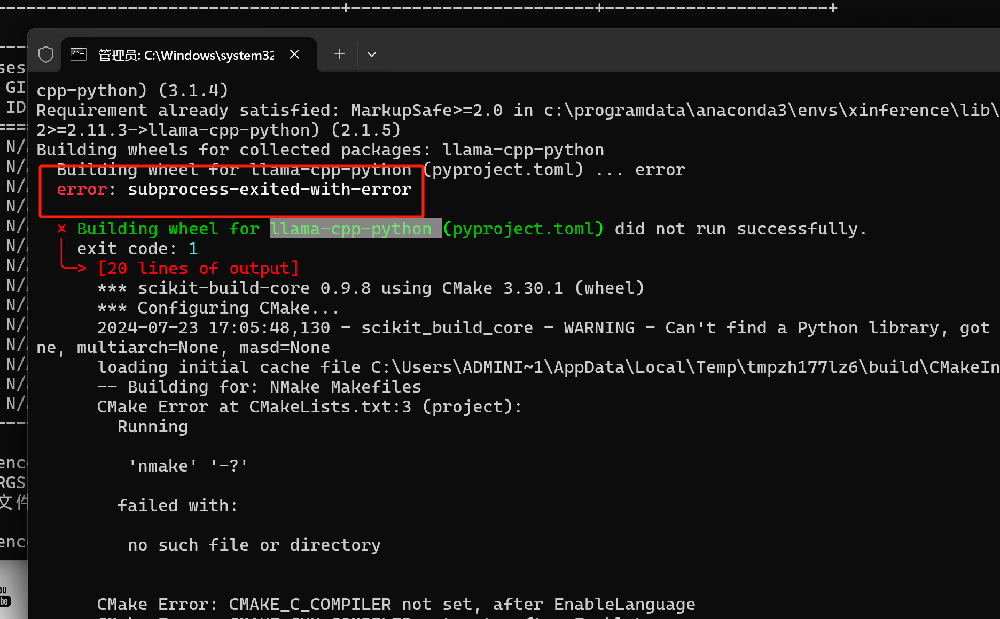
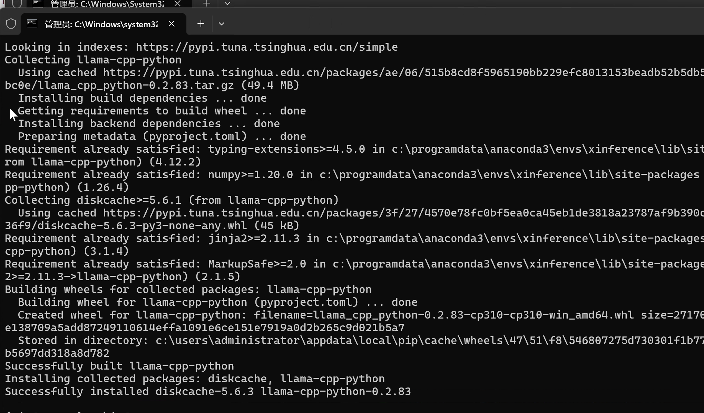

# xinference

github 安装文档地址：[https://inference.readthedocs.io/zh-cn/latest/getting_started/installation.html#installation](https://inference.readthedocs.io/zh-cn/latest/getting_started/installation.html#installation)

参考文档

[https://xorbits.cn/blogs/langchain-streamlit-doc-chat#6%E7%94%A8-streamlit-%E5%AE%9E%E7%8E%B0%E4%B8%80%E4%B8%AA-demo](https://xorbits.cn/blogs/langchain-streamlit-doc-chat#6%E7%94%A8-streamlit-%E5%AE%9E%E7%8E%B0%E4%B8%80%E4%B8%AA-demo)


github 地址：[https://github.com/xorbitsai/inference](https://github.com/xorbitsai/inference)

### 1 .问题记录启动
用 xinference-local --host 0.0.0.0 --port 9997  启动 xinference 报错显示端口占用，问题截图如下



RuntimeError: Cluster is not available after multiple attempts

#### 解决方法：<font style="color:rgb(31, 35, 40);">换IP就可以了</font>
```python
xinference-local --host 192.168.5.19 --port 9997
xinference-local --host 0.0.0.0 --port 9997
```

### 2 问题 2typer 版本问题


```python
pip install typer==0.9
```

### 3.问题 报错GenerationMixin._get_logits_warper() missing 1 required positional argument: 'device
```python
pip install Transformers==4.36.0
```


#### 4.GPU 启动
参考资料

[https://github.com/abetlen/llama-cpp-python](https://github.com/abetlen/llama-cpp-python)

```python
pip install llama-cpp-python
```




此次安装是安装的 visul stuido 2022



```python
# 1. 安装
pip install "xinference[all]"

# 2. 启动
# 默认情况下，Xinference 会使用 <HOME>/.xinference 作为主目录来存储一些必要的信息，比如日志文件和模型文件
xinference-local --host 0.0.0.0 --port 9997

# 3. 使用命令行运行模型（不指定-u/--model-uid会随机生成一个）
# -u --model-uid 不指定会自动生成一个唯一id（默认跟模型名一样）
# -n --model-name 模型名
# -f model format
# -s 模型大小（billions）
# -e --endpoint xinference地址
# -r --replica 副本数
# --n-gpu 使用多少个gpu
# 在使用具体的加速框架时，可以增加对应的参数，如vllm支持的--max_model_len 8192
xinference launch -u my-llama-2 -n llama-2-chat -s 13 -f pytorch -r 1 --n-gpu 2 --gpu-idx 3,4
```

```python
xinference launch -u qwen1.5-chat-32b -n qwen1.5-chat -f awq -s 32 -q Int4 -r 1 --n-gpu 2 --max_model_len 32768 --gpu_memory_utilization 0.9 --enforce_eager True
```

#### 官网 docker 拉取 启动 GPU
```python
docker run -e XINFERENCE_MODEL_SRC=modelscope -p 9997:9997 --gpus all xprobe/xinference:latest xinference-local -H 0.0.0.0 --log-level debug
```


[https://xorbits.cn/blogs/langchain-streamlit-doc-chat](https://xorbits.cn/blogs/langchain-streamlit-doc-chat)本地部署


#### centos 部署
[https://blog.csdn.net/liuzhenghua66/article/details/137536335](https://blog.csdn.net/liuzhenghua66/article/details/137536335)

#### 参考资料
[https://doc.fastgpt.in/docs/development/custom-models/xinference/](https://doc.fastgpt.in/docs/development/custom-models/xinference/)


> 更新: 2024-07-31 14:09:32  
> 原文: <https://www.yuque.com/lixinsi/nyg25m/aedgpe41y30emk3k>