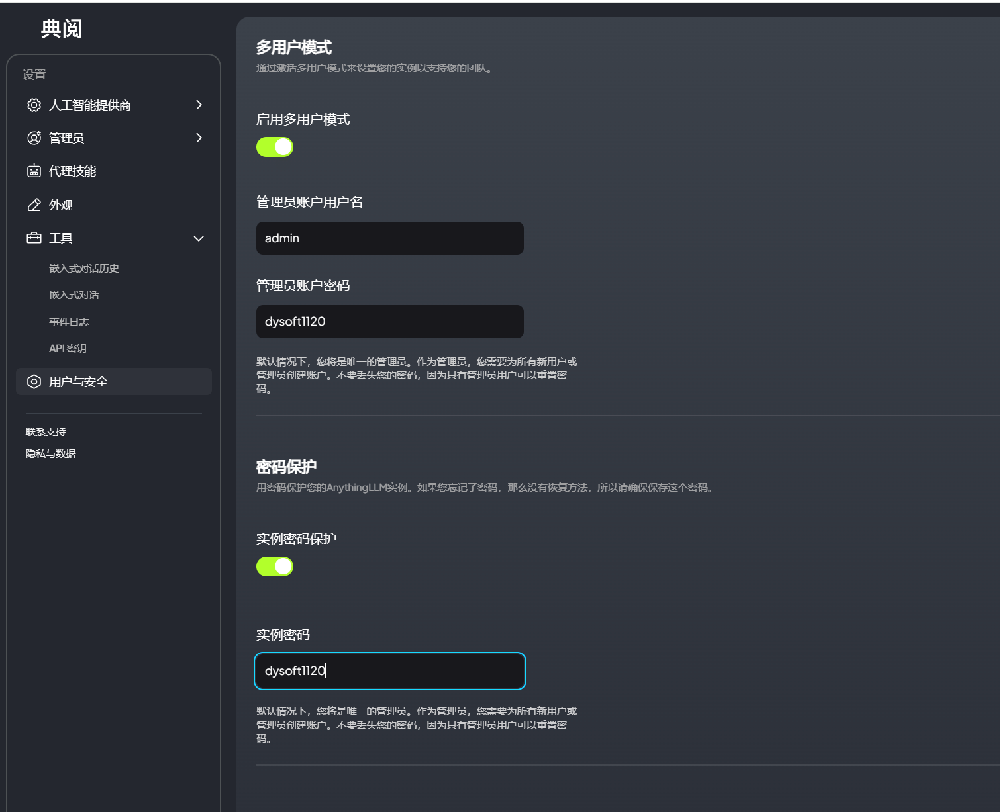

# 不使用Docker配置AnythingLLM实例

**<font style="color:rgb(12, 10, 9);">不使用Docker配置AnythingLLM实例</font>**

<font style="color:rgb(12, 10, 9);">一次勇敢的尝试！</font><font style="color:rgb(12, 10, 9);">😅</font>

<font style="color:rgb(12, 10, 9);">在没有 Docker 的情况下配置 AnythingLLM 实例需要更多努力，但这是可行的。以下是帮助您在 Linux 机器上设置 AnythingLLM 实例的分步指南：</font>

**<font style="color:rgb(12, 10, 9);">先决条件：</font>**

1. <font style="color:rgb(12, 10, 9);">具有兼容架构（x86\_64 或 ARM64）的 Linux 机器（例如 Ubuntu、CentOS 或 Fedora）。</font>
2. <font style="color:rgb(12, 10, 9);">兼容的 CUDA 或 ROCm 安装（取决于您的 GPU 架构）。</font>
3. <font style="color:rgb(12, 10, 9);">兼容的 Python 版本（3.7 或更高版本）。</font>
4. <font style="color:rgb(12, 10, 9);">兼容 CUDA 或支持 ROCm 的 GPU，具有足够的 VRAM（至少 8 GB）。</font>

**<font style="color:rgb(12, 10, 9);">步骤 1：安装依赖项</font>**

1. <font style="color:rgb(12, 10, 9);">安装所需的依赖项：</font>
   * <code><font style="color:rgb(12, 10, 9);">git</font></code><font style="color:rgb(12, 10, 9);">：（</font><code><font style="color:rgb(12, 10, 9);">sudo apt-get install git</font></code><font style="color:rgb(12, 10, 9);">基于 Ubuntu）或</font><code><font style="color:rgb(12, 10, 9);">sudo yum install git</font></code><font style="color:rgb(12, 10, 9);">（基于 RHEL）。</font>
   * <code><font style="color:rgb(12, 10, 9);">python3</font></code><font style="color:rgb(12, 10, 9);">：（</font><code><font style="color:rgb(12, 10, 9);">sudo apt-get install python3</font></code><font style="color:rgb(12, 10, 9);">基于 Ubuntu）或</font><code><font style="color:rgb(12, 10, 9);">sudo yum install python3</font></code><font style="color:rgb(12, 10, 9);">（基于 RHEL）。</font>
   * <code><font style="color:rgb(12, 10, 9);">pip3</font></code><font style="color:rgb(12, 10, 9);">：（</font><code><font style="color:rgb(12, 10, 9);">sudo apt-get install python3-pip</font></code><font style="color:rgb(12, 10, 9);">基于 Ubuntu）或</font><code><font style="color:rgb(12, 10, 9);">sudo yum install python3-pip</font></code><font style="color:rgb(12, 10, 9);">（基于 RHEL）。</font>
   * <code><font style="color:rgb(12, 10, 9);">cuda</font></code><font style="color:rgb(12, 10, 9);">或者</font><code><font style="color:rgb(12, 10, 9);">rocm</font></code><font style="color:rgb(12, 10, 9);">：为您的 GPU 架构安装 CUDA 或 ROCm 包。</font>
2. <font style="color:rgb(12, 10, 9);">安装所需的库：</font>
   * <code><font style="color:rgb(12, 10, 9);">libcurl4-openssl-dev</font></code><font style="color:rgb(12, 10, 9);">：（</font><code><font style="color:rgb(12, 10, 9);">sudo apt-get install libcurl4-openssl-dev</font></code><font style="color:rgb(12, 10, 9);">基于 Ubuntu）或</font><code><font style="color:rgb(12, 10, 9);">sudo yum install libcurl4-openssl-dev</font></code><font style="color:rgb(12, 10, 9);">（基于 RHEL）。</font>
   * <code><font style="color:rgb(12, 10, 9);">libssl-dev</font></code><font style="color:rgb(12, 10, 9);">：（</font><code><font style="color:rgb(12, 10, 9);">sudo apt-get install libssl-dev</font></code><font style="color:rgb(12, 10, 9);">基于 Ubuntu）或</font><code><font style="color:rgb(12, 10, 9);">sudo yum install libssl-dev</font></code><font style="color:rgb(12, 10, 9);">（基于 RHEL）。</font>

**<font style="color:rgb(12, 10, 9);">第 2 步：克隆 AnythingLLM 存储库</font>**

1. <font style="color:rgb(12, 10, 9);">使用 Git 克隆 AnythingLLM 存储库：</font>

```plain
git clone https://github.com/anythingllm/anything-llm.git
```

**<font style="color:rgb(12, 10, 9);">步骤 3：安装所需的软件包</font>**

1. <font style="color:rgb(12, 10, 9);">使用 pip3 安装所需的软件包：</font>

```plain
pip3 install -r anything-llm/requirements.txt
```

**<font style="color:rgb(12, 10, 9);">步骤 4：构建并安装 AnythingLLM 模型</font>**

1. <font style="color:rgb(12, 10, 9);">使用提供的脚本构建 AnythingLLM 模型：</font>

```plain
cd anything-llm
python3 scripts/build_model.py
```

**<font style="color:rgb(12, 10, 9);">步骤 5：配置 AnythingLLM 实例</font>**

1. <code><font style="color:rgb(12, 10, 9);">config.json</font></code><font style="color:rgb(12, 10, 9);">使用所需设置</font><font style="color:rgb(12, 10, 9);">创建配置文件（ ）：</font>

```plain
{
  "model_path": "path/to/model",
  "device": "cuda" or "rocm",
  "batch_size": 32,
  "max_length": 512,
  "temperature": 0.7,
  "top_k": 50,
  "top_p": 0.9
}
```

**<font style="color:rgb(12, 10, 9);">步骤 6：运行 AnythingLLM 实例</font>**

1. <font style="color:rgb(12, 10, 9);">使用提供的脚本运行 AnythingLLM 实例：</font>

```plain
python3 scripts/run.py --config config.json
```

<font style="color:rgb(12, 10, 9);">这将启动 AnythingLLM 实例，您可以使用提供的 API 与其进行交互。</font>

**<font style="color:rgb(12, 10, 9);">故障排除提示：</font>**

* <font style="color:rgb(12, 10, 9);">确保您安装了正确的依赖项并且 GPU 已正确配置。</font>
* <font style="color:rgb(12, 10, 9);">检查</font><code><font style="color:rgb(12, 10, 9);">anything-llm</font></code><font style="color:rgb(12, 10, 9);">存储库是否有任何更新或问题。</font>
* <font style="color:rgb(12, 10, 9);">如果遇到任何错误，请尝试使用标志运行脚本</font><code><font style="color:rgb(12, 10, 9);">--debug</font></code><font style="color:rgb(12, 10, 9);">以获取更详细的输出。</font>

<font style="color:rgb(12, 10, 9);">请记住，不使用 Docker 设置 AnythingLLM 实例需要更多手动操作和配置。如果您不熟悉此过程，请考虑使用 Docker 来简化设置过程。</font>

<font style="color:rgb(12, 10, 9);"></font>



<font style="color:rgb(12, 10, 9);"></font>

<https://github.com/Mintplex-Labs/anything-llm/blob/master/docker/HOW_TO_USE_DOCKER.md>

### SEARXNG 部署

```python
docker run --rm \
             -d -p 8080:8080 \
             -v "${PWD}/searxng:/etc/searxng" \
             -e "BASE_URL=http://0.0.0.0:8080/" \
             -e "INSTANCE_NAME=searxng" \
             searxng/searxng
```


> 更新: 2024-08-08 17:31:03  
> 原文: <https://www.yuque.com/lixinsi/nyg25m/girkp7anww2e3er2>