# 在Ubuntu 22.04系统下部署运行ChatGLM3-6B模型

### 本地部署开源大模型
Ch.4在Ubuntu 22.04系统下部署运行ChatGLM3-6B模型

大模型部署整体来看并不复杂，且官方一般都会提供标准的模型部署流程，但很多人在部署过程中 会遇到各种各样的问题，很难成功部署，主要是因为这个过程会涉及非常多依赖库的安装和更新及根据 本地的

安装情况，需要适时的调整代码逻辑。除此之外也有一定的硬件要求，总的来说还是具有一定的部署和 使用门槛。因此本期课程，我们特地详细整理了一份ChatGLM3-6B模型的部署流程教程，供大家参考 和学习。

### •操作系统要求
首先看系统要求。目前开源的大模型都支持在Windows、Linux和Mac上部署运行。但在应用开发 领域中，Linux系统通常被优先选择而不是Windows,主要原因是Linux系统具有强大的包管理系统 

（如apt, yum, pacman）,允许开发者轻松安装、更新和管理软件包，这比Windows操作系统上的 软件安装和管理更加方便快捷。同时Linux系统与多种编程语言和开发工具的兼容性较好，尤其是一些 开源工具，仅支持在Linux系统上使用。整体来看，在应用运行方面对硬件的要求较低，且在处理多任 务时表现出色，所以被广泛认为是一个非常稳定和可靠的系统，特别是对于服务器和长时间运行的应 用。

Linux操作系统有许多不同的发行版，每种发行版都有其特定的特点和用途，如CentOS、Ubuntu 和DebianWo CentOS是一种企业级的Linux发行版，以稳定性和安全性著称。它是RHEL （Red Hat Enterprise Linux）的免费替代品，与RHEL完全兼容，适用于服务器和企业环境。而Ubuntu,是最受 欢迎的Linux发行版之一，其优势就是对用户友好和很强的易用性，其图形化界面都适合大部分人的习 惯。

所以，在实践大模型时，强烈建议大家使用Ubuntu系统。同时，本教程也是针对Ubuntu 22.04桌 面版系统来进行ChatGLM3-6B模型的部署和运行的。

### •硬件配置要求
其次，关于硬件的需求，ChatGLM3-6B支持GPU运行（需要英伟达显卡）、CPU运行以及Apple M 系列芯片运行。其中GPU运行需要至少6GB以上显存（4Bit精度运行模式下），而CPU运行则需要至少 32G的内存。而由于Apple M系列芯片是统一内存架构，因此最少需要13G内存即可运行。其中CPU运 行模式下内存占用过大且运行效率较低，因此我们也强调过，GPU模式部署才能有效的进行大模型的学 习实践。

在本教程中，我们将重点讲解如何配置GPU环境来部署运行ChatGLM3-6B模型。

基于上述两方面的原因，我们在前两期内容也分别详细地介绍了如何根据大模型的官方配置需求来 选择最合适的硬件环境，及如何部署一个纯净的Ubuntu 22.04双系统。本期内容就在这样的环境基础 上，安装必要的大模型运行依赖环境，并实际部署、运行及使用ChatGLM3-6B模型。

在开始之前，请大家确定当前使用的硬件环境满足ChatGLM3-6B模型本地化运行的官方最低配置 需求：


硬件需求

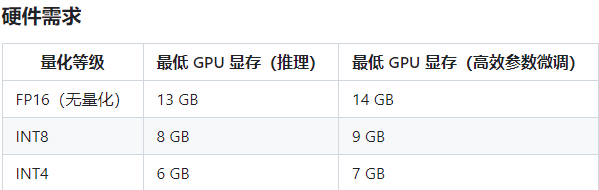


如果配置满足需求，接下来我们就一步一步执行本地化部署ChatGLM3-6B模型。本期内容将首先 介绍ChatGLM3-6B模型在Ubuntu 22.04系统下单显卡部署流程，更加专业的Linux多卡部署模式，我们 将在下一期课程中进行详细介绍。

本期教程进行演示环境的GPU资源是：NVIDIA RTX 4080, 单卡共计16G显存。

### 一、Ubuntu系统初始化配置
如果跟随上一期视频安装完Ubuntu双系统后，当前的环境是一个比较纯净的系统，首先建议大家 做的操作是进行系统的软件更新。这种更新涉及安全补丁、软件更新、之前版本中的错误和问题修复和 依赖包的更新，一方面是可以提升系统的安全性，另一方面更重要的也是，更新可以确保所有依赖项都 是最新和相互兼容的。虽然不做更新系统仍然可以运行，但我们强烈建议先执行这一操作。

1.1 更换国内软件源

Ubuntu的软件源服务器在境外，所以会导致下载速度很慢，甚至有时无法使用，所以建议在进行 软件更新前，将软件源更改为国内的镜像网站。

Step 1. 备份软件源配置文件

进入                     路径，找到软件源配置文件“sources.list”, 将其源文件做个备份，以免修改后出现 问题可以及时回退。命令如下：

```python
cd /ect/apt
sudo cp sources.list sources.list.backup
```

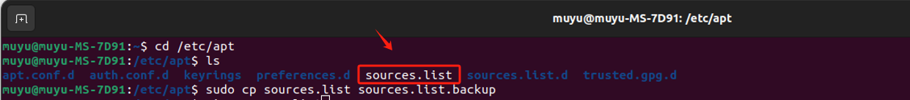Step 2. 安装vim编辑器

Ubuntu 默认自带的 vi 是一个非常基础的文本编辑器，而 vim（Vi IMproved）是 vi 的扩展版本， 提供了语法高亮、代码折叠、多级撤销/重做、自动命令、宏记录和播放等高级编辑功能。先执行如下 命令进行安装：

```bash
sudo apt install vim
```

Step 3. 使用 vim 编辑器修改软件源配置文件

Ubuntu的国内镜像源非常多，比较有代表性的有清华源、中科大源、阿里源、网易源，以下是它 们的网址：

```bash
清华源：https://mirrors.tuna.tsinghua.edu.cn/help/ubuntu/
中科大源：http://mirrors.ustc.edu.cn/help/ubuntu.html
阿里源：https://developer.aliyun.com/mirror/ubuntu? spm=a2c6h.13651102.0.0.3e221b11xgh2AI
网易源：http://mirrors.163.com/.help/ubuntu.html
```

我们这里使用中科大源。使用 Vim 编辑器进入后，按"i"键插入内容，将如下内容复制进去：

```bash
deb https://mirrors.ustc.edu.cn/ubuntu/ focal main restricted universe multiverse
deb https://mirrors.ustc.edu.cn/ubuntu/ focal-updates main restricted universe multiverse
deb https://mirrors.ustc.edu.cn/ubuntu/ focal-backports main restricted universe multiverse
deb https://mirrors.ustc.edu.cn/ubuntu/ focal-security main restricted universe multiverse
```

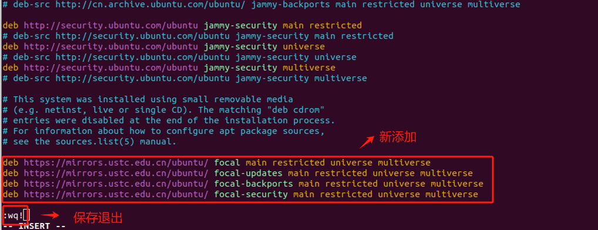

写入内容后，先按 ESC ，然后输入 :wq! 后保存写入并退出。

1.2 系统软件更新

更新完软件源后，我们执行系统的软件更新。

Step 1. 打开“终端” -> 输入  sudo apt update   命令，先更新软件包列表

在这里，如果大家看到的URL前缀已经变成了刚才设置的软件源（中科大），就说明上一步更改国 内镜像源成功了，否则请返回上一步检查执行的操作哪里出现了纰漏。

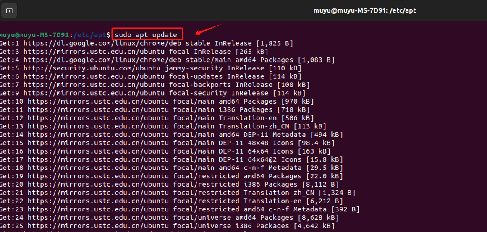

Step 2. 输入  sudo apt upgrade 命令，执行更新所有可更新的软件包

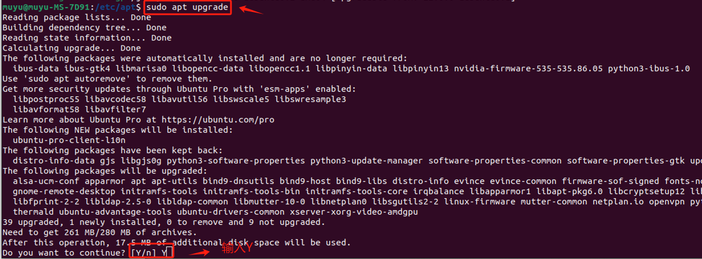

1.3 设置英文目录路径

上一期视频中在Ubuntu的双系统安装过程中，我们建议大家选择的语言是“English”，主要还是因 为英文的路径在使用命令行进行路径切换时不会产生字符编码的问题。而如果有小伙伴选择了中文安 装，强烈建议大家要将路径名称更改成英文，如果直接使用的是英文安装的，可以跳过这一步骤。

Step 1. 如果大家当前的路径是这样的，说明就是中文的

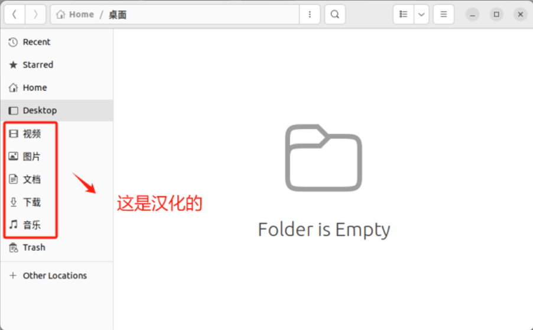

Step 2. 打开终端，快捷键

依次输入如下命令：

Ctrl + Alt + T

```bash
export LANG=en_US  # 设置当前会话的语言环境变量为英文
xdg-user-dirs-gtk-update  # xdg-user-dirs 是一个管理用户目录（如“文档”、“音乐”、“图 片”等）的工具，用于更新用户目录的  GTK+ 版本
```

Step 3. 跳出对话框询问是否将目录转化为英文路径

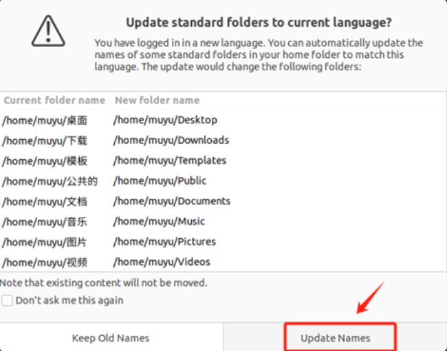

Step 4. 如果没有弹出，需要重新生成user-dirs.locale文件

user-dirs.locale

主要作用是存储关于用户目录（如“文档”、“下载”、“音乐”、“图片”等）的本地

化（语言和地区）设置，如果这个文件中的语言设置为英语，那么用户目录将使用英文名称（如 Documents, Downloads），如果设置为中文，则这些目录可能会显示为中文名称（如 文档, 下载）。 依次输入如下命令：

```bash
# 先生成user-dirs.locale文件，
echo 'en_US' > ~/.config/user-dirs.locale
# 再重新设置语言
export LANG=en_US
xdg-user-dirs-gtk-update
```

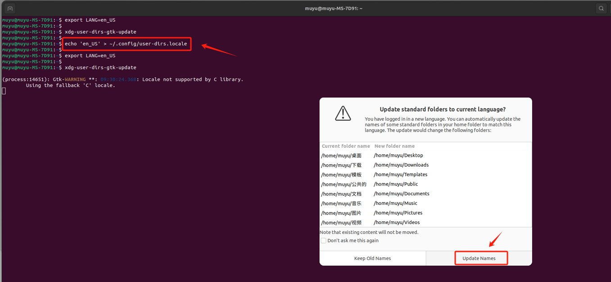

Step 5. 更改成功后，如下所示

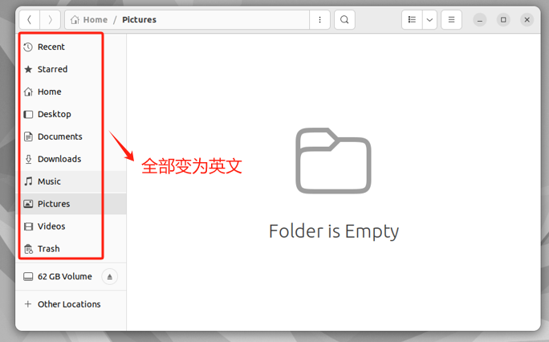

此时相关目录名称已经变更。（实际上是删除原中文名目录再新建英文名目录，如果中文名称的目 录中有文件，则会被保留下来，如“图片”和“Pictures”）

1.4 安装Chrome浏览器

安装Chrome浏览器很有必要，对于开发来说，其优势还是在于与 Google 的其他服务（如 Gmail、Google Drive 和 Google 搜索）紧密集成，且展程序生态系统丰富，提供了大量的扩展程序。 除此之外，后面我们需要配置VPN、启用ChatGLM3-6B 时采用基于Gradio 的Web端等操作，都需要用到浏览器。其安装过程相较于Windwos操作系统稍有复杂。具体安装过程如下：

Step 1. 先找到Ubuntu的默认安装的浏览器


Step 2. 进入谷歌浏览器官网：[https://www.google.com/intl/zh-CN/chrome/](https://www.google.com/intl/zh-CN/chrome/)


Step 3. 下载Chrome浏览器的“deb”后缀文件

Ubuntu 使用 .deb 包格式的原因与其底层架构和历史有关。Ubuntu 是基于 Debian 操作系统的， 而 Debian 使用 .deb 包格式来管理和分发软件。.deb 文件中包含了软件程序的文件、脚本以及安装该 软件所需的其他信息。这种格式支持复杂的安装场景，包括依赖关系处理、预先和事后脚本执行等。

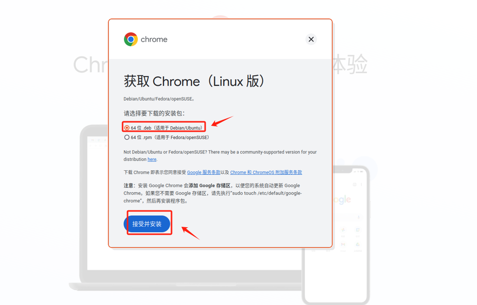

下载的文件，默认是存放在/home/downloads 中的。

Step 4. 进入终端，执行安装

Ubuntu 使用 DPKG 包管理系统来安装、删除和管理 .deb 包，提供了一种稳定和灵活的方式来管 理系统中的软件。

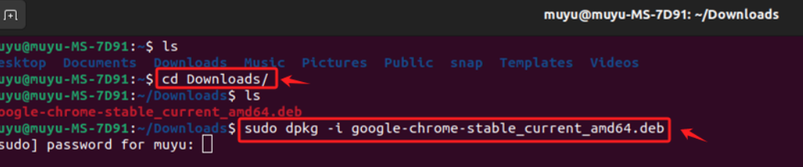

Step 5. 验证安装

当安装完成后，可以在左下角的程序管理页面，找到对应的应用图标

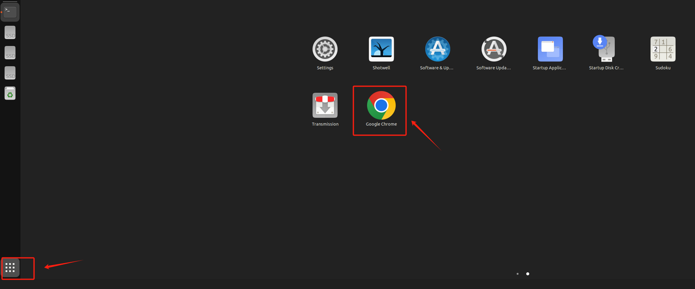

1.5 配置VPN

在 Linux 系统上科学上网方式有很多，一般使用的软件，都支持在各平台上使用。大家根据个人的 使用情况，按照其软件说明进行配置即可，一般都会有比较详细的说明。这里需要配置VPN的原因主要 是后面下载Chatglm3-6B的模型权重时需要用到。我个人使用的Pigcha加速器，大家可以参考一下配置 过程。

Step 1. 进入官网：[https://www.pigcha.com.hk/](https://www.pigcha.com.hk/)

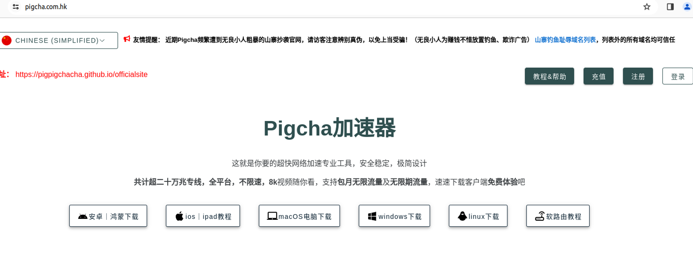

Step 2. 选择Linux版本的软件进行下载

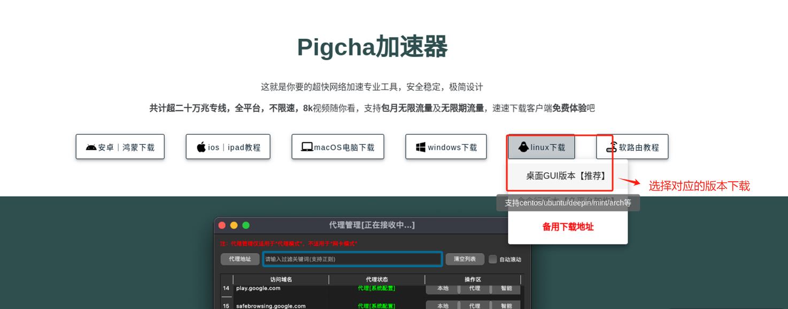

Step 3. 使用 dkpg -i 的方式安装.deb的包

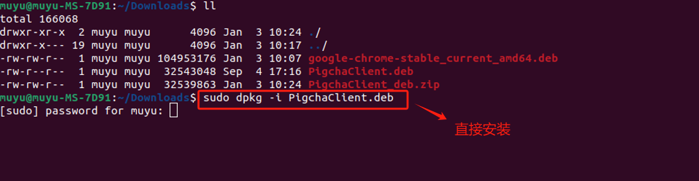

安装完成，即可找到该加速器的快捷方式，可以直接打开使用。

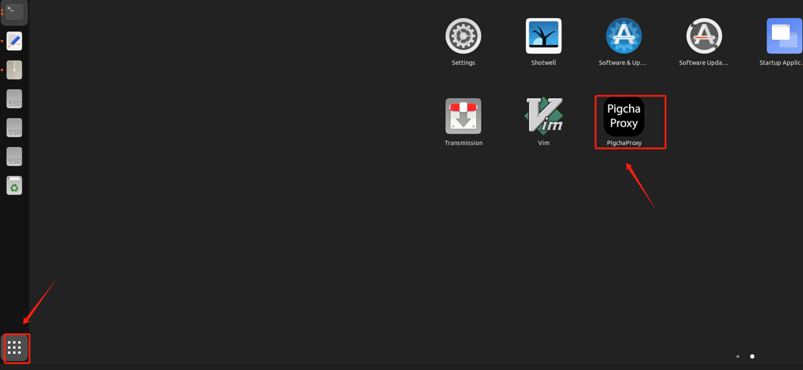

Step 4. 按需输入购买的账户和密码

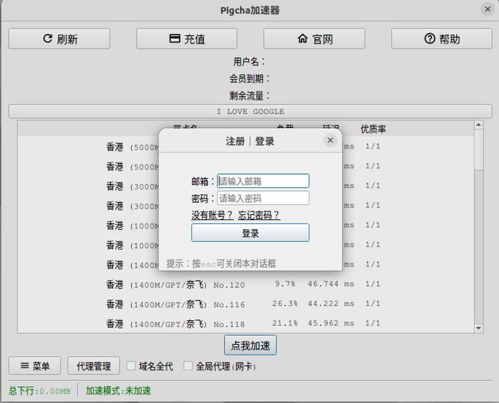

Step 5. 验证网络的连通性

进如果开启加速器后可以访问到Google的资源，说明代理可以正常使用。


### 二、配置大模型运行环境
关于大模型的运行环境，安装显卡驱动显然是首先要做的事情。我们需要确保可以正常的将大模型 部署在GPU上，这也是大家比较容易出现问题的环节，比如安装过程中因各种环境问题导致安装不成 功，缺依赖包的问题等，总会遇到莫名奇妙的报错导致这第一步就把人的心态搞崩。

2.1 安装显卡驱动

显卡驱动是软件，它可以允许操作系统和其他软件与显卡硬件进行交互。对于 NVIDIA 的 GPU，这 些驱动是由 NVIDIA 提供的，安装以后，在该系统上就可以来使用 GPU 的功能，比如图形渲染，显卡 驱动会激活 GPU，使其能够处理图形和视频任务。在Ubuntu系统下安装显卡驱动，主要有两种方式：

方法一：使用官方的NVIDIA驱动进行手动安装，这种方式比较稳定、靠谱，但可能会遇到很多问 题；

方法二：使用系统自带的“软件和更新”程序-附加驱动更新，这种方法需要联网，但是非常简单， 很难出现问题；（我们推荐大家先使用这种方法）

无论使用哪种方法，前置的操作都是一样的，包括安装依赖包和禁用默认的显卡驱动，具体执行过 程如下：

Step 1. 安装依赖包

在终端依次执行完如下命令：

```bash
sudo apt install gcc
sudo apt install g++
sudo apt install make
sudo apt-get install libprotobuf-dev libleveldb-dev libsnappy-dev libopencv-dev libhdf5-serial-dev protobuf-compiler
sudo apt-get install --no-install-recommends libboost-all-dev  
sudo apt-get install libopenblas-dev liblapack-dev libatlas-base-dev  sudo apt-get install libgflags-dev libgoogle-glog-dev liblmdb-dev
```

Step 2. 禁用Ubuntu默认的显卡驱动

Ubuntu 默认安装了开源显卡驱动Nouveau，用于 NVIDIA 显卡。这些驱动通常用来支持基本的桌 面图形需求，如 2D 和一些轻度的 3D 渲染。但对于我们的高性能显卡，需要安装专有的驱动来获得更 高性能或特定功能的支持。所以，在安装前，需要将默认安装的Nouveau驱动禁用。

用vim编辑器打开黑名单配置文件:

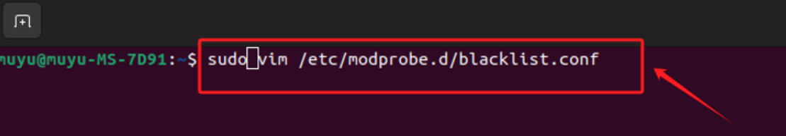

在文件末尾添加如下代码，输入“:wq”后保存退出

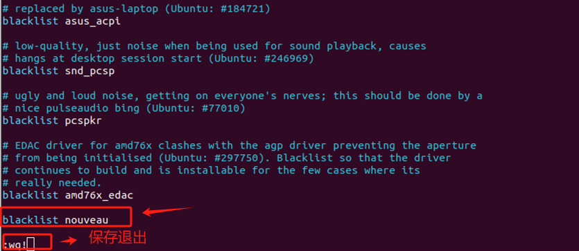

Step 3. 让配置立即生效

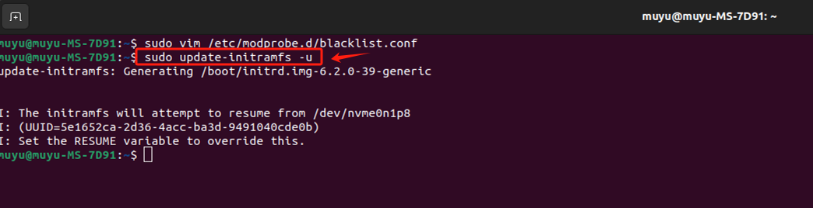

Step 4. 使用Ubuntu自带的更新软件安装NVIDIA（强烈建议使用这种方式）

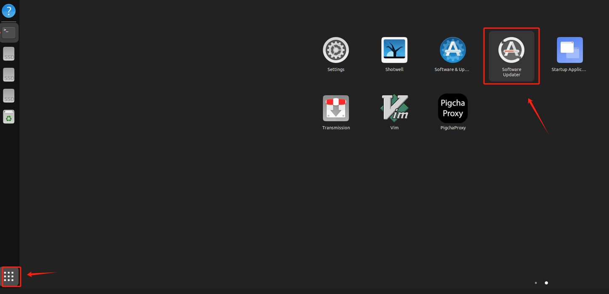

Step 5. 选择驱动

直接选择对应的显卡驱动就好。如果没有，检查一下网络连接情况，如果联网了还没有，可能是显 卡不支持、版本较低等情况，只能手动安装。

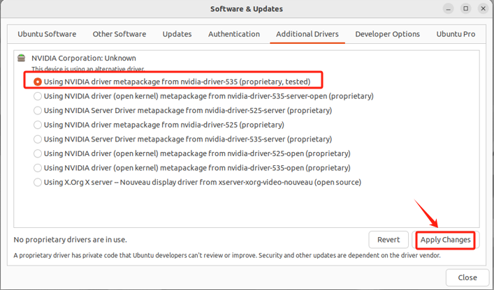

Step 6. 进行用户认证

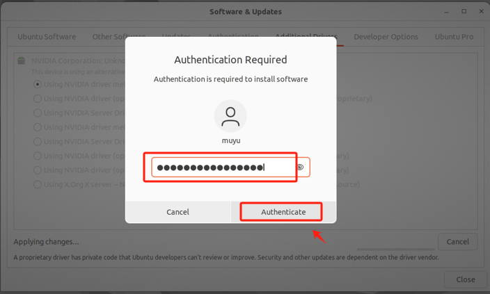

Step 7. 安装完成后执行重启操作

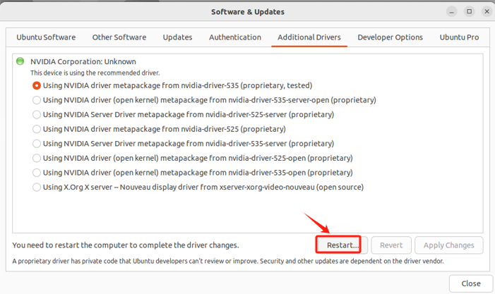

Step 8. 验证驱动是否安装成功

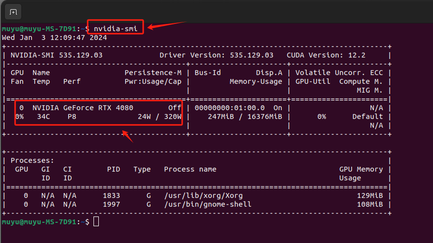

输入 nvidia-smi 命令，如果能正确的输出当前环境下的GPU信息，则说明驱动安装成功。

如果采用手动安装

如果有的小伙伴的电脑无法直接使用Ubuntu自带的更新软件安装NVIDIA的显卡驱动，则需要按照 如下过程来执行安装步骤：

先进入NVIDIA的官网，选择最适合自己显卡型号的驱动：[https://www.nvidia.cn/Download/inde](https://www.nvidia.cn/Download/inde) x.aspx?lang=cn

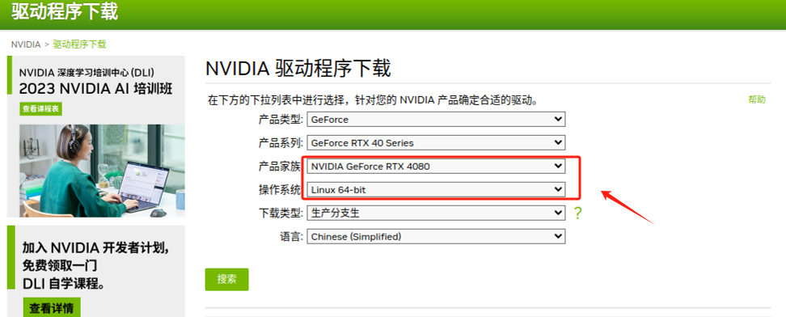

选择好显卡驱动和适用平台后，点击下载

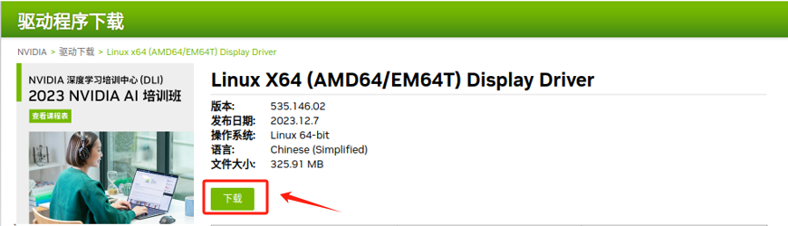

下载完成后，对该驱动添加执行权限，否则无法进入安装页面。

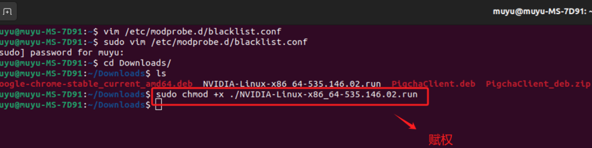

在安装之前，需要关闭图形化界面，需要判断你目前的ubuntu系统的图像化界面管理器是 gdm3（默认）或是其它。gdm3 或 lightdm负责登录界面和用户会话的初始化，是系统启动进程的一 部分，用于用户登录和启动图形用户界面 (GUI) 会话。其中gdm3是安装Ubuntu系统时默认安装的，而 lightdm可以选择性安装，它是一个更轻量级的显示管理器。

关闭的原因是因为显示管理器（如 gdm3、lightdm）控制着图形界面，包括使用显卡驱动来显示 内容。在这些图形界面运行时尝试安装或更新显卡驱动可能会导致冲突，因为驱动程序文件可能正在被 系统使用。所以我们需要进入命令行模式来安装显卡驱动。

如果之前执行过 sudo  apt install lightdm,就说明当前环境下已经使用lightdm代替了 gdm3,此时需要如下命令关闭：

```bash
sudo service lightdm stop
```

否则就是默认的gdm3，这样关闭：

```bash
sudo /etc/init.d/gdm3 stop
```

关闭后，进入命令行模式。最简单的方法是使用telinit命令更改为运行级别3。执行以下linux命令 后，显示服务器将停止。

```bash
bash sudo telinit 3
```

通过 Ctrl+Alt+F3（F1-F6）快捷键打开终端，先登录然后输入下面命令:

```bash
# 删除已安装的显卡驱动
sudo apt-get remove --purge nvidia*
cd Downloads
sudo ./NVIDIA-Linux-x86_64-430.26.run –no-opengl-files –no-x-check
```

随后进入安装界面，依次选择“Continue” --> 不安装32位兼容库(选择no) --> 不运行x配置(选择no) 即可。最后输入“reboot”命令重启主机。重新进入图形化界面，在终端输入“nvidia-smi”命令即可。


2.2 如何理解CUDA

有一个误区，就是安装完驱动后，通过 nvidia-smi 命令可以看到Cuda版本，本机显示版本为 “CUDA Version：12.2”，很多人以为已经安装了CUDA 12.2版本，但实质上，这指的是显卡驱动兼容的 CUDA 版本。意味着我们当前的系统驱动支持的 CUDA 最高版本是 12.2。安装更高版本的 CUDA 可能 会导致不兼容的问题。

需要明确的概念：显卡驱动可以使计算机系统能够识别和使用显卡，但这与安装 CUDA 是两个不同 的过程。CUDA（Compute Unified Device Architecture）是 NVIDIA 开发的一个平台，允许开发者使 用特定的 NVIDIA GPU 进行通用计算。它主要用于那些需要大量并行处理的计算密集型任务，如深度学 习、科学计算、图形处理等。如果我们的应用程序或开发工作需要利用 GPU 的并行计算能力，那么 CUDA 是非常关键的。但如果只是进行常规使用，比如网页浏览、办公软件使用或轻度的图形处理，那 么安装标准的显卡驱动就足够了，无需单独安装 CUDA。对我们要做大模型实践的需求来看，CUDA一 定是要安装的。

CUDA 提供了两种主要的编程接口：CUDA Runtime API 和 CUDA Driver API。

CUDA Runtime API 是一种更高级别的抽象，旨在简化编程过程，它自动处理很多底层细节。大多 数 CUDA 程序员使用 Runtime API，因为它更易于使用。

CUDA Driver API 提供了更细粒度的控制，允许直接与 CUDA 驱动交互。它通常用于需要精细控 制的高级应用。

而要安装CUDA，其实就是在安装CUDA Toolkit， 其版本决定了我们可以使用的 CUDA Runtime API 和 CUDA Driver API 的版本，当安装 CUDA Toolkit 时会安装一系列工具和库，用于开发和运行 CUDA 加速的应用程序。这包括了 CUDA 编译器（nvcc）、CUDA 库和 API，以及其他用于支持 CUDA 编程的工具。如果安装好 CUDA Toolkit，就可以开发和运行使用 CUDA 的程序了。

当我们运行 CUDA 应用程序时，通常是在使用与安装的 CUDA Toolkit 版本相对应的 Runtime API。这可以通过 nvcc -v 命令查询:

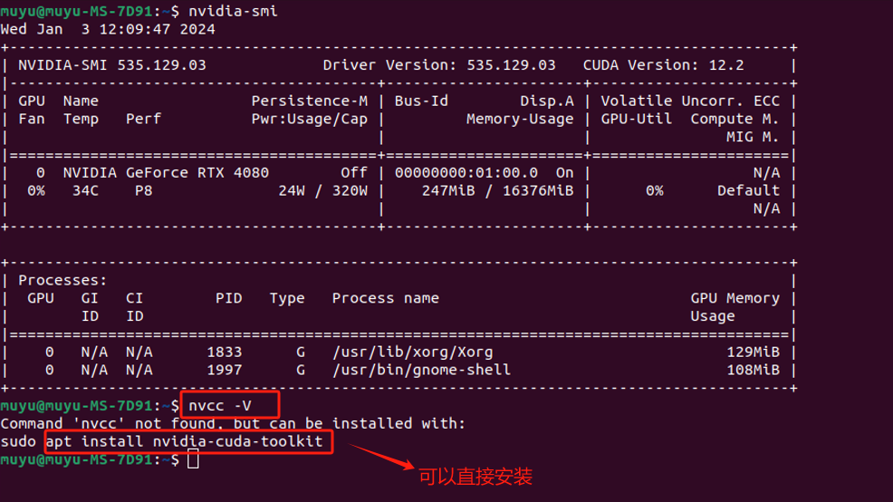

可以看到，默认是并没有安装的。可以直接通过提示的命令进行安装。

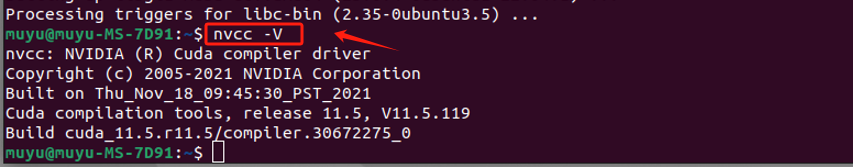

通过 apt install nvidia-cuda-toolkit安装的是 Ubuntu 仓库中可用的 CUDA Toolkit 版本，这可能不是最新的，也可能不是特定需要的版本。主要用于本地 CUDA 开发（如果想直接编写 CUDA 程序或编译 CUDA 代码）。

如果想安装指定版本的CUDA-Toolkit，如何操作呢？

需要进入NVIDIA官网：[https://developer.nvidia.com/cuda-toolkit-archive](https://developer.nvidia.com/cuda-toolkit-archive)  ，找到需要下载的 Cuda版本。

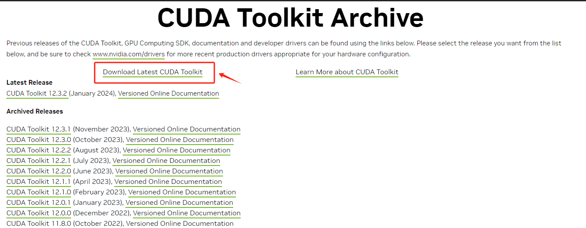

根据当前情况依次选择操作系统、版本等。

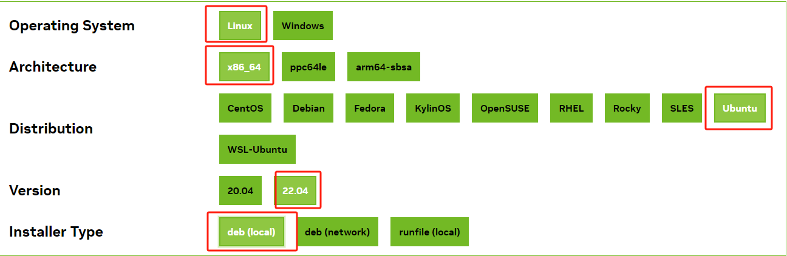

最后根据当前官方给出的代码，在终端执行即可安装。

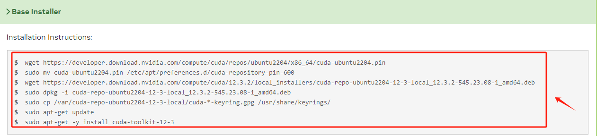

但其实，通常不需要预先手动安装 CUDA ，因为我们目前使用的 PyTorch 等框架在安装过程会处 理这些依赖。当我们通过 Conda/pip等方式安装 PyTorch 时会指定的 CUDA 版本，该 CUDA 版本就会 与当前的Pytorch版本相兼容，预编译并打包了与 CUDA 版本相对应的二进制文件和库。所以除非有特 定的需求或要进行 CUDA 级别的开发，才可能需要手动安装 CUDA Toolkit。

2.3 安装Anaconda环境

Anaconda是一个为科学计算设计的发行版，适用于数据科学、机器学习、科学计算和工程领域。 它会提供大量预安装的科学计算和数据科学相关的库，且提供了 Conda 这样一个包管理器，用来安 装、管理和升级包，同时也可以创建隔离的环境以避免版本和依赖冲突。相较于单独安装Python，对初 学者更友好，尤其是对于不熟悉 Python 和包管理的用户。

运行大模型需要 Python 环境。所以我们这里选择使用Anaconda来构造和管理Python环境。 Step 1. 进入Anaconda官网：[https://www.anaconda.com/download](https://www.anaconda.com/download)


Step 2. 下载安装程序

Anaconda官网会根据系统版本自动下载对应的安装程序。

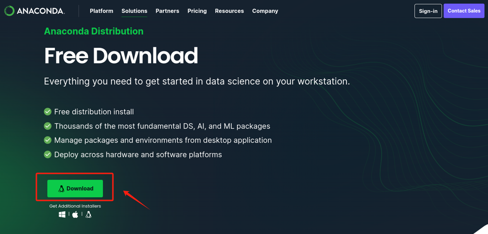

Step 3. 进入终端，执行安装

找到安装包的下载位置，执行如下命令：

```bash
bash Anaconda3-2023.09.0-Linux-x86_64.sh
```

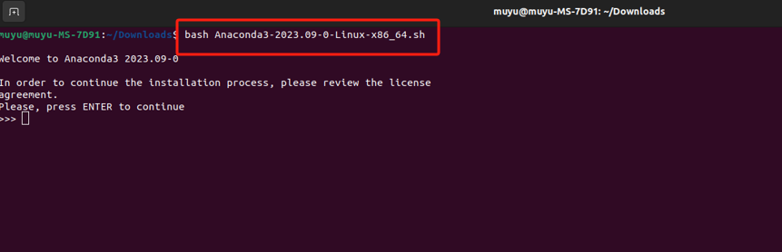

在此处输入“yes”,然后按“Enter”键使用Anaconda的默认安装位置 （/home/${account}/anaconda3）。

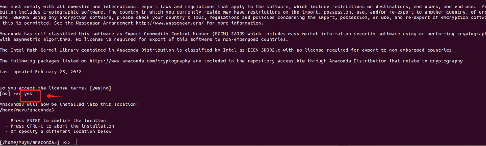

Step 4. 等待安装完成

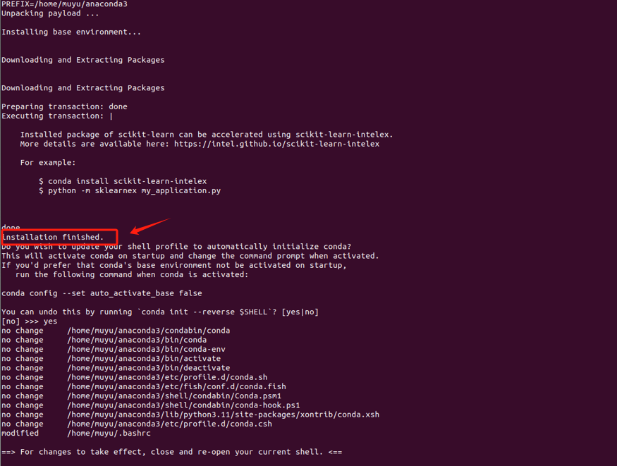

Step 5. 验证安装情况

安装完成后，会在对应的安装目录中出现 anaconda3 文件夹。

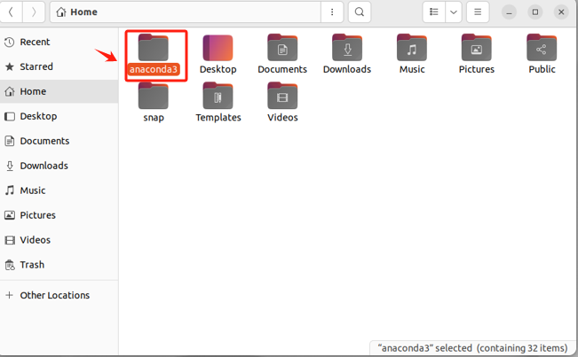

Step 6. 配置环境变量

在终端的命令行修改配置文件：

```bash
vim ~/.bashrc
```

在打开的配置文件末尾添加 export PATH= {Anaconda3的实际安装路径}，配置完成后，按 :wq! 保存并退出。

```bash
# 我的anaconda3的安装路径是/home/muyu/anaconda3 
export PATH=/home/muyu/anaconda3/bin:$PATH
```

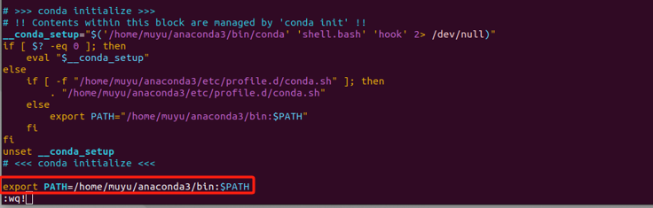

使用如下命令使环境变量的修改立即生效。


Step 7. 启动Anaconda

配置好环境变量后，在终端输入anaconda-navigator可打开Anaconda，和Windows操作系统下的操作基本一致

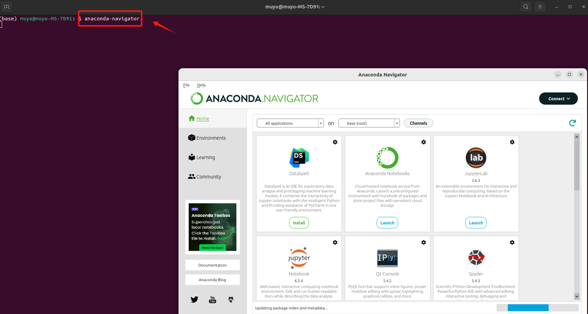

### 三、ChatGLM3-6B介绍与快速入门
ChatGLM3 是智谱AI和清华大学 KEG 实验室在2023年10月27日联合发布的新一代对话预训练模 型。ChatGLM3-6B 是 ChatGLM3 系列中的开源模型，免费下载，免费的商业化使用。

该模型在保留了前两代模型对话流畅、部署门槛低等众多优秀特性的基础上，ChatGLM3-6B 引入 了如下特性：ChatGLM 3 GitHub

1. 更强大的基础模型： ChatGLM3-6B 的基础模型 ChatGLM3-6B-Base 采用了更多样的训练数据、 更充分的训练步数和更合理的训练策略。在语义、数学、推理、代码、知识等不同角度的数据集上 测评显示，在44个中英文公开数据集测试中处于国内模型的第一位。ChatGLM3-6B-Base 具有在 10B 以下的基础模型中最强的性能。

2. 更完整的功能支持： ChatGLM3-6B 采用了全新设计的 Prompt 格式，除正常的多轮对话外。同时 原生支持工具调用（Function Call）、代码执行（Code Interpreter）和 Agent 任务等复杂场 景。

3. 更全面的开源序列： 除了对话模型 ChatGLM3-6B 外，还开源了基础模型 ChatGLM3-6B-Base、 长文本对话模型 ChatGLM3-6B-32K。以上所有权重对学术研究完全开放，在填写问卷进行登记后 亦允许免费商业使用。

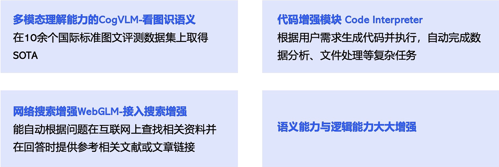

性能层面，ChatGLM3-6B在10B范围内性能最强，推理能力直逼GPT-3.5；功能层面，ChatGLM3- 6B重磅更新多模态功能、代码解释器功能、联网功能以及Agent优化功能四项核心功能，全线逼近GPT- 4！

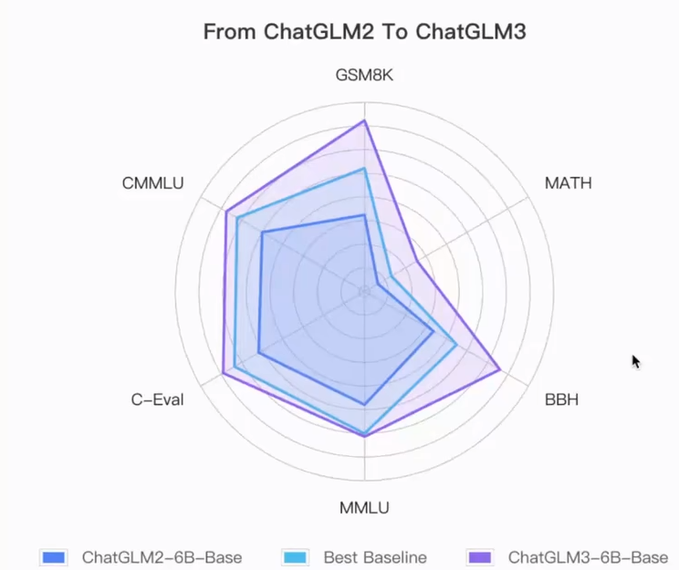

AI Agent（人工智能代理）是一个能够自主执行任务或达成目标的系统或程序，能够围绕复杂问题 进行任务拆解，规划多步执行步骤；能够实时围绕自动编写的代码进行debug；能够根据人类意见反馈 修改答案，实时积累修改对话，并进行阶段性微调等等，具有很强的决策和执行能力。那ChatGLM3- 6B模型开放的Function calling能力，是大语言模型推理能力和复杂问题处理能力的核心体现，是本次 ChatGLM 3模型最为核心的功能迭代，也是ChatGLM 3模型性能提升的有力证明。

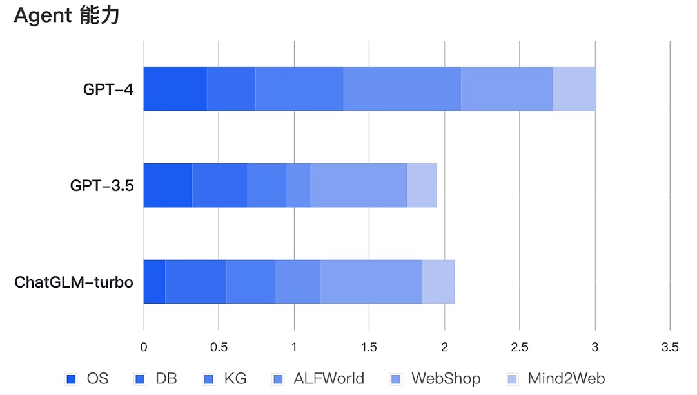

相关的信息获取方途径

官方网站：[https://www.zhipuai.cn/](https://www.zhipuai.cn/)

智谱清言：[https://chatglm.cn](https://chatglm.cn)

API开放平台：[https://bigmodel.cn/](https://bigmodel.cn/)

Github仓库：[https://github.com/THUDM](https://github.com/THUDM)

开源模型列表：

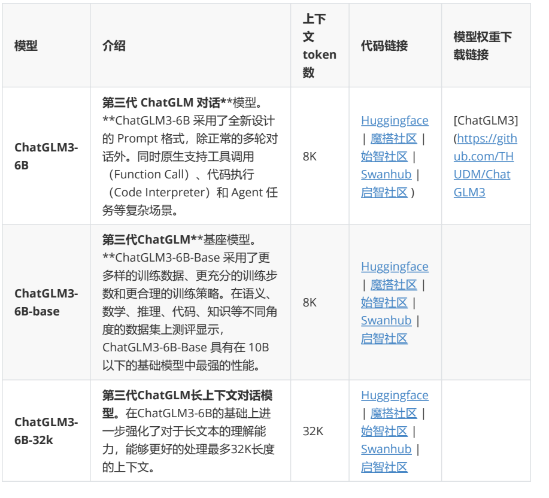

### 四、ChatGLM3-6B私有化部署
对于部署ChatGLM3-6B来说，从官方说明上看，其规定了Transformers 库版本应该 4.30.2 以及 以上的版本 ，torch 库版本应为 2.0 及以上的版本，gradio 库版本应该为 3.x 的版本，以获得最佳的推 理性能。所以为了保证 torch 的版本正确，建议大家严格按照官方文档的说明安装相应版本的依赖包。

Step 1. 创建conda虚拟环境

Conda创建虚拟环境的意义在于提供了一个隔离的、独立的环境，用于Python项目和其依赖包的管 理。每个虚拟环境都有自己的Python运行时和一组库。这意味着我们可以在不同的环境中安装不同版本 的库而互不影响。例如，可以在一个环境中使用Python 3.8，而在另一个环境中使用Python 3.9。对于 大模型来说，建议Python版本3.10以上。创建的方式也比较简单，使用以下命令创建一个新的虚拟环境：

```bash
# myenv 是你想要给环境的名称，python=3.8 指定了要安装的Python版本。你可以根据需要选择不同的 名称和/或Python版本。
conda create --n chatglm3_test python=3.11
```

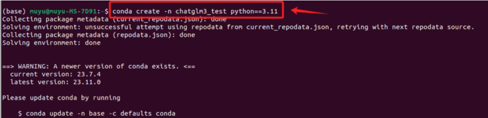

创建虚拟环境后，需要激活它。使用以下命令来激活刚刚创建的环境。

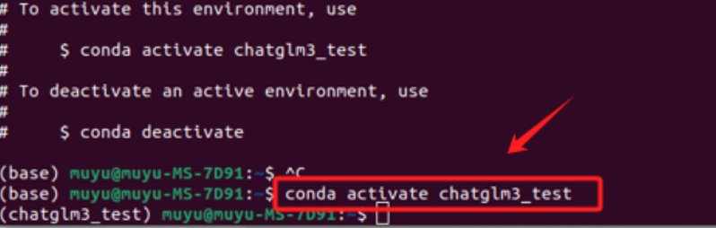

如果成功激活，可以看到在命令行的最前方的括号中，就标识了当前的虚拟环境 （chatglm3_test），然后，按照官方的要求安装torch。

Step 2. 查看当前驱动最高支持的CUDA版本

我们需要根据CUDA版本选择Pytorch框架，先看下当前的CUDA版本：

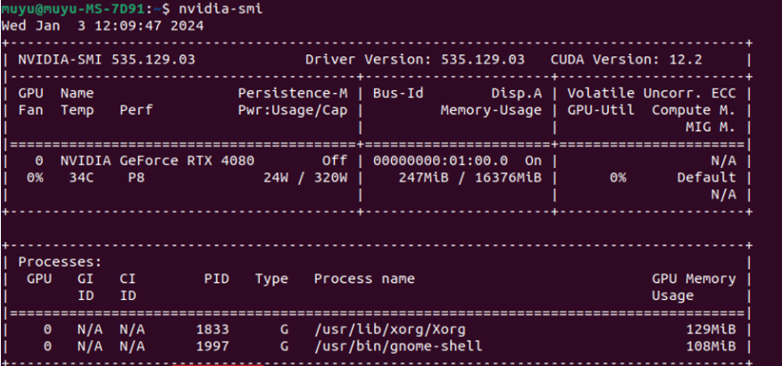

Step 3. 在虚拟环境中安装Pytorch

进入Pytorch官网：[https://pytorch.org/get-started/previous-versions/](https://pytorch.org/get-started/previous-versions/)

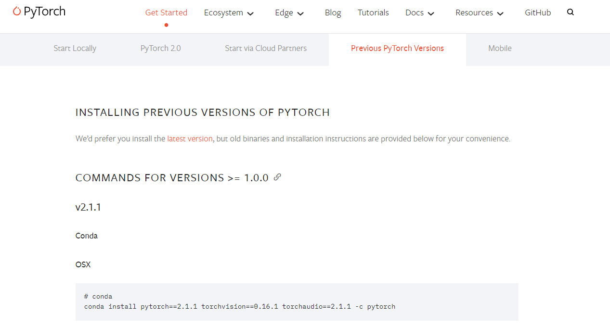

当前的电脑CUDA的最高版本要求是12.2，所以需要找到 >=12.2版本的Pytorch。

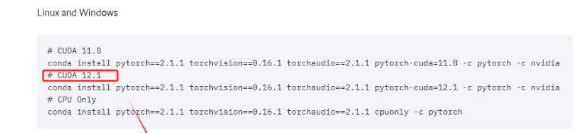

直接复制对应的命令，进入终端执行即可。这实际上安装的是为 CUDA 12.1 优化的 PyTorch 版 本。这个 PyTorch 版本预编译并打包了与 CUDA 12.1 版本相对应的二进制文件和库。

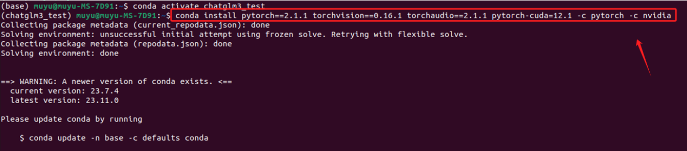

Step 4. 安装Pytorch验证

待安装完成后，如果想要检查是否成功安装了GPU版本的PyTorch，可以通过几个简单的步骤在 Python环境中进行验证：

```bash
import torch
print(torch.cuda.is_available())
```

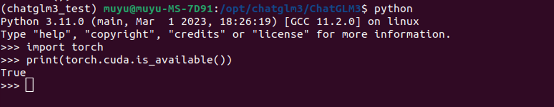

如果输出是 True，则表示GPU版本的PyTorch已经安装成功并且可以使用CUDA，如果输出是 False，则表明没有安装GPU版本的PyTorch，或者CUDA环境没有正确配置，此时根据教程，重新检查 自己的执行过程。

Step 5. 下载ChatGLM3的项目文件

ChatGLM3的代码库和相关文档存储在 GitHub 这个在线平台上。GitHub 是一个广泛使用的代码托 管平台，它提供了版本控制和协作功能。

要下载ChatGLM3-6B的项目文件，需要进入ChatGLM3的Github：[https://github.com/THUDM/C](https://github.com/THUDM/C)hatGLM3

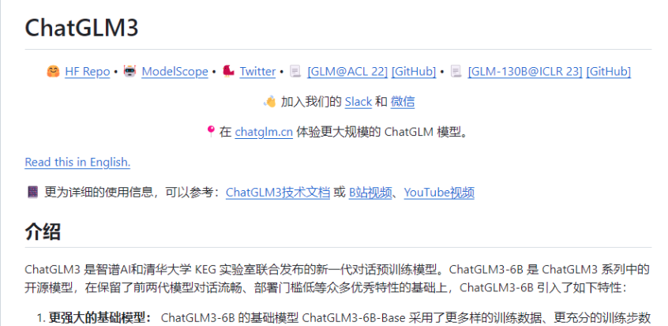

在 GitHub 上将项目下载到本地通常有两种主要方式：克隆 (Clone) 和 下载 ZIP 压缩包。 克隆 (Clone)是使用 Git 命令行的方式。我们可以克隆仓库到本地计算机，从而创建仓库的一个完

整副本。这样做的好处是我们可以跟踪远程仓库的所有更改，并且可以提交自己的更改。如果要克隆某 一个仓库，可以使用如下命令：

```bash
git clone <repository-url>   # 其中  <repository-url> 是  GitHub 仓库的  URL
```

推荐使用克隆 (Clone)的方式。对于ChatGLM3这个项目来说，我们首先在GitHub上找到其仓库的 URL。

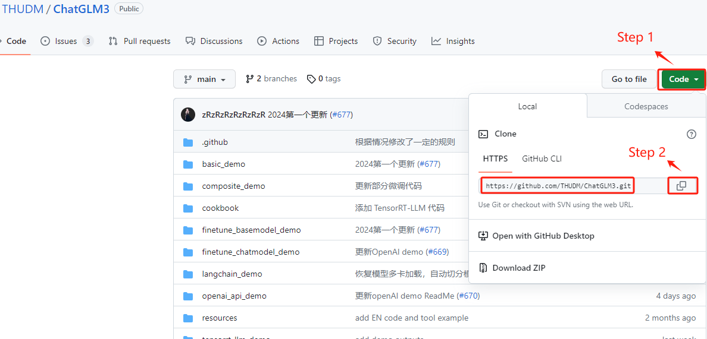

在执行命令之前，先安装git软件包。

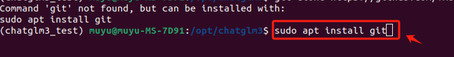

然后创建一个存放ChatGLM3-6B项目文件的文件夹。

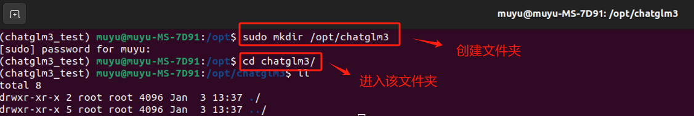

执行克隆命令，将Github上的项目文件下载至本地

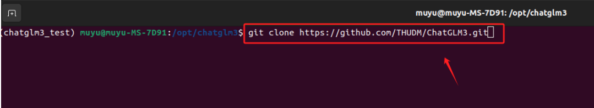

如果克隆成功，本地应该会出现如下文件内容

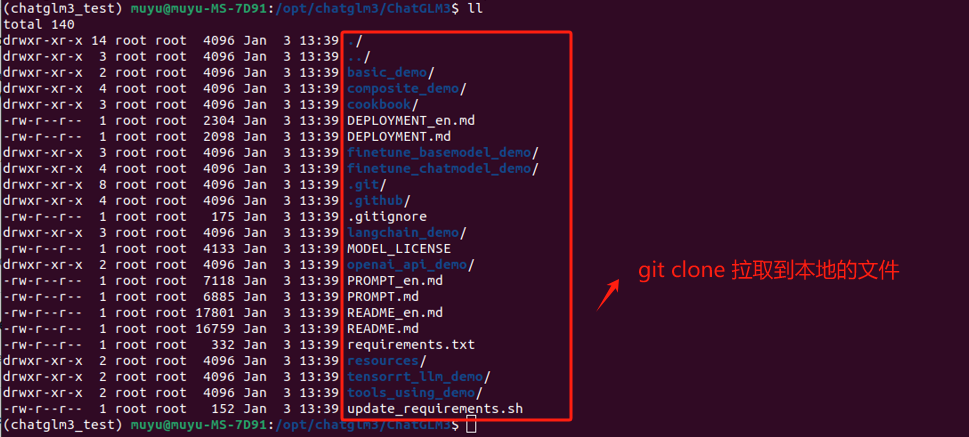

不需要使用 Git，适合那些不打算使用 Git 版本控制的用户。在 GitHub 仓库页面上，通常会有一个 “Download ZIP”按钮，我们可以点击这个按钮下载仓库的当前状态的压缩包

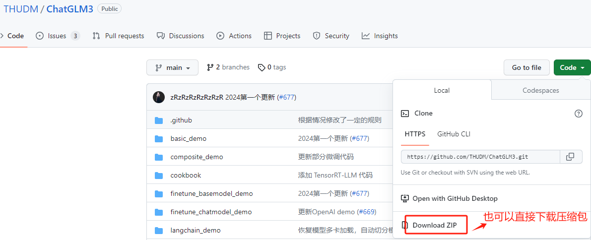

选择压缩包的下载路径

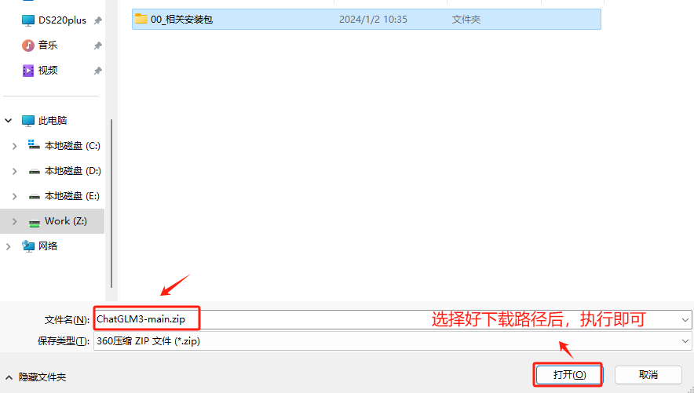

下载后，只需解压缩该文件即可访问项目文件。压缩包中存放的是ChatGLM3运行的一些项目文件。

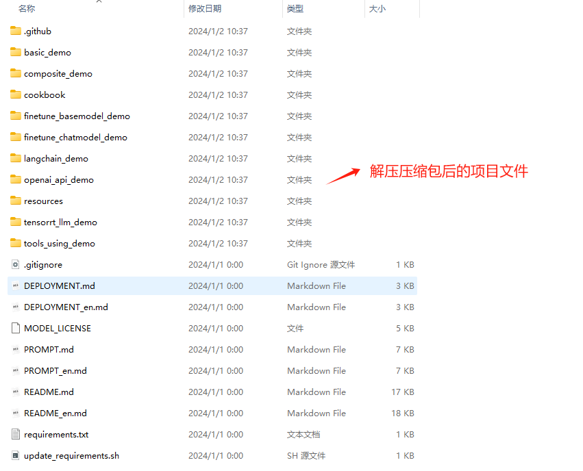

通过这种方式下载的项目文件，需要xftp这样的工具在上传到服务器使用。

Step 6. 升级pip版本

pip 是 Python 的一个包管理器，用于安装和管理 Python 软件包。允许从 Python Package Index（PyPI）和其他索引中安装和管理第三方库和依赖。一般使用 pip 来安装、升级和删除 Python 软件包。除此之外，pip 自动处理 Python 软件包的依赖关系，确保所有必需的库都被安装。在Python 环境中，尽管我们是使用conda来管理虚拟环境，但conda是兼容pip环境的，所以使用pip下载必要的 包是完全可以的。

我们建议在执行项目的依赖安装之前升级 pip 的版本，如果使用的是旧版本的 pip，可能无法安装 一些最新的包，或者可能无法正确解析依赖关系。升级 pip 很简单，只需要运行命令如下命令：

```bash
python -m pip install --upgrade pip
```

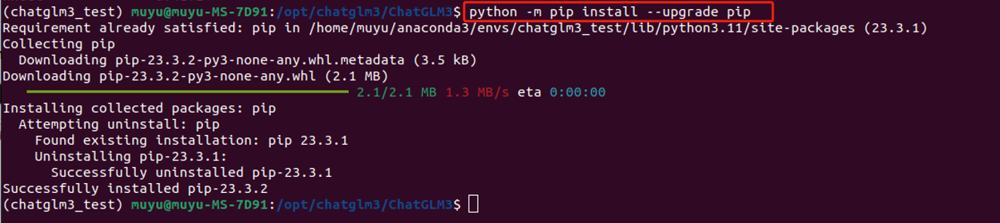

Step 7. 使用pip安装ChatGLM运行的项目依赖

一般项目中都会提供 requirements.txt 这样一个文件，该文件包含了项目运行所必需的所有 Python 包及其精确版本号。使用这个文件，可以确保在不同环境中安装相同版本的依赖，从而避免了 因版本不一致导致的问题。我们可以借助这个文件，使用pip一次性安装所有必需的依赖，而不必逐个 手动安装，大大提高效率。命令如下：

```bash
pip install -r requirements.txt
```

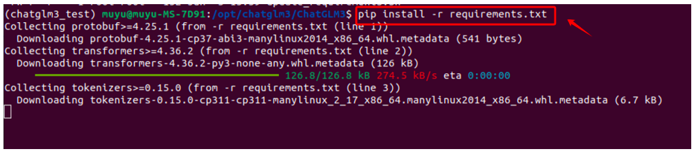

 Step 8. 从Hugging Face下载ChatGLM3模型权重  

 经过Step 5的操作过程，我们下载到的只是ChatGLM3-6B的一些运行文件和项目代码，并不包含 ChatGLM3-6B这个模型。这里我们需要进入到 Hugging Face 下载。Hugging Face 是一个丰富的模型 库，开发者可以上传和共享他们训练好的机器学习模型。这些模型通常是经过大量数据训练的，并且很 大，因此需要特殊的存储和托管服务。 不同于GitHub，GitHub 仅仅是一个代码托管和版本控制平台，托管的是项目的源代码、文档和其 他相关文件。同时对于托管文件的大小有限制，不适合存储大型文件，如训练好的机器学习模型。相 反，Hugging Face 专门为此类大型文件设计，提供了更适合大型模型的存储和传输解决方案。  

 下载路径如下：  

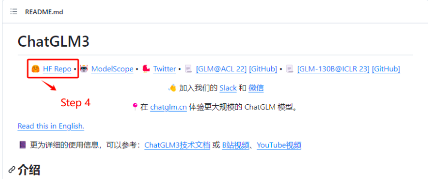

 注：需要挂梯子才能进入。  

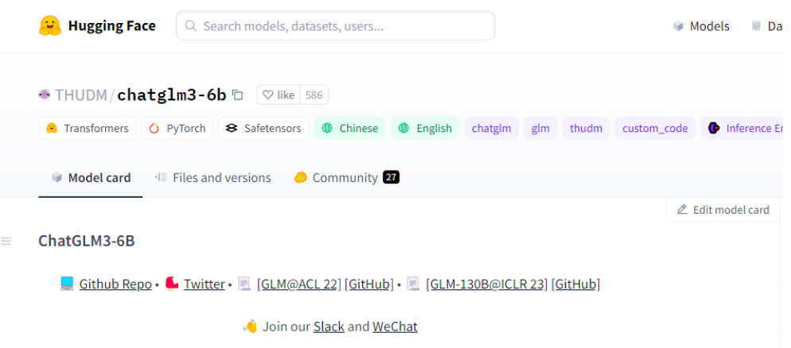

 然后按照如下位置，找到对应的下载URL。  

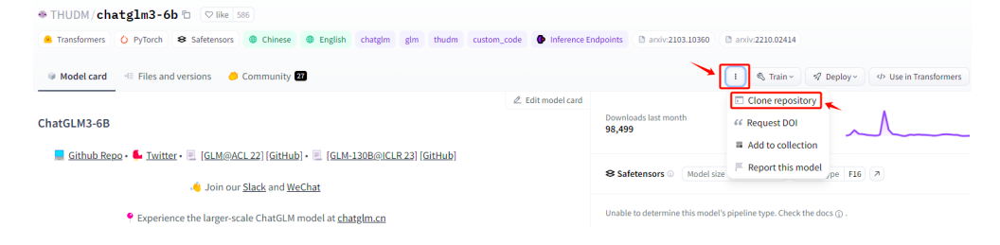

 复制此命令，进入到服务器的命令行准备执行。  

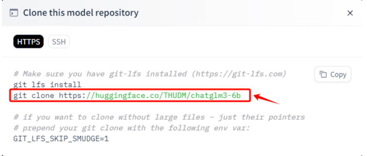

 Step 9. 安装Git LFS Git Large File Storage（Git LFS）是一种用于处理大文件的工具，在 Hugging Face 下载大模型 时，通常需要安装 Git LFS，主要的原因是：Git 本身并不擅长处理大型文件，因为在 Git 中，每次我们 提交一个文件，它的完整内容都会被保存在 Git 仓库的历史记录中。但对于非常大的文件，这种方式会 导致仓库变得庞大而且低效。而 Git LFS， 就不会直接将它们的内容存储在仓库中。相反，它存储了一 个轻量级的“指针”文件，它本身非常小，它包含了关于大型文件的信息（如其在服务器上的位置），但 不包含文件的实际内容。当我们需要访问或下载这个大型文件时，Git LFS 会根据这个指针去下载真正 的文件内容。 实际的大文件存储在一个单独的服务器上，而不是在 Git 仓库的历史记录中。所以如果不安装 Git LFS 而直接从 Hugging Face 或其他支持 LFS 的仓库下载大型文件，通常只会下载到一个包含指向实际 文件的指针的小文件，而不是文件本身。 所以，我们需要先安装git-lfs这个工具。命令如下：  

```bash
sudo apt-get install git-lfs
```

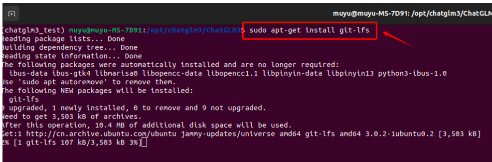

 Step 10. 初始化Git LFS 安装完成后，需要初始化 Git LFS。这一步是必要的，因为它会设置一些必要的钩子。Git 钩子 （hooks）是 Git 提供的一种强大的功能，允许在特定的重要动作（如提交、推送、合并等）发生时自 动执行自定义脚本。这些钩子是在 Git 仓库的 .git/hooks 目录下的脚本，可以被配置为在特定的 Git 命令执行前后触发。钩子可以用于各种自动化任务，比如： 1. 代码检查： 在提交之前自动运行代码质量检查或测试，如果检查失败，可以阻止提交。 2. 自动化消息： 在提交或推送后发送通知或更新任务跟踪系统。 3. 自动备份： 在推送到远程仓库之前自动备份仓库。 4. 代码风格格式化： 自动格式化代码以符合团队的代码风格标准。 而初始化git lfs，会设置一些在上传或下载大文件是必要的操作，如在提交之前检查是否有大文件 被 Git 正常跟踪，而不是通过 Git LFS 跟踪，从而防止大文件意外地加入到 Git 仓库中。（pre-commit 钩子）或者在合并后，确保所有需要的 LFS 对象都被正确拉取（post-merge）等。初始化命令如下：  

```bash
git lfs install
```

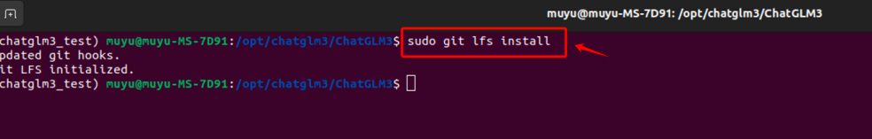

 Step 11. 使用 Git LFS 下载ChatGLM3-6B的模型权重 直接复制Hugging Face上提供的命令，在终端运行，等待下载完成即可。 

```bash
git clone https://huggingface.co/THUDM/chatglm3-6b
```

 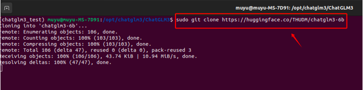

 全部需要下载的模型文件如下：  


 这里主要的.bin文件较大，会导致下载较慢。  

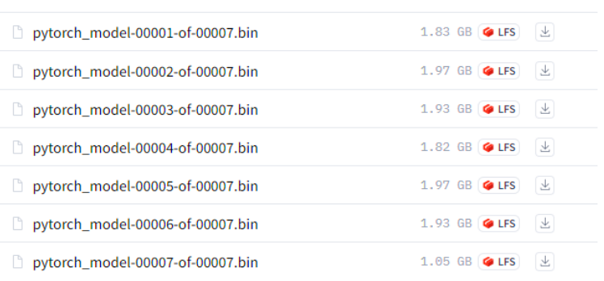

 我们这里可以使用 wget 的方式加速下载，具体的执行过程如下：  

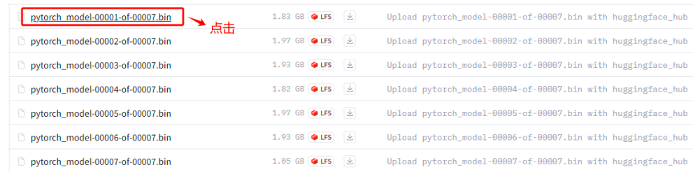

 进入到具体的模型权重页面后，鼠标右键。  

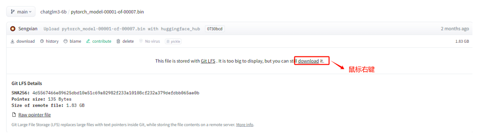

 选择复制链接地址。  

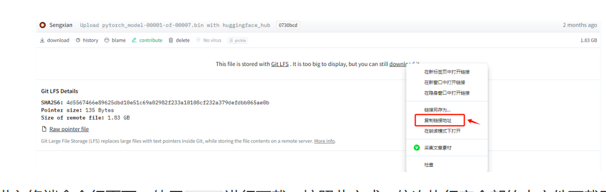

 进入终端命令行页面，使用 wget 进行下载。按照此方式，依次执行完全部的大文件下载即可。虽 然繁琐一点，但是下载速度非常快。根据网络情况，大家自行判断一下，有时候也会很慢，多尝试几 次。 除此之外，一种最简单的方式就是这类大的文件，直接通过浏览器下载到本地后，然后再移动到 chatglm3-6b这个文件夹中。这种方式最简单粗暴，且效率也很高。  

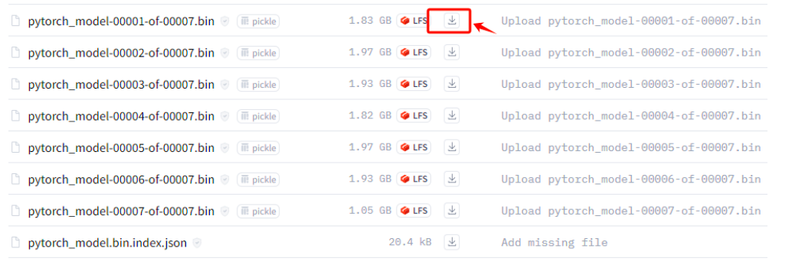

 Step 12. 启动模型前，校验下载的文件 经过Step1在Hugging Face下载模型权重的操作后，当前的Chatglm3-6B模型的项目文件中会出现 chatglm3-6b 这样一个新的文件  

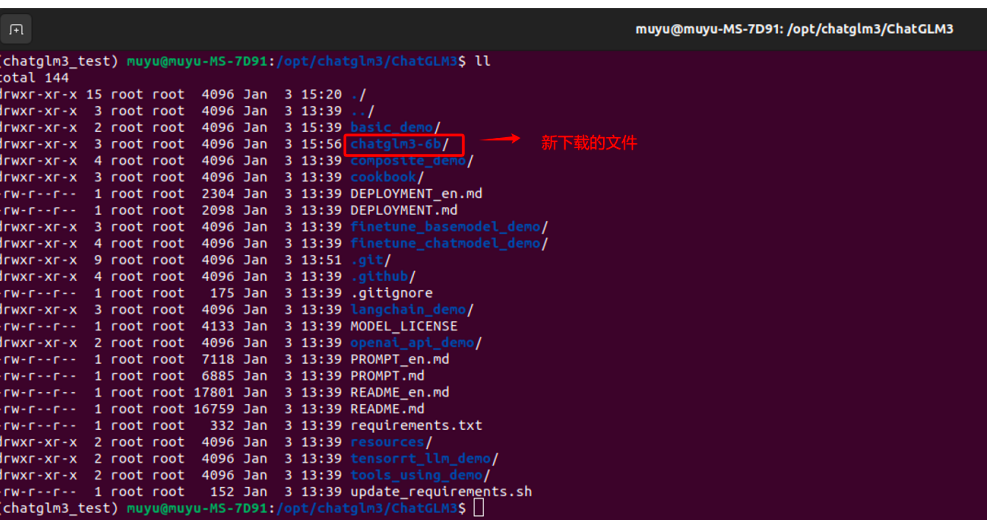

 chatglm3-6b 中的文件内容如下，请确保不缺少文件。  

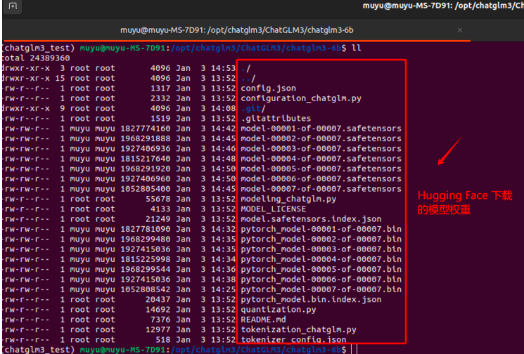

 至此，我们就已经把ChatGLM3-6B模型部署运行前所需要的文件全部准备完毕。 五、运行ChatGLM3-6B模型的方式 ChatGLM3-6B提供了一些简单应用Demo，存放在供开发者尝试运行。这里我们由简到难依次对其 进行介绍。  

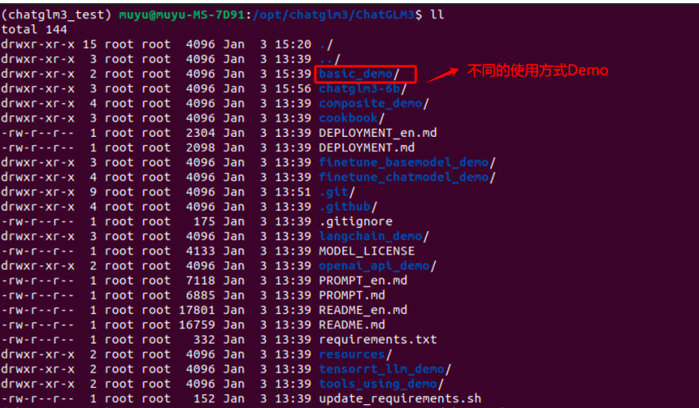

 5.1 基于命令行的交互式对话 这种方式可以为非技术用户提供一个脱离代码环境的对话方式。对于这种启动方式，官方提供的脚 本名称是：cli_demo.py。  

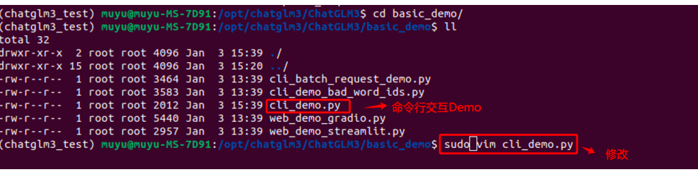

 在启动前，我们仅需要进行一处简单的修改，因为我们已经把ChatGLM3-6B这个模型下载到了本 地，所以需要修改一下模型的加载路径。  

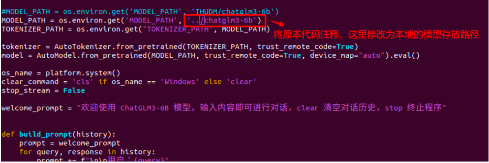

 修改完成后，直接使用 python cli_demp.py 即可启动，如果启动成功，就会开启交互式对话，如 果输入 stop 可以退出该运行环境。  

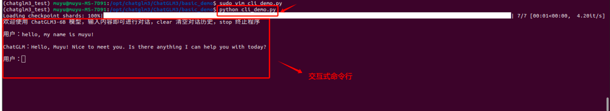

###  5.2 基于 Gradio 的Web端对话应用  
 基于网页端的对话是目前非常通用的大语言交互方式，ChatGLM3官方项目组提供了两种Web端对 话demo，两个示例应用功能一致，只是采用了不同的Web框架进行开发。首先是基于 Gradio 的Web 端对话应用demo。Gradio是一个Python库，用于快速创建用于演示机器学习模型的Web界面。开发者 可以用几行代码为模型创建输入和输出接口，用户可以通过这些接口与模型进行交互。用户可以轻松地 测试和使用机器学习模型，比如通过上传图片来测试图像识别模型，或者输入文本来测试自然语言处理 模型。Gradio非常适合于快速原型设计和模型展示。 对于这种启动方式，官方提供的脚本名称是：web_demo_gradio.py。同样，我们只需要使用vim 编辑器进入修改模型的加载路径，直接使用python启动即可。  

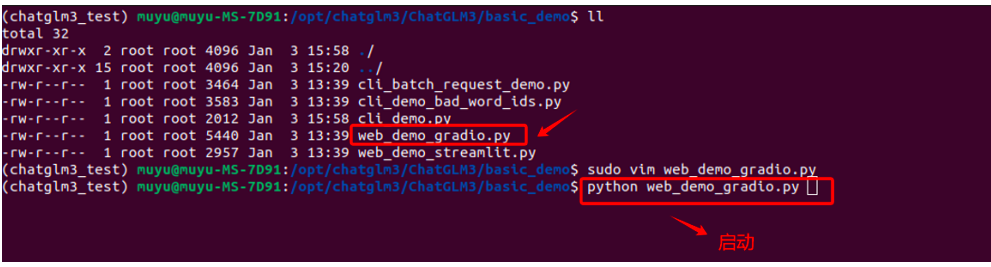

 如果启动正常，会自动弹出Web页面，可以直接在Web页面上进行交互。  

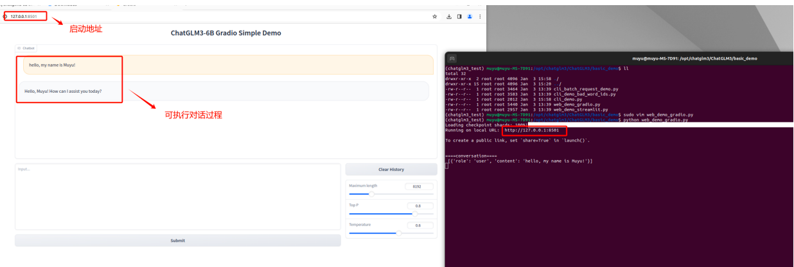

###  5.3 基于 Streamlit 的Web端对话应用  
 ChatGLM3官方提供的第二个Web对话应用demo，是一个基于Streamlit的Web应用。Streamlit是 另一个用于创建数据科学和机器学习Web应用的Python库。它强调简单性和快速的开发流程，让开发 者能够通过编写普通的Python脚本来创建互动式Web应用。Streamlit自动管理UI布局和状态，这样开 发者就可以专注于数据和模型的逻辑。Streamlit应用通常用于数据分析、可视化、构建探索性数据分析 工具等场景。 对于这种启动方式，官方提供的脚本名称是：web_demo_streamlit.py。同样，先使用 vim 编辑器 修改模型的加载路径  

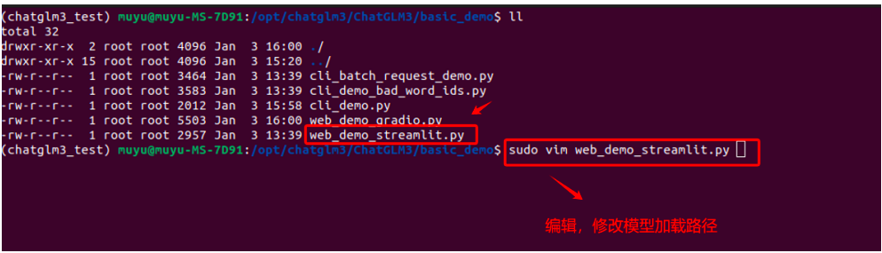

 启动命令略有不同，不再使用 python ，而是需要使用 streamkit run 的方式来启动。  

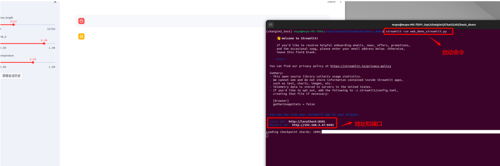

###  5.4 在指定虚拟环境的Jupyter Lab中运行  
 我们在部署Chatglm3-6B模型之前，创建了一个 chatglme3_test 虚拟环境来支撑该模型的运行。 除了在终端中使用命令行启动，同样可以在Jupyter Lab环境中启动这个模型。具体的执行过程如下： 首先，在终端中找到需要加载的虚拟环境，使用如下命令可以查看当前系统中一共存在哪些虚拟环境：

```bash
conda env list
```

  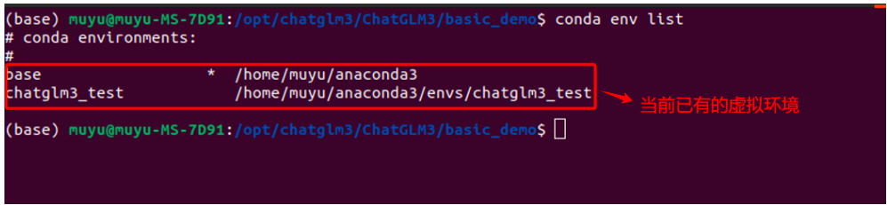

 这里可以看到我们之前创建的 chatglm3_test 虚拟环境，需要使用如下命令进入该虚拟环境：  

```bash
# 这里的`env_name`就是需要进入的虚拟环境名称
conda activate `env_name`
```

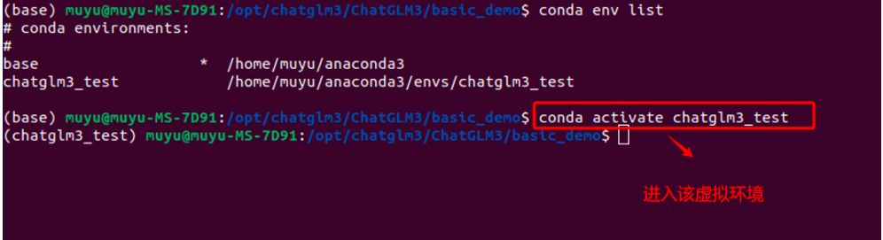

 在该环境中安装 ipykernel 软件包。这个软件包将允许Jupyter Notebook使用特定环境的Python 版本。运行以下命令：  

```bash
conda install ipykernel
```

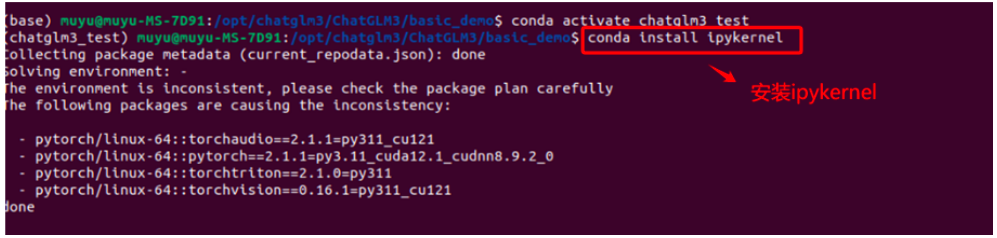

 将该环境添加到Jupyter Notebook中。运行以下命令：  

```bash
# 这里的env_name 替换成需要使用的虚拟环境名称
python -m ipykernel install --user --name=yenv_name --displayname="Python(env_name)"
```

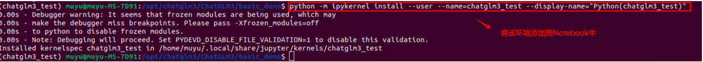

 执行完上述过程后，在终端输入 jupyter lab 启动  

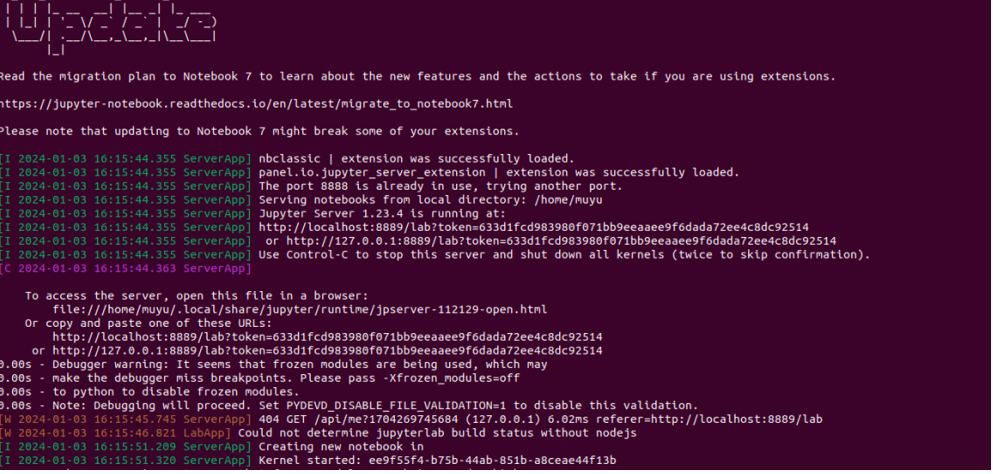

 打开后就可以看到，当前环境下我们已经可以使用新的虚拟环境创建Notebook。  

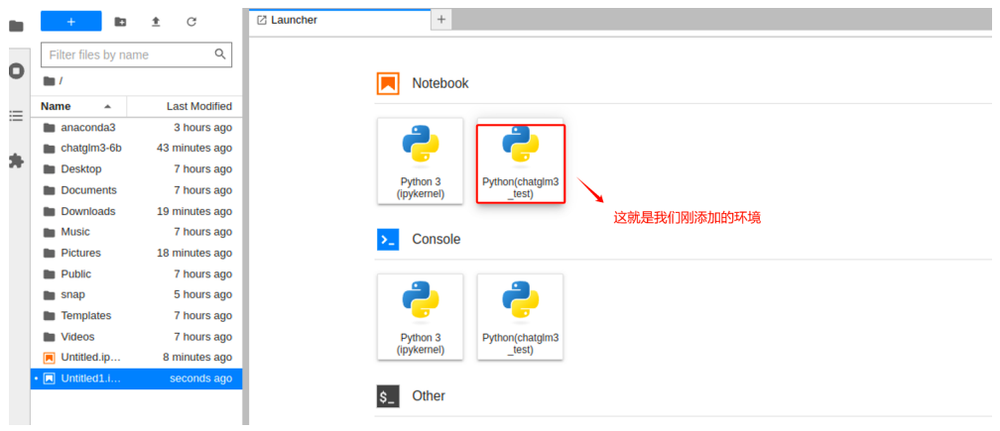

 基本调用流程也比较简单，官方也给出了一个实例：  

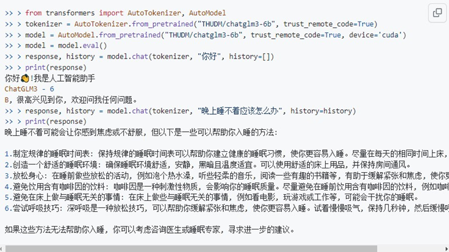

<font style="color:#333333;">只需要从</font><font style="color:#333333;">transformers</font><font style="color:#333333;">中加载</font><font style="color:#333333;">AutoTokenizer </font><font style="color:#333333;">和</font><font style="color:#333333;"> AutoModel</font><font style="color:#333333;">，指定好模型的路径即可。</font><font style="color:#333333;">tokenizer </font><font style="color:#333333;">这个词大家应该不会很陌生，可以简单理解我们在之前使用</font><font style="color:#333333;">gpt</font><font style="color:#333333;">系列模型的时候，使用</font><font style="color:#333333;">tiktoken</font><font style="color:#333333;">库帮我们把输入的自然语言，也就是</font><font style="color:#333333;">prompt</font><font style="color:#333333;">按照一种特定的编码方式来切分成</font><font style="color:#333333;">token</font><font style="color:#333333;">，从而生成</font><font style="color:#333333;">API</font><font style="color:#333333;">调用的成本。但在</font><font style="color:#333333;">Transform</font><font style="color:#333333;">中</font><font style="color:#333333;">tokenizer</font><font style="color:#333333;">要干的事会更多一些，它会把输入到大语言模型的文本，包在 </font><font style="color:#333333;">tokenizer</font><font style="color:#333333;">中去做一些前置的预处理，会将自然语言文本转换为模型能够理解的格式，然后拆分为</font><font style="color:#333333;"> tokens</font><font style="color:#333333;">（如单词、字符或子词单位）等操作。</font>

<font style="color:#333333;"></font><font style="color:#333333;">而对于模型的加载来说，官方的代码中指向的路径是</font><font style="color:#333333;">THUDM/chatglm3</font><font style="color:#333333;">-</font><font style="color:#333333;">6b </font><font style="color:#333333;">,</font><font style="color:#333333;">表示可以直接在云端加载模型，所以如果我们没有下载</font><font style="color:#333333;">chatglm3-6b</font><font style="color:#333333;">模型的话，直接运行此代码也是可以的，只不过第一次加载会很慢，耐心等待即可，同时需要确保当前的网络是联通的（必要的情况下需要开梯子）。</font>

<font style="color:#333333;"></font><font style="color:#333333;">因为我们已经将</font><font style="color:#333333;">ChatGLM3-6B</font><font style="color:#333333;">的模型权重下载到本地了，所以此处可以直接指向我们下载的</font>

<font style="color:#333333;">Chatglm3-6b模型的存储路径来进行推理测试。</font>

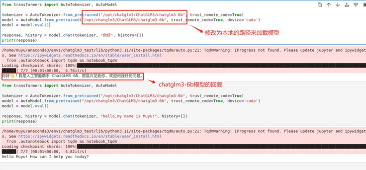

<font style="color:#333333;">对于其他参数来说，</font><font style="color:#333333;">model </font><font style="color:#333333;">有一个</font><font style="color:#333333;">eval</font><font style="color:#333333;">模式，就是评估的方法，模型基本就是两个阶段的事，一个是训练，一个是推理，计算的量更大，它需要把输入的值做一个推理，如果是一个有监督的模型，那必然存在一个标签值，也叫真实值，这个值会跟模型推理的值做一个比较，这个过程是正向传播。差异如果很大，就说明这个模型的能力还远远不够，既然效果不好，就要调整参数来不断地修正，通过不断地求导，链式法则等方式进行反向传播。当模型训练好了，模型的参数就不会变了，形成一个静态的文</font>

<font style="color:#333333;">件，可以下载下来，当我们使用的时候，就不需要这个反向传播的过程，只需要做正向的推理就好了，此处设置 model.eval()就是说明这个过程。而trust_remote_code=True 表示信任远程代码（如果有）， device='cuda' 表示将模型加载到CUDA设备上以便使用GPU加速，这两个就很好理解了。</font>

### <font style="color:#333333;">5.5</font><font style="color:#333333;">（重点）</font><font style="color:#333333;">OpenAI</font><font style="color:#333333;">风格</font><font style="color:#333333;">API</font><font style="color:#333333;">调用方法</font><font style="color:#333333;">       </font>
<font style="color:#333333;"></font><font style="color:#333333;">ChatGLM3-6B</font><font style="color:#333333;">模型提供了</font><font style="color:#333333;">OpenAI</font><font style="color:#333333;">风格的</font><font style="color:#333333;">API</font><font style="color:#333333;">调用方法。正如此前所说，在</font><font style="color:#333333;">OpenAI</font><font style="color:#333333;">几乎定义了整个前沿</font><font style="color:#333333;">AI</font><font style="color:#333333;">应用开发标准的当下，提供一个</font><font style="color:#333333;">OpenAI</font><font style="color:#333333;">风格的</font><font style="color:#333333;">API</font><font style="color:#333333;">调用方法，毫无疑问可以让</font><font style="color:#333333;">ChatGLM3</font><font style="color:#333333;">模型无缝接入</font><font style="color:#333333;">OpenAI</font><font style="color:#333333;">开发生态。所谓的</font><font style="color:#333333;">OpenAI</font><font style="color:#333333;">风格的</font><font style="color:#333333;">API</font><font style="color:#333333;">调用，指的是借助</font><font style="color:#333333;">OpenAI</font><font style="color:#333333;">库中的</font><font style="color:#333333;">ChatCompletion </font><font style="color:#333333;">函数进行</font><font style="color:#333333;">ChatGLM3</font><font style="color:#333333;">模型调用。而现在，我们只需要在</font><font style="color:#333333;">model</font><font style="color:#333333;">参数上输入</font><font style="color:#333333;">chatglm3-6b</font><font style="color:#333333;">，即可调用</font>

<font style="color:#333333;">ChatGLM3</font><font style="color:#333333;">模型。调用</font><font style="color:#333333;">API</font><font style="color:#333333;">风格的统一，无疑也将大幅提高开发效率。</font>

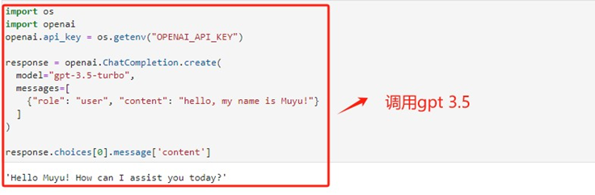

<font style="color:#333333;"></font><font style="color:#333333;">而要执行</font><font style="color:#333333;">OpenAI</font><font style="color:#333333;">风格的</font><font style="color:#333333;">API</font><font style="color:#333333;">调用，则首先需要安装</font><font style="color:#333333;">openai</font><font style="color:#333333;">库，并提前运行</font><font style="color:#333333;">openai_api.py</font><font style="color:#333333;">脚本。具体执行流程如下</font><font style="color:#333333;">:</font>

<font style="color:#333333;"></font><font style="color:#333333;">首先需要注意：</font><font style="color:#333333;">OpenAI</font><font style="color:#333333;">目前已将</font><font style="color:#333333;">openai</font><font style="color:#333333;">库更新至</font><font style="color:#333333;">1.x</font><font style="color:#333333;">，但目前</font><font style="color:#333333;">Chatglm3-6B</font><font style="color:#333333;">仍需要使用旧版本</font>

<font style="color:#333333;">0.28。所以需要确保当前环境的openai版本。</font>

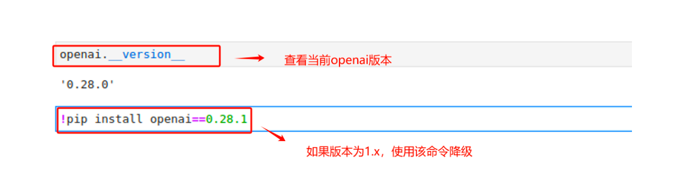

 如果想要使用API持续调用Chatglm3-6b模型，需要启动一个脚本，该脚本位于 open_api_demo 中。  

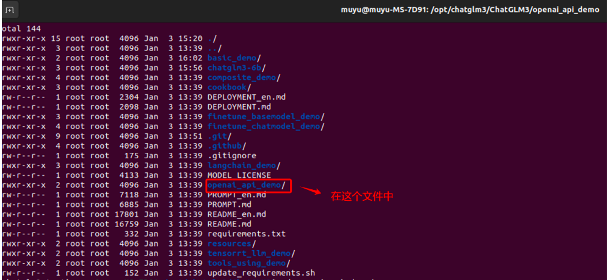

 启动之前，需要安装tiktoken包，用于将文本分割成 tokens。  

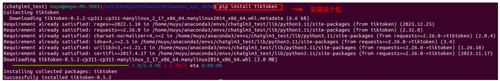

 同时，需要降级 typing_extensions 依赖包，否则会报错。  

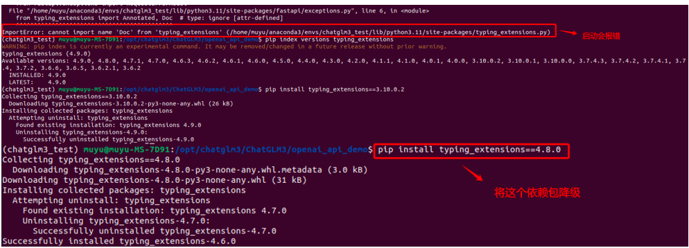

 最后，还需要安装 sentence_transformers 依赖包，安装最新的即可。  

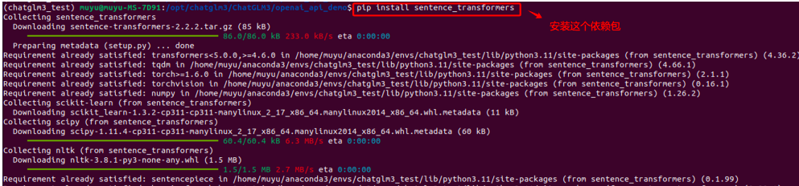

 安装完成后，使用命令 python openai_api.py 启动，第一次启动会有点慢，耐心等待。  

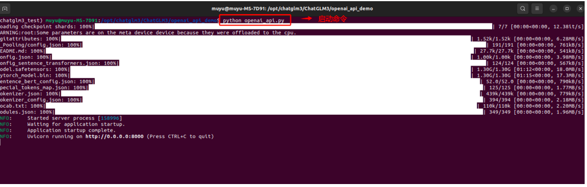

 启动成功后，在Jupyter lab上执行如下代码，进行API调用测试。  

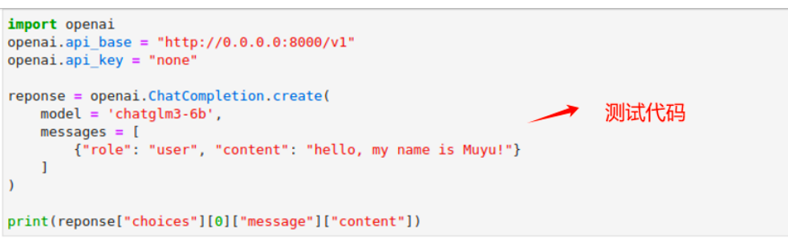

 如果上述代码出现如下报错的话，是因为开代理导致的，需要关闭，如果关闭后仍无法解决，重启 电脑后才可重新运行。  

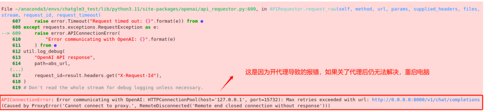

 如果服务正常是可以得到模型的回复的。  

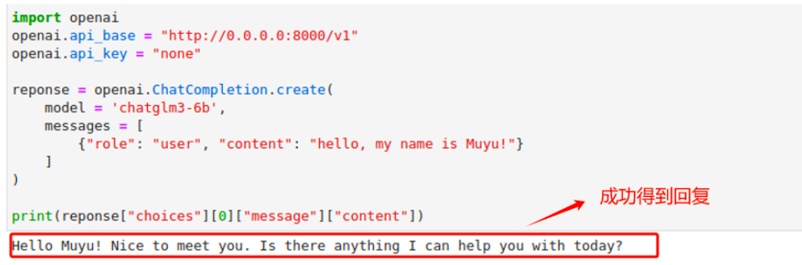

 同时，在终端应用运行处，也可以看到API的实时调用情况。  

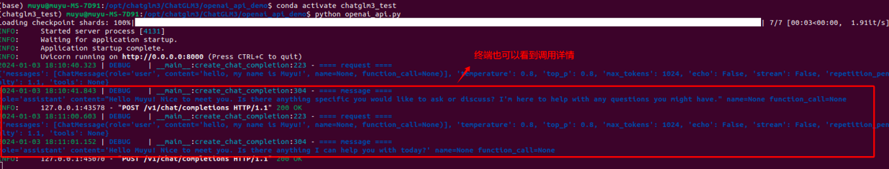

 除此之外，大家还可以去测试ChatGLM3-6B的Function Calling等更高级的用法时的性能情况。我 们推荐大家使用OpenAI风格的API调用方法是进行学习和尝试构造高级的AI Agent，同时积极参与国产 大型模型的开源社区，共同增强国内在这一领域的实力和影响力。  


> 更新: 2024-08-01 15:54:09  
> 原文: <https://www.yuque.com/lixinsi/nyg25m/gcpabx1c2mp7ih2q>