# 手把手教你Windows安装Python以及pip

### 1，先去[Python官网](https://www.python.org/)（打开可能会有点慢，耐心等待）
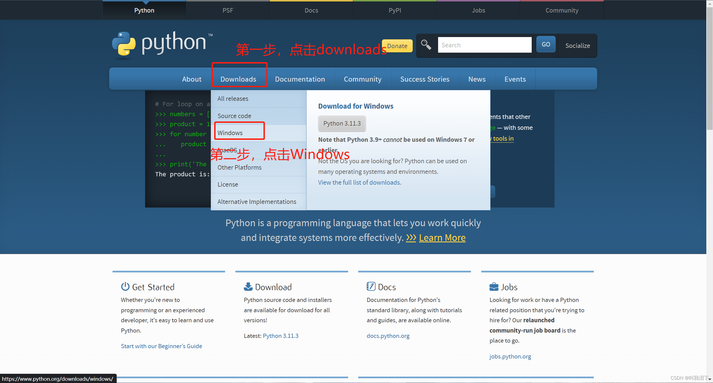

### 2，选好版本然后点击下载（现在应该都是64位的系统吧，所以选择64bit）
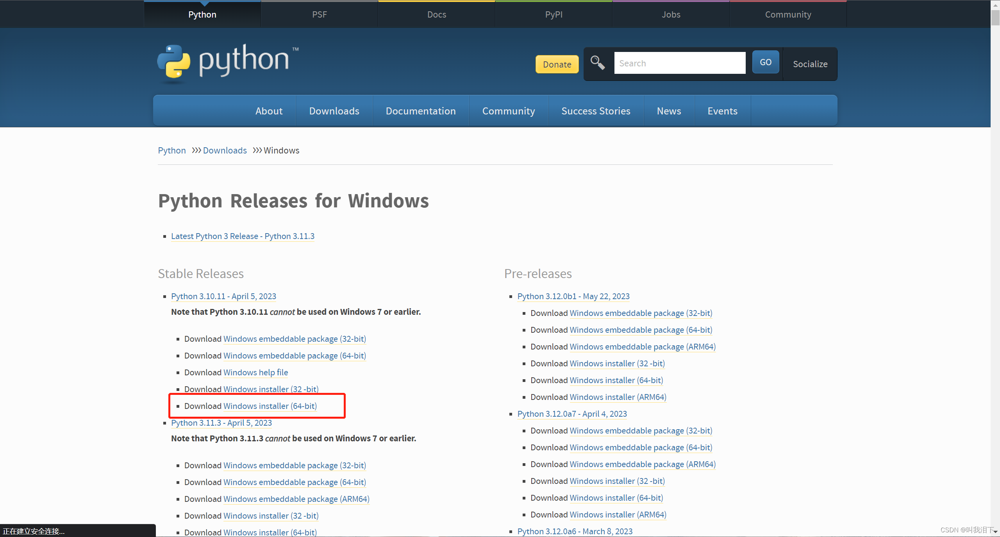

### 3，双击安装包进行安装
#### 1，勾选"add python.exe to Path"，然后选择"customize installation"
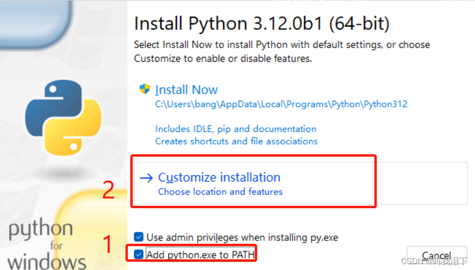

#### 2，这里直接下一步：
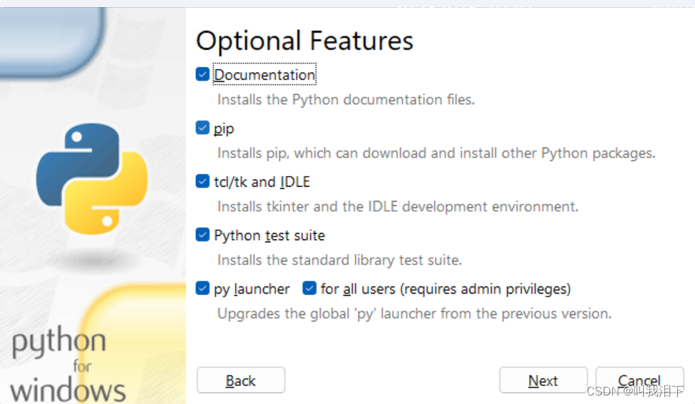

#### 3，这里选择一个比较好记的路径：
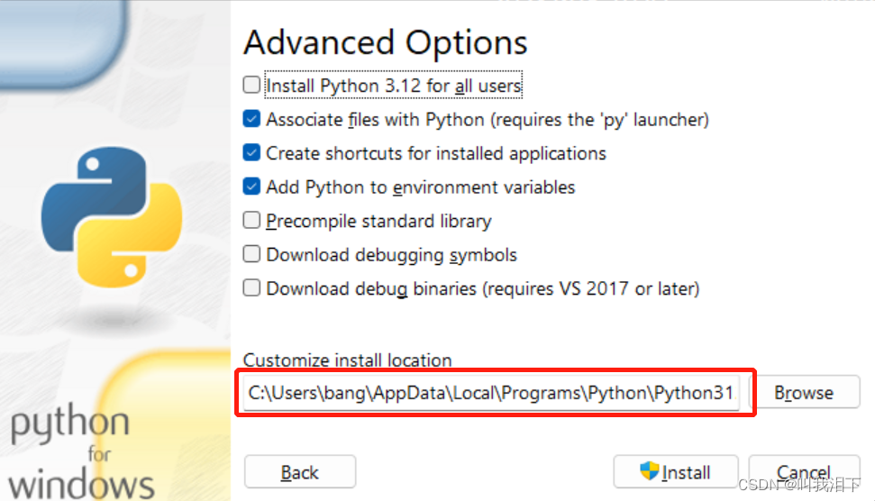

#### 4，然后点击"install"，进行安装。
### 4，验证安装
#### 1，同时按下win+r，输入cmd，然后输入python,如果出现以下的提示就说明python安装成功。
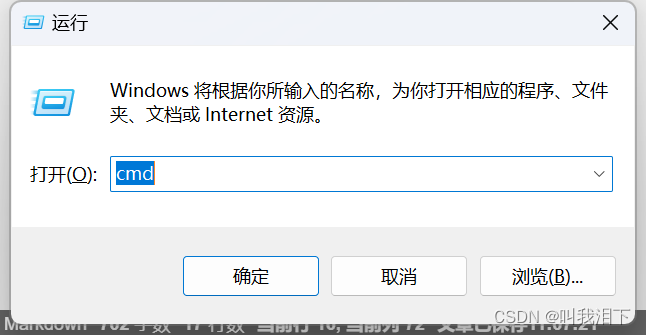  
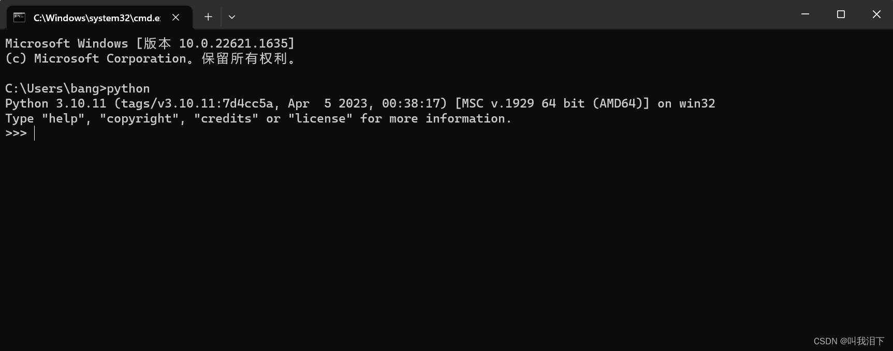

#### 2，如果没有出现这个提示，它会提示 == python 不是内部或外部命令，也不是可运行的程序或批处理文件 ==
这个时候需要去环境变量里面取手动添加：  
1，打开设置，搜索“环境变量”，然后点击“编辑系统环境变量”  
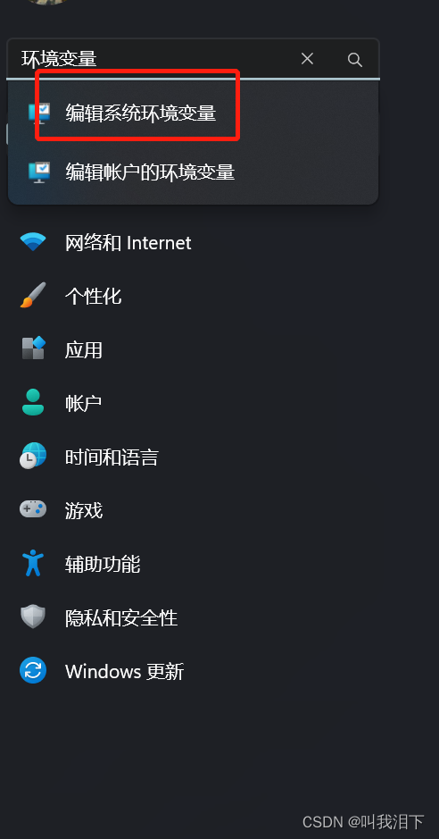  
2，点击环境变量，找到"path",点击编辑  
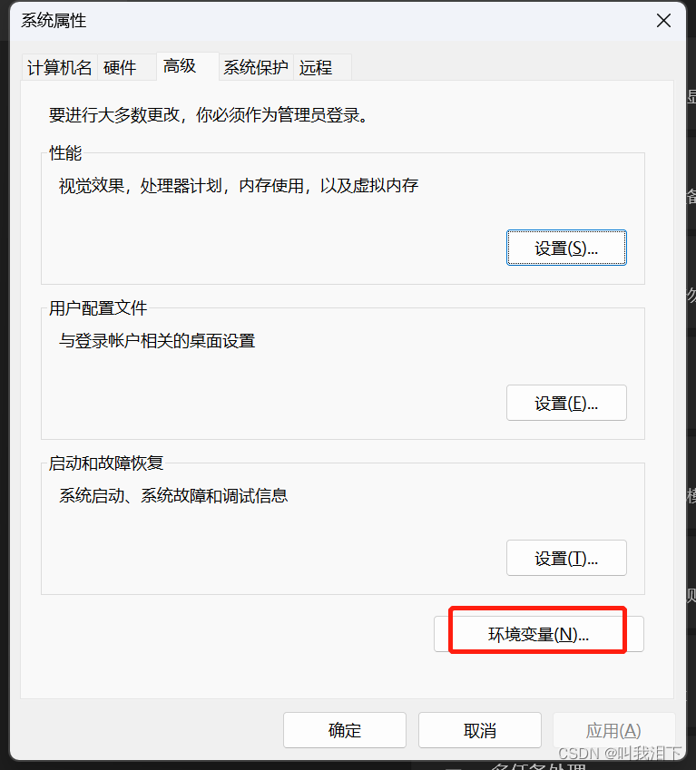  
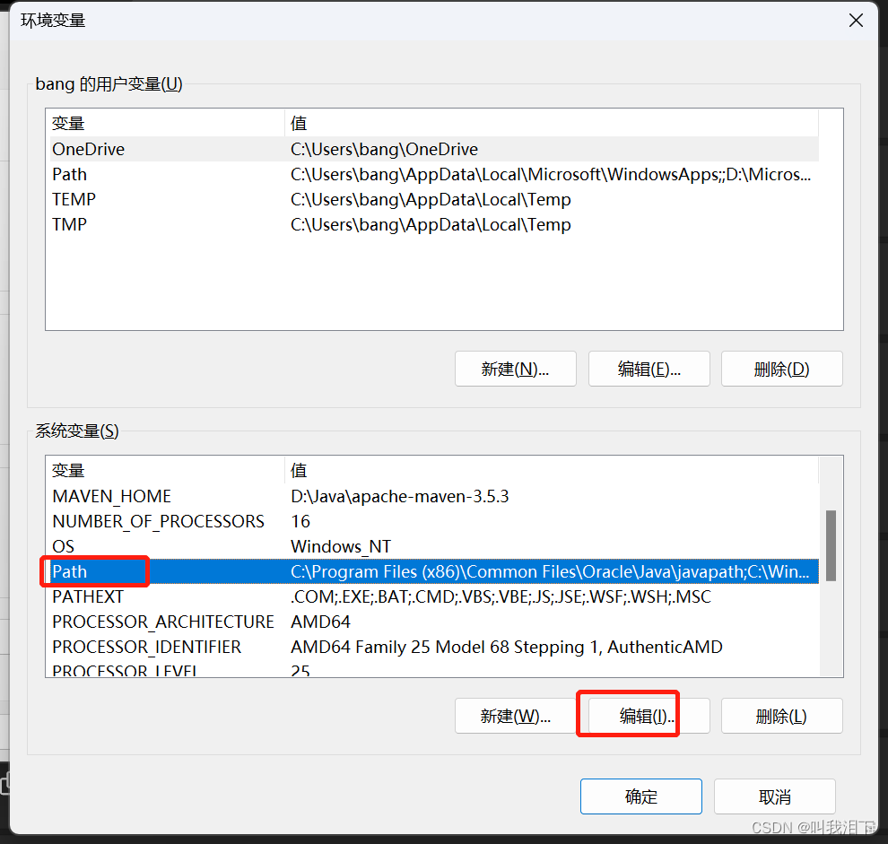  
3，点击"新建"，然后输入刚刚的安装路径，再点击确定，然后把刚刚弹出来的环境变量都点击确定。  
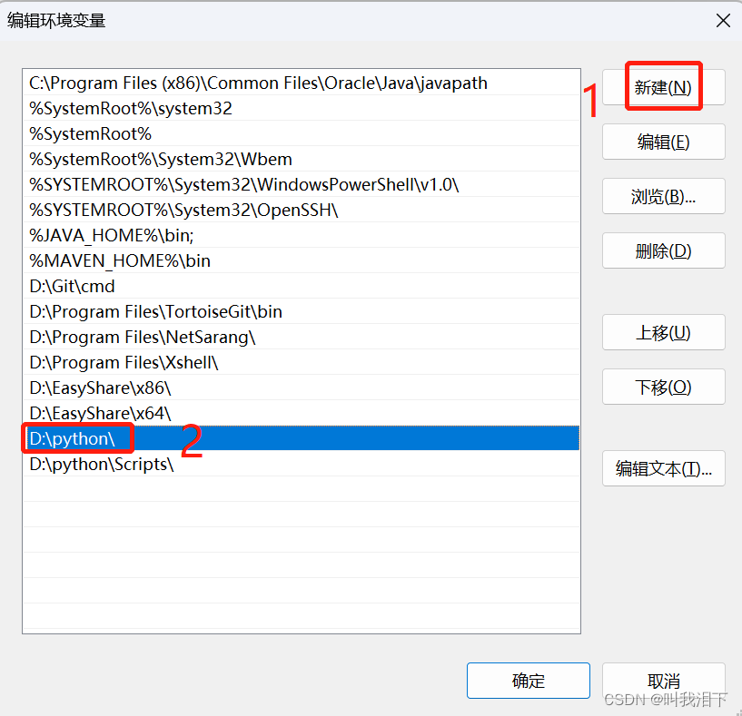  
4，在去cmd中输入python，验证是否成功。  
5，重复刚刚的步骤再去环境变量中添加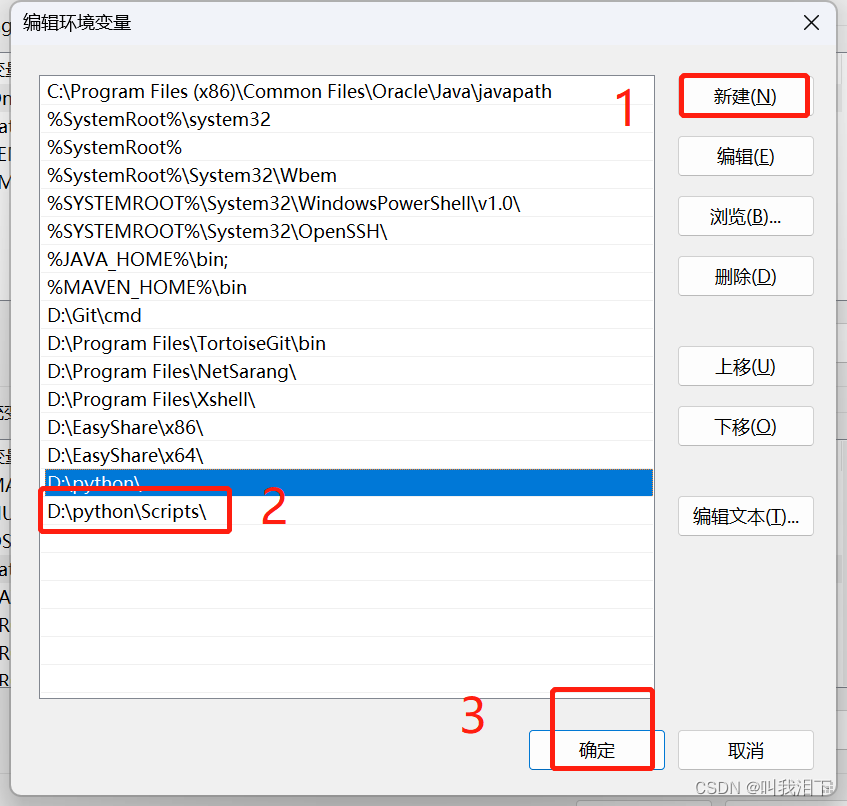  
6,完成后去cmd窗口输入pip,如果出现一堆东西，说明OK了。  
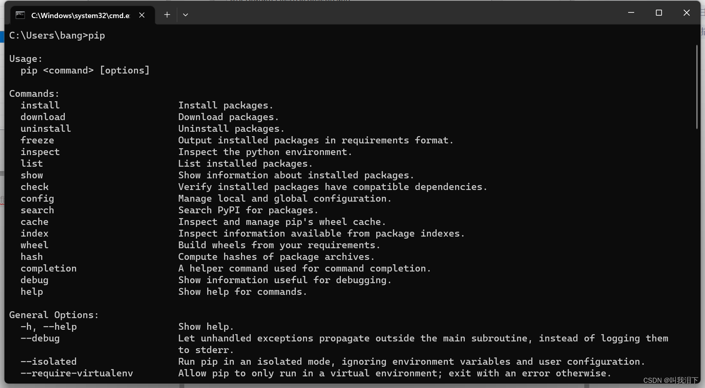  
7，可以使用pip命令来下载一些依赖。比如pip install selenium  
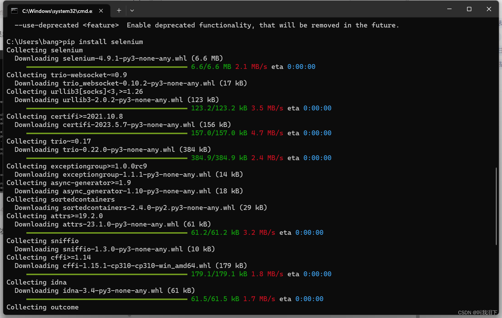

> 更新: 2024-06-14 10:30:36  
> 原文: <https://www.yuque.com/lixinsi/nyg25m/wlfykai0agamzptg>