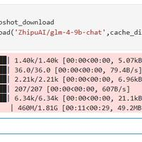

# 本地部署glm-4-9b-chat

**<font style="color:rgb(51, 51, 51);">Ubuntu</font>**

**<font style="color:rgb(51, 51, 51);">官网</font>**

[<font style="color:rgb(51, 51, 51);">https://github.com/THUDM/GLM-4</font>](https://github.com/THUDM/GLM-4)

---

**<font style="color:rgb(51, 51, 51);">硬件环境</font>**

**<font style="color:rgb(51, 51, 51);">软件环境</font>**<font style="color:rgb(51, 51, 51);">: Python3.11 (</font>**<font style="color:rgb(51, 51, 51);">ubuntu22.04</font>**<font style="color:rgb(51, 51, 51);">)</font>

**<font style="color:rgb(51, 51, 51);">GPU</font>**<font style="color:rgb(51, 51, 51);">: RTX 4090D (24G)</font>

---

# <font style="color:rgb(26, 26, 26);">[1] 模型下载</font>
[<font style="color:rgb(51, 51, 51);">https://modelscope.cn/models/ZhipuAI/glm-4-9b-chat</font>](https://modelscope.cn/models/ZhipuAI/glm-4-9b-chat)

**<font style="color:rgb(51, 51, 51);">2种下载方式</font>**

<font style="color:rgb(51, 51, 51);">SDK下载</font>

```plain
#模型下载
from modelscope import snapshot_download
model_dir = snapshot_download('ZhipuAI/glm-4-9b-chat',cache_dir='/root/hy-data/models')
```



<font style="color:rgb(51, 51, 51);">Git下载</font>

<font style="color:rgb(51, 51, 51);">请确保 lfs 已经被正确安装</font>

```plain
git lfs install
```

```plain
git clone https://www.modelscope.cn/ZhipuAI/glm-4-9b-chat.git
```

## <font style="color:rgb(26, 26, 26);">[2] 安装相关库</font>
<font style="color:rgb(51, 51, 51);">2-1 安装官方指定的库</font>

```plain
[https://github.com/THUDM/GLM-4/blob/main/basic_demo/requirements.txt](https://github.com/THUDM/GLM-4/blob/main/basic_demo/requirements.txt)
```

```plain
pip install -r requirements.txt -i https://pypi.tuna.tsinghua.edu.cn/simple
```

<font style="color:rgb(51, 51, 51);">2-2 安装 其他的库</font>

```plain
pip install  modelscope
pip install  langchain -i https://pypi.tuna.tsinghua.edu.cn/simple
pip install  langchain-core -i https://pypi.tuna.tsinghua.edu.cn/simple 
pip install  langserve[all] -i https://pypi.tuna.tsinghua.edu.cn/simple 
pip install  langchain-openai -i https://pypi.tuna.tsinghua.edu.cn/simple 
pip install  langchain-community -i https://pypi.tuna.tsinghua.edu.cn/simple 
pip install  vllm -i https://pypi.tuna.tsinghua.edu.cn/simple
```

## <font style="color:rgb(26, 26, 26);">[3] 下载 glm4 代码仓库</font>
<font style="color:rgb(51, 51, 51);">下载命令</font>

```plain
git clone https://github.com/THUDM/GLM-4.git
```

<font style="color:rgb(51, 51, 51);">openai 服务端</font>

```plain
https://github.com/THUDM/GLM-4/blob/main/basic_demo/openai_api_server.py
```

<font style="color:rgb(51, 51, 51);">开启服务端</font>

```plain
python openai_api_server.py
```

## <font style="color:rgb(26, 26, 26);">[4] 验证 OpenAi Endpoint</font>
<font style="color:rgb(51, 51, 51);">openai 调用</font>

```plain
"""
This script creates a OpenAI Request demo for the glm-4-9b model, just Use OpenAI API to interact with the model.
"""

from openai import OpenAI

base_url = "http://127.0.0.1:8000/v1/"
client = OpenAI(api_key="EMPTY", base_url=base_url)


def function_chat(use_stream=False):
    messages = [
        {
            "role": "user", "content": "What's the Celsius temperature in San Francisco?"
        },

        # Give Observations
        # {
        #     "role": "assistant",
        #         "content": None,
        #         "function_call": None,
        #         "tool_calls": [
        #             {
        #                 "id": "call_1717912616815",
        #                 "function": {
        #                     "name": "get_current_weather",
        #                     "arguments": "{\"location\": \"San Francisco, CA\", \"format\": \"celsius\"}"
        #                 },
        #                 "type": "function"
        #             }
        #         ]
        # },
        # {
        #     "tool_call_id": "call_1717912616815",
        #     "role": "tool",
        #     "name": "get_current_weather",
        #     "content": "23°C",
        # }
    ]
    tools = [
        {
            "type": "function",
            "function": {
                "name": "get_current_weather",
                "description": "Get the current weather",
                "parameters": {
                    "type": "object",
                    "properties": {
                        "location": {
                            "type": "string",
                            "description": "The city and state, e.g. San Francisco, CA",
                        },
                        "format": {
                            "type": "string",
                            "enum": ["celsius", "fahrenheit"],
                            "description": "The temperature unit to use. Infer this from the users location.",
                        },
                    },
                    "required": ["location", "format"],
                },
            }
        },
    ]

    # All Tools: CogView
    # messages = [{"role": "user", "content": "帮我画一张天空的画画吧"}]
    # tools = [{"type": "cogview"}]

    # All Tools: Searching
    # messages = [{"role": "user", "content": "今天黄金的价格"}]
    # tools = [{"type": "simple_browser"}]

    response = client.chat.completions.create(
        model="glm-4",
        messages=messages,
        tools=tools,
        stream=use_stream,
        max_tokens=256,
        temperature=0.9,
        presence_penalty=1.2,
        top_p=0.1,
        tool_choice="auto"
    )
    if response:
        if use_stream:
            for chunk in response:
                print(chunk)
        else:
            print(response)
    else:
        print("Error:", response.status_code)


def simple_chat(use_stream=False):
    messages = [
        {
            "role": "system",
            "content": "请在你输出的时候都带上“喵喵喵”三个字，放在开头。",
        },
        {
            "role": "user",
            "content": "你是谁"
        }
    ]
    response = client.chat.completions.create(
        model="glm-4",
        messages=messages,
        stream=use_stream,
        max_tokens=256,
        temperature=0.4,
        presence_penalty=1.2,
        top_p=0.8,
    )
    if response:
        if use_stream:
            for chunk in response:
                print(chunk)
        else:
            print(response)
    else:
        print("Error:", response.status_code)


if __name__ == "__main__":
    simple_chat(use_stream=False)
    # function_chat(use_stream=False)
```

<font style="color:rgb(51, 51, 51);">Langchain 调用</font>

```plain
from langchain_core.prompts import ChatPromptTemplate, MessagesPlaceholder
from langchain_core.runnables import RunnablePassthrough
from langchain_openai import ChatOpenAI

if __name__ == '__main__':

    chat_model = ChatOpenAI(openai_api_base="http://localhost:8000/v1",
                            model="glm-4",
                            openai_api_key="EMPTY")

    # 测试普通模型对话
    res = chat_model.invoke("你好，介绍一下你自己")

    print(res.content)
```

<font style="color:rgb(51, 51, 51);">langserve 启动</font>

```plain
#!/usr/bin/env python
from fastapi import FastAPI
from langchain.prompts import ChatPromptTemplate
from langchain.chat_models import ChatOpenAI
from langserve import add_routes
from langchain_core.prompts import ChatPromptTemplate, MessagesPlaceholder
from langchain.pydantic_v1 import BaseModel, Field
from typing import Any, BinaryIO, List, Optional
from typing import Any, Dict, List, Optional, Sequence, Union

from langchain_core.messages import (
    BaseMessage,
    FunctionMessage,
    HumanMessage,
    SystemMessage,
    ToolMessage,
    AIMessage
)


from fastapi.middleware.cors import CORSMiddleware

local_glm4 = ChatOpenAI(openai_api_base="http://localhost:8000/v1",
                          model="glm-4",
                        openai_api_key="EMPTY")
app = FastAPI(
    title="Glm4 9B Server",
    version="1.0",
    description="Glm4 9B Runnable interfaces",
)

# Set all CORS enabled origins
app.add_middleware(
    CORSMiddleware,
    allow_origins=["*"],
    allow_credentials=True,
    allow_methods=["*"],
    allow_headers=["*"],
    expose_headers=["*"],
)

# Declare a chain
prompt = ChatPromptTemplate.from_messages(
    [
        ("system", "你是一个AI助手"),
        MessagesPlaceholder(variable_name="messages"),
    ]
)

chain = prompt | local_glm4


class InputChat(BaseModel):
    """Input for the chat endpoint."""

    messages: List[Union[HumanMessage, AIMessage, SystemMessage]] = Field(
        ...,
        description="The chat messages representing the current conversation.",
    )


add_routes(
    app,
    chain.with_types(input_type=InputChat),
    enable_feedback_endpoint=True,
    enable_public_trace_link_endpoint=True,
    playground_type="chat",
)

if __name__ == "__main__":
    import uvicorn

    uvicorn.run(app, host="localhost", port=8001)
```


> 更新: 2024-07-24 16:50:32  
> 原文: <https://www.yuque.com/lixinsi/nyg25m/qn5872hu29nk5ua6>