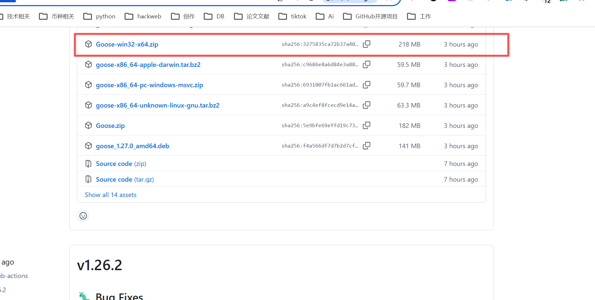
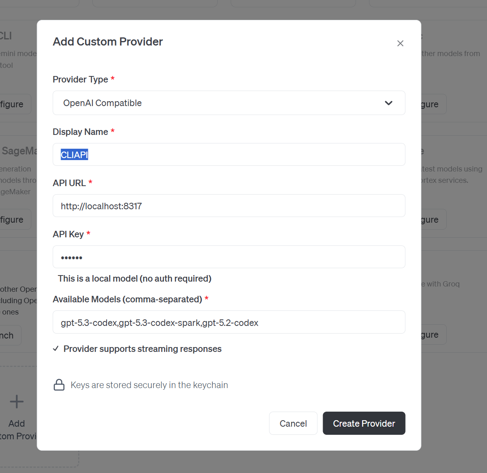
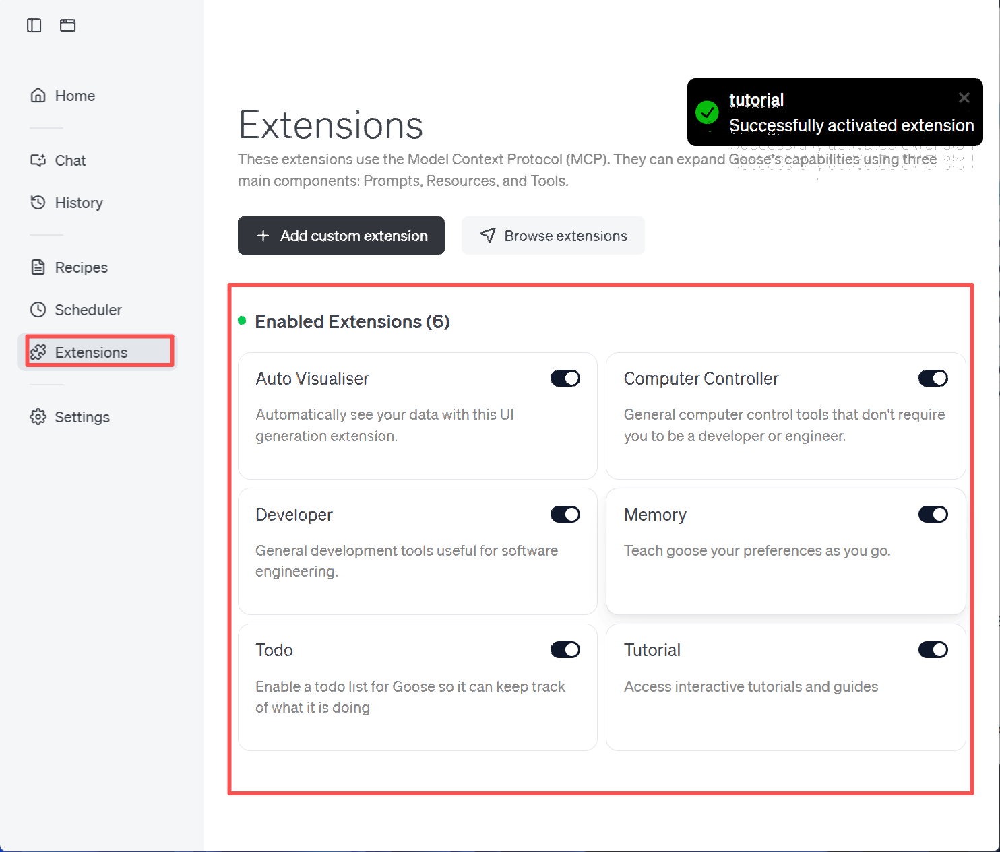

# Goose配置

[https://github.com/block/goose/releases](https://github.com/block/goose/releases)





```plain
CLIAPI
http://localhost:8317
密钥：123456
gpt-5.3-codex,gpt-5.3-codex-spark,gpt-5.2-codex
gpt-5
gpt-5.1
gpt-5.1-codex-mini
gpt-5-codex
gpt-5-codex-mini
gpt-5.1-codex
gpt-5.1-codex-max
gpt-5.2
gpt-5.2-codex

```

### 插件市场
[https://block.github.io/goose/extensions/](https://block.github.io/goose/extensions/)




### goolse 路径
```plain
C:\Users\lixin\AppData\Roaming\Goose
C:\Users\lixin\AppData\Roaming\Block\goose\config\
```


> 更新: 2026-03-05 17:24:54  
> 原文: <https://www.yuque.com/lixinsi/yh04az/iwfgks6tqso9gsq8>