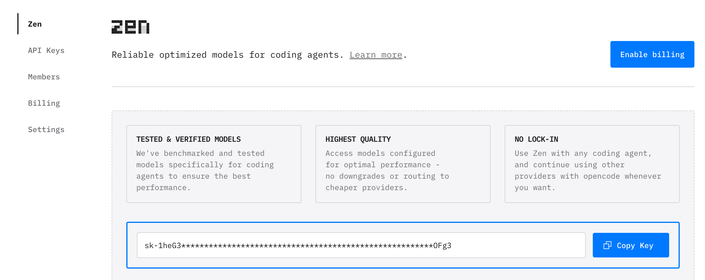
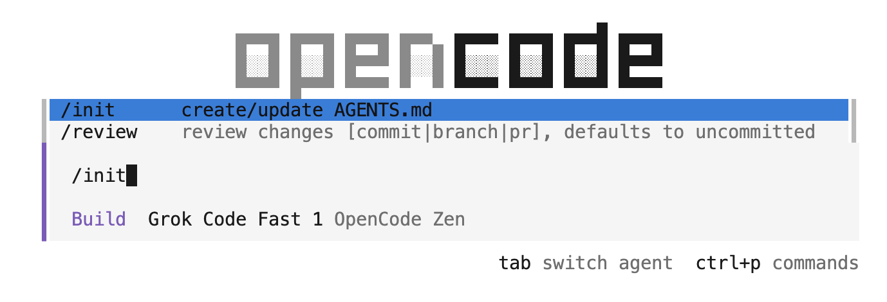
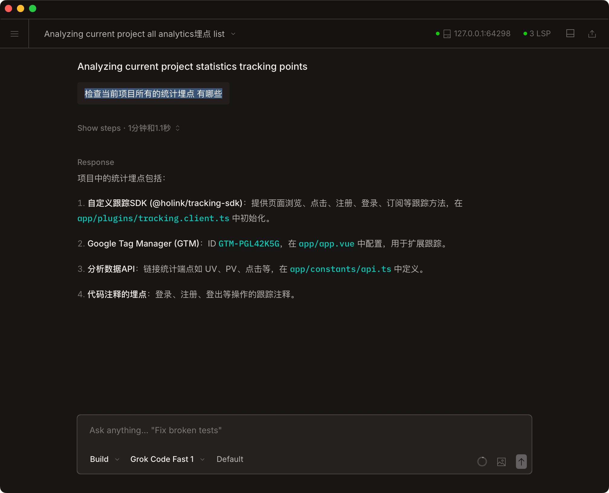
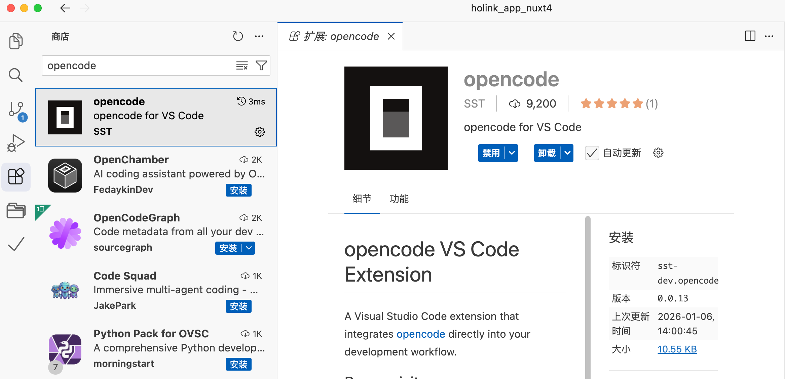
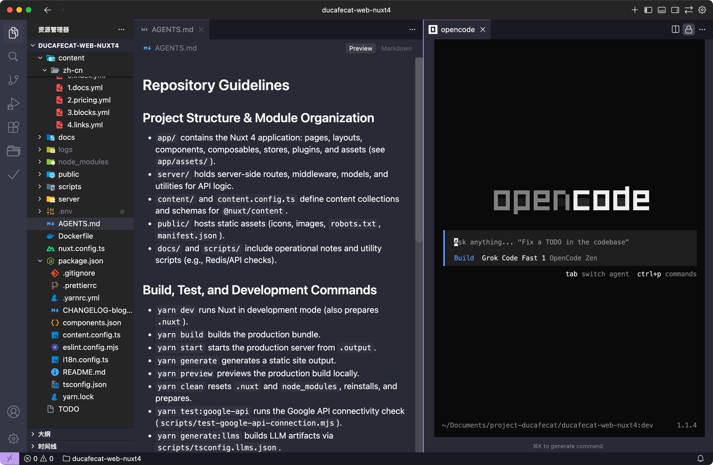
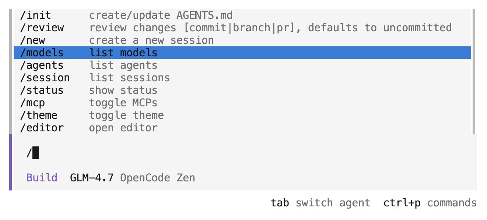
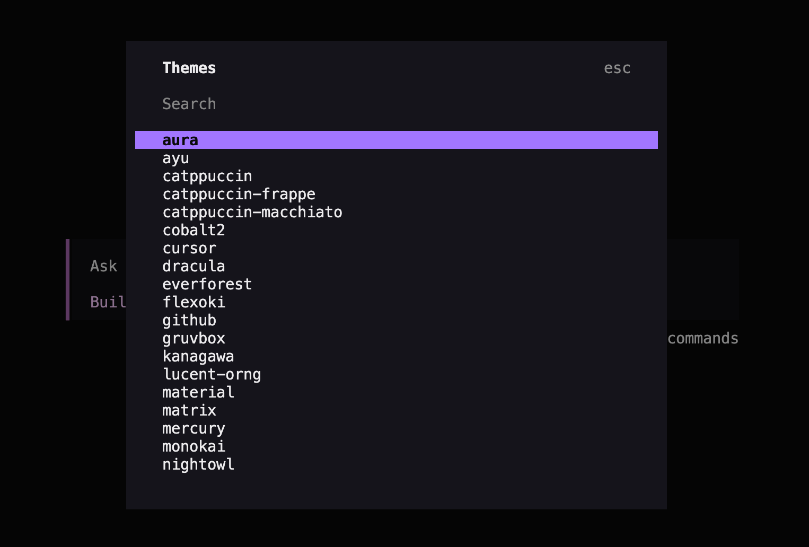
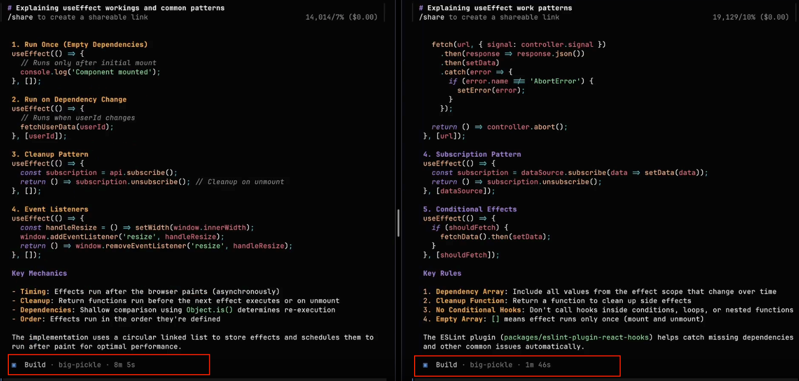
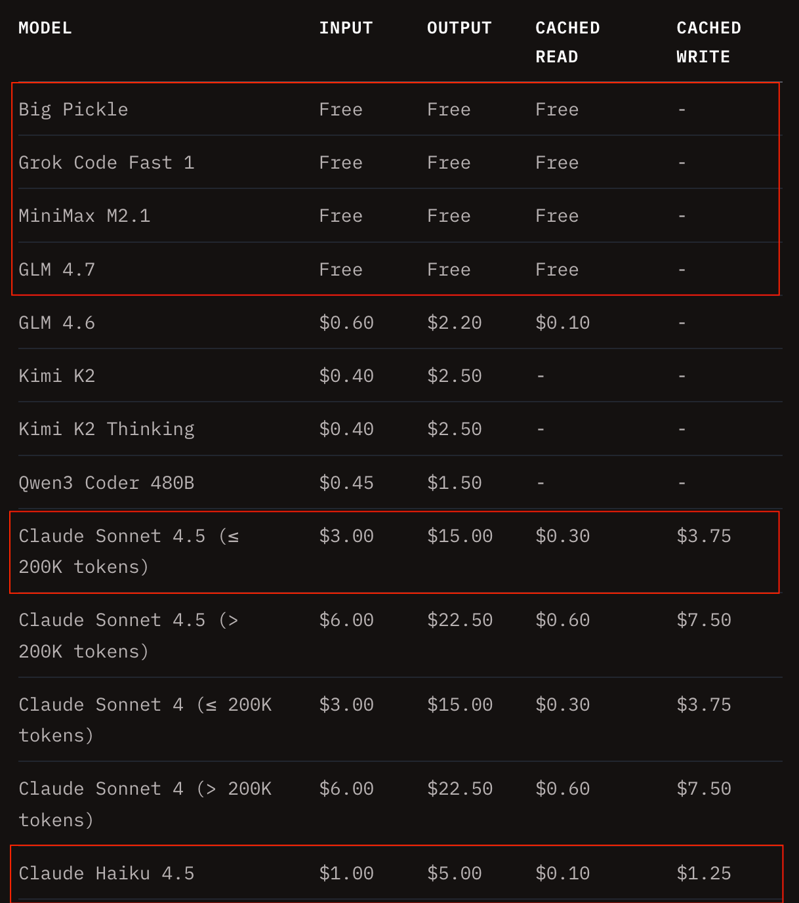

# OpenCode 最佳开源 AI 编程工具

# [https://github.com/anomalyco/opencode](https://github.com/anomalyco/opencode)


## 视频
[<font style="color:rgb(14, 165, 233);">https://youtu.be/Hgo2Eo2NiaA</font>](https://youtu.be/Hgo2Eo2NiaA)

[<font style="color:rgb(14, 165, 233);">https://www.bilibili.com/video/BV19XqMBzENU</font>](https://www.bilibili.com/video/BV19XqMBzENU)

## 前言
OpenCode 是一款面向开发者的开源 AI CLI 编程工具，支持多模型并行、LSP 自动加载、极速响应与非订阅制计费。无论是命令行、桌面 App 还是 VS Code 插件，OpenCode 都提供高效、不啰嗦的 AI 编程体验，是 Cursor 与 Claude Code 的有力替代方案。

<font style="background-color:rgba(240, 240, 240, 0.3);">原文</font><font style="background-color:rgba(240, 240, 240, 0.3);"> </font>[<font style="color:rgb(14, 165, 233);background-color:rgba(240, 240, 240, 0.3);">OpenCode：也许是程序员开始 AI CLI 编程的最佳方式</font>](https://ducafecat.com/blog/cursor-opencode-ai-cli-programming)

分类：AI CLI 编程、OpenCode

## 参考
+ [<font style="color:rgb(14, 165, 233);">https://opencode.ai/</font>](https://opencode.ai/)
+ [<font style="color:rgb(14, 165, 233);">https://github.com/anomalyco/opencode</font>](https://github.com/anomalyco/opencode)
+ [<font style="color:rgb(14, 165, 233);">https://github.com/code-yeongyu/oh-my-opencode/blob/dev/README.zh-cn.md</font>](https://github.com/code-yeongyu/oh-my-opencode/blob/dev/README.zh-cn.md)
+ [<font style="color:rgb(14, 165, 233);">https://github.com/mixedbread-ai/mgrep</font>](https://github.com/mixedbread-ai/mgrep)

## 正文
### 运行速度快、不啰嗦
+ **LSP 自动启用**：自动加载与当前项目匹配的语言服务器（LSP），让大模型更准确理解代码结构与语义
+ **多会话并行**：在同一个项目中同时启动多个 AI Agent，并行处理不同任务，互不干扰
+ **会话链接分享**：每个会话都可以生成可分享链接，方便参考、复盘或协助 Debug
+ **支持 Claude Pro 账号**：可登录 Anthropic，直接使用你现有的 Claude Pro 或 Max 账户
+ **支持任意模型**：通过 Models.dev 接入 75+ 大模型服务商，也支持本地模型
+ **支持任意编辑器**：既可在终端使用，也提供桌面应用和 IDE 插件（如 VS Code）

## 安装
[<font style="color:rgb(14, 165, 233);">https://opencode.ai/</font>](https://opencode.ai/)

可以用 google 、github 账号激活。

获取 api key

```plain
sk-NEflLdzc059Ja2D5zlJRKy8YzEm5xW4hzP1DNWjIMfZVEAskD0ndcGZKtMwDw4zn
```



全局安装 opencode cli

**<font style="color:rgb(71, 85, 105);background-color:rgb(248, 250, 252);">代码片段</font>**

```plain
npm install -g opencode-windows-x64
```

执行登录

**<font style="color:rgb(71, 85, 105);background-color:rgb(248, 250, 252);">代码片段</font>**

```plain
opencode auth login
输入 api key
```

### 多种使用方式
+ cli 命令行

进入项目

**<font style="color:rgb(71, 85, 105);background-color:rgb(248, 250, 252);">代码片段</font>**

```plain
opencode
```

启动后第一次需要进行初始化，将会生成 [<font style="color:rgb(14, 165, 233);">AGENTS.md</font>](http://agents.md/)



+ 桌面 app



+ vsc 插件





### 开局 3 个免费模型
+ Grok Code Fast
+ GLM-4.7
+ Big Pickle

输入

**<font style="color:rgb(71, 85, 105);background-color:rgb(248, 250, 252);">代码片段</font>**

```plain
/models
```



## 漂亮的 theme
输入

**<font style="color:rgb(71, 85, 105);background-color:rgb(248, 250, 252);">代码片段</font>**

```plain
/theme
```



### 因为开源所以变的更好
+ oh-my-opencode 多任务自动分配模型

[<font style="color:rgb(14, 165, 233);">https://github.com/code-yeongyu/oh-my-opencode/blob/dev/README.zh-cn.md</font>](https://github.com/code-yeongyu/oh-my-opencode/blob/dev/README.zh-cn.md)


+ mgrep 语义识别提速快

[<font style="color:rgb(14, 165, 233);">https://github.com/mixedbread-ai/mgrep</font>](https://github.com/mixedbread-ai/mgrep)



- ecosystem 生态

[<font style="color:rgb(14, 165, 233);">https://opencode.ai/docs/ecosystem/</font>](https://opencode.ai/docs/ecosystem/)

[<font style="color:rgb(14, 165, 233);">https://github.com/awesome-opencode/awesome-opencode</font>](https://github.com/awesome-opencode/awesome-opencode)

### 充值模式而不是订阅
+ pay-as-you-go model

[<font style="color:rgb(14, 165, 233);">https://opencode.ai/docs/zen/#pricing</font>](https://opencode.ai/docs/zen/#pricing)



### 更多的可能
[<font style="color:rgb(14, 165, 233);">https://opencode.ai/docs/sdk/</font>](https://opencode.ai/docs/sdk/)

+ sdk
+ server
+ plugins

## 总结要点
OpenCode 通过开源架构与 AI CLI 编程方式，为开发者提供了一种更轻量、更快速、更专注代码本身的 AI 编程体验。相比传统 IDE 插件或订阅制工具，OpenCode 支持多模型并行、LSP 自动加载以及灵活的充值模式，特别适合追求效率与掌控感的程序员。如果你正在寻找一款真正为开发者设计的 AI 命令行编程工具，OpenCode 值得深入尝试。

感谢阅读本文

如果有什么建议，请在评论中让我知道。我很乐意改进。


> 更新: 2026-01-11 21:16:36  
> 原文: <https://www.yuque.com/lixinsi/yh04az/gkrt5y3gla1m6qso>