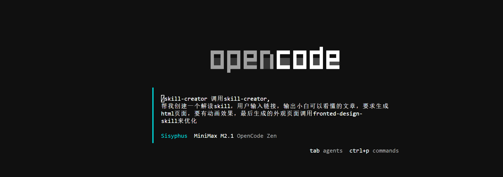
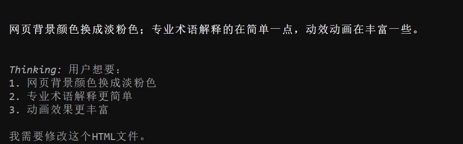

# Opencode Skill

### 1.专门新建一个文件夹
skillproject

.claude

skills

myproject

SKILL.md

### 2.skills 站点
[https://skillsmp.com/](https://skillsmp.com/)


### 3.页面涉及得 skill 开源站点
[https://github.com/nextlevelbuilder/ui-ux-pro-max-skill](https://github.com/nextlevelbuilder/ui-ux-pro-max-skill)

[https://github.com/obra/superpowers](https://github.com/obra/superpowers)

Do you have superpowers?


### 4.skill 迭代
[https://github.com/OthmanAdi/planning-with-files](https://github.com/OthmanAdi/planning-with-files)


### 5.skill 创建
#### 提示词
```powershell
/skill-creator 调用skill-creator, 帮我创建一个解读skill，用户输入链接，输出小白可以看懂的文章，要求生成html页面，要有动画效果，最后生成的外观页面调用fronted-design-skill来优化
```




```powershell
网页背景颜色换成淡粉色；专业术语解释的在简单一点，动效动画在丰富一些。
```




```powershell
请你把现在这个效果作为最佳实现归档到skill里面方便，日后复用
```

### 6.网站风格复刻 skill
```powershell
/skill-creator 帮我创建一个skill,调用skill-creator,理解需求，判断设计场景，决定调用方案。调用方案设定后，执行层的skill进行工作，1.执行创意设计师， 调用fronted-design-skill，自由发挥，追求独特。2.执行设计数据库，调用ui-ux-pro-max，存储57种风格规范。设计流程，用户了解设计需求，主控判断设计场景，确定设计路线，如果用户需要走创意方向，没有特定要求执行创意设计师，纯创意。2.如果用户强调规范性，不太在意设计感，调用ui-ux-pro-max的数据库，找到一个案列把它复刻出来。如果用户希望既希望有风格，又希望有风格又希望有规范性，先通过ui-ux-pro-max提供的参考规范，然后用fronted-design-skill,在去主导整个设计语言，给出最终的设计方案，进行执行，由于ui-ux-pro-max内置的规范数据量有限，需要ui提取规范的skill，它的工作方式是输入一个url，它就会调用playwright skill进行页面的捕获，同时拿到网站的截图和css代码，拿到代码以及截图后，进行分析，分析完成后会在ui-ux-pro-max数据库里面新增一条规范，然后把对应的参数全都填进去
```


v1.0

```powershell
/skill-creator 帮我创建一个skill,调用skill-creator,理解需求，判断设计场景，决定调用方案。调用方案设定后，执行层的skill进行工作，1.执行创意设计师， 调用use frontend-design，自由发挥，追求独特。2.执行设计数据库，调用use ui-ux-pro-max，存储57种风格规范。设计流程，用户了解设计需求，主控判断设计场景，确定设计路线，如果用户需要走创意方向，没有特定要求执行创意设计师，纯创意。2.如果用户强调规范性，不太在意设计感，调用use ui-ux-pro-max的数据库，找到一个案列把它复刻出来。如果用户希望既希望有风格，又希望有风格又希望有规范性，先通过use ui-ux-pro-max提供的参考规范，然后用use fronted-design-skill,在去主导整个设计语言，给出最终的设计方案，进行执行，由于use ui-ux-pro-max内置的规范数据量有限，需要ui提取规范的skill，它的工作方式是输入一个url，它就会调用playwright skill进行页面的捕获，同时拿到网站的截图和css代码，拿到代码以及截图后，进行分析，分析完成后会在use ui-ux-pro-max数据库里面新增一条规范，然后把对应的参数全都填进去
```

### 7.推送 GitHub 前 10 的 skill
```powershell
创建一个Skill，功能如下:第一步爬取今日热门项目前10个  https://github.com/trending第二步，获取他们的README文件，第三步 把前10个项目，总结成一个中文简介摘要，需要包含 项目是什么?解决什么问题?技术栈是什么?Star数量多少等主要内容第四步 调用python脚本，发送总结的中文摘要邮件到我的邮箱。
这个Skill应包含两个Python脚本:脚本1:爬trending，获取前五10项目的README，把结果保存到一个json文件脚本2:发送总结邮件
```


> 更新: 2026-01-22 17:54:40  
> 原文: <https://www.yuque.com/lixinsi/yh04az/yohgqztz42aax5fw>