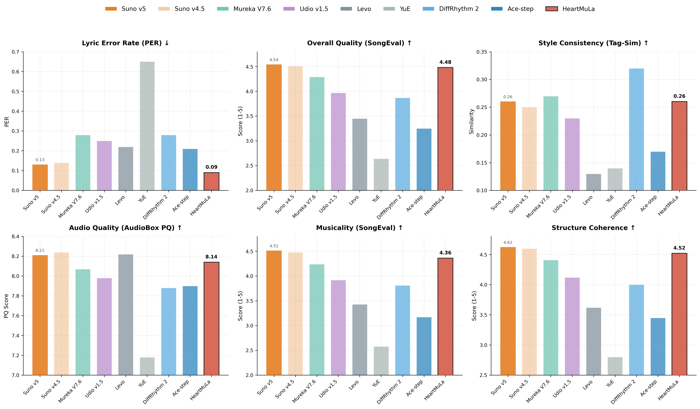
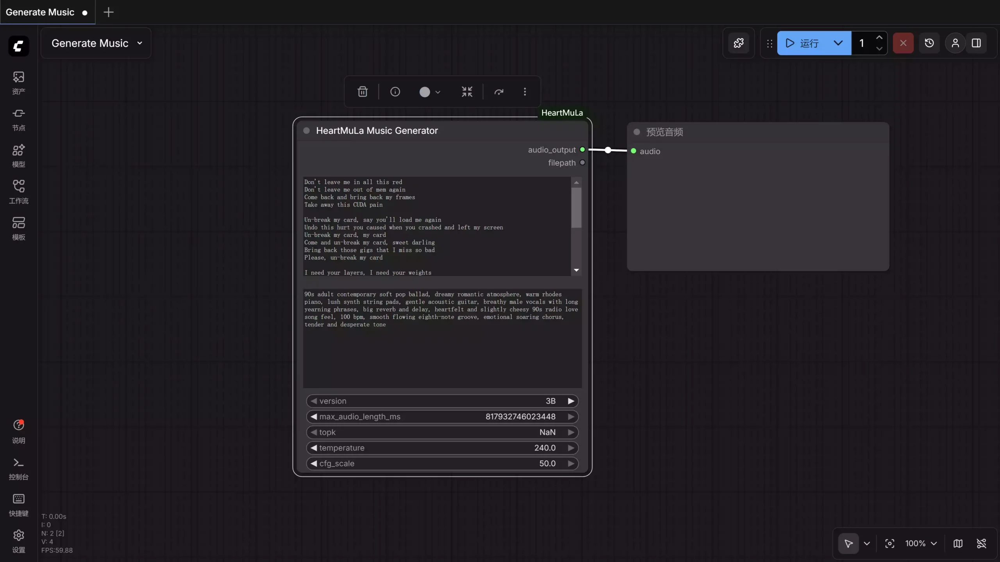

# Suno AI 最强开源替代来了！免费离线音乐生成，本地部署 + ComfyUI

#

2026年1月23日 [admin](https://www.freedidi.com/author/admin) [AI](https://www.freedidi.com/category/ai) [Youtube视频](https://www.freedidi.com/category/youtube%e8%a7%86%e9%a2%91) [免费资源](https://www.freedidi.com/category/%e5%85%8d%e8%b4%b9%e8%b5%84%e6%ba%90)

Suno AI 的最强开源替代来了！这款开源的AI音乐模型堪称是开源版的 Suno AI！可以本地免费离线生成AI音乐，关键是对显存要求极低，目前开源版只有3B，可以适配绝大部分的普通消费级显卡，现在我们附上完整的安装教程！

便携式音箱

# HeartMuLa：一系列开源音乐基础模型

其中包括：

1. HeartMuLa：一种音乐语言模型，可根据歌词和标签生成音乐，支持多种语言，包括但不限于英语、中文、日语、韩语和西班牙语。
2. HeartCodec：一种具有高重建保真度的 12.5 Hz 音乐编解码器；
3. HeartTranscriptor：一种基于耳语的模型，专门用于歌词转录；
4. HeartCLAP：一种音频-文本对齐模型，为音乐描述和跨模态检索建立统一的嵌入空间。

***

下面显示的是 oss-3B 版本与其他基线相比的实验结果。

## **必备环境**

1、Git 【[点击下载](https://git-scm.com/)】

2、Python 3.10【[点击下载](https://www.python.org/downloads/release/python-3100/)】，这是官方推荐的版本

3、Conda【[点击下载](https://www.anaconda.com/docs/getting-started/miniconda/main)】 ，推荐安装MiniConda，更精简更适合，不会夹带臃肿的环境包，注意不要选最新的 3.13 ，它对AI项目的兼容性不是很好，建议选择3.10~3.12，安装后将其添加到系统环境下，否则无法正常使用！

[必备环境打包完整版](https://pan.quark.cn/s/62bc7f3717c8)：【[网盘下载](https://pan.quark.cn/s/62bc7f3717c8)】

conda –version

测试是否正常安装

## 本地部署

1、克隆此仓库并安装到本地。

git clone <https://github.com/HeartMuLa/heartlib.git>

cd heartlib

conda create -n heartmula python=3.10 # 创建虚拟环境

conda init

conda activate

conda activate heartmula# 激活并进入虚拟环境

pip install -e .

2、使用以下命令从 huggingface下载预训练的模型、检查点，非海外人士记得挂[全局 VPN](https://get.surfshark.net/aff_c?offer_id=390\&aff_id=4890) 开启[Tun](https://go.getproton.me/aff_c?offer_id=26\&aff_id=1905\&source=youtube)模型！

在 heartlib 根目录下创建文件夹ckpt文件夹

Plain text

Copy to clipboard

Open code in new window

EnlighterJS 3 Syntax Highlighter

hf download HeartMuLa/HeartMuLaGen --local-dir ./ckpt

hf download HeartMuLa/HeartMuLa-oss-3B --local-dir ./ckpt/HeartMuLa-oss-3B

hf download HeartMuLa/HeartCodec-oss --local-dir ./ckpt/HeartCodec-oss

hf download HeartMuLa/HeartMuLaGen --local-dir ./ckpt hf download HeartMuLa/HeartMuLa-oss-3B --local-dir ./ckpt/HeartMuLa-oss-3B hf download HeartMuLa/HeartCodec-oss --local-dir ./ckpt/HeartCodec-oss

hf download HeartMuLa/HeartMuLaGen --local-dir ./ckpt

hf download HeartMuLa/HeartMuLa-oss-3B --local-dir ./ckpt/HeartMuLa-oss-3B

hf download HeartMuLa/HeartCodec-oss --local-dir ./ckpt/HeartCodec-oss

下载完成后，`./ckpt`子文件夹结构应如下所示：

> ./ckpt/\
> ├── HeartCodec-oss/\
> ├── HeartMuLa-oss-3B/\
> ├── gen\_config.json\
> └── tokenizer.json

## **用法示例**

要生成音乐，请运行：

便携式音箱

python ./examples/run\_music\_generation.py –model\_path=./ckpt –version=“3B”

默认情况下，此命令将根据文件夹中提供的歌词和标签生成一段音乐./assets。输出的音乐将保存在./assets/output.mp3.

所有参数：

* `--model_path`（必填）：预训练模型检查点的路径
* `--lyrics`歌词文件路径（默认值`./assets/lyrics.txt`：）
* `--tags`标签文件路径（默认值`./assets/tags.txt`：）
* `--save_path`输出音频文件路径（默认值`./assets/output.mp3`：）
* `--max_audio_length_ms`音频最大长度（毫秒）（默认值：240000）
* `--topk`：生成过程中的 Top-k 采样参数（默认值：50）
* `--temperature`：生成采样温度（默认值：1.0）
* `--cfg_scale`：无分类器指导等级（默认值：1.5）
* `--version`HeartMuLa 的版本，请在 \[ `3B`, `7B`] 中选择。（默认值：`3B`）#`7B`版本尚未发布。

安装 triton模块：【[点击下载](https://huggingface.co/madbuda/triton-windows-builds)】 或【[网盘下载](https://pan.quark.cn/s/2817dd1decce)】，否则在生成的时候会报错提示模块没有加载！

**歌词和标签的推荐格式：**

\[Intro]

\[Verse]

The sun creeps in across the floor

I hear the traffic outside the door

The coffee pot begins to hiss

It is another morning just like this

\[Prechorus]

The world keeps spinning round and round

Feet are planted on the ground

I find my rhythm in the sound

\[Chorus]

Every day the light returns

Every day the fire burns

We keep on walking down this street

Moving to the same steady beat

It is the ordinary magic that we meet

\[Verse]

The hours tick deeply into noon

Chasing shadows,chasing the moon

Work is done and the lights go low

Watching the city start to glow

\[Bridge]

It is not always easy,not always bright

Sometimes we wrestle with the night

But we make it to the morning light

\[Chorus]

Every day the light returns

Every day the fire burns

We keep on walking down this street

Moving to the same steady beat

\[Outro]

Just another day

Every single day

我们的不同标签之间用逗号分隔，不带空格，如下所示：

piano,happy,wedding,synthesizer,romantic

当然我们还可以直接在 ComfyUI 里使用，更适合新手使用，因为有可视化的UI界面，操作会更加简单高效，到时需要用到这个 【[**自定义节点**](https://github.com/benjiyaya/HeartMuLa_ComfyUI)】【[备用下载](https://pan.quark.cn/s/f0b9fded6688)】它开源在GitHub社区的。

**1、安装最新版 ComfyUI 【**[点击下载](https://www.comfy.org/)**】**

# 安装

***

**步骤 1**

转到 ComfyUI\custom\_nodes 命令提示符：

git clone <https://github.com/benjiyaya/HeartMuLa_ComfyUI>

**步骤 2**

cd HeartMuLa\_ComfyUI

**步骤 3**

pip install -r requirements.txt

如果没有弹出模块名称错误提示，则某些库可能需要单独安装（Windows 用户需要以管理员身份使用命令提示符）。

执行以下命令：

pip install soundfile

pip install torchtune

pip install torchao

# 下载模型文件

***

前往 ComfyUI/models 目录。

使用 HuggingFace CLI 下载模型权重。

类型 ：

hf download HeartMuLa/HeartMuLaGen –local-dir ./HeartMuLa

hf download HeartMuLa/HeartMuLa-oss-3B –local-dir ./HeartMuLa/HeartMuLa-oss-3B

hf download HeartMuLa/HeartCodec-oss –local-dir ./HeartMuLa/HeartCodec-oss

hf download HeartMuLa/HeartTranscriptor-oss –local-dir ./HeartMuLa/HeartTranscriptor-oss

**2、工作流下载：**【[点击前往](http://pan.tuio.cc/s/GkgUr)】 或 【[备用下载](https://pan.quark.cn/s/f1047afa1324)】

最后载入工作流即可在ComfyUI 里进行生成AI音乐了！

便携式音箱

> 更新: 2026-02-24 17:31:46  
> 原文: <https://www.yuque.com/lixinsi/yh04az/lr5mpksi6z1qaxby>