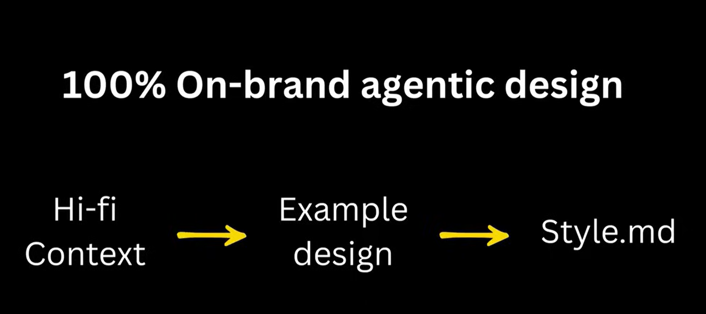
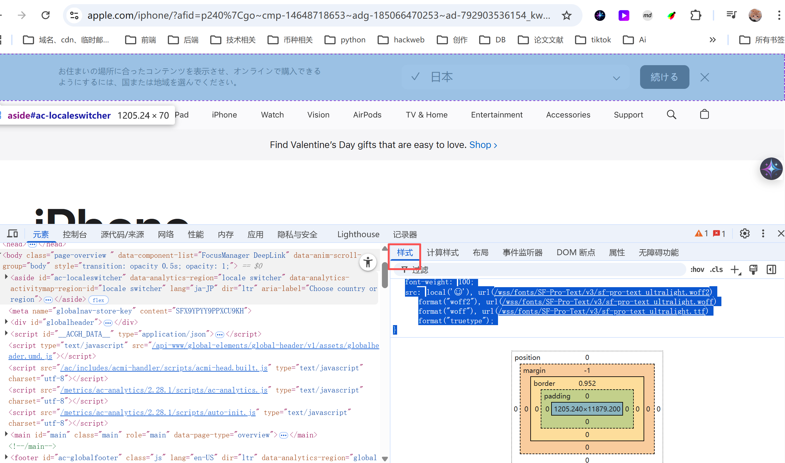
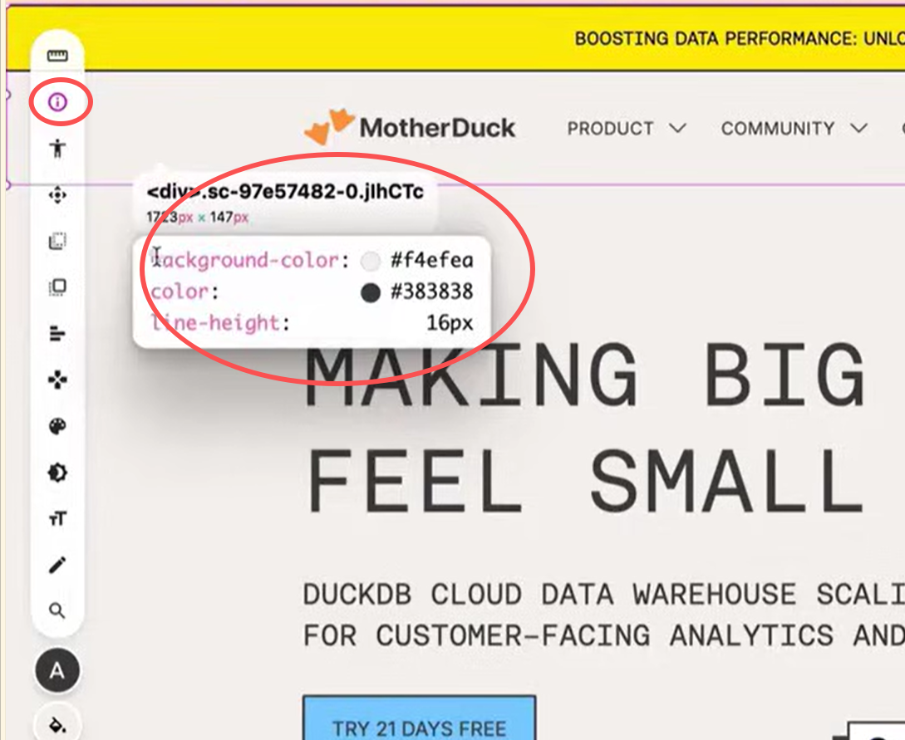

# UI design




### 1.从网站收集真实的 css 样式给智能体。F12


```json
element.style {
}
<style>
@media (min-width: 1302px) {
    .hUkyVM {
        padding-top: 110px;
    }
}
<style>
@media (min-width: 960px) {
    .hUkyVM {
        padding-top: 80px;
        padding-bottom: 180px;
    }
}
<style>
@media (min-width: 728px) {
    .hUkyVM {
        padding-top: 64px;
        padding-bottom: 140px;
    }
}
<style>
.hUkyVM {
    padding-top: 40px;
    padding-bottom: 160px;
    overflow: visible;
}
<style>
@media (min-width: 1302px) {
    .kHNfYW {
        max-width: 1302px;
        padding: 0px 30px;
    }
}
<style>
@media (min-width: 960px) {
    .kHNfYW {
        max-width: 960px;
        padding: 0px 60px;
    }
}
<style>
@media (min-width: 728px) {
    .kHNfYW {
        max-width: 728px;
        padding: 0px 20px;
    }
}
<style>
.kHNfYW {
    position: relative;
    margin: 0px auto;
    padding: 0px 24px;
    width: 100%;
}
<style>
html, body, div, span, applet, object, iframe, h1, h2, h3, h4, h5, h6, p, blockquote, pre, a, abbr, acronym, address, big, cite, code, del, dfn, em, img, ins, kbd, q, s, samp, small, strike, strong, sub, sup, tt, var, b, u, i, center, dl, dt, dd, ol, ul, li, fieldset, form, label, legend, table, caption, tbody, tfoot, thead, tr, th, td, article, aside, canvas, details, embed, figure, figcaption, footer, header, hgroup, menu, nav, output, ruby, section, summary, time, mark, audio, textarea, video, button, input {
    box-sizing: border-box;
    margin: 0px;
    padding: 0px;
    border: 0px;
    font-size: 100%;
    font-family: "Aeonik Mono", sans-serif;
    vertical-align: baseline;
    text-decoration: none;
}
用户代理样式表
div {
    display: block;
    unicode-bidi: isolate;
}
<style>
body {
    line-height: 1;
    background-color: rgb(244, 239, 234);
    color: rgb(56, 56, 56);
    min-height: 100vh;
}
:root {
    --swiper-theme-color: #007aff;
}
<style>
:root {
    --header-mobile: 70px;
    --header-desktop: 90px;
    --eyebrow-mobile: 70px;
    --eyebrow-desktop: 55px;
}
<style>
:root {
    --toastify-toast-min-height: fit-content;
    --toastify-toast-width: fit-content;
}
:root {
    --toastify-color-light: #fff;
    --toastify-color-dark: #121212;
    --toastify-color-info: #3498db;
    --toastify-color-success: #07bc0c;
    --toastify-color-warning: #f1c40f;
    --toastify-color-error: #e74c3c;
    --toastify-color-transparent: hsla(0, 0%, 100%, .7);
    --toastify-icon-color-info: var(--toastify-color-info);
    --toastify-icon-color-success: var(--toastify-color-success);
    --toastify-icon-color-warning: var(--toastify-color-warning);
    --toastify-icon-color-error: var(--toastify-color-error);
    --toastify-toast-width: 320px;
    --toastify-toast-background: #fff;
    --toastify-toast-min-height: 64px;
    --toastify-toast-max-height: 800px;
    --toastify-font-family: sans-serif;
    --toastify-z-index: 9999;
    --toastify-text-color-light: #757575;
    --toastify-text-color-dark: #fff;
    --toastify-text-color-info: #fff;
    --toastify-text-color-success: #fff;
    --toastify-text-color-warning: #fff;
    --toastify-text-color-error: #fff;
    --toastify-spinner-color: #616161;
    --toastify-spinner-color-empty-area: #e0e0e0;
    --toastify-color-progress-light: linear-gradient(90deg, #4cd964, #5ac8fa, #007aff, #34aadc, #5856d6, #ff2d55);
    --toastify-color-progress-dark: #bb86fc;
    --toastify-color-progress-info: var(--toastify-color-info);
    --toastify-color-progress-success: var(--toastify-color-success);
    --toastify-color-progress-warning: var(--toastify-color-warning);
    --toastify-color-progress-error: var(--toastify-color-error);
}
:root {
    --toastify-color-light: #fff;
    --toastify-color-dark: #121212;
    --toastify-color-info: #3498db;
    --toastify-color-success: #07bc0c;
    --toastify-color-warning: #f1c40f;
    --toastify-color-error: #e74c3c;
    --toastify-color-transparent: hsla(0, 0%, 100%, .7);
    --toastify-icon-color-info: var(--toastify-color-info);
    --toastify-icon-color-success: var(--toastify-color-success);
    --toastify-icon-color-warning: var(--toastify-color-warning);
    --toastify-icon-color-error: var(--toastify-color-error);
    --toastify-toast-width: 320px;
    --toastify-toast-background: #fff;
    --toastify-toast-min-height: 64px;
    --toastify-toast-max-height: 800px;
    --toastify-font-family: sans-serif;
    --toastify-z-index: 9999;
    --toastify-text-color-light: #757575;
    --toastify-text-color-dark: #fff;
    --toastify-text-color-info: #fff;
    --toastify-text-color-success: #fff;
    --toastify-text-color-warning: #fff;
    --toastify-text-color-error: #fff;
    --toastify-spinner-color: #616161;
    --toastify-spinner-color-empty-area: #e0e0e0;
    --toastify-color-progress-light: linear-gradient(90deg, #4cd964, #5ac8fa, #007aff, #34aadc, #5856d6, #ff2d55);
    --toastify-color-progress-dark: #bb86fc;
    --toastify-color-progress-info: var(--toastify-color-info);
    --toastify-color-progress-success: var(--toastify-color-success);
    --toastify-color-progress-warning: var(--toastify-color-warning);
    --toastify-color-progress-error: var(--toastify-color-error);
}
<style>
::-webkit-scrollbar {
    width: 5px;
    height: 5px;
}
<style>
::-webkit-scrollbar-thumb {
    background: rgb(136, 136, 136);
}
<style>
::-webkit-scrollbar-track {
    background: rgb(241, 241, 241);
}
<style>
@font-face {
    font-family: Aeonik Mono;
    src: url(/fonts/AeonikMono/AeonikMono-Regular.woff2) format("woff2"), url(/fonts/AeonikMono/AeonikMono-Regular.woff) format("woff");
    font-style: normal;
    font-weight: 400;
    font-display: swap;
}
```



```json
Help me rebuildexact same UI design in single html &s motherduck.html,above is extracted css;
```

### 2.生成详细的风格指南
```yaml
Great, now help me generate a detailed style guide\
In style guide, you must include the following part：
-Overview
-Color Palette
-Typography (Pay attention to font weight,front size and how different fonts have been used together in the project)
-Spacing System
-Component Styles-Shadows & Elevation
-Animations & Transitions
-Border Radius
-Opacity & Transparency
-Common Tailwind CSS Usage in Project
-Example component reference design code
-And so on..
In a word, Give detailed analysis and descriptions to the project style system, and don't
miss any important details.
```


```markdown
only code in HTML/Tailwind in a single code block.
Any CSS styles should be in the style attribute. Start with a response,then code andfinish with a response.Don't mention about tokens, Tailwind or HTML.
Always include the html, head and body tags
Use lucide icons for javascript, 1.5 strokewidth.
Unless style is specified by user, design in the style of Linear, Stripe, Vercel, TailwindUI (IMPORTANT: don't mention names)
Checkboxes, sliders, dropdowns, toggles should be custom (don't add, only include if partof the UI). Be extremely accurate with fonts.For font weight, use one level thinner: for example, Bold should be Semibold.Titles above 20px should use tracking-tight.
Make it responsive.
Avoid setting tailwind config or css classes, use tailwind directly in html tags.If there are charts, use chart.js for charts (avoid bug: if your canvas is on thesamelevel as other hodes: h2 p canvas div = infinite grows. h2 p div>canvas div = asintended.).
Add subtle dividers and outlines where appropriate.
Don't put tailwind classes in the html tag.put them in the body tags.
If no images are specified, use these Unsplash images like faces, 3d, render, etc.
Be creative with fonts, layouts, be extremely detailed and make it functional.
If design, code or html is provided, IMPORTANT: respect the original design, fonts,colors, style as much as possible.
Don't use javascript for animations, use tailwind instead. Add hover color and outlineinteractions.
For tech, cool, futuristic, favor dark mode unless specified otherwise.
For modern, traditional, professional, business, favor light mode unless specifiedotherwise.
Use 1.5 strokewidth for lucide icons and avoid gradient containers for icons.
Use subtle contrast.
For logos, use letters only with tight tracking.
Avoid a bottom right floating DOwNLOAD button.
```

```markdown
use ui-design 帮我用这种风格C:\Users\lixin\Desktop\app\ui\STYLE_GUIDE.md写一个新的newtodo.html
```

```markdown
curl: (56) Recv failure: Connection was aborted
✗ Failed to install context: core/context-system/standards/structure
curl: (56) Recv failure: Connection was aborted
✗ Failed to install context: core/context-system
✓ Installed context: core/context-system/standards/templates
✓ Installed context: core/context-system/standards/frontmatter
✓ Installed context: core/context-system/standards/codebase-references
✓ Installed context: core/workflows/feature-breakdown
curl: (28) Failed to connect to raw.githubusercontent.com port 443 after 21668 ms: Could not connect to server
✗ Failed to install context: core/workflows/session-management
✓ Installed context: core/workflows/component-planning
curl: (28) Failed to connect to raw.githubusercontent.com port 443 after 21675 ms: Could not connect to server
✗ Failed to install context: core/context-system/CHANGELOG
curl: (56) Recv failure: Connection was aborted
✗ Failed to install context: core/context-system/guides/navigation-design
curl: (56) Recv failure: Connection was aborted
✗ Failed to install context: core/context-system/guides/organizing-context
✓ Installed context: core/context-system/examples/navigation-examples
✓ Installed context: core/task-management/lookup/task-commands
curl: (56) Recv failure: Connection was aborted
✗ Failed to install context: core/task-management/guides/splitting-tasks
curl: (56) Recv failure: Connection was aborted
✗ Failed to install context: core/task-management/guides/managing-tasks
✓ Installed context: core/task-management/standards/task-schema
curl: (56) Recv failure: Connection was aborted
✗ Failed to install context: core/standards/project-intelligence
✓ Installed context: core/standards/project-intelligence-management
✓ Installed context: core/workflows/delegation
curl: (28) Failed to connect to raw.githubusercontent.com port 443 after 21661 ms: Could not connect to server
✗ Failed to install context: core/workflows/review
```


> 更新: 2026-02-05 08:31:52  
> 原文: <https://www.yuque.com/lixinsi/yh04az/dyd0pap2xwdh98wu>