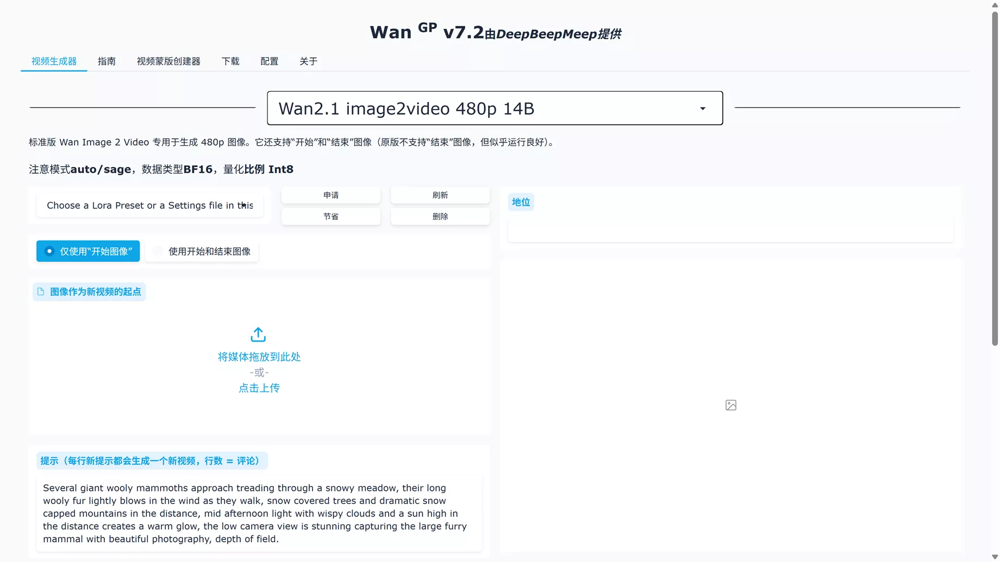
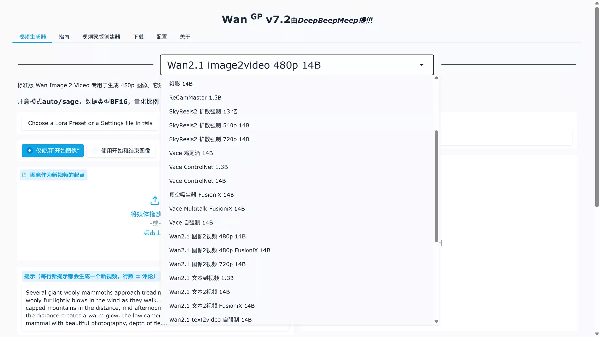

# Wan2GP AI视频生成神器安装教程！ DeepBeepMeep 可视化UI界面，易操作！

## 要求环境
+ Python 3.10.9 【[点击下载](https://www.python.org/downloads/release/python-3109/)】
+ Git 【[点击下载](https://git-scm.com/downloads)】
+ Conda 【[点击下载](https://repo.anaconda.com/miniconda/Miniconda3-py311_24.5.0-0-Windows-x86_64.exe)】

## RTX 10XX 至 RTX 40XX（稳定版）的安装
安装包下载：【[点击前往](https://speed.ozabc.com/view.php?id=03467c1e)】

### 步骤1：下载并设置环境
```plain
git clone https://github.com/deepbeepmeep/Wan2GP.git
cd Wan2GP
conda create -n wan2gp python=3.10.9
conda activate wan2gp
```

### 步骤2：安装PyTorch
```plain
pip install torch==2.6.0 torchvision torchaudio --index-url https://download.pytorch.org/whl/test/cu124
```

### 步骤3：安装依赖项
```plain
pip install -r requirements.txt
```

### 步骤 4：可选的性能优化（自由选择）
#### 贤者注意力（速度提高 30%）
```plain
pip install triton-windows
```

#### Sage 2 Attention（速度提高 40%）
```plain
pip install triton-windows 
pip install https://github.com/woct0rdho/SageAttention/releases/download/v2.1.1-windows/sageattention-2.1.1+cu126torch2.6.0-cp310-cp310-win_amd64.whl
```

**运行使用方法：**

```plain
python wgp.py  # 文字转视频 (default)
python wgp.py --i2v  # 图片转视频
```

运行后在CMD下可以看到UI界面的地址：[http://localhost:7860](http://localhost:7860/)



**里面有大量可选的开源视频模型可供你选择使用,都是完全免费的，支持多种分辨率**



**下次启动的话，只需执行下方的命令即可开启：**

```plain
cd Wan2GP
python wgp.py --i2v
```


**如果你是50系列 **[显卡](https://www.freedidi.com/20311.html#)**，则使用这个部署命令:**

```plain
git clone https://github.com/deepbeepmeep/Wan2GP.git
cd Wan2GP
conda create -n wan2gp python=3.10.9
conda activate wan2gp
pip install torch==2.7.0 torchvision torchaudio --index-url https://download.pytorch.org/whl/test/cu124
pip install -r requirements.txt
```

部署成功后同样执行运行命令：

```plain
python wgp.py  # Text-to-video (default)
python wgp.py --i2v  # Image-to-video
```


> 更新: 2026-02-24 17:29:46  
> 原文: <https://www.yuque.com/lixinsi/yh04az/uvzdaws4peb7us0i>