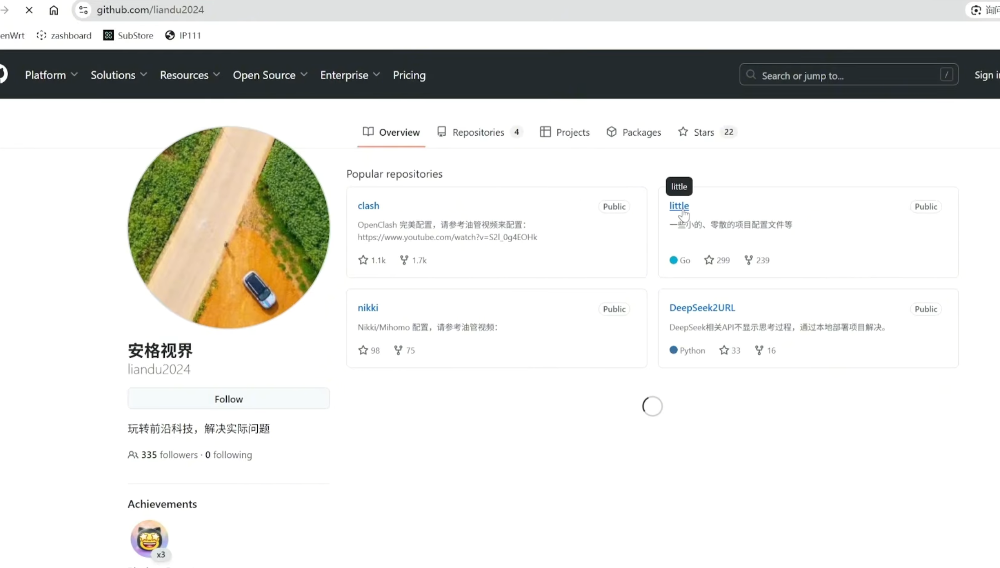
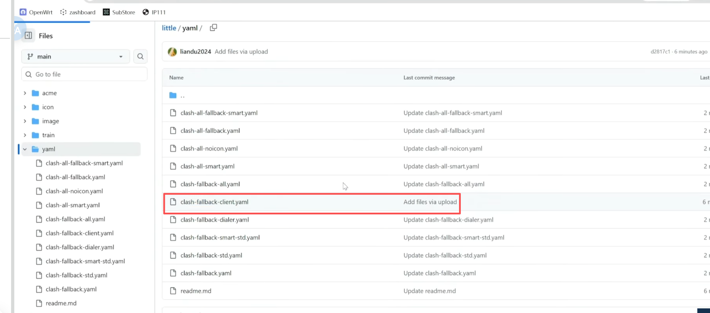
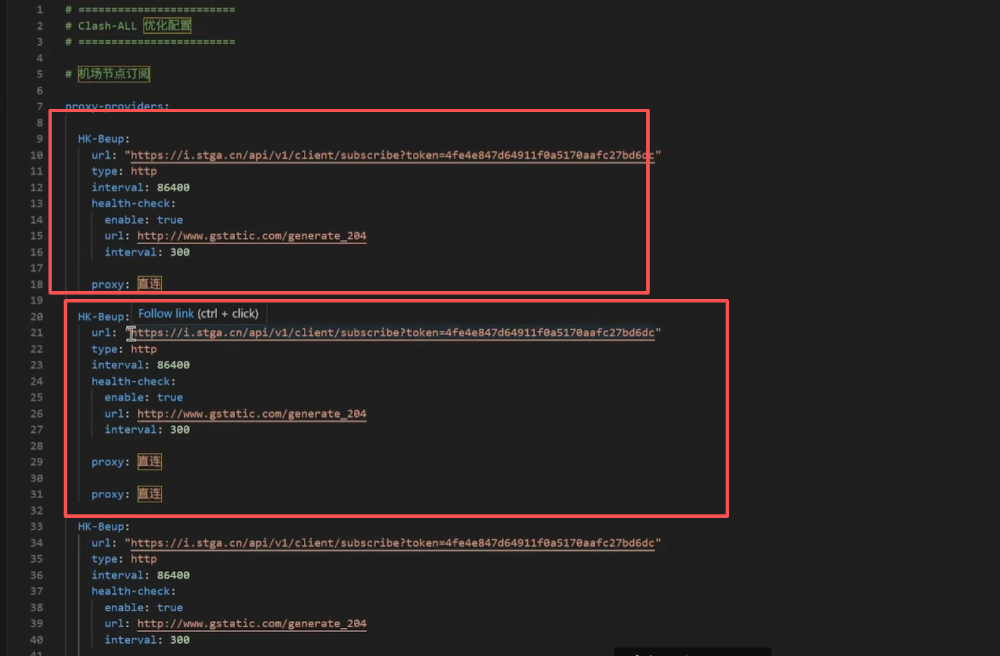
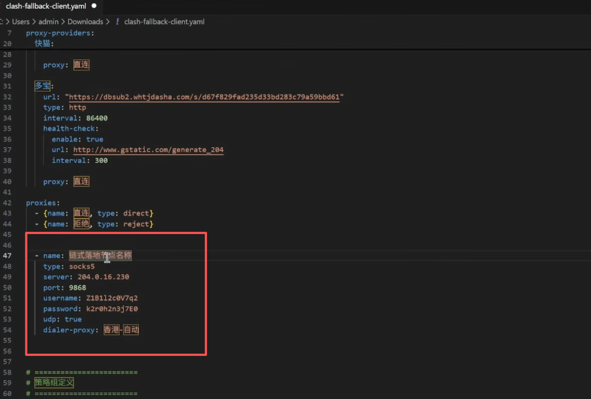
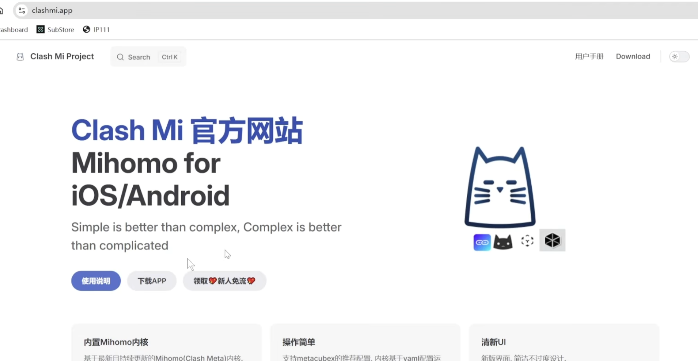
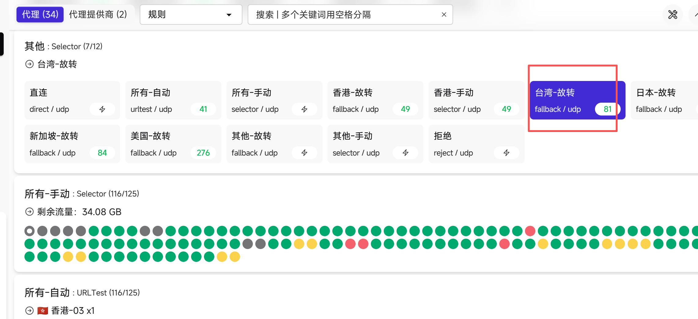

# vpn最完美的客户端纯净ip方案

### 1.下载 yaml 文件
[https://github.com/liandu2024/little/tree/main/yaml](https://github.com/liandu2024/little/tree/main/yaml)







### 2.复制连接编辑 yaml 文件



### 3 .链式住宅 ip 配置



### 4.下载 clashmi.app
访问地址：https://clashmi.app




### 5 导入 yaml 文件
```yaml
# ========================
# Clash-ALL 优化配置
# ========================

# 机场节点订阅

proxy-providers:

  凌云加速:
    url: "http://vayrqkhwvqkr.naobaiazzaw.xyz/TwvAuEiqFZgcW/b15239ac7d4148764ad18be3eae3938d"  
    type: http
    interval: 86400
    health-check:
      enable: true
      url: http://www.gstatic.com/generate_204
      interval: 300

    proxy: 直连

    
  飞兔云:
    url: "https://ft-togktjcy.tutunode.com/gateway/feitu?token=873cd231a0c5d30b0792686eee566dc2"  
    type: http
    interval: 86400
    health-check:
      enable: true
      url: http://www.gstatic.com/generate_204
      interval: 300

    proxy: 直连

    

proxies:
  - {name: 直连, type: direct}
  - {name: 拒绝, type: reject}


# 以下为 链式代理 socks5 节点，如果要启用，请将前面的 # 去掉

#  - name: 链式落地节点名称
#    type: socks5
#    server: 
#    port: 
#    username: 
#    password: 
#    udp: true
#    dialer-proxy: 香港-自动

# ========================
# 策略组定义
# ========================
default: &default
  type: select
  proxies:
    - 直连
    - 所有-自动
    - 所有-手动
#    - 香港-自动
    - 香港-故转
    - 香港-手动

    - 台湾-故转
#    - 台湾-手动
    - 日本-故转
#    - 日本-手动
    - 新加坡-故转
#    - 新加坡-手动
    - 美国-故转
#    - 美国-手动
    - 其他-故转
    - 其他-手动
    - 拒绝

proxy-groups:

  # 业务分流组
  - {name: AI, <<: *default}
  - {name: Stream Media, <<: *default}
  - {name: Google, <<: *default}  
  - {name: Microsoft, <<: *default}
  - {name: Apple, <<: *default}
#  - {name: Reddit, <<: *default}  
  - {name: Nvidia, <<: *default}
  - {name: Adobe, <<: *default}  
  - {name: Games, <<: *default}
  - {name: Crypto, <<: *default}
  - {name: Sex, <<: *default}
  - {name: Test, <<: *default}
  - {name: 国外, <<: *default}
  - {name: 国内, <<: *default}
  - {name: 其他, <<: *default}  

  - name: 所有-手动
    type: select
    include-all: true
    filter: "^((?!(直连|拒绝)).)*$"

  - name: 所有-自动
    type: url-test
    include-all: true
    tolerance: 50
    interval: 180
    filter: "^((?!(直连|拒绝)).)*$"

  # 香港组
  - name: 香港-故转
    type: fallback
    interval: 180
    lazy: false
    proxies:
      - 香港-手动
      - 香港-自动
  
  - name: 香港-手动
    type: select
    include-all: true
    filter: "(?=.*(广港|香港|HK|Hong Kong|🇭🇰|HongKong)).*$"
    
  - name: 香港-自动
    type: url-test
    include-all: true
    tolerance: 50
    interval: 180
    filter: "(?=.*(广港|香港|HK|Hong Kong|🇭🇰|HongKong)).*$"
 
  # 台湾组
  - name: 台湾-故转
    type: fallback
    interval: 180
    lazy: false
    proxies:
      - 台湾-手动
      - 台湾-自动
  - name: 台湾-手动
    type: select
    include-all: true
    filter: "(?=.*(广台|台湾|台灣|TW|Tai Wan|🇹🇼|🇨🇳|TaiWan|Taiwan)).*$"
  - name: 台湾-自动
    type: url-test
    include-all: true
    tolerance: 50
    interval: 180
    filter: "(?=.*(广台|台湾|台灣|TW|Tai Wan|🇹🇼|🇨🇳|TaiWan|Taiwan)).*$"

  # 日本组
  - name: 日本-故转
    type: fallback
    interval: 180
    lazy: false
    proxies:
      - 日本-手动
      - 日本-自动
  - name: 日本-手动
    type: select
    include-all: true
    filter: "(?=.*(广日|日本|JP|川日|东京|大阪|泉日|埼玉|沪日|深日|🇯🇵|Japan)).*$"
  - name: 日本-自动
    type: url-test
    include-all: true
    tolerance: 50
    interval: 180
    filter: "(?=.*(广日|日本|JP|川日|东京|大阪|泉日|埼玉|沪日|深日|🇯🇵|Japan)).*$"

  # 新加坡组
  - name: 新加坡-故转
    type: fallback
    interval: 180
    lazy: false
    proxies:
      - 新加坡-手动
      - 新加坡-自动
  - name: 新加坡-手动
    type: select
    include-all: true
    filter: "(?=.*(广新|新加坡|SG|坡|狮城|🇸🇬|Singapore)).*$"
  - name: 新加坡-自动
    type: url-test
    include-all: true
    tolerance: 50
    interval: 180
    filter: "(?=.*(广新|新加坡|SG|坡|狮城|🇸🇬|Singapore)).*$"

  # 美国组
  - name: 美国-故转
    type: fallback
    interval: 180
    lazy: false
    proxies:
      - 美国-手动
      - 美国-自动
  - name: 美国-手动
    type: select
    include-all: true
    filter: "(?=.*(广美|US|美国|纽约|波特兰|达拉斯|俄勒|凤凰城|费利蒙|洛杉|圣何塞|圣克拉|西雅|芝加|🇺🇸|United States)).*$"
  - name: 美国-自动
    type: url-test
    include-all: true
    tolerance: 50
    interval: 180
    filter: "(?=.*(广美|US|美国|纽约|波特兰|达拉斯|俄勒|凤凰城|费利蒙|洛杉|圣何塞|圣克拉|西雅|芝加|🇺🇸|United States)).*$"

  # 其他组
  - name: 其他-故转
    type: fallback
    interval: 180
    lazy: false
    proxies:
      - 其他-手动
      - 其他-自动
  - name: 其他-手动
    type: select
    include-all: true
    filter: "^((?!(直连|拒绝|广港|香港|HK|Hong Kong|🇭🇰|HongKong|广台|台湾|台灣|TW|Tai Wan|🇹🇼|🇨🇳|TaiWan|Taiwan|广日|日本|JP|川日|东京|大阪|泉日|埼玉|沪日|深日|🇯🇵|Japan|广新|新加坡|SG|坡|狮城|🇸🇬|Singapore|广美|US|美国|纽约|波特兰|达拉斯|俄勒|凤凰城|费利蒙|洛杉|圣何塞|圣克拉|西雅|芝加|🇺🇸|United States)).)*$"
  
  - name: 其他-自动
    type: url-test
    include-all: true
    tolerance: 50
    interval: 180
    filter: "^((?!(直连|拒绝|广港|香港|HK|Hong Kong|🇭🇰|HongKong|广台|台湾|台灣|TW|Tai Wan|🇹🇼|🇨🇳|TaiWan|Taiwan|广日|日本|JP|川日|东京|大阪|泉日|埼玉|沪日|深日|🇯🇵|Japan|广新|新加坡|SG|坡|狮城|🇸🇬|Singapore|广美|US|美国|纽约|波特兰|达拉斯|俄勒|凤凰城|费利蒙|洛杉|圣何塞|圣克拉|西雅|芝加|🇺🇸|United States)).)*$"

# ========================
# 规则引擎（rules）
# ========================
rules:
  - RULE-SET,ChatGPT / Domain,AI
  - RULE-SET,Sex / Domain,Sex
  - RULE-SET,Test / Domain,Test
#  - RULE-SET,GitHub / Domain,国外 
  - RULE-SET,Claude / Domain,AI
#  - RULE-SET,Copilot / Domain,AI
#  - RULE-SET,Gemini / Domain,AI
  - RULE-SET,Groq / Domain,AI
  - RULE-SET,Grok / Domain,AI
  - RULE-SET,Meta AI / Domain,AI
  - RULE-SET,Perplexity / Domain,AI

  - RULE-SET,Google / Domain,Google
  - RULE-SET,Google / IP,Google

  - RULE-SET,Microsoft / Domain,Microsoft
  - RULE-SET,Apple / Domain,Apple
  - RULE-SET,Apple-CN / Domain,Apple  
  - RULE-SET,Apple-Custome / Domain,Apple  
  - RULE-SET,OKX / Domain,Crypto
  - RULE-SET,Bybit / Domain,Crypto
  - RULE-SET,Binance / Domain,Crypto
  - RULE-SET,TikTok / Domain,Stream Media
  - RULE-SET,Netflix / Domain,Stream Media
  - RULE-SET,Netflix / IP,Stream Media,no-resolve
  - RULE-SET,Disney / Domain,Stream Media
  - RULE-SET,Amazon / Domain,Stream Media
  - RULE-SET,HBO / Domain,Stream Media
  - RULE-SET,Crunchyroll / Domain,Stream Media
  - RULE-SET,Popcorn / Domain,Stream Media  
  - RULE-SET,Spotify / Domain,Stream Media
  - RULE-SET,Steam / Domain,Games
  - RULE-SET,Epic / Domain,Games
  - RULE-SET,EA / Domain,Games
  - RULE-SET,Blizzard / Domain,Games
  - RULE-SET,UBI / Domain,Games
  - RULE-SET,PlayStation / Domain,Games
  - RULE-SET,Nintend / Domain,Games
  - RULE-SET,Nvidia / Domain,Nvidia
#  - RULE-SET,Reddit / Domain,Reddit 
  - RULE-SET,Adobe / Domain,Adobe 
  - RULE-SET,AdobeActivation / Domain,Adobe
  - RULE-SET,Proxy / Domain,国外
  - RULE-SET,Globe / Domain,国外  
  - RULE-SET,Direct / Domain,国内
  - RULE-SET,China / Domain,国内
  - RULE-SET,China / IP,国内,no-resolve
  - RULE-SET,Private / Domain,国内
  - MATCH,其他

# ========================
# 规则集提供者
# ========================
rule-anchor:
  ip: &ip {type: http, interval: 86400, behavior: ipcidr, format: mrs}
  domain: &domain {type: http, interval: 86400, behavior: domain, format: mrs}
  class: &class {type: http, interval: 86400, behavior: classical, format: text}

rule-providers:
  Test / Domain: {<<: *class, url: "https://gh-proxy.com/raw.githubusercontent.com/liandu2024/clash/refs/heads/main/list/Check.list"}
  ChatGPT / Domain: {<<: *domain, url: "https://gh-proxy.com/github.com/metacubex/meta-rules-dat/raw/refs/heads/meta/geo/geosite/openai.mrs"}
  Claude / Domain: {<<: *class, url: "https://gh-proxy.com/raw.githubusercontent.com/blackmatrix7/ios_rule_script/refs/heads/master/rule/Clash/Claude/Claude.list"}
  Meta AI / Domain: {<<: *class, url: "https://gh-proxy.com/raw.githubusercontent.com/liandu2024/clash/refs/heads/main/list/MetaAi.list"}
  Perplexity / Domain: {<<: *domain, url: "https://gh-proxy.com/github.com/metacubex/meta-rules-dat/raw/refs/heads/meta/geo/geosite/perplexity.mrs"}
  Copilot / Domain: {<<: *class, url: "https://gh-proxy.com/raw.githubusercontent.com/liandu2024/clash/refs/heads/main/list/Copilot.list"}
  Gemini / Domain: {<<: *class, url: "https://gh-proxy.com/raw.githubusercontent.com/liandu2024/clash/refs/heads/main/list/Gemini.list"}
  GitHub / Domain: {<<: *domain, url: "https://gh-proxy.com/github.com/metacubex/meta-rules-dat/raw/refs/heads/meta/geo/geosite/github.mrs"}
  Amazon / Domain: {<<: *domain, url: "https://gh-proxy.com/github.com/metacubex/meta-rules-dat/raw/refs/heads/meta/geo/geosite/amazon.mrs"}
  Apple-CN / Domain: {<<: *domain, url: "https://gh-proxy.com/github.com/metacubex/meta-rules-dat/raw/refs/heads/meta/geo/geosite/apple-cn.mrs"}
  Apple / Domain: {<<: *domain, url: "https://gh-proxy.com/github.com/metacubex/meta-rules-dat/raw/refs/heads/meta/geo/geosite/apple.mrs"} 
  Apple-Custome / Domain: {<<: *class, url: "https://gh-proxy.com/raw.githubusercontent.com/liandu2024/clash/refs/heads/main/list/Apple.list"}
  Microsoft / Domain: {<<: *domain, url: "https://gh-proxy.com/github.com/metacubex/meta-rules-dat/raw/refs/heads/meta/geo/geosite/microsoft.mrs"}
  OKX / Domain: {<<: *domain, url: "https://gh-proxy.com/github.com/metacubex/meta-rules-dat/raw/refs/heads/meta/geo/geosite/okx.mrs"}
  Bybit / Domain: {<<: *domain, url: "https://gh-proxy.com/github.com/metacubex/meta-rules-dat/raw/refs/heads/meta/geo/geosite/bybit.mrs"}
  Binance / Domain: {<<: *domain, url: "https://gh-proxy.com/github.com/metacubex/meta-rules-dat/raw/refs/heads/meta/geo/geosite/binance.mrs"}
  TikTok / Domain: {<<: *domain, url: "https://gh-proxy.com/github.com/metacubex/meta-rules-dat/raw/refs/heads/meta/geo/geosite/tiktok.mrs"}
  Netflix / Domain: {<<: *domain, url: "https://gh-proxy.com/github.com/metacubex/meta-rules-dat/raw/refs/heads/meta/geo/geosite/netflix.mrs"}
  Netflix / IP: {<<: *ip, url: "https://gh-proxy.com/github.com/metacubex/meta-rules-dat/raw/refs/heads/meta/geo/geoip/netflix.mrs"}
  Disney / Domain: {<<: *domain, url: "https://gh-proxy.com/github.com/metacubex/meta-rules-dat/raw/refs/heads/meta/geo/geosite/disney.mrs"}
  HBO / Domain: {<<: *domain, url: "https://gh-proxy.com/github.com/metacubex/meta-rules-dat/raw/refs/heads/meta/geo/geosite/hbo.mrs"}
  Spotify / Domain: {<<: *domain, url: "https://gh-proxy.com/github.com/metacubex/meta-rules-dat/raw/refs/heads/meta/geo/geosite/spotify.mrs"}
  Steam / Domain: {<<: *domain, url: "https://gh-proxy.com/github.com/metacubex/meta-rules-dat/raw/refs/heads/meta/geo/geosite/steam.mrs"}
  Epic / Domain: {<<: *class, url: "https://gh-proxy.com/raw.githubusercontent.com/blackmatrix7/ios_rule_script/master/rule/Clash/Epic/Epic.list"}
  EA / Domain: {<<: *class, url: "https://gh-proxy.com/raw.githubusercontent.com/blackmatrix7/ios_rule_script/master/rule/Clash/EA/EA.list"}
  Blizzard / Domain: {<<: *class, url: "https://gh-proxy.com/raw.githubusercontent.com/blackmatrix7/ios_rule_script/master/rule/Clash/Blizzard/Blizzard.list"}
  UBI / Domain: {<<: *class, url: "https://gh-proxy.com/raw.githubusercontent.com/blackmatrix7/ios_rule_script/master/rule/Clash/UBI/UBI.list"}
  PlayStation / Domain: {<<: *class, url: "https://gh-proxy.com/raw.githubusercontent.com/blackmatrix7/ios_rule_script/refs/heads/master/rule/Clash/PlayStation/PlayStation.list"}
  Nintend / Domain: {<<: *class, url: "https://gh-proxy.com/raw.githubusercontent.com/blackmatrix7/ios_rule_script/master/rule/Clash/Nintendo/Nintendo.list"}
  Proxy / Domain: {<<: *class, url: "https://gh-proxy.com/raw.githubusercontent.com/liandu2024/clash/refs/heads/main/list/Proxy.list"}
  Globe / Domain: {<<: *class, url: "https://gh-proxy.com/raw.githubusercontent.com/blackmatrix7/ios_rule_script/refs/heads/master/rule/Clash/Global/Global.list"} 
  Block / Domain: {<<: *class, url: "https://gh-proxy.com/raw.githubusercontent.com/liandu2024/clash/refs/heads/main/list/Block.list"}
  Nvidia / Domain: {<<: *class, url: "https://gh-proxy.com/raw.githubusercontent.com/blackmatrix7/ios_rule_script/refs/heads/master/rule/Clash/Nvidia/Nvidia.list"}
  Crunchyroll / Domain: {<<: *class, url: "https://gh-proxy.com/raw.githubusercontent.com/liandu2024/clash/refs/heads/main/list/Crunchyroll.list"}
  Reddit / Domain: {<<: *domain, url: "https://gh-proxy.com/github.com/metacubex/meta-rules-dat/raw/refs/heads/meta/geo/geosite/reddit.mrs"}
  Groq / Domain: {<<: *domain, url: "https://gh-proxy.com/github.com/metacubex/meta-rules-dat/raw/refs/heads/meta/geo/geosite/groq.mrs"}
  Grok / Domain: {<<: *class, url: "https://gh-proxy.com/raw.githubusercontent.com/liandu2024/clash/refs/heads/main/list/Grok.list"}
  Popcorn / Domain: {<<: *class, url: "https://gh-proxy.com/raw.githubusercontent.com/liandu2024/clash/refs/heads/main/list/Popcorn.list"}

  Adobe / Domain: {<<: *class, url: "https://gh-proxy.com/raw.githubusercontent.com/blackmatrix7/ios_rule_script/refs/heads/master/rule/Clash/Adobe/Adobe.list"}
  AdobeActivation / Domain: {<<: *class, url: "https://gh-proxy.com/raw.githubusercontent.com/blackmatrix7/ios_rule_script/refs/heads/master/rule/Clash/AdobeActivation/AdobeActivation.list"}

  Google / Domain: {<<: *domain, url: "https://gh-proxy.com/github.com/metacubex/meta-rules-dat/raw/refs/heads/meta/geo/geosite/google.mrs"}  
  Google / IP: {<<: *ip, url: "https://gh-proxy.com/github.com/metacubex/meta-rules-dat/raw/refs/heads/meta/geo/geoip/google.mrs"}

  Sex / Domain: {<<: *class, url: "https://gh-proxy.com/raw.githubusercontent.com/liandu2024/clash/refs/heads/main/list/Sex.list"}
  Direct / Domain: {<<: *class, url: "https://gh-proxy.com/raw.githubusercontent.com/liandu2024/clash/refs/heads/main/list/Direct.list"}
  Private / Domain: {<<: *domain, url: "https://gh-proxy.com/github.com/metacubex/meta-rules-dat/raw/refs/heads/meta/geo/geosite/private.mrs"}
  China / Domain: {<<: *domain, url: "https://gh-proxy.com/github.com/metacubex/meta-rules-dat/raw/refs/heads/meta/geo/geosite/cn.mrs"}
  China / IP: {<<: *ip, url: "https://gh-proxy.com/github.com/metacubex/meta-rules-dat/raw/refs/heads/meta/geo/geoip/cn.mrs"}
#  Twitter / Domain: {<<: *domain, url: "https://gh-proxy.com/github.com/metacubex/meta-rules-dat/raw/refs/heads/meta/geo/geosite/x.mrs"}
#  WhatsApp / Domain: {<<: *class, url: "https://gh-proxy.com/raw.githubusercontent.com/blackmatrix7/ios_rule_script/refs/heads/master/rule/Clash/Whatsapp/Whatsapp.list"}
#  Facebook / Domain: {<<: *domain, url: "https://gh-proxy.com/github.com/metacubex/meta-rules-dat/raw/refs/heads/meta/geo/geosite/facebook.mrs"}
#  Telegram / Domain: {<<: *domain, url: "https://gh-proxy.com/github.com/metacubex/meta-rules-dat/raw/refs/heads/meta/geo/geosite/telegram.mrs"}  
#  Telegram / IP: {<<: *ip, url: "https://gh-proxy.com/github.com/metacubex/meta-rules-dat/raw/refs/heads/meta/geo/geoip/telegram.mrs"}
#  Youtube / Domain: {<<: *domain, url: "https://gh-proxy.com/github.com/metacubex/meta-rules-dat/raw/refs/heads/meta/geo/geosite/youtube.mrs"}  


#  GateFireWall / Domain: {<<: *domain, url: "https://gh-proxy.com/github.com/metacubex/meta-rules-dat/raw/refs/heads/meta/geo/geosite/gfw.mrs"}

```




> 更新: 2025-12-31 14:47:33  
> 原文: <https://www.yuque.com/lixinsi/yh04az/hx81utk8c52bys8r>