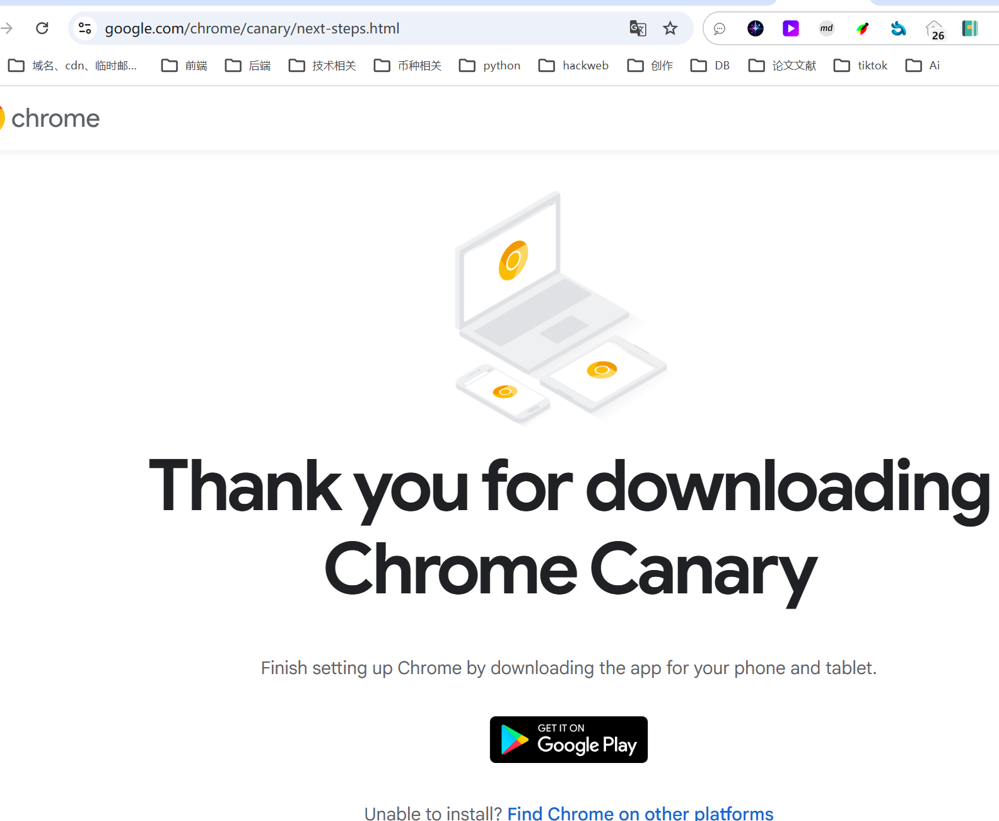
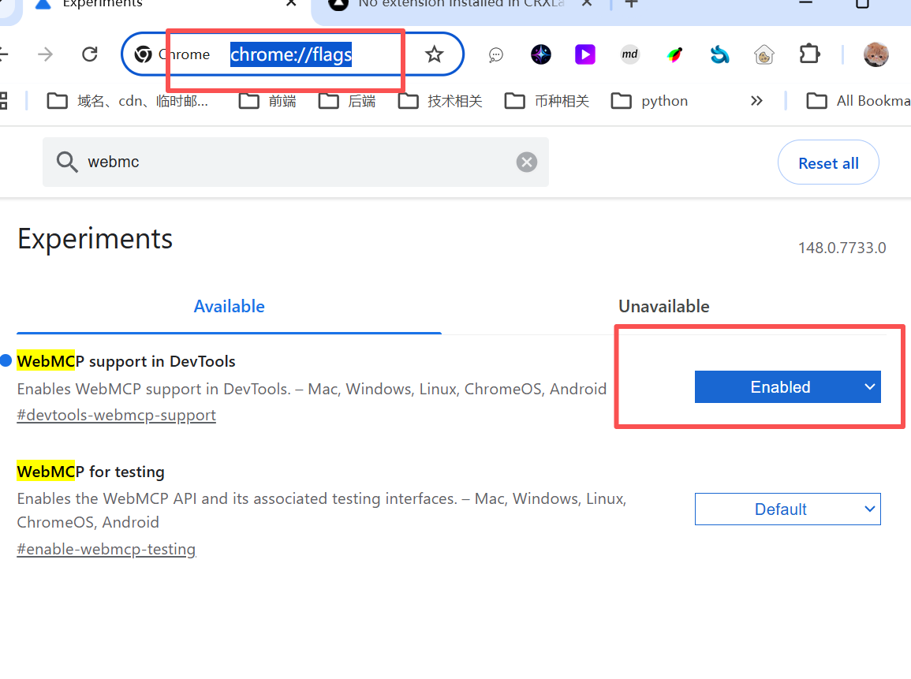
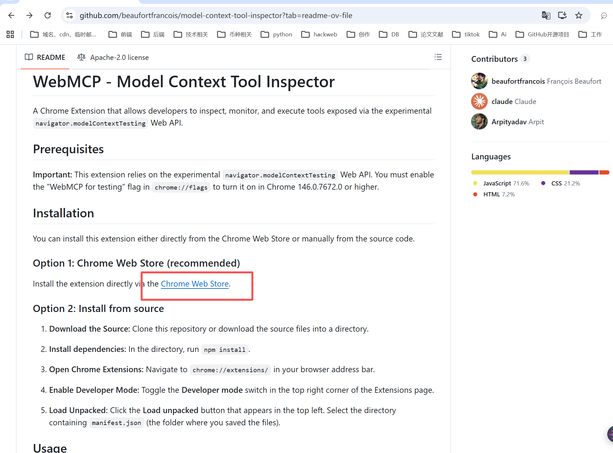

# webmcp使用

### 1.下载浏览器安装  
[https://www.google.com/chrome/cancry](https://www.google.com/chrome/cancry)


### 启动 webmcp
```sql
chrome://flags/
```



### 下载扩展
[https://github.com/beaufortfrancois/model-context-tool-inspector?tab=readme-ov-file](https://github.com/beaufortfrancois/model-context-tool-inspector?tab=readme-ov-file)




> 更新: 2026-03-18 20:31:43  
> 原文: <https://www.yuque.com/lixinsi/yh04az/cqzhh9ryc2zsbg6l>