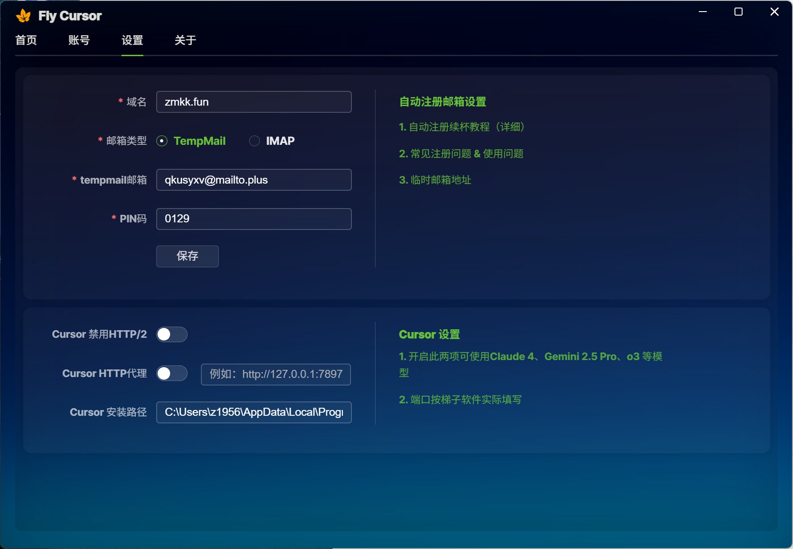
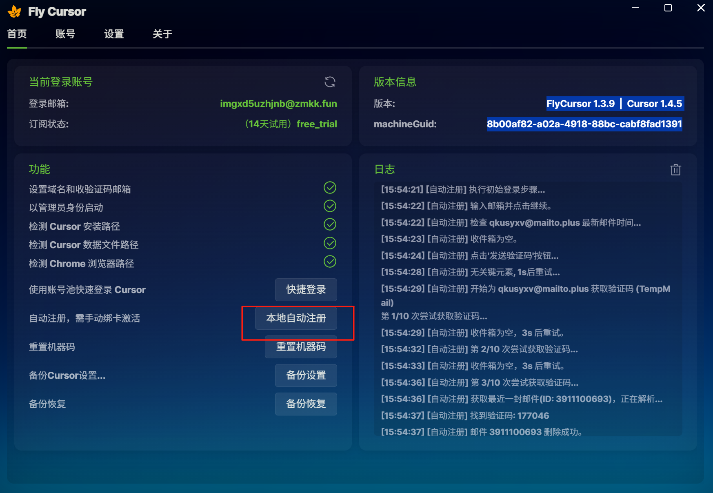
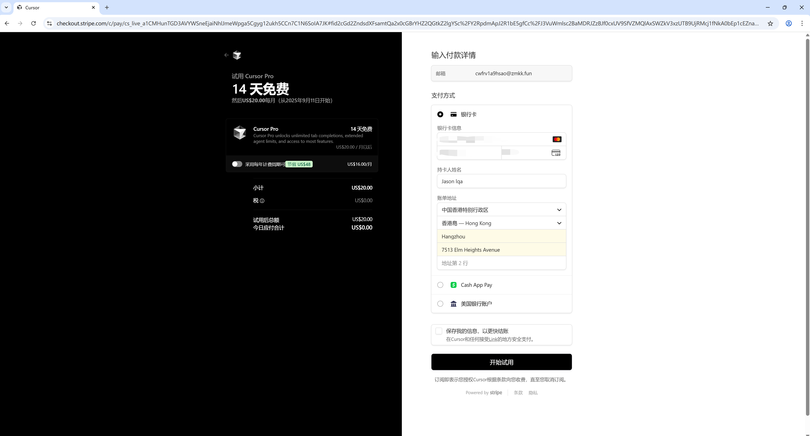
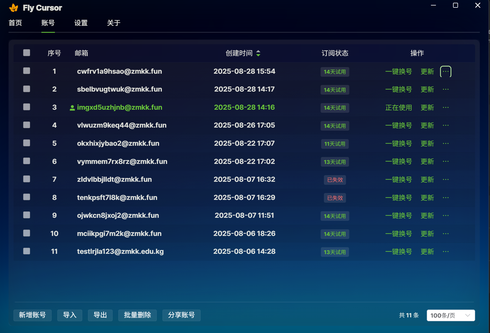

# 万里汇永久白嫖 Cursor Pro 专业版 - 无限次数量 Cursor 免费使用完整教程

## 📋 准备条件
### 必需工具
+ **万里汇虚拟卡**：注册教程视频 [点击查看](https://www.youtube.com/watch?v=BsF7Nb79boU&list=PLeC0e5aKPpX8ERd5W80B6RbSbWKx_oIvT&index=20)
+ **Flycursor**：下载地址 [GitHub Releases](https://github.com/liqiang-xxfy/fly-cursor-free/releases)
+ **Cursor**：官方下载
+ **临时邮箱**：Tempmail [访问地址](https://tempmail.plus/en/#!)

### 可选工具
+ 一个域名托管到 CF（可选，如果没有也可以使用博主视频中演示的）

## ⚠️ 特别说明
### 使用限制
+ 一个 cursor 账号：能调用 100 次模型，试用时间 14 天
+ 一个万里汇卡：能注册 5 个 cursor 账号
+ 万里汇免费卡：5 张卡 = 可注册 25 个 cursor 账号
+ 总调用次数：相当于可以调用 2500 次（配合 MCP 最少能达到 6000-7000 次，足够一个月使用）

### 相关教程
+ cursor MCP 多次使用教程：[cursor MCP 配置](#)

## 🔄 循环薅羊毛方法
**重点**：可以循环注销万里汇账号重复开卡，实现无限循环薅 cursor 账号

**万里汇账号注销地址**：[点击注销](https://iticketcenter.worldfirst.com.cn/iticketcenter/portal/wfportal/fillTicket?ticketTypeConfigUuid=90f28857-1d03-3397-810d-a337cc237fd1)

## 🚀 操作步骤
### Step 1: 安装软件
1. 下载并安装 Flycursor（选择对应系统版本）
2. 下载并安装 Cursor

### Step 2: 设置临时邮箱
1. 打开 Tempmail
2. 设置时效：7 天
3. 设置 pin 码：记住这个码

### Step 3: 配置 Flycursor
1. 打开 Flycursor，点击 **设置**
2. 域名配置（二选一）：
    - **有域名**：按照 [配置教程](#) 配置
    - **无域名**：使用博主域名（⚠️ 使用人多可能收不到邮件）
3. 填写 tempmail 邮箱和刚才设置的 pin 码
4. 点击 **保存**

### Step 4: 自动注册
1. 点击首页的 **本地自动注册**
2. 等待 1 分钟
3. 填写万里汇卡信息：

    - 卡号、安全码等
4. 地址姓名可以随意填写

### Step 5: 完成使用
✅ 至此基本上就可以正常使用 cursor 了

## 📊 使用量查看
### 查看账号使用量方法
点击账号里面的 **三个点** 即可查看当前账号的调用次数

> 更新: 2026-01-03 09:49:29  
> 原文: <https://www.yuque.com/lixinsi/yh04az/biv9zeczx6gp2g7e>