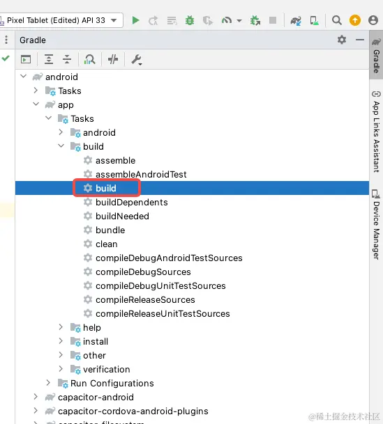

# 使用Capacitor将H5打包成安卓APK

#### 前言

有时候我们需要将我们的H5打包成离线包来使用：

1. 可以不需要网络环境，有极快的加载速度，比如一个展示型的页面可能有好几个G的体积；
2. 可以使用H5无法使用的功能，比如一些APP原生能力；
3. 不想让别人看到我们的H5，单纯封装给某些客户使用；
4. ......

**什么是Capacitor？**

1. Capacitor可以类比为Electron的移动端版本，A cross-platform native runtime for web apps
2. 官网：[capacitorjs.com/](https://link.juejin.cn?target=https%3A%2F%2Fcapacitorjs.com%2F)

**前置知识**

为什么Capacitor plugin，有时候需要安装2次，分别在web端安装，同时需要在Capacitor目录再次安装？

Capacitor 的插件设计遵循了一种双环境支持的原则，旨在让插件既能在Web环境中运行，也能在原生环境中无缝工作。这就解释了为什么有时候需要分别在两个地方安装或配置插件：

1. **Web端安装**：部分插件包含JavaScript代码，这些代码需要在Webview中运行，以提供Web应用的功能增强。例如，一个插件可能提供了与硬件交互的接口，但实际的逻辑处理（如错误处理、API封装等）在Web层完成。因此，你需要在项目的前端代码base中（通常是`node_modules`目录）安装这样的插件，确保在构建Web应用时这些JavaScript文件会被包含进去。
2. **Capacitor目录安装**：除了Web端的JavaScript实现，Capacitor插件往往还包含了原生代码部分，用于在iOS或Android平台上实现具体功能。这部分代码允许你的Web应用调用设备的原生API。为了使这些原生功能可用，你需要在Capacitor项目中通过命令（如`npm install @capacitor/plugin-name`或`npx cap add plugin-name`）安装插件，这一步操作实际上会在项目的Capacitor相关目录下添加必要的原生桥接代码，并更新项目的原生配置（如Android的`android/app/src/main/java`目录或iOS的`ios/App/App/AppPlugins`目录），使得原生平台能够识别并加载这些插件。

总结来说，分两次安装是为了确保插件的所有组件都能正确地部署到它们应该运行的环境：Web组件在Web环境中运行，原生组件在对应的原生平台运行，从而实现跨平台功能的无缝集成。

# 如何打包安卓APK

***

### 1. 环境搭建

#### 1.1 安卓环境配置

SDKManger 是安卓的sdk管理工具，可以通过SDKManager下载安卓sdk

```bash
# 下载

curl -O https://dl.google.com/android/repository/commandlinetools-linux-7583922_latest.zip

# 解压到目录 得到文件夹 cmdline-tools

unzip commandlinetools-linux-7583922_latest.zip

# 打开到 cmdlin-tools/bin 下载SDK 31（若需要其他版本sdk， 可更换版本号）

./sdkmanager --sdk_root=../ --install "build-tools;31.0.0" "platforms;android-31"
```

设置环境变量 ， 指定android\_home 的路径为cmdline-tools的绝对路径

```bash
sudo nano /etc/profile

...

# Android

export ANDROID_HOME=...

export PATH=$ANDROID_HOME/tools:$ANDROID_HOME/platform-tools:$PATH

...

# 应用

source /etc/profil
```

#### 1.2 配置打包目录

新建文件夹 android\_package ，配置capacitor环境

```bash
# 初始化node环境

npm init -y

# 下载capacitor依赖 yarn与npm都是node的包管理工具，yarn安装速度更快

yarn add @capacitor/core @capacitor/cli @capacitor/android -D

# capacitor初始化

npx cap init

npx cap add android

# 新建www目录存放网页

mkdir www

# 复制网页文件到安卓 一般用下面同步命令就可以了

npx cap copy android

# 同步配置

npx cap sync
```

#### 1.3 打包配置

安卓打包需要进行签名，因此需要先生成签名文件, 这里需要填写签名的密码

```bash
# 在android目录下 执行该命令

keytool -genkey -v -keystore my-release-key.jks -keyalg RSA -keysize 2048 -validity 10000 -alias my-alias
```

生成好签名后会生成一个my-release-key.jks的文件

打开app目录，编辑build.gradle文件

```php
android {

    ...

    // 取消格式检查，避免打包错误

    lintOptions {

        checkReleaseBuilds false

    }

    signingConfigs {

        release {

            storeFile file("../my-release-key.jks")

            storePassword "password" # 这个密码需要填生成签名时的密码

            keyAlias "my-alias"

            keyPassword "password" # 这个密码需要填生成签名时的密码

        }

    }

    buildTypes {

        release {

            signingConfig signingConfigs.release

            ...

        }

    }

    ...
}
```

#### 1.4 执行打包

打开android目录

```bash
# 使用命令进行打包
./gradlew assembleRelease
```

也可以使用Android Studio进行打包



### 2. 安卓配置

#### 2.1 自定义图标和启动图

下载依赖包

```bash
yarn add @capacitor/assets -D
```

在android\_package目录下新建文件夹assets

配置四个文件, 普通使用时可以将`icon`,`icon-backgournd`,`icon-foreground`设置为一致即可

```plain
- icon.png // 图标 1024 * 1024

- splash.png // 启动图 最小2732*2732

- icon-background.png // 自适应图标 1024 * 1024

- icon-foreground.png // 自适应图标 1024 * 1024
```

在package.json 新增命令

```json
"icon": "capacitor-assets generate --android"
```

执行命令即可生成和替换源码的图标

```bash
npm run icon
```

#### 2.2 APP强制横屏或者竖屏

有些需求是要在安卓平板中使用的，并且要求默认横屏展示，有需要的话，可以进行配置。

配置AndroidManifest.xml

```xml
<?xml version="1.0" encoding="utf-8"?>
<manifest xmlns:android="http://schemas.android.com/apk/res/android">

    <application
        <activity
            <!-- 横屏 -->
            android:screenOrientation="landscape"
            <!-- 竖屏 -->
            android:screenOrientation="portrait"
            android:configChanges="orientation|keyboardHidden">
        </activity>
</manifest>
```

#### 2.3 打包HTML到安卓应用

复制对应资源到www目录下，执行命令

```bash
# 将Web应用程序的内容复制到原生项目中
npx cap copy android

# 同步配置信息 (一般只需要这个命令，已经包含了copy功能)
npx cap sync
```

#### 2.4 修改包名

包名决定了手机安装应用的目录。如果手机安装了一个应用，再安装一个与它包名一致的应用时，会导致覆盖应用。

如果报名一致，签名证书不一致，则安装失败。

在./android/app/build.gradle 文件进行修改即可

```json
android {
...
    defaultConfig {
        applicationId "com.abc.egf"
        ...
    }
...
}
```

#### 2.5 强制全屏

修改android/app/src/res/value/styles.xml

```xml
<style name="AppTheme.NoActionBar" parent="Theme.AppCompat.NoActionBar">
...
<item name="android:windowFullscreen">true</item>
...
</style>
```

#### 2.6 配置启动图存在时间

可以配置启动图一直存在，在页面中处理关闭的逻辑

在andoid\_package中新增依赖

```bash
npm i @capacitor/splash-screen -D

npx cap sync
```

配置capacitor.config.json

```json
{

  "appId": "com.example.app",

  "appName": "android_package",

  "webDir": "www",

  "bundledWebRuntime": false,

  "plugins": {

    "SplashScreen": {

      "launchShowDuration": 1000,

      "launchAutoHide": false

    }

  }

}
```

在网页文件中

```bash
npm i @capacitor/core

npm i @capacitor/splash-screen
```

```plain
import { SplashScreen } from "@capacitor/splash-screen";

document.addEventListener("DOMContentLoaded", () => {
    SplashScreen.hide()
})
```

#### 2.7 修改应用名称

在android/app/src/main/res/values/strings.xml修改文件

```xml
<?xml version='1.0' encoding='utf-8'?>
<resources>
    <!-- 应用名称 -->
    <string name="app_name">电子沙盘</string>
    <string name="title_activity_main">电子沙盘</string>
    <!-- 包名 -->
    <string name="package_name">cn.ideamake.inficloud</string>
    <!-- 自定义协议 -->
    <string name="custom_url_scheme">cn.ideamake.inficloud</string>
</resources>
```

#### 2.8 网页中关闭APP

实现在网页中关闭当前安卓应用

网页端

```plain
import { App as CapacitorApp } from '@capacitor/app'

CapacitorApp.exitApp()
```

打包配置（安卓端）

```bash
npm install @capacitor/app -D

npx cap sync
```

#### 2.9 设置应用的最低版本

设置最低版本后，低于该版本的安卓系统无法安装该应用

修改variables.gradle

```shell
minSdkVersion = 28
```

作


> 更新: 2026-01-30 17:07:39  
> 原文: <https://www.yuque.com/lixinsi/yh04az/pyr2ttxspvtb7lnp>