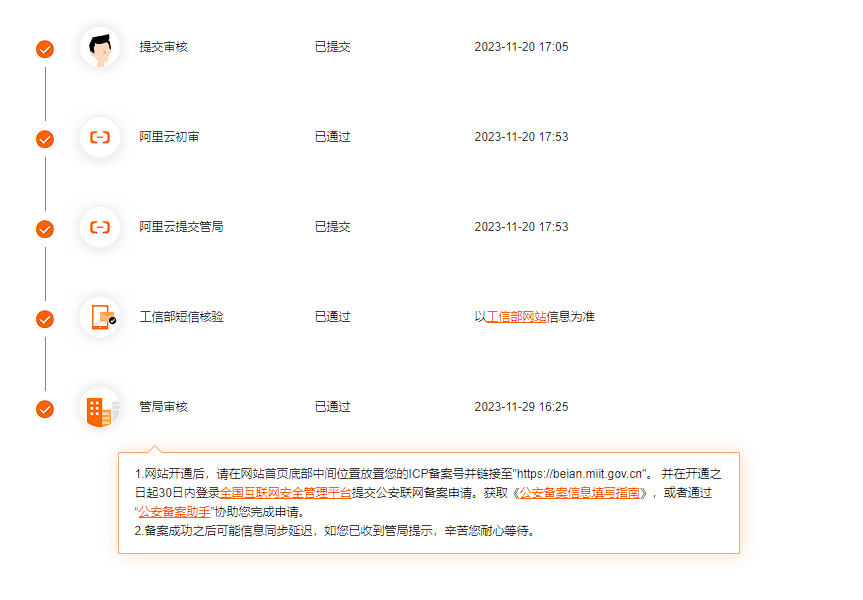
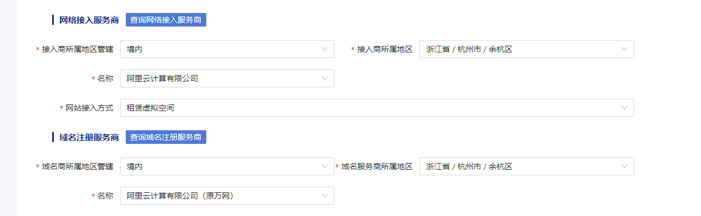
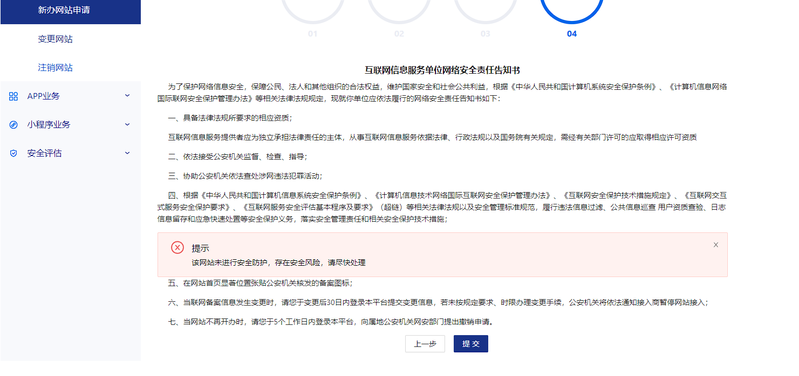

# 公安部域名备案

# [阿里云购买的域名如何在公安联网备案](https://www.cnblogs.com/lybaobei/p/17920466.html)
<font style="color:rgb(51, 51, 51);">首先需要在阿里云进行管局备案,流程如下图  
</font>

### <font style="color:rgb(51, 51, 51);">管局备案成功才可进行公安联网备案</font>
<font style="color:rgb(51, 51, 51);">工信部短信核验地址:</font>

```bash
https://beian.miit.gov.cn/#/Integrated/index
```

<font style="color:rgb(51, 51, 51);">备案入口</font>

```bash
https://beian.mps.gov.cn/#/
```

<font style="color:rgb(51, 51, 51);">1.申请主体,需要身份证正反面,手持身份证照片</font>

### <font style="color:rgb(51, 51, 51);">主体审核成功才可进行第二步</font>
<font style="color:rgb(51, 51, 51);">2.新增网站,需要身份证正反面,手持身份证照片,域名证书照(阿里云域名管理处下载)</font>

<font style="color:rgb(51, 51, 51);">3.填写网络接入商信息和域名注册服务商信息</font>

```plain
填写网络接入服务商信息
若您的备案所需服务器是在阿里云购买，办理公安联网备案的域名是通过阿里云在工信部备案，阿里云信息如下。

网络接入服务商名称：阿里云计算有限公司

网络接入商所属区域：浙江省杭州市余杭区

接入方式：租赁虚拟空间

接入服务商电话：95187

接入服务商组织机构代码/接入商编码：673959654
```

```plain
填写域名注册服务商信息
若您办理公安联网备案的域名是通过阿里云注册，阿里云信息如下。 如需下载域名证书，请参见域名证书。

域名注册服务商名称：阿里云计算有限公司（原万网）

域名注册服务商所属区域：浙江省杭州市余杭区

域名注册服务商电话：010-65985888
```



<font style="color:rgb(51, 51, 51);">4.最后一步会有一个安全责任告知书</font>



<font style="color:rgb(51, 51, 51);">点击提交等待审核即可,一般一到两天会有消息提示审核通过或不通过,不通过会提示不通过的原因,</font>

### <font style="color:rgb(51, 51, 51);">如果不通过需要从第二步重新开始,各种证件照需要重新上传(真是有趣)</font>
<font style="color:rgb(125, 139, 141);">分类: </font>[额外的](https://www.cnblogs.com/lybaobei/category/2363278.html)


> 更新: 2024-01-20 16:12:25  
> 原文: <https://www.yuque.com/lixinsi/yh04az/cdgsqcc4vb7y5oe9>