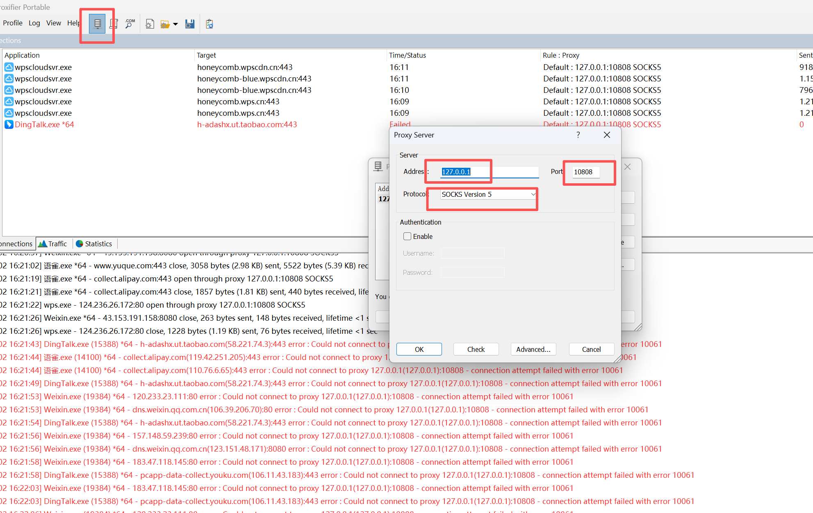
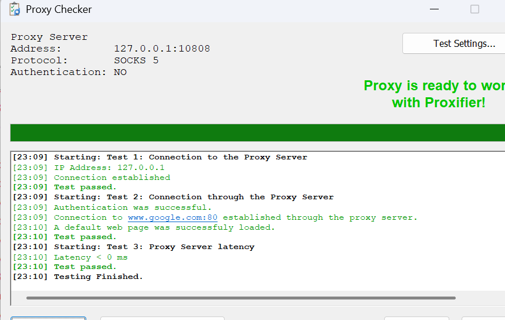
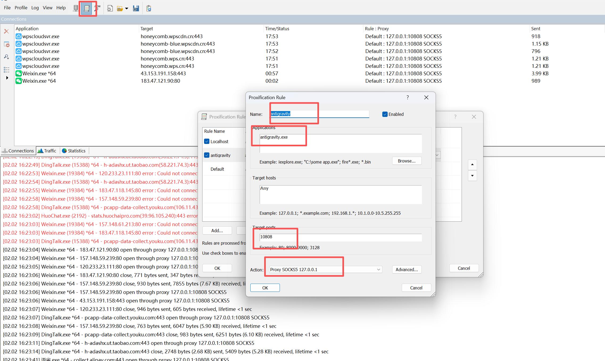

# 安装Antigravity登入问题解决

### 1.安装后打开 v2ray
##### 记住端口号10808，之后要用

### 2.Proxifier 设置

#### checker 一下绿色显示成功

#### 第二步配置  

#### 点击 ok 就可以成功登入了

> 更新: 2026-02-02 16:28:17  
> 原文: <https://www.yuque.com/lixinsi/yh04az/oktusefg6w34qhbi>