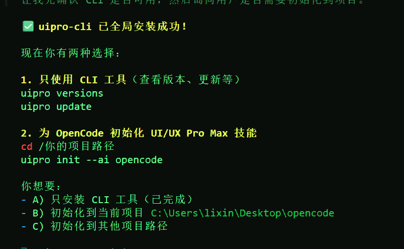
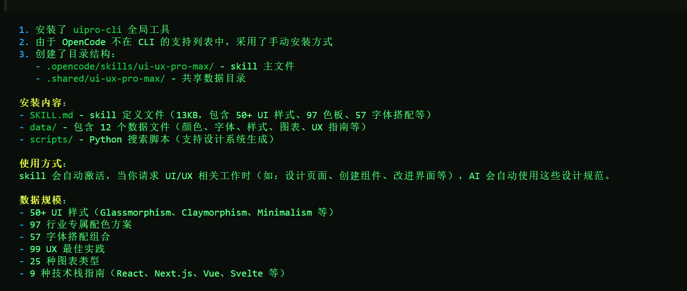
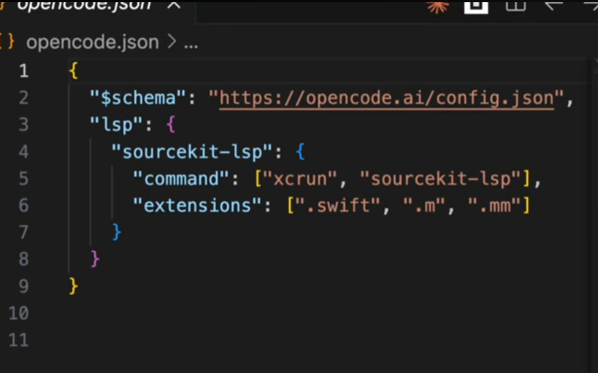
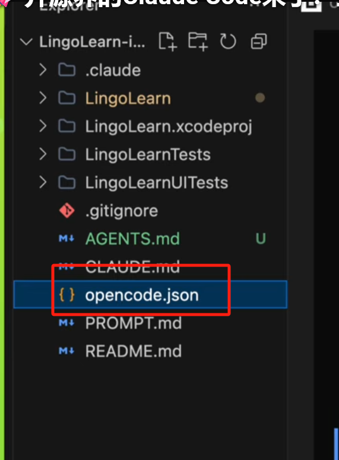

# 安装卸载opencode 以及安装

### 1.卸载
```bash
opencode uninstall
opencode upgrade
```

### 2.安装
```bash
npm install -g opencode-ai
```

### 3.安装 oh-my-opencode
```bash
npx oh-my-opencode@latest install 
```

### 4.安装 skill
#### ui-ux-pro-max-skill
```bash
https://github.com/nextlevelbuilder/ui-ux-pro-max-skill
```





```bash
uipro-cli 已全局安装成功!
现在你有两种选择:
1.只使用 CLI 工具(查看版本、更新等)uipro versionsuipro update
2.为 opencode 初始化 UI/UX Pro Max 技能cd /你的项目路径uipro init --ai opencode
你想要:
A)只安装 CLI 工具(已完成)
初始化到当前项目c:\Users\lixin\Desktoplopencode
初始化到其他项目路径
```

#### 5.opencode.json 配置文件
```bash
{
  "plugin": [
    "oh-my-opencode",
    "opencode-agent-skills",
  ],
  "$schema": "https://opencode.ai/config.json"
}

```

###### 6.安装 superpowers
[https://github.com/obra/superpowers](https://github.com/obra/superpowers)

```bash
Fetch and follow instructions from https://raw.githubusercontent.com/obra/superpowers/refs/heads/main/.opencode/INSTALL.md
```

Superpowers 安装完成!

已完成的步骤:

1.克隆 Superpowers 仓库C:\UsersllixinlAppDatalRoaminglopencodelsuperpowers

创建插件符号链接2C:\Usersllixin\AppData\Roaminglopencode\pluginlsuperpowers.js -> superpowers.js

下一步:重启 opencode，插件会自动加载。完成后可以问:

"do you have superpowers?"

如果需要更新:cd c:\Users\lixinlAppDatalRoaminglopencode\superpowersgit pull

```bash
| 技能名称 | 用途 |
|---------|------|
| superpowers:brainstorming | 头脑风暴 |
| superpowers:dispatching-parallel-agents | 并行代理分发 |
| superpowers:executing-plans | 执行计划 |
| superpowers:finishing-a-development-branch | 完成开发分支 |
| superpowers:receiving-code-review | 接收代码审查 |
| superpowers:requesting-code-review | 请求代码审查 |
| superpowers:subagent-driven-development | 子代理驱动开发 |
| superpowers:systematic-debugging | 系统化调试 |
| superpowers:test-driven-development | 测试驱动开发 |
| superpowers:using-git-worktrees | 使用 git worktrees |
| superpowers:using-superpowers | 使用 superpowers |
| superpowers:verification-before-completion | 完成前验证 |
| superpowers:writing-plans | 编写计划 |
| superpowers:writing-skills | 编写技能 |
| .system/skill-creator | 技能创建器 |
| .system/skill-installer | 技能安装器 |
你可以通过 superpowers-codex use-skill <skill-name> 加载特定技能使用。
```

```bash
rm -f ~/.config/opencode/plugin/superpowers.js && rm -rf ~/.config/opencode/superpowers
```

### 7.加载 lsp




```bash
{
  "$schema": "https://opencode.ai/config.json",
  "plugin": [
    "oh-my-opencode",
    "opencode-agent-skills"
  ],
  "lsp": {
    "sourcekit-lsp": {
      "command": [
        "xcrun",
        "sourcekit-lsp"
      ],
      "extensions": [
        ".swift",
        ".mm",
        ".m"
      ]
    }
  }
}

```

### 8.安装 openspec
```bash
 npm install -g @fission-ai/openspec@latest
```

### 9 安装 notebookskill
[https://github.com/teng-lin/notebooklm-py](https://github.com/teng-lin/notebooklm-py)

```bash
帮我安装agent skill https://github.com/teng-lin/notebooklm-py
```

### 10.技能配置
```bash
每个技能名称创建一个文件夹,然后放一个SKILL.md里面。 OpenCode 搜索以下位置:
全局配置:~/.config/opencode/skill/<name>/SKILL.md
    项目配置:.opencode/skill/<name>/SKILL.md
    全局配置:~/.config/opencode/skill/<name>/SKILL.md
    与克劳德项目兼容:.claude/skills/<name>/SKILL.md
    全球克劳德兼容:~/.claude/skills/<name>/SKILL.md

```

当前可用的技能（已配置在 ~/.config/opencode/skill/）：

| 技能名称 | 描述 |
| --- | --- |
| playwright | 浏览器自动化 - 页面验证、测试、网页抓取、截图 |
| notebooklm-py | NotebookLM Python API - 自动化研究、生成播客、集成AI代理 |
| superpowers | 完整软件开发工作流 - TDD、规划、子代理驱动开发 |
| ui-ux-pro-max | 专业UI/UX设计 - 57种UI风格、95种配色、56种字体配对 |
| 使用方式： |  |


# 加载技能
skill({ name: "ui-ux-pro-max" })  
skill({ name: "superpowers" })  
skill({ name: "notebooklm-py" })  
skill({ name: "playwright" })


> 更新: 2026-01-29 08:52:47  
> 原文: <https://www.yuque.com/lixinsi/yh04az/xfzwbyzxsu5q95ky>