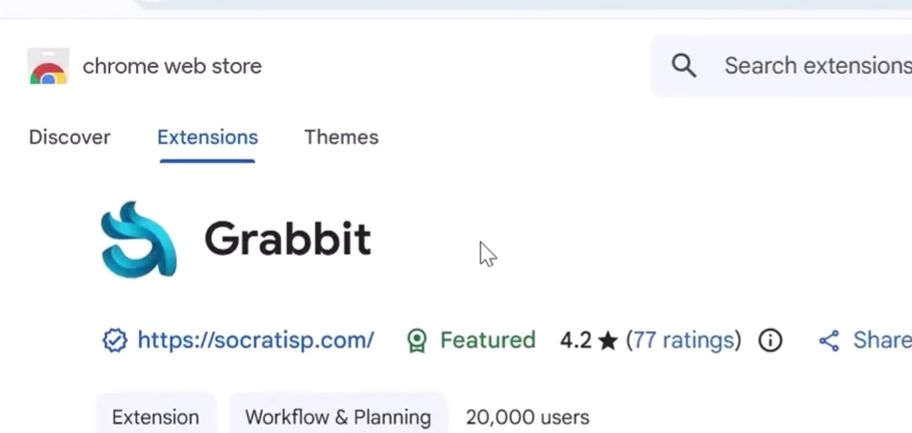
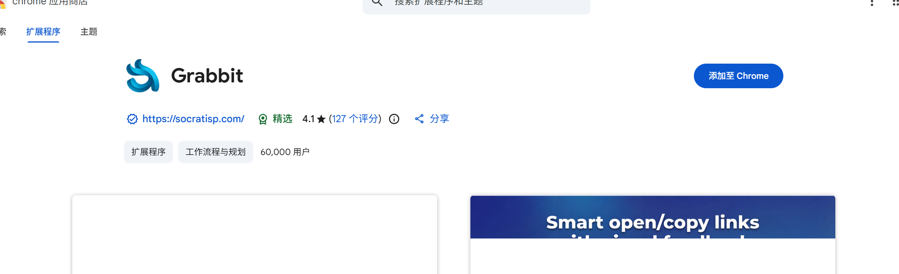
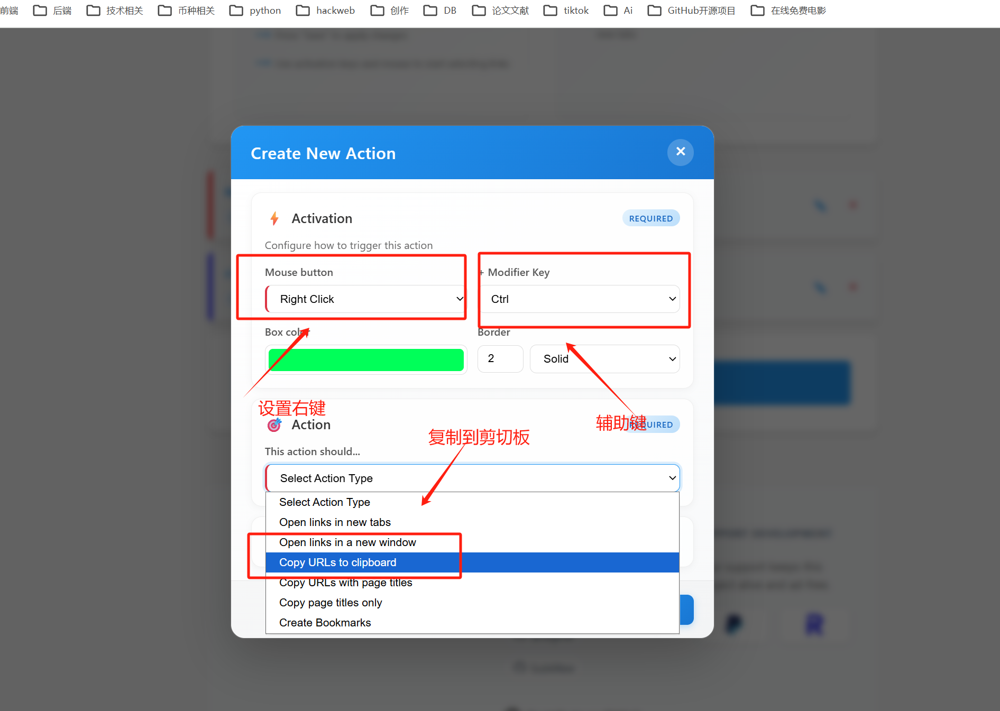
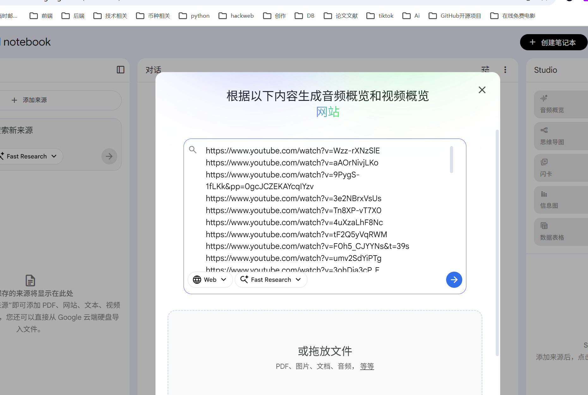
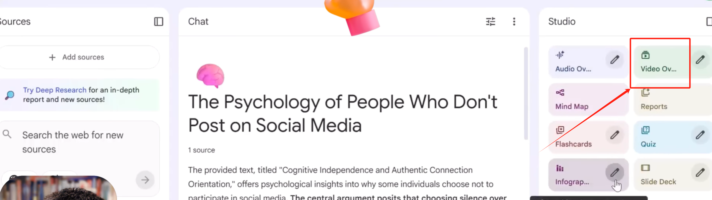
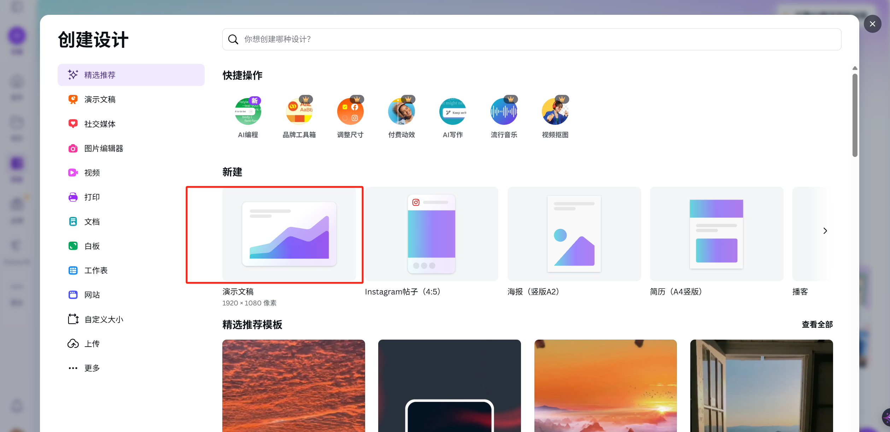

# 爆款视频制作

### 1.查询 youtube 数据
查询网址：[https://socialblade.com/](https://socialblade.com/)

### 2.新建笔记，new。

### 3.抓取插件 Grabbit

这个意思是按住鼠标左键以及 ctrl 键就会直接粘贴到剪切板

### 4.提示词
Prompt 1:

l want to clone a channel like this. Go through these sources and understand the niche, script.

title and tone format.

拆解这些视频的脚本分格，预期格式，标题逻辑

Prompt 2:

Give me 2 word 10 channel name ideas for a channel like this.

基于这些分析给我 10 个类似的频道的名字

Prompt 3:

Generate 10 video ideas for this channel.

给我生成 10 个视频创意和这个频道类似

### 5.复制选题视频创意，新建一个笔记本

### 6.生成标题和制作封面
Prompt 4:

Give me 10 headlines with high click-through rates.Psychology of People Who Don't Post on socia media!

给我10个高点击率的标题

字体是Poppins

> 更新: 2026-02-09 11:44:55  
> 原文: <https://www.yuque.com/lixinsi/yh04az/bnmegi5g8r7kgmiw>