# Windows Server 2008 R2 磁盘空间监测及 Email 通知报警

#### <font style="color:rgb(79, 79, 79);">一、配置性能监控器监控项</font>
<font style="color:rgb(77, 77, 77);">1：添加查看磁盘空间监测</font>

```powershell
perfmon.msc
```

<font style="color:rgb(77, 77, 77);">运行： 开始 -> 控制面板 -> 管理工具 -> 性能监视器</font>

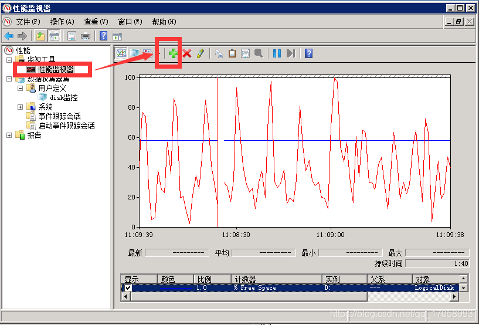


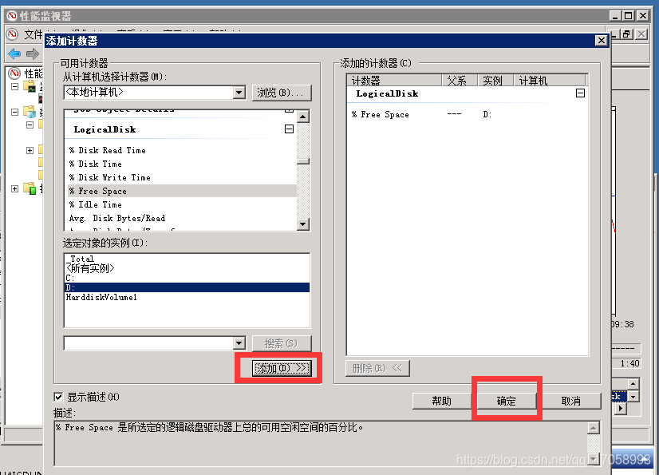

<font style="color:rgb(77, 77, 77);">2：就会看到一开始的界面，双击选中刚刚创建的监视项可以修改相应的属性</font>

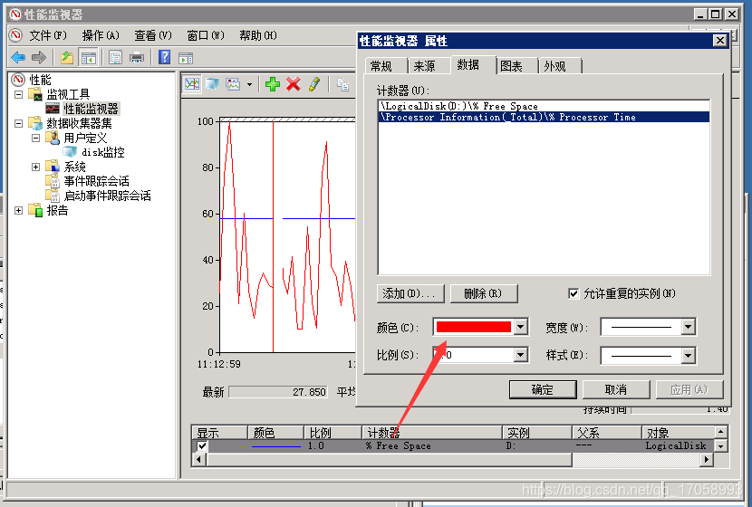

#### <font style="color:rgb(51, 51, 51);">二. 指定警告操作 </font>
<font style="color:rgb(51, 51, 51);">最后还要切换到“操作”标签页，在“当触发警报时”框体中选中“执行这个程序”选项，单击“浏览”，选择“邮件警告.bat”</font>

<font style="color:rgb(51, 51, 51);"> </font>

<font style="color:rgb(51, 51, 51);">附上“邮件警告.bat”示例：</font>

<font style="color:rgb(51, 51, 51);"></font>

```powershell
@echo off  
echo 磁盘已满，请及时清理！！！服务器地址为： > c:\mail_body.txt\mail_body.txt  
ipconfig | find "IP Address" >> c:\mail_body.txt\mail_body.txt  
  
:::::::::::::: 参数设置:::::::::::::  
  
set from=test@qq.com  
set user=test  
set pass=11111  
set to=alarm@qq.com  
set subj="Disk Full Alarm!"  
set mail=c:\mail_body.txt\mail_body.txt  
set server=smtp.qq.com  
set debug=-debug -log c:\blat.log -timestamp  
  
::::::::::::::::: 运行blat :::::::::::::::::  
blat %mail% -to %to% -base64 -charset Gb2312 -subject %subj%  -server %server% -f %from% -u %user% -pw %pass%  %debug%  
 
```

#### <font style="color:rgb(79, 79, 79);">三、设定任务计划</font>
<font style="color:rgb(77, 77, 77);">1：运行： 开始 -> 附件 -> 系统工具 -> 任务计划程序</font>

<font style="color:rgb(77, 77, 77);">2：右侧窗格 -> 创建任务（不是创建基本任务）</font>

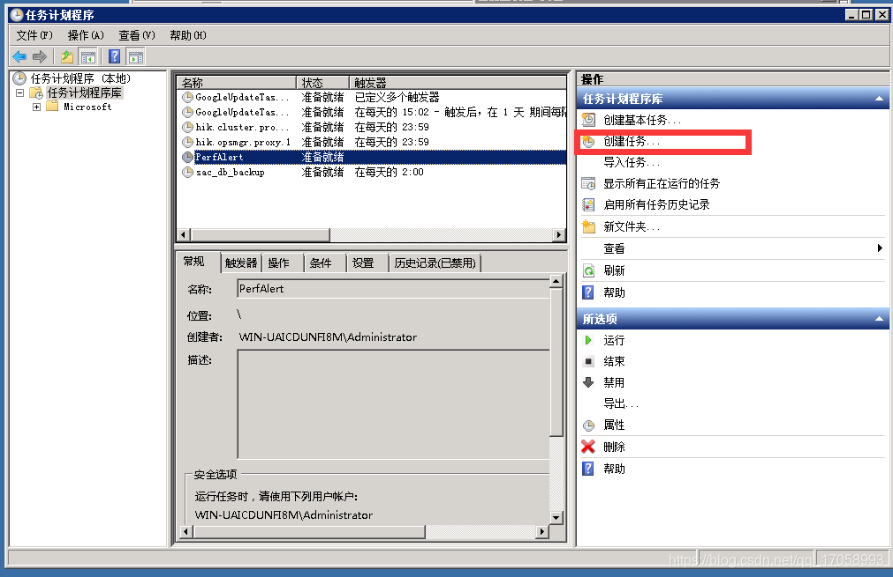

<font style="color:rgb(77, 77, 77);">3：在“名称”选项卡，输入一个名称，例如“PerfAlert”</font>

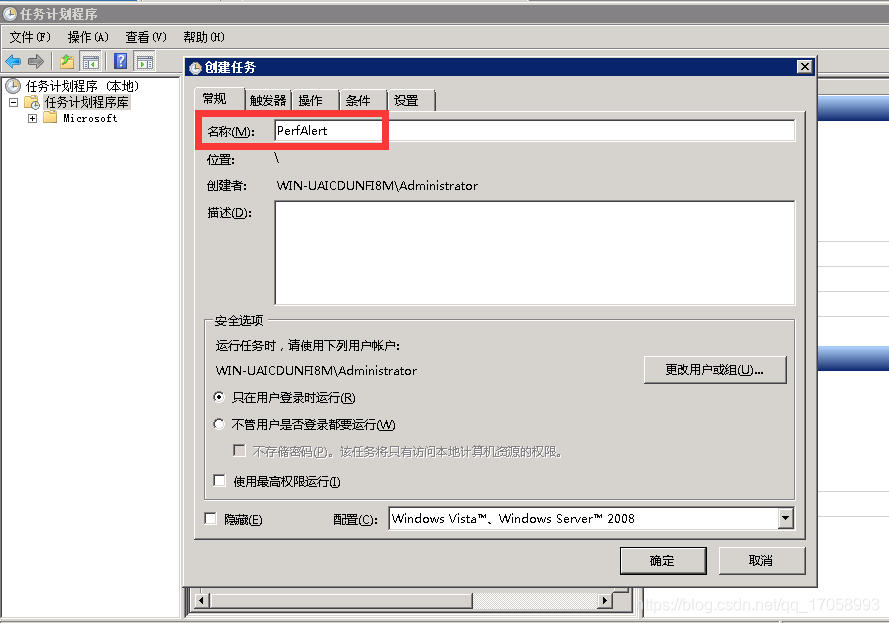

<font style="color:rgb(77, 77, 77);">4：在“操作”选项卡，按“新建”按钮，选择“启动程序”，然后下面按浏览按钮，找到刚才保存好的 perfalert.cmd 文件。注意一定要在下面的“起始于”文本框中输入保存上面这个文件的目录路径，例如：d:\smtpmailsender\ 。</font>

<font style="color:rgb(77, 77, 77);">5：一路确定保存，这样就把任务计划设置好了。下面就要设置性能监视器的报警了。</font>

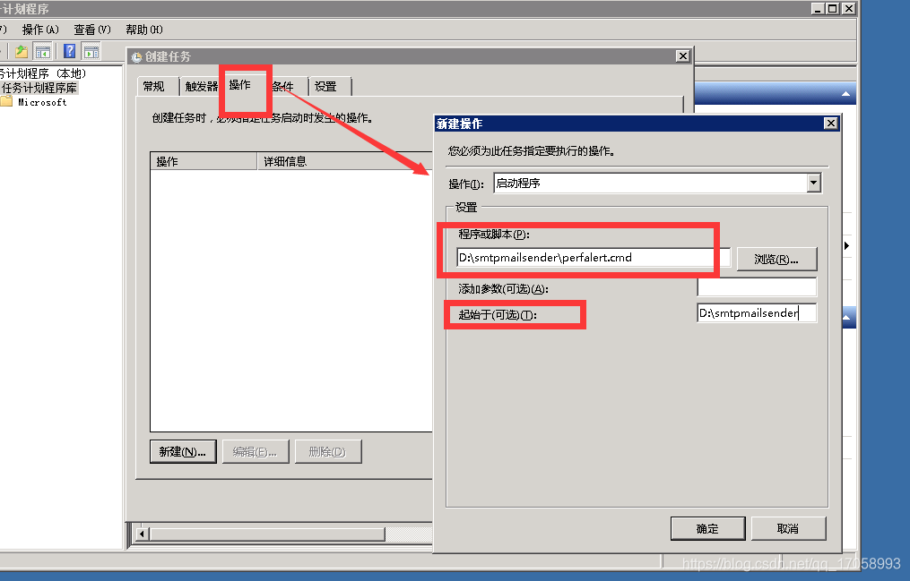

#### <font style="color:rgb(79, 79, 79);">四、设定性能监视器的报警选项</font>
<font style="color:rgb(77, 77, 77);">1：在任务监视器左侧窗格中，选择 数据收集器 -> 用户定义，鼠标右键，选择 新建 -> 收集数据，在弹出的对话框中输入一个名字 disk监控，然后选择“手动创建”，然后“下一步” -> “性能计数器报警” -> “下一步” -> 选择性能计数器，选择“LogicalDisk-> % Free Space”，然后点击确定。</font>

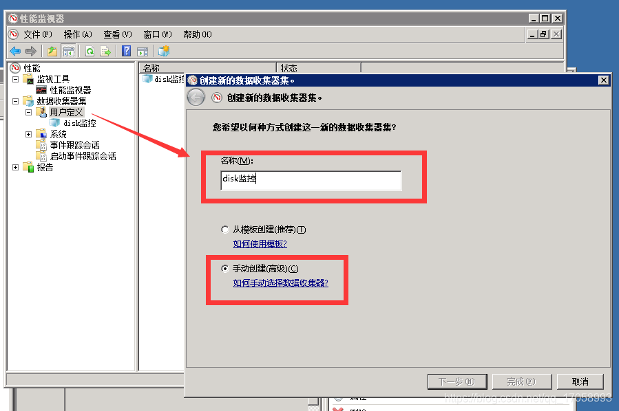

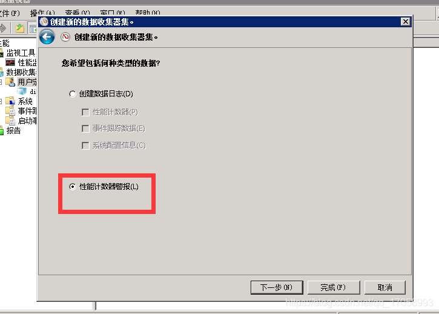

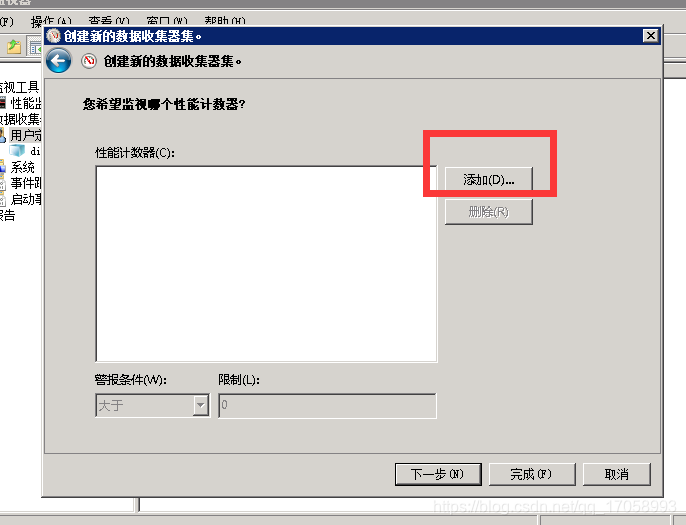

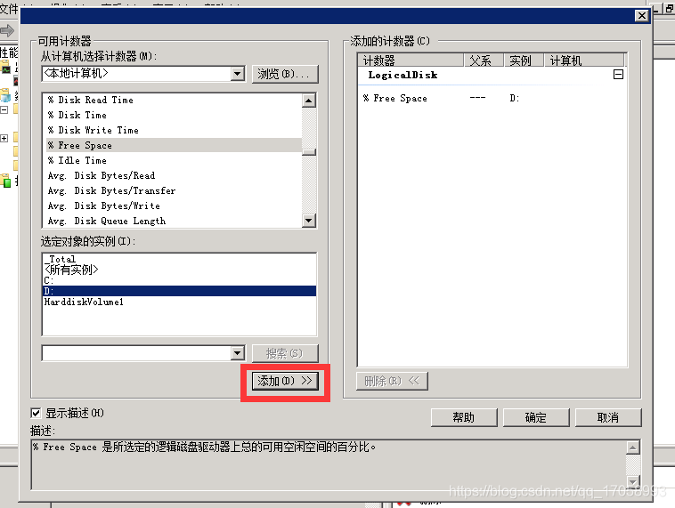


<font style="color:rgb(77, 77, 77);">2：在右侧可一看到刚才创建的这个报警对应于一个项目，鼠标右键单击它，出现对话框，在“警报”页面，警报条件选择“大于”，并输入一个限值，为了便于测试，可以输入一个低一些的数值，这样保证很快就会触发。下面输入采样间隔，</font>

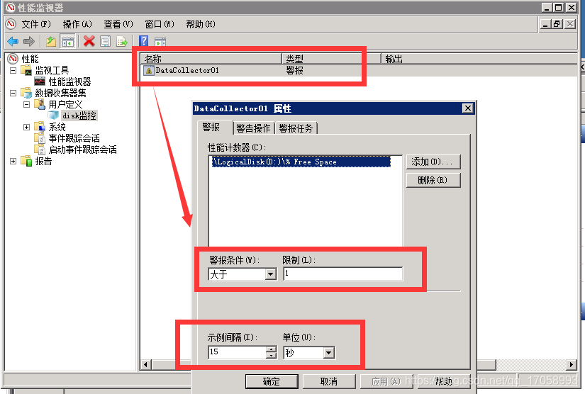


<font style="color:rgb(77, 77, 77);">在“警告操作”页面，下拉框中选中对应的那个数据收集器集，然后在“警告任务”页面，最上面的文本框输入在任务计划中创建的任务名称，例如上面的 PerfAlert。然后确定，关闭对话框。</font>

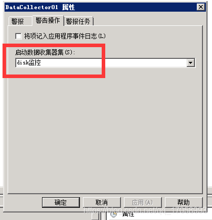

<font style="color:rgb(77, 77, 77);">3：右键点击“数据收集器”，停止以再次启动，配置才会生效。如上图的配置，每15秒采样一次，监控值为1，超过监控值，就会自动发送perfalert.cmd设置的邮件内容给指定邮箱。</font>


> 更新: 2024-06-17 15:06:15  
> 原文: <https://www.yuque.com/lixinsi/zgdgm0/xyu0o91mv1y0yrq9>