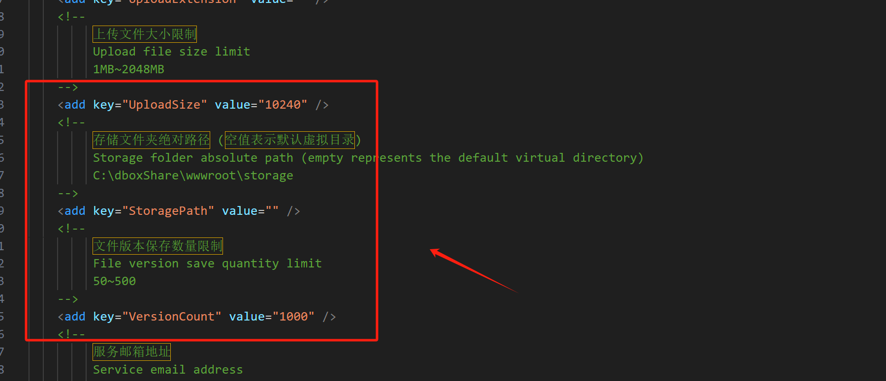
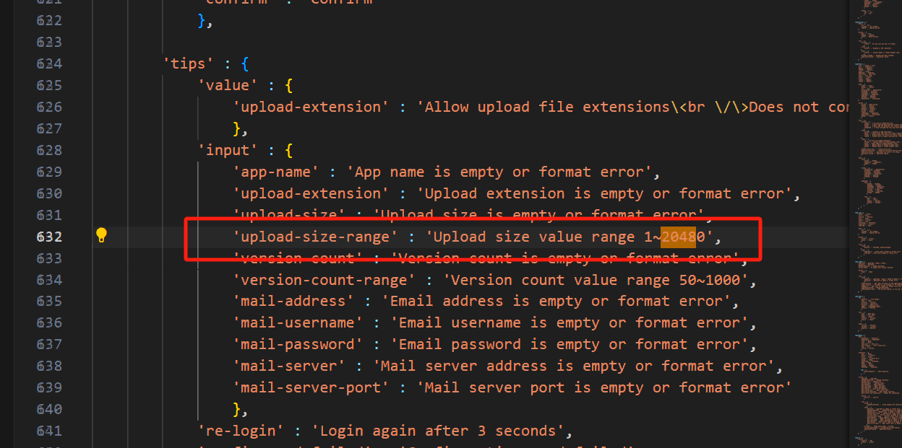
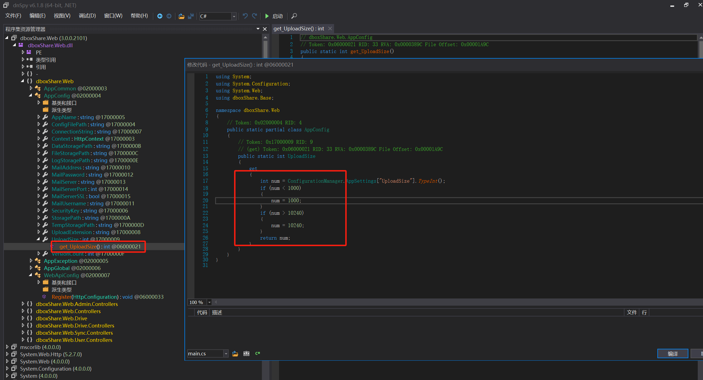

# dbshare3.0修改限制存储

#### 1.修改配置文件

#### 2.修改 JS 文件
C:\收集的源代码\网盘系统\dbshare3.0\dboxShare-v3.0.0.2101\dist\wwwroot\ui\languages

#### 3.用 dnSpy 修改 bin 目录下面的 dboxShare.Web.dll 文件

> 更新: 2024-06-16 10:21:16  
> 原文: <https://www.yuque.com/lixinsi/zgdgm0/tokimiwyxmy621tf>