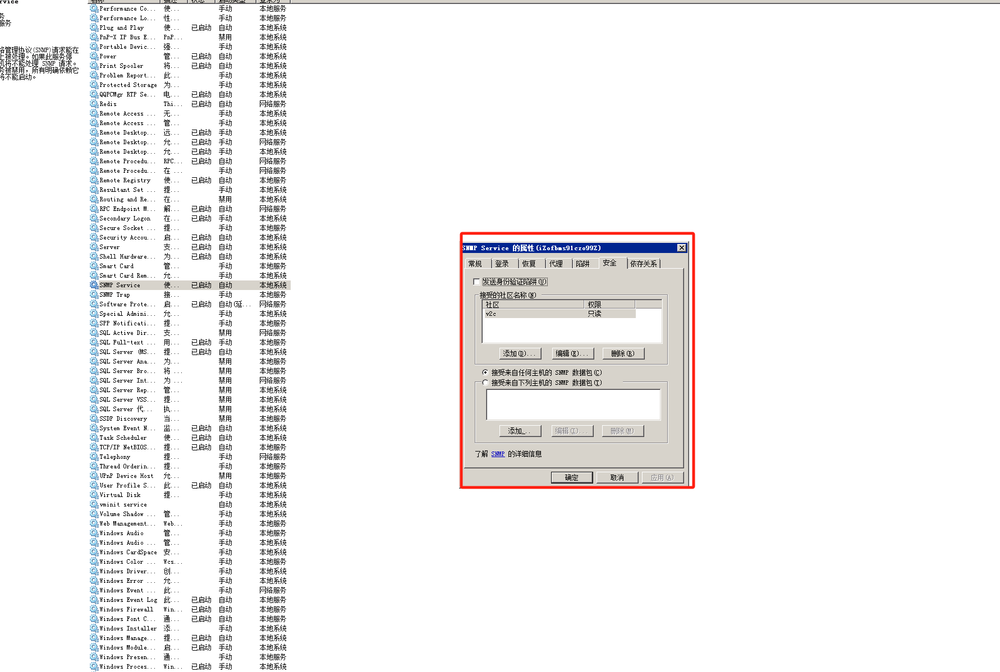
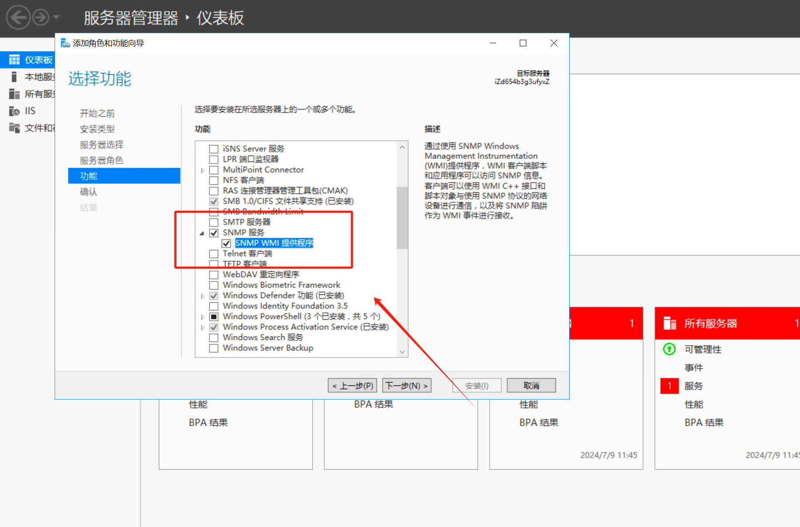

# hertzbeat监控安装

### 1.离线安装官网下载程序
```bash
 tar xf apache-hertzbeat-1.6.0-incubating-bin.tar.gz

 mv apache-hertzbeat-1.6.0-incubating-bin herzbeat

 rm -f apache-hertzbeat-1.6.0-incubating-bin.tar.gz

  chmod +x herzbeat/

```


### 2.安装 Java java17+ environment
```bash
apt install openjdk-21-jre-headless

root@ubuntu:~/hertzbeat/herzbeat/bin# ./startup.sh


```


### 3.安装连接器
```bash
tar xf apache-hertzbeat-collector-1.6.0-incubating-bin.tar.gz 

mv apache-hertzbeat-collector-1.6.0-incubating-bin hertzbear-collector

root@ubuntu:~/hertzbeat/hertzbear-collector/bin# ./startup.sh


```


### docker 安装
```bash
docker run -d -p 1157:1157 -p 1158:1158 --name hertzbeat apache/hertzbeat
```


账号密码

```bash
http://localhost:1157 to start, default account: admin/hertzbeat
```


```bash
docker run -d -e IDENTITY=custom-collector-name -e MANAGER_HOST=127.0.0.1 -e MANAGER_PORT=1158 --name hertzbeat-collector apache/hertzbeat-collector
```


[https://github.com/apache/hertzbeat](https://github.com/apache/hertzbeat)

windows  server2008 安装 snmp

```bash
ServerManagerCmd -install SNMP-Service
```







参考文档：[https://hertzbeat.apache.org/zh-cn/docs/help/alert_threshold](https://hertzbeat.apache.org/zh-cn/docs/help/alert_threshold)


> 更新: 2024-07-10 10:08:22  
> 原文: <https://www.yuque.com/lixinsi/zgdgm0/rvw7fubcr3yv28w2>