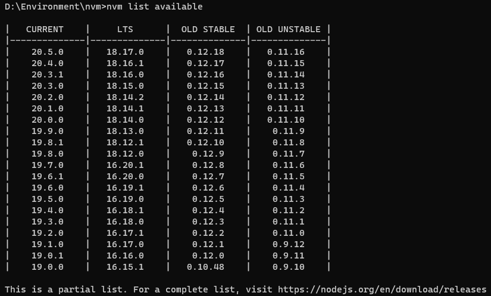
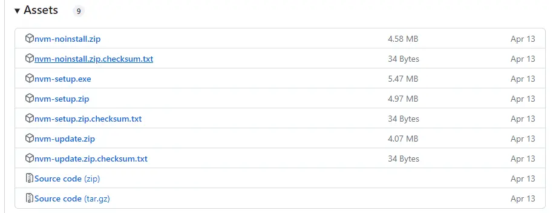
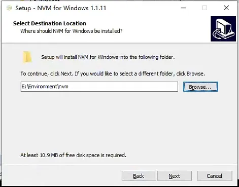
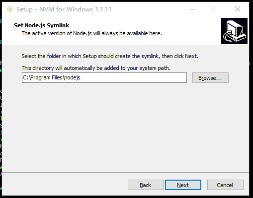
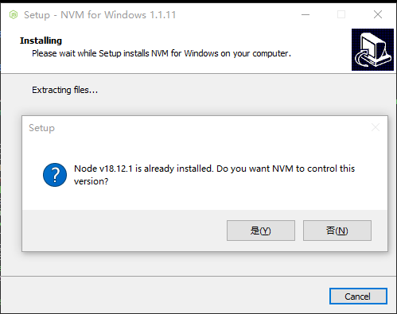

# node版本管理




# <font style="color:rgb(25, 27, 31);">【环境-1】Node 版本管理——NVM</font>
## <font style="color:rgb(25, 27, 31);">一、概述</font>
<font style="color:rgb(25, 27, 31);">nvm（Node Version Manager）是</font>[Node.js](https://link.zhihu.com/?target=https%3A//nodejs.org/en/)<font style="color:rgb(25, 27, 31);">的版本管理器，可以让我们轻松地在不同的Node.js版本之间进行切换。</font>

<font style="color:rgb(25, 27, 31);">官网：</font>

[nvm-sh/nvm: Node Version Manager - POSIX-compliant bash script to manage multiple active node.js versions (github.com)github.com/nvm-sh/nvm](https://link.zhihu.com/?target=https%3A//github.com/nvm-sh/nvm)

<font style="color:rgb(25, 27, 31);">nvm-windows：</font>

[https://github.com/coreybutler/nvm-windowsgithub.com/coreybutler/nvm-windows](https://link.zhihu.com/?target=https%3A//github.com/coreybutler/nvm-windows)

<font style="color:rgb(25, 27, 31);">中文网</font>

[nvm文档手册 - nvm是一个nodejs版本管理工具 - nvm中文网nvm.uihtm.com/](https://link.zhihu.com/?target=https%3A//nvm.uihtm.com/)

## <font style="color:rgb(25, 27, 31);">二. 使用（安装在后面）</font>
```plain
切换node的版本
$ nvm use 16
Now using node v16.9.1 (npm v7.21.1)
$ node -v
v16.9.1
$ nvm use 14
Now using node v14.18.0 (npm v6.14.15)
$ node -v
v14.18.0
# 安装指定版本，latest 是最新版本
$ nvm install 12
Now using node v12.22.6 (npm v6.14.5)
# 查看当前node的版本
$ node -v
v12.22.6
```


### <font style="color:rgb(25, 27, 31);">1.查看当前使用的Node.js版本</font>
```bash
nvm current   // v20.5.0
```

### <font style="color:rgb(25, 27, 31);">2.查看所有Node.js版本，*表示当前使用的版本</font>
```bash
nvm ls


    20.5.0
  * 14.21.0 (Currently using 64-bit executable)
```

### <font style="color:rgb(25, 27, 31);">3. 查看可安装列表</font>
```bash
nvm list available
```


### <font style="color:rgb(25, 27, 31);">4. 升级/安装Node.js版本</font>
<font style="color:rgb(25, 27, 31);">Node.js的版本管理方法有很多种，比如手动下载最新版，使用Node版本管理工具等。而使用NVM管理Node.js版本则非常方便。使用如下的命令升级或安装Node.js的版本：</font>

```bash
nvm install 10
nvm install 10.0.0
nvm install latest
```


### <font style="color:rgb(25, 27, 31);">5. 切换Node.js版本命令</font>
```bash
nvm use 8.0.0
nvm use 8
```

### <font style="color:rgb(25, 27, 31);">6. 离线安装</font>
<font style="color:rgb(25, 27, 31);">有时候，我们可能需要在没有网络的情况下安装Node.js版本。这时候，我们可以先下载Node.js的</font>**<font style="color:rgb(25, 27, 31);">二进制</font>**<font style="color:rgb(25, 27, 31);">安装包然后通过NVM进行安装。以下是NVM离线安装Node.js版本的命令：</font>

```plain
nvm install /path/to/binary
```

<font style="color:rgb(25, 27, 31);">其中，/path/to/binary表示你要安装的二进制文件路径。</font>

<font style="color:rgb(25, 27, 31);">例如，我们已经将Node.js的8.0.0二进制文件放置在了“/opt/nodejs/node-v8.0.0-linux-x64.tar.xz”这个路径下，那么可以执行以下命令进行安装：</font>

```plain
nvm install /opt/nodejs/node-v8.0.0-linux-x64.tar.xz
```

<font style="color:rgb(25, 27, 31);">执行该命令后，NVM就会自动解压、安装Node.js 8.0.0，并将其添加到已安装列表中。</font>

### <font style="color:rgb(25, 27, 31);">7. 命令列表说明</font>
```plain
nvm命令提示
nvm arch：显示node是运行在32位还是64位。
nvm install <version> [arch] ：安装node， version是特定版本也可以是最新稳定版本latest。可选参数arch指定安装32位还是64位版本，默认是系统位数。可以添加--insecure绕过远程服务器的SSL。
nvm list [available] ：显示已安装的列表。可选参数available，显示可安装的所有版本。list可简化为ls。
nvm on ：开启node.js版本管理。
nvm off ：关闭node.js版本管理。
nvm proxy [url] ：设置下载代理。不加可选参数url，显示当前代理。将url设置为none则移除代理。
nvm node_mirror [url] ：设置node镜像。默认是https://nodejs.org/dist/。如果不写url，则使用默认url。设置后可至安装目录settings.txt文件查看，也可直接在该文件操作。
nvm npm_mirror [url] ：设置npm镜像。https://github.com/npm/cli/archive/。如果不写url，则使用默认url。设置后可至安装目录settings.txt文件查看，也可直接在该文件操作。
nvm uninstall <version> ：卸载指定版本node。
nvm use [version] [arch] ：使用制定版本node。可指定32/64位。
nvm root [path] ：设置存储不同版本node的目录。如果未设置，默认使用当前目录。
nvm version ：显示nvm版本。version可简化为v。
```

<font style="color:rgb(25, 27, 31);">  
</font>

## <font style="color:rgb(25, 27, 31);">三、Window 安装</font>
<font style="color:rgb(25, 27, 31);">官网下载地址：</font>[Releases · coreybutler/nvm-windows](https://link.zhihu.com/?target=https%3A//github.com/coreybutler/nvm-windows/releases)



<font style="color:rgb(25, 27, 31);">我下载了</font><font style="color:rgb(25, 27, 31);background-color:rgb(248, 248, 250);">nvm-steup.exe</font><font style="color:rgb(25, 27, 31);">，下载后双击运行选择安装位置。</font>





<font style="color:rgb(83, 88, 97);">在这里创建一个软连接，并添加到 path，相当于配置了环境变量。  
</font><font style="color:rgb(83, 88, 97);">选用默认的或者自己已安装 node 的目录也是可以的。会有弹框，一直点是就可以了</font>



<font style="color:rgb(25, 27, 31);">选择是。相当于电脑已经安装了 node.js，是否让nvm管理起来，选择是之后就会复制一份到自己的安装目录中。省去了再下载一次。</font>

<font style="color:rgb(25, 27, 31);">最后，Finish就安装好了。可以通过前面的使用命令进行使用了。</font>

## <font style="color:rgb(25, 27, 31);">四、Linux 安装</font>
### <font style="color:rgb(25, 27, 31);">1.下载安装包</font>
<font style="color:rgb(25, 27, 31);background-color:rgb(248, 248, 250);">wget https://github.com/nvm-sh/nvm/archive/refs/tags/v0.39.0.tar.gz</font>

<font style="color:rgb(25, 27, 31);">版本号可改，去看官网版本列表，官网地址在最前面。</font>

```bash
[root@centos1 nvm]# wget https://github.com/nvm-sh/nvm/archive/refs/tags/v0.39.0.tar.gz
--2023-07-31 10:06:14--  https://github.com/nvm-sh/nvm/archive/refs/tags/v0.39.0.tar.gz
正在解析主机 github.com (github.com)... 20.205.243.166
正在连接 github.com (github.com)|20.205.243.166|:443... 已连接。
已发出 HTTP 请求，正在等待回应... 302 Found
位置：https://codeload.github.com/nvm-sh/nvm/tar.gz/refs/tags/v0.39.0 [跟随至新的 URL]
--2023-07-31 10:06:15--  https://codeload.github.com/nvm-sh/nvm/tar.gz/refs/tags/v0.39.0
正在解析主机 codeload.github.com (codeload.github.com)... 20.205.243.165
正在连接 codeload.github.com (codeload.github.com)|20.205.243.165|:443... 已连接。
已发出 HTTP 请求，正在等待回应... 200 OK
长度：未指定 [application/x-gzip]
正在保存至: “v0.39.0.tar.gz”

    [  <=>                                                                                               ] 154,875      444KB/s 用时 0.3s   

2023-07-31 10:06:16 (444 KB/s) - “v0.39.0.tar.gz” 已保存 [154875]

[root@centos1 nvm]# ll
总用量 152
-rw-r--r--. 1 root root 154875 7月  31 10:06 v0.39.0.tar.gz
[root@centos1 nvm]#
```

<font style="color:rgb(25, 27, 31);">2. 解压</font>

```bash
mkdir -p /root/.nvm
tar -zxvf v0.39.0.tar.gz -C /root/.nvm
ls /root/.nvm/
```

<font style="color:rgb(83, 88, 97);">注意解压文件名，看看下载下来是啥名就改成啥名，有的是</font><font style="color:rgb(83, 88, 97);background-color:rgb(248, 248, 250);">nvm-0.39.0.tar.gz</font>

<font style="color:rgb(25, 27, 31);">3.配置环境</font>

<font style="color:rgb(25, 27, 31);">（1）打开</font><font style="color:rgb(25, 27, 31);background-color:rgb(248, 248, 250);">vim ~/.bashrc</font>

<font style="color:rgb(25, 27, 31);">（2）在~/.bashrc的末尾，添加如下语句：</font>

```bash
export NVM_DIR="$HOME/.nvm/nvm-0.39.0"
[ -s "$NVM_DIR/nvm.sh" ] && \. "$NVM_DIR/nvm.sh"
# This loads nvm
[ -s "$NVM_DIR/bash_completion" ] && \. "$NVM_DIR/bash_completion"  
# This loads nvm bash_completion
# nodejs下载更换淘宝镜像
export NVM_NODEJS_ORG_MIRROR=https://npm.taobao.org/mirrors/node
```

<font style="color:rgb(83, 88, 97);">这个注意一下NVM_DIR，确定这个目录下能找到 nvm.sh，有的解压之后可能文件名会变，去看一下</font><font style="color:rgb(83, 88, 97);background-color:rgb(248, 248, 250);">ls /root/.nvm/</font>

<font style="color:rgb(25, 27, 31);">（3）使配置生效</font>

```bash
source ~/.bashrc
```

<font style="color:rgb(25, 27, 31);">4.查看和使用</font><font style="color:rgb(25, 27, 31);background-color:rgb(248, 248, 250);">nvm -v</font>

## <font style="color:rgb(25, 27, 31);">五、nvm切换国内镜像（如果下载node.js慢的话）</font>
<font style="color:rgb(25, 27, 31);">如果下载node过慢或者安装失败，请更换国内镜像源, 在 nvm 的安装路径下，找到 settings.txt，设置node_mirro与npm_mirror为国内镜像地址。下载就飞快了~~</font>

```bash
root: D:\nvm
path: D:\nodejs
nvm npm_mirror https://npmmirror.com/mirrors/npm/
nvm node_mirror https://npmmirror.com/mirrors/node/
或者：
node_mirror: https://npm.taobao.org/mirrors/node/
npm_mirror: https://npm.taobao.org/mirrors/npm/
```

### <font style="color:rgb(25, 27, 31);">命令行切换(注意：请切换国内镜像后再安装node版本，否则会很慢)</font>
### <font style="color:rgb(25, 27, 31);">阿里云镜像</font>
```plain
nvm npm_mirror https://npmmirror.com/mirrors/npm/
nvm node_mirror https://npmmirror.com/mirrors/node/
```

### <font style="color:rgb(25, 27, 31);">腾讯云镜像</font>
```plain
nvm npm_mirror http://mirrors.cloud.tencent.com/npm/
nvm node_mirror http://mirrors.cloud.tencent.com/nodejs-release/
```

<font style="color:rgb(25, 27, 31);">打开链接查看可以node版本：</font>[https://registry.npmmirror.com/](https://link.zhihu.com/?target=https%3A//registry.npmmirror.com/binary.html%3Fpath%3Dnode/)


```bash
# 安装指定node版本
nvm install v14.15.0
# 运行指定node版本
nvm use v14.15.0
# 指定默认版本
nvm alias default v16.16.0
nvm current
# 切换到最新的node版本
nvm use node
# 远程服务器上所有的可用版本
nvm ls-remote
# 给不同的版本号设置别名
nvm alias node_cms 14.15.0
# 使用该别名
nvm use node_cms
# 查看已安装node列表
nvm ls
```


> 更新: 2025-10-28 17:35:09  
> 原文: <https://www.yuque.com/lixinsi/zgdgm0/twigxtvxgf7o897u>