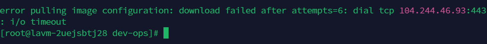
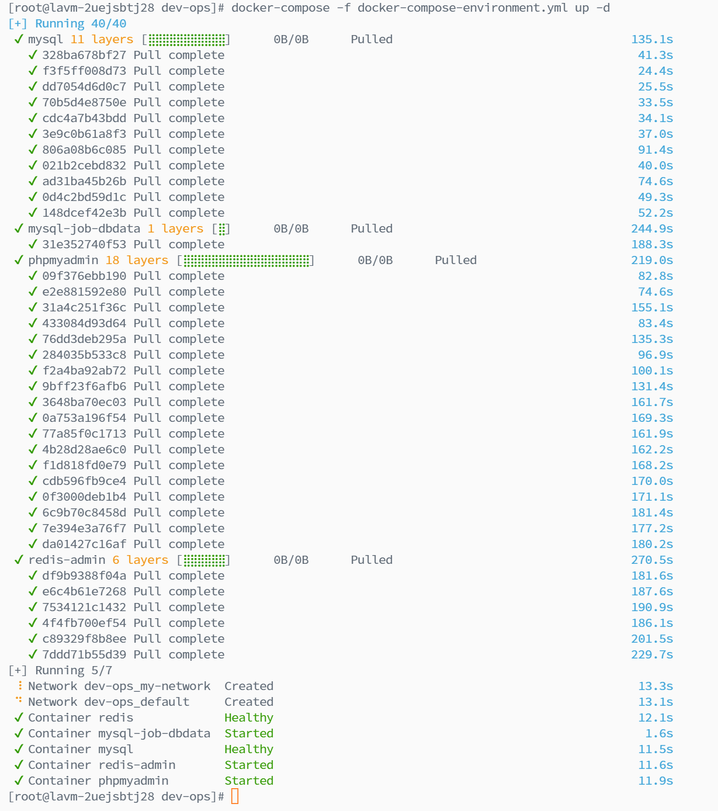

# ragflow部署

[https://ragflow.io/docs/dev/deploy_local_llm](https://ragflow.io/docs/dev/deploy_local_llm)

[https://blog.csdn.net/qq_44796920/article/details/139573309?utm_medium=distribute.pc_relevant.none-task-blog-2~default~baidujs_baidulandingword~default-8-139573309-blog-139745845.235^v43^pc_blog_bottom_relevance_base1&spm=1001.2101.3001.4242.5&utm_relevant_index=11](https://blog.csdn.net/qq_44796920/article/details/139573309?utm_medium=distribute.pc_relevant.none-task-blog-2~default~baidujs_baidulandingword~default-8-139573309-blog-139745845.235^v43^pc_blog_bottom_relevance_base1&spm=1001.2101.3001.4242.5&utm_relevant_index=11)

[https://github.com/infiniflow/ragflow](https://github.com/infiniflow/ragflow)


```bash
apt update

sudo apt update
sudo apt upgrade
sudo apt full-upgrade

apt install docker

apt install docker-compose

```

```bash
$ cd ragflow/docker
$ chmod +x ./entrypoint.sh

docker-compose -f docker-compose-CN.yml up -d

```


### 配置 docker 加速


```bash
sudo nano /etc/docker/daemon.json

```


```bash
{
  "registry-mirrors": ["https://cloudsx.top/"]
}
```


### 执行sysytemctl daemon-reload 报错sudo: unable to resolve host ecm-1242: Name or service not known
<font style="color:rgb(51, 51, 51);">Ubuntu环境, 假设这台机器名字叫abc(机器的hostname), 每次执行sudo 就出现这个警告讯息:</font>

<font style="color:rgb(51, 51, 51);">sudo: unable to resolve host abc</font>  
<font style="color:rgb(51, 51, 51);">虽然sudo 还是可以正常执行, 但是警告讯息每次都出来,而这只是机器在反解上的问题, 所以就直接从/etc/hosts 设定, 让abc(hostname) 可以解回127.0.0.1 的IP 即可.</font>  


<font style="color:rgb(77, 77, 77);">  
</font>

<font style="color:rgb(77, 77, 77);">解决方法</font>

<font style="color:rgb(51, 51, 51);">1.    vi   /etc/hosts  第一行信息如下：</font>

```plain
127.0.0.1       localhost
```

<font style="color:rgb(51, 51, 51);">2. 在127.0.0.1 localhost 后面加上主机名称(hostname) 即可, /etc/hosts 内容修改成如下:</font>

<font style="color:rgb(51, 51, 51);">第一种方法：直接将hostname（abc）追加到后面</font>

```plain
 127.0.0.1     localhost  abc  #要保证这个名字与 
```

<font style="color:rgb(51, 51, 51);">   /etc/hostname中的主机名一致才有效</font><font style="color:rgb(79, 79, 79);">  
</font>

<font style="color:rgb(79, 79, 79);">第二种方法：可以分开写</font>

```plain
 127.0.0.1       localhost 


127.0.0.1       abc
```

<font style="color:rgb(79, 79, 79);">这样设完后, 使用sudo 就不会再有那个提示信息了。</font>

<font style="color:rgb(79, 79, 79);"></font>

# <font style="color:rgb(34, 34, 38);">Docker 镜像下载加速（error pulling image configuration:download failed）</font>
## <font style="color:rgb(79, 79, 79);">存在问题</font>
<font style="color:rgb(77, 77, 77);">  
</font><font style="color:rgb(77, 77, 77);">拉取镜像一直失败</font>

## <font style="color:rgb(79, 79, 79);">问题解决</font>
**<font style="color:rgb(77, 77, 77);">修改配置文件：</font>**

```plain
vim /etc/docker/daemon.json
```

**<font style="color:rgb(77, 77, 77);">配置内容如下：</font>**<font style="color:rgb(77, 77, 77);">  
</font><font style="color:rgb(77, 77, 77);">输入i开始输入</font>

```plain
{
  "builder": {
    "gc": {
      "defaultKeepStorage": "20GB",
      "enabled": true
    }
  },
  "experimental": true,
  "features": {
    "buildkit": true
  },
  "insecure-registries": [
    "172.24.86.231"
  ],
  "registry-mirrors": [
    "https://dockerproxy.com",
    "https://mirror.baidubce.com",
    "https://ccr.ccs.tencentyun.com",
    "https://docker.m.daocloud.io",
    "https://docker.nju.edu.cn",
    "https://docker.mirrors.ustc.edu.cn"
  ],
  "log-driver":"json-file",
  "log-opts": {
    "max-size":"500m", 
    "max-file":"3"
  }
}


```

<font style="color:rgb(77, 77, 77);">输入:wq保存并退出</font>

**<font style="color:rgb(77, 77, 77);">docker重启</font>**

```plain
sudo systemctl daemon-reload

sudo systemctl restart docker

```

## <font style="color:rgb(79, 79, 79);">解决结果</font>


## <font style="color:rgb(79, 79, 79);">参考文献</font>
<font style="color:rgb(77, 77, 77);">https://blog.csdn.net/feiyanaffection/article/details/135032893</font>


> 更新: 2024-07-16 14:34:28  
> 原文: <https://www.yuque.com/lixinsi/zgdgm0/taq2pkh0kv9lg9ov>