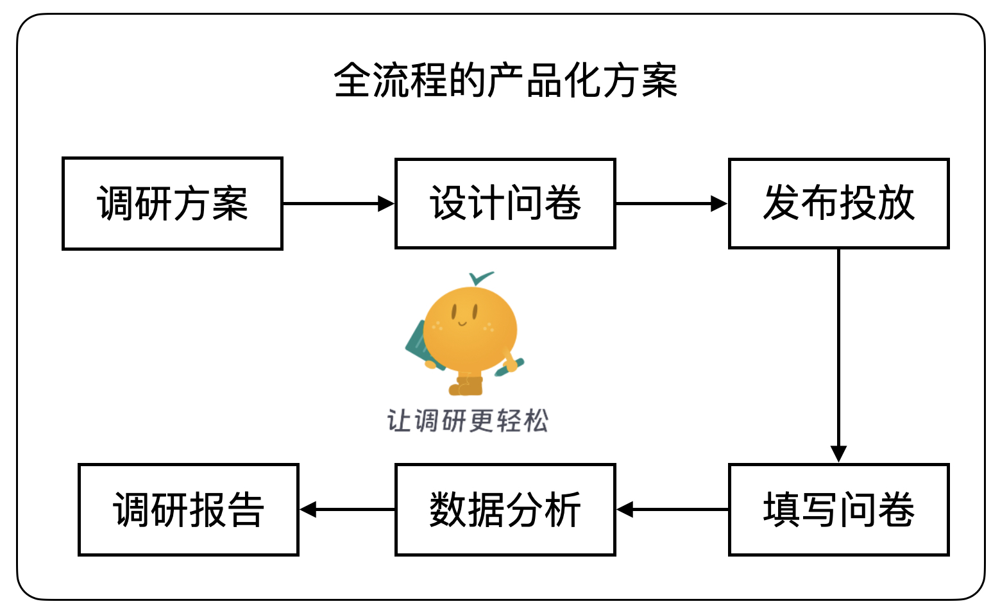
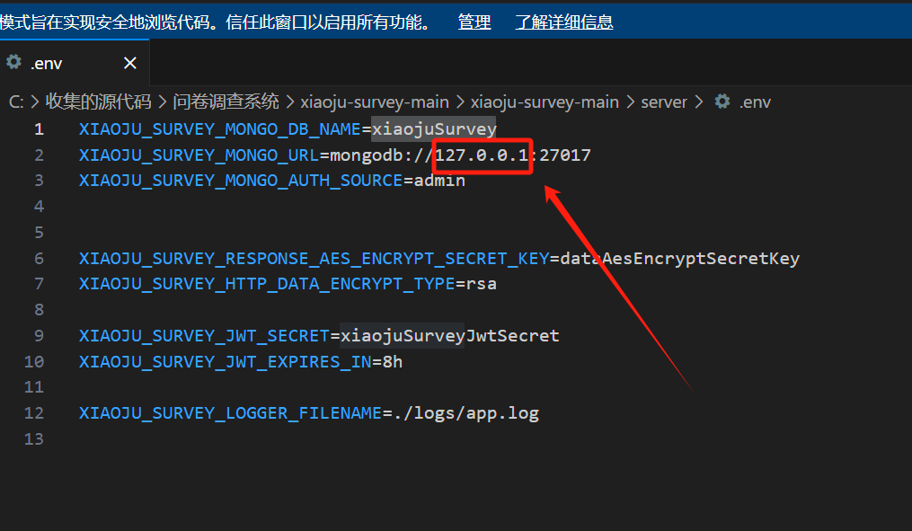
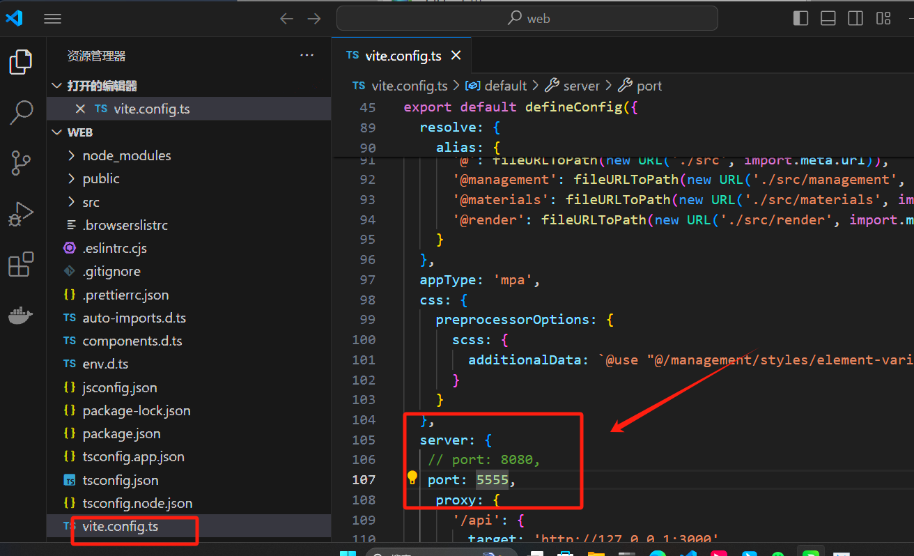
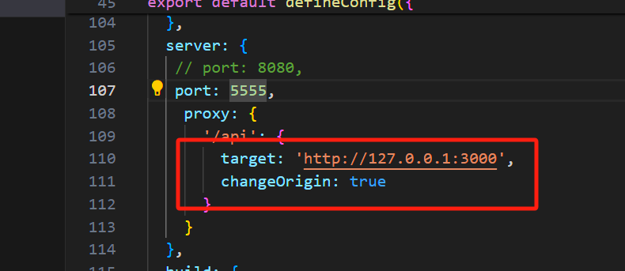

# 问卷系统开源


[GitHub - didi/xiaoju-survey: 「快速」打造「专属」问卷系统, 让调研「更轻松」](https://github.com/didi/xiaoju-survey)


<u><font style="background-color:rgb(13, 17, 23);"> </font></u><u><font style="background-color:rgb(13, 17, 23);"> </font></u><u><font style="background-color:rgb(13, 17, 23);"> </font></u><u><font style="background-color:rgb(13, 17, 23);"> </font></u>

  


**<font style="color:#000000;background-color:#FFFFFF;">XIAOJUSURVEY</font>**<font style="color:#000000;background-color:#FFFFFF;">是一套轻量、安全的</font>**<font style="color:#000000;background-color:#FFFFFF;">问卷系统基座</font>**<font style="color:#000000;background-color:#FFFFFF;">，提供面向个人和企业的一站式产品级解决方案，快速满足各类线上调研场景。</font>

<font style="color:#000000;background-color:#FFFFFF;">内部系统已沉淀40+种题型，累积精选模板100+，适用于市场调研、客户满意度调研、在线考试、投票、报道、测评等众多场景。数据能力上，经过上亿量级打磨，沉淀了分题统计、交叉分析、多渠道分析等在线报表能力，快速满足专业化分析。</font>

<font style="color:#000000;background-color:#FFFFFF;">开源项目以打造</font>**<font style="color:#000000;background-color:#FFFFFF;">调研基座</font>**<font style="color:#000000;background-color:#FFFFFF;">为核心，围绕</font>**<font style="color:#000000;background-color:#FFFFFF;">平台能力</font>**<font style="color:#000000;background-color:#FFFFFF;">、</font>**<font style="color:#000000;background-color:#FFFFFF;">工程架构</font>**<font style="color:#000000;background-color:#FFFFFF;">、</font>**<font style="color:#000000;background-color:#FFFFFF;">研发体系</font>**<font style="color:#000000;background-color:#FFFFFF;">进行建设，大家可以「快速」打造「专属」问卷系统：</font>[快速了解生态发展理念](https://xiaojusurvey.didi.cn/docs/next/community/%E7%94%9F%E6%80%81%E5%BB%BA%E8%AE%BE)


# <font style="background-color:#FFFFFF;">功能简介</font>
+ <font style="background-color:#FFFFFF;">问卷管理：创、编、投、收、数据分析</font>
+ <font style="background-color:#FFFFFF;">多样化题型：单行输入框、多行输入框、单项选择、多项选择、判断题、评分、投票、...</font>
+ <font style="background-color:#FFFFFF;">用户管理：登录、注册、权限管理</font>
+ <font style="background-color:#FFFFFF;">数据安全：传输加密、脱敏等</font>

<font style="color:#FAFAFA;background-color:rgb(13, 17, 23);">更全的建设请查阅</font><font style="background-color:rgb(13, 17, 23);"> </font>[官方Feature](https://github.com/didi/xiaoju-survey/issues/45)



_**<font style="color:#000000;background-color:#FFFFFF;">(个人和企业用户均可快速构建特定领域的调研类解决方案。)</font>**_

# <font style="color:#000000;background-color:#FFFFFF;">技术</font>
<font style="color:#000000;background-color:#FFFFFF;">Web端：Vue3 + ElementPlus</font>

<font style="color:#000000;background-color:#FFFFFF;">Server端：Nestjs + MongoDB</font>

<font style="color:#000000;background-color:#FFFFFF;">架构：</font>[<font style="color:#000000;background-color:#FFFFFF;">架构解读</font>](https://xiaojusurvey.didi.cn/docs/next/document/%E8%AE%BE%E8%AE%A1%E5%8E%9F%E7%90%86/%E6%9E%B6%E6%9E%84)

# <font style="color:#000000;background-color:#FFFFFF;">项目优势</font>
**<font style="color:#000000;background-color:#FFFFFF;">一、具备全面的综合性和专业性</font>**

+ [<font style="color:#000000;background-color:#FFFFFF;">制定了问卷标准化协议规范</font>](https://xiaojusurvey.didi.cn/docs/next/agreement/%E3%80%8A%E9%97%AE%E5%8D%B7Meta%E5%8D%8F%E8%AE%AE%E3%80%8B)

<font style="color:#000000;background-color:#FFFFFF;">领域标准保障概念互通，是全系统的基础和核心。基于实际业务经验，沉淀了两大类：</font>

    - <font style="color:#000000;background-color:#FFFFFF;">业务描述：问卷协议、题型协议</font>
    - <font style="color:#000000;background-color:#FFFFFF;">物料描述：题型物料协议，包含题型和设置器</font>
+ [制定了问卷UI/UX规范](https://xiaojusurvey.didi.cn/docs/next/design/%E3%80%8A%E8%AE%BE%E8%AE%A1%E8%A7%84%E8%8C%83%E3%80%8B)

<font style="color:#000000;background-color:#FFFFFF;">设计语言是系统灵活性、一致性的基石，保障系统支撑的实际业务运转拥有极高的用户体验。包含两部分：</font>

    - <font style="color:#000000;background-color:#FFFFFF;">设计规范：灵活、降噪、统一</font>
    - <font style="color:#000000;background-color:#FFFFFF;">交互规范：遵循用户行为特征，遵循产品定位，遵循成熟的用户习惯</font>
+ [所见即所得，搭建渲染一致性高](https://xiaojusurvey.didi.cn/docs/next/document/%E8%AE%BE%E8%AE%A1%E5%8E%9F%E7%90%86/%E9%A2%98%E5%9E%8B%E5%9C%BA%E6%99%AF%E5%8C%96%E8%AE%BE%E8%AE%A1)

<font style="color:#000000;background-color:#FFFFFF;">实</font><font style="color:#000000;background-color:#FAFAFA;">际业务使用上包含问卷生成和投放使用，即对于系统的搭建端和渲染端。我们将题型场景化设计，以满足一份问卷从加工生产到投放应用的高度一致。</font>

+ [<font style="color:#000000;background-color:#FAFAFA;">题型物料化设计，自由定制扩展</font>](https://xiaojusurvey.didi.cn/docs/next/document/%E8%AE%BE%E8%AE%A1%E5%8E%9F%E7%90%86/%E9%A2%98%E5%9E%8B%E7%89%A9%E6%96%99%E5%8C%96%E8%AE%BE%E8%AE%A1/%E5%9F%BA%E7%A1%80%E8%AE%BE%E8%AE%A1)

<font style="color:#000000;background-color:#FAFAFA;">题型是问卷最核心的组成部分，而题型可配置化能力决定了上层业务可扩展的场景以及系统自身可复用的场景。 题型架构设计上，主打每一类题型拥有通用基础能力，每一种题型拥有原子化特性能力，并保障高度定制化。</font>

+ [<font style="color:#000000;background-color:#FAFAFA;">合规建设沉淀积累，安全能力拓展性高</font>](https://xiaojusurvey.didi.cn/docs/next/document/%E5%AE%89%E5%85%A8%E8%AE%BE%E8%AE%A1/%E6%A6%82%E8%BF%B0)

<font style="color:#000000;background-color:#FAFAFA;">数据加密传输、敏感信息精细化检测、投票防刷等能力，保障问卷发布、数据回收链路安全性。</font>

**<font style="color:#000000;background-color:#FAFAFA;">二、轻量化设计，快速接入、灵活扩展</font>**

+ [<font style="color:#000000;background-color:#FAFAFA;">产品级开源方案，快速产出一套调研流程</font>](https://xiaojusurvey.didi.cn/docs/next/document/%E4%BA%A7%E5%93%81%E6%89%8B%E5%86%8C/%E6%A6%82%E8%BF%B0)

<font style="color:#000000;background-color:#FAFAFA;">围绕问卷生命周期提供了完整的产品化能力，包含用户管理: 登录、注册、问卷权限，问卷管理: 创、编、投、收、数据分析，可快速构建特定领域的调研类解决方案。</font>

+ [<font style="color:#000000;background-color:#FAFAFA;">问卷设计开箱即用，降低领域复杂度</font>](https://xiaojusurvey.didi.cn/docs/next/document/%E8%AE%BE%E8%AE%A1%E5%8E%9F%E7%90%86/%E9%97%AE%E5%8D%B7%E6%90%AD%E5%BB%BA%E9%A2%86%E5%9F%9F%E5%8C%96%E8%AE%BE%E8%AE%A1)

<font style="color:#000000;background-color:#FAFAFA;">问卷组成具有高灵活性，此业务特征带来问卷编辑能力的高复杂性设计。我们将问卷编辑划分为五大子领域，进行产品能力聚类，同时指导系统模块化设计和开发。基于模块编排和管理，能够开箱即用。</font>

+ [<font style="color:#000000;background-color:#FAFAFA;">二次开发成本低，轻松定制专属调研系统</font>](https://xiaojusurvey.didi.cn/docs/next/document/%E5%BC%80%E5%8F%91%E6%89%8B%E5%86%8C/%E5%B7%A5%E7%A8%8B%E9%85%8D%E7%BD%AE%E5%8C%96)

<font style="color:#000000;background-color:#FAFAFA;">全系统设计原则基于协议标准化、功能模块化、管理配置化，并提供了一些列完整的文档和开发及扩展手册。</font>

+ [<font style="color:#000000;background-color:#FAFAFA;">部署成本低，快速上线</font>](https://xiaojusurvey.didi.cn/docs/next/document/%E5%B7%A5%E7%A8%8B%E9%83%A8%E7%BD%B2/Docker%E9%83%A8%E7%BD%B2)

<font style="color:#000000;background-color:#FAFAFA;">前后端分离，提供Docker化方案，提供了完善的部署指导手册。</font>

<font style="color:#000000;background-color:#FAFAFA;"></font>

# <font style="color:#000000;background-color:#FAFAFA;">快速启动</font>
<font style="color:#000000;background-color:#FAFAFA;">Node版本 >= 18.x， </font>[<font style="color:#000000;background-color:#FAFAFA;">查看环境准备指导</font>](https://xiaojusurvey.didi.cn/docs/next/document/%E6%A6%82%E8%BF%B0/%E5%BF%AB%E9%80%9F%E5%BC%80%E5%A7%8B)

<font style="color:#000000;background-color:#FAFAFA;">复制工程</font>

<font style="color:#000000;">git clone git@github.com:didi/xiaoju-survey.git</font>

## <font style="color:#000000;background-color:#FFFFFF;">服务端启动</font>
### <font style="color:#000000;background-color:#FFFFFF;">方案一、快速启动，无需安装数据库</font>
_<font style="color:#000000;background-color:#FFFFFF;">便于快速预览工程，对于正式项目需要使用方案二。</font>_

#### <font style="color:#000000;background-color:#FFFFFF;">1、安装依赖</font>
```plain
cd server
npm install
```

#### <font style="color:rgb(230, 237, 243);background-color:rgb(13, 17, 23);">2、启动</font>
<font style="color:#000000;">npm run local</font>

<font style="color:#000000;background-color:#FAFAFA;">服务运行依赖 </font>[<font style="color:#000000;background-color:#FAFAFA;">mongodb-memory-server</font>](https://github.com/nodkz/mongodb-memory-server)<font style="color:#000000;background-color:#FAFAFA;">：</font>

<font style="color:#000000;background-color:#FAFAFA;">1、数据保存在内存中，重启服务会更新数据。  
</font><font style="color:#000000;background-color:#FAFAFA;">2、启动内存服务器新实例时，如果找不到MongoDB二进制文件会自动下载，因此首次可能需要一些时间。</font>

### <font style="color:#000000;background-color:#FAFAFA;">方案二、(生产推荐)</font>
#### <font style="color:#000000;background-color:#FAFAFA;">1、启动数据库</font>
<font style="color:#000000;background-color:#FAFAFA;">项目使用MongoDB：</font>[<font style="color:#000000;background-color:#FAFAFA;">MongoDB安装指导</font>](https://xiaojusurvey.didi.cn/docs/next/document/%E6%A6%82%E8%BF%B0/%E6%95%B0%E6%8D%AE%E5%BA%93#%E5%AE%89%E8%A3%85)

+ <font style="color:#000000;background-color:#FAFAFA;">配置数据库，查看</font>[<font style="color:#000000;background-color:#FAFAFA;">MongoDB配置</font>](https://xiaojusurvey.didi.cn/docs/next/document/%E6%A6%82%E8%BF%B0/%E6%95%B0%E6%8D%AE%E5%BA%93)
+ <font style="color:#000000;background-color:#FAFAFA;">启动本地数据库，查看</font>[<font style="color:#000000;background-color:#FAFAFA;">MongoDB启动</font>](https://xiaojusurvey.didi.cn/docs/next/document/%E6%A6%82%E8%BF%B0/%E6%95%B0%E6%8D%AE%E5%BA%93#%E4%BA%94%E5%90%AF%E5%8A%A8)

[MongoDB（Windows版）安装_mongodb windows安装-CSDN博客](https://blog.csdn.net/qq_47070121/article/details/131247863)

#### <font style="color:#000000;background-color:#FFFFFF;">2、安装依赖</font>
```plain
cd server
npm install
```

#### <font style="color:#000000;background-color:#FFFFFF;">3、启动</font>
<font style="color:#000000;background-color:#FFFFFF;">npm run dev</font>

## <font style="color:#000000;background-color:#FFFFFF;">前端启动</font>
### <font style="color:#000000;background-color:#FFFFFF;">安装依赖</font>
```plain
cd web
npm install
```

### <font style="color:#000000;background-color:#FFFFFF;">启动</font>
<font style="color:#000000;background-color:#FFFFFF;">npm run serve</font>

## <font style="color:#000000;background-color:#FFFFFF;">访问</font>
### <font style="color:#000000;background-color:#FFFFFF;">问卷管理端</font>
[<font style="color:#000000;background-color:#FFFFFF;">http://localhost:8080/management</font>](http://localhost:8080/)

### <font style="color:#000000;background-color:#FFFFFF;">问卷投放端</font>
<font style="color:#000000;background-color:#FFFFFF;">创建并发布问卷。</font>

[<font style="color:#000000;background-color:#FFFFFF;">http://localhost:8080/render/:surveyPath</font>](http://localhost:8080/render/:surveyPath)

<font style="color:#000000;background-color:#FFFFFF;"></font>

### <font style="color:#000000;background-color:#FFFFFF;">搭建时候注意的问题</font>
server 端配置文件启动报错需要更改



配置成 127.0.0.1ip 地址


### web 端报错启动问题
查看前端配置文件







[GitHub - didi/xiaoju-survey: 「快速」打造「专属」问卷系统, 让调研「更轻松」](https://github.com/didi/xiaoju-survey/)


> 更新: 2024-06-25 11:28:06  
> 原文: <https://www.yuque.com/lixinsi/zgdgm0/etg88rzsvxgaa6gl>