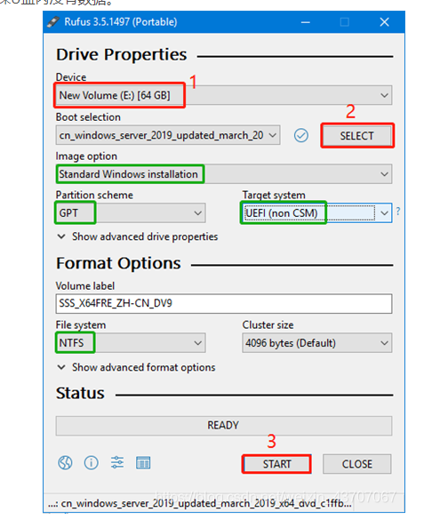
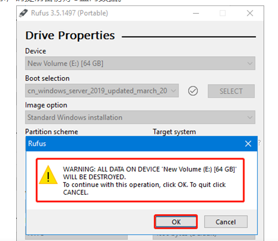
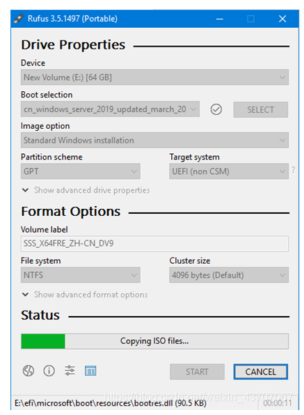
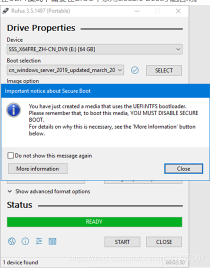
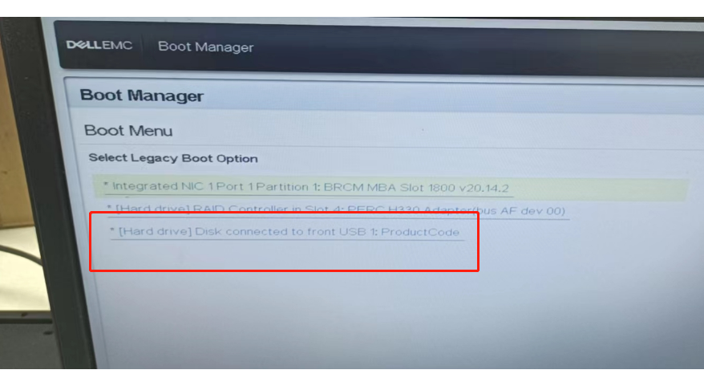
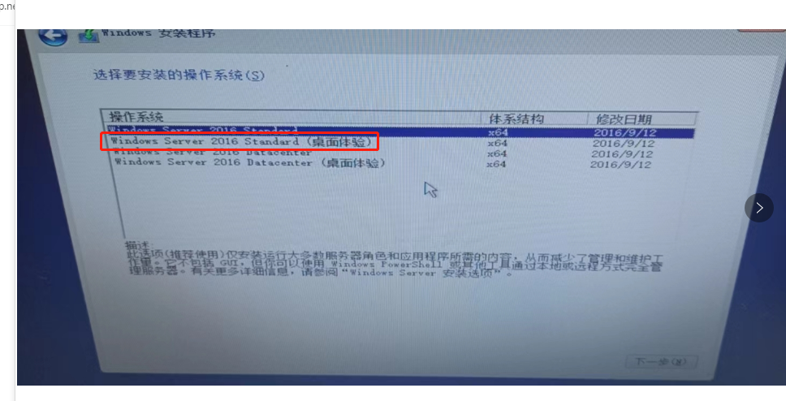
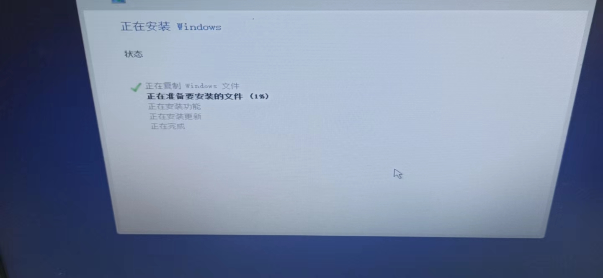
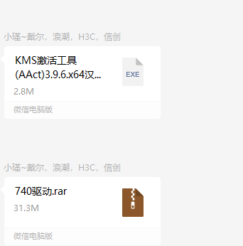
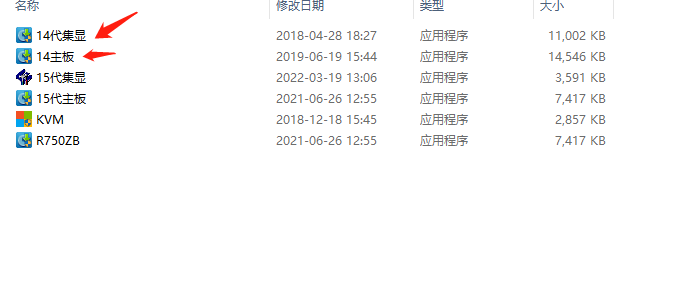

# 服务器安装Windows server2016 DELL R740

1.得找一个空的优盘  用软件刻录工具做一个u盘启动盘

[附件: rufus-3.17.rar](./attachments/JRqJKINuAQebICyV/rufus-3.17.rar)

Rufus是一款开源免费使用的启动盘制作工具，可创建大于4GB 的ISO镜像UEFI启动盘，

下载地址：[https://github.com/pbatard/rufus/releases/download/v3.11/rufus-3.11p.exe](https://github.com/pbatard/rufus/releases/download/v3.11/rufus-3.11p.exe)

T40 不支持使用Legacy BIOS启动内部磁盘，请务必确保启动盘支持UEFI引导。

第一次运行Rufus将提示是否检查更新，点击“否”即可进入主界面。

一、选择所需要制作成启动盘的U盘设备；

选择Windows Server ISO文件；

绿框内的内容将全部自动生成，请确认是否一致

点“Start” 开始制作，制作前请确保U盘内没有数据。

二、 提示U盘内所有数据都将被清除，请提前备份好U盘内数据。

三、 等待ISO写入

四、启动盘制作完毕后提示，该启动盘在UEFI模式下需要在BIOS中禁用Secure Boot才能启动。

系统安装选带桌面的 

重启  按F2 进bios设置页面  第一个选项 进去 找boot开头的选项

进去第一个改成uefi   按esc退出  保存 

系统选择

安装系统

打驱动和激活

[附件: 740驱动.rar](./attachments/JRqJKINuAQebICyV/740驱动.rar)[附件: KMS激活工具(AAct)3.9.6.x64汉化版.rar](./attachments/JRqJKINuAQebICyV/KMS激活工具(AAct)3.9.6.x64汉化版.rar)

> 更新: 2022-11-29 18:04:44  
> 原文: <https://www.yuque.com/lixinsi/srgrkk/csc21f3vdmau0uoi>