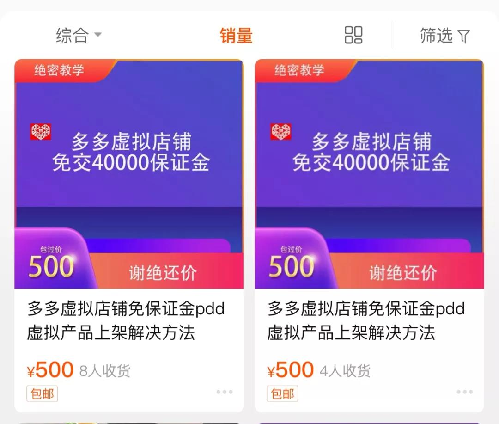
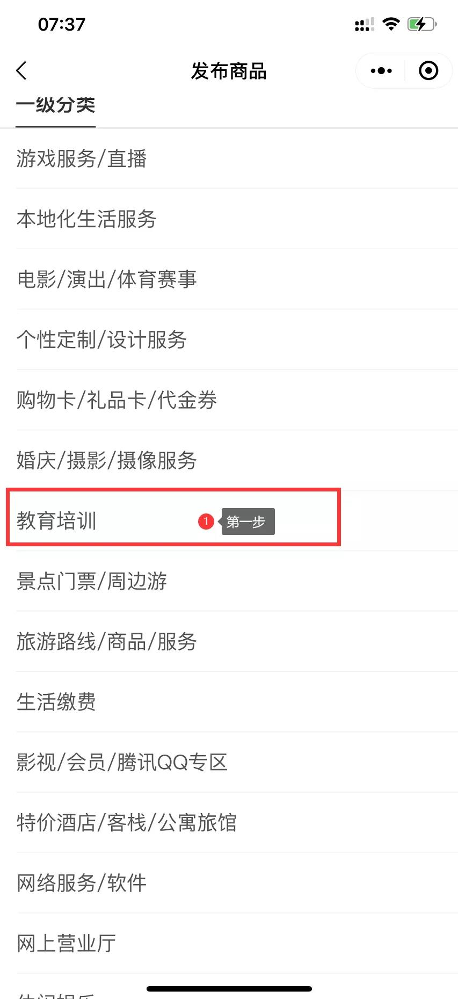
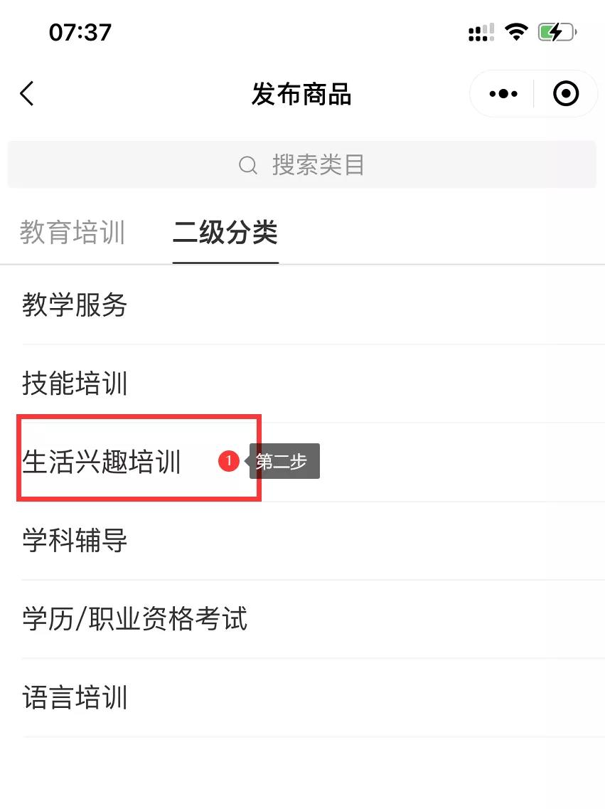
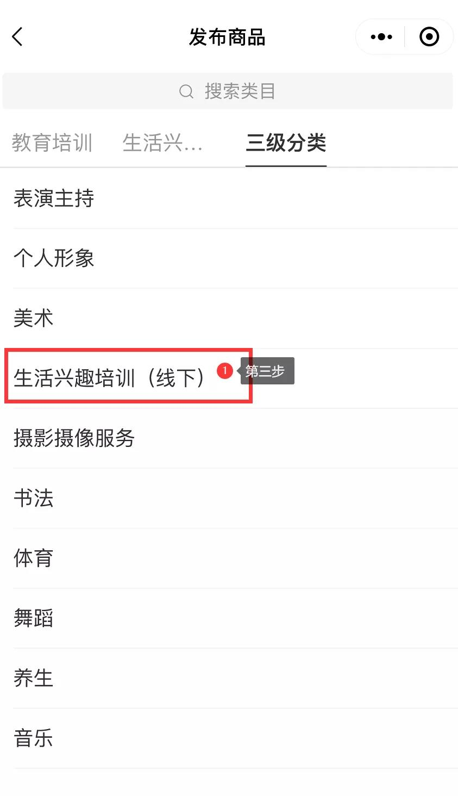
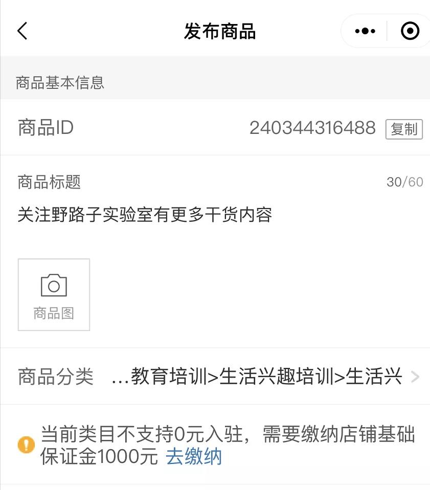
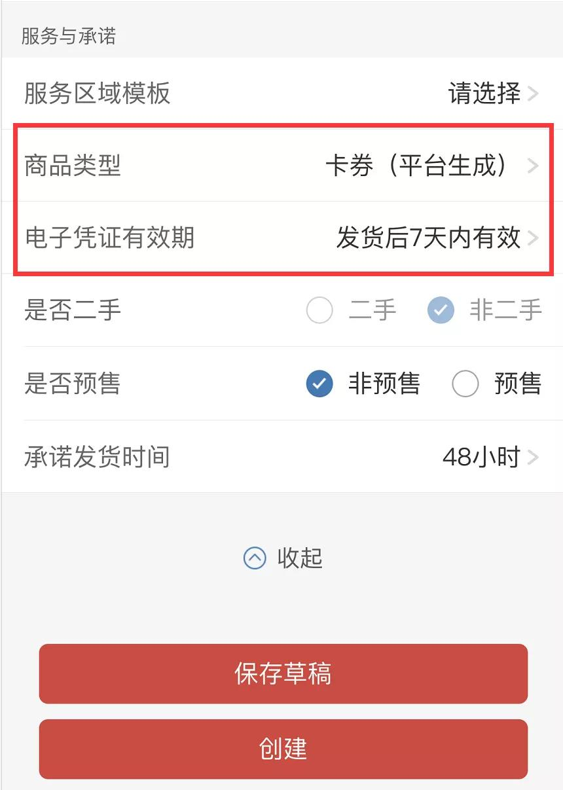

# 拼多多虚拟类目

**拼多多虚拟店铺免40000保证金如何做？**

 

众所周知[拼多多](https://www.niaogebiji.com/tag/%E6%8B%BC%E5%A4%9A%E5%A4%9A)现在流量非常大，虚拟也算是蓝海，想做的人大部分都被保证金拦在门外，高达4W的保证金不是每个人都能承受的，正好在当下有一个方法可以解决这个苦恼。

  

拼多多虚拟店铺免保证金玩法现在处于前期阶段，很多人还不知道这个玩法，市场卖这个技术也高达百元，第一批做虚拟产品的还是可以赚点零花钱的，后期可能拼多多对于虚拟这块升级会有所限制，最起码能做一天是一天。

  

  

我们首先是去注册一个虚拟店铺。

  

注册好店铺之后有一个**初始保证金1000是要缴纳**的，缴纳之后，我们点击**发布商品**，最重要的是选择类目这里。

  

**选择教育培训-生活兴趣培训-生活兴趣培训（线下）**

**  
**

  

  

**一定要按照上述的类目选择，如果选择其他类目全部要求你缴纳40000保证金。**

  

  

选择好**进入类目发布，按照所有提示填写设置可以**，最后**有一项是电子凭证**，主要免保证金玩法就靠这个**电子凭证核销，你可以随意选择，最好是发货后1天内有效。**

  

  

都设置好之后提交等待审核，可以通过商品列表查看是否审核通过，**通过审核以后我们到后台核销工具里面找到订单核销门店管理，新建一个门店，按照提示操作就可以，**弄好之后等待门店审核通过就可以使用了。

  

当有客户购买你的商品以后**找客户索要券码，拿到券码后到你的核销工具里面，输入客户给的券码，选择门店开始核销**就可以完成一次销售，然后去给用户发货。

  

操作非常简单，想做的直接去**注册一个个人店铺**就可以，**现在审核几乎都是秒通过**，最主要**虚拟产品是真正的空手套白狼，尤其卖资料根本没什么成本的**，**卖1件和卖10W件除了利润提高以外成本没有任何增加。**

> 更新: 2022-10-20 21:43:51  
> 原文: <https://www.yuque.com/lixinsi/oia1qm/mfc5kr>