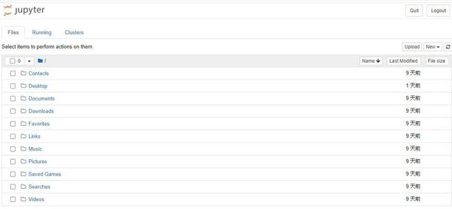

# Windowslinux下Jupyter Notebook的安装

**Windows下Jupyter Notebook的安装与远程访问配置**

<font style="color:rgb(34, 34, 34);">Jupyter Notebook是基于网页的用于交互计算的应用程序。其可被应用于全过程计算：开发、文档编写、运行代码和展示结果。</font>

<font style="color:rgb(34, 34, 34);">1、安装Python3</font>

<font style="color:rgb(34, 34, 34);">2、pip的安装  
</font>

<font style="color:rgb(34, 34, 34);">参照：Python中PIP的安装</font><font style="color:rgb(34, 34, 34);">  
</font>

<font style="color:rgb(34, 34, 34);">3、</font><font style="color:rgb(34, 34, 34);">jupyter-noteboo</font><font style="color:rgb(34, 34, 34);">安装</font>

```shell
pip install jupyter notebook -i http://pypi.douban.com/simple/ --trusted-host pypi.douban.com
```

<font style="color:rgb(34, 34, 34);">4、配置远程访问</font>

<font style="color:rgb(34, 34, 34);">（1）生成配置文件jupyter-notebook --generate-config</font>

<font style="color:rgb(34, 34, 34);">（2）设置密码jupyter-notebook password</font>

<font style="color:rgb(34, 34, 34);">C:\Users\Guo>jupyter-notebook --generate-config</font><font style="color:rgb(34, 34, 34);">  
</font><font style="color:rgb(34, 34, 34);">Writing default config to: C:\Users\Guo\.jupyter\jupyter_notebook_config.py</font><font style="color:rgb(34, 34, 34);">  
</font><font style="color:rgb(34, 34, 34);">  
</font><font style="color:rgb(34, 34, 34);">C:\Users\Guo>jupyter-notebook password</font><font style="color:rgb(34, 34, 34);">  
</font><font style="color:rgb(34, 34, 34);">Enter password:</font><font style="color:rgb(34, 34, 34);">  
</font><font style="color:rgb(34, 34, 34);">Verify password:</font><font style="color:rgb(34, 34, 34);">  
</font><font style="color:rgb(34, 34, 34);">[NotebookPasswordApp] Wrote hashed password to C:\Users\Guo\.jupyter\jupyter_not</font><font style="color:rgb(34, 34, 34);">  
</font><font style="color:rgb(34, 34, 34);">ebook_config.json</font>

<font style="color:rgb(34, 34, 34);">（3）查看密码：打开C:\Users\Guo</font><font style="color:rgb(34, 34, 34);">.</font><font style="color:rgb(34, 34, 34);">jupyter\jupyter_notebook_config.json</font>

<font style="color:rgb(34, 34, 34);">{</font><font style="color:rgb(34, 34, 34);">  
</font><font style="color:rgb(34, 34, 34);">"NotebookApp": {</font><font style="color:rgb(34, 34, 34);">  
</font><font style="color:rgb(34, 34, 34);">"password": "argon2:$argon2id$v=19$m=10240,t=10,p=8$1HlRX82mRx7+f5o+1GJo3A$wJB8Frf4Tm1ABK3hVKeJ9c/9XEogdfBqyG1b4/IFT1o"</font><font style="color:rgb(34, 34, 34);">  
</font><font style="color:rgb(34, 34, 34);">}</font><font style="color:rgb(34, 34, 34);">  
</font><font style="color:rgb(34, 34, 34);">}</font>

<font style="color:rgb(34, 34, 34);">（4）修改配置文件jupyter_notebook_config.py</font>

<font style="color:rgb(34, 34, 34);">在文件尾添加如下代码</font>

<font style="color:rgb(34, 34, 34);">c.NotebookApp.ip = '*' # 允许访问此服务器的 IP，星号表示任意 IP</font><font style="color:rgb(34, 34, 34);">  
</font><font style="color:rgb(34, 34, 34);">c.NotebookApp.password = 'argon2:$argon2id$v=19$m=10240,t=10,p=8$1HlRX82mRx7+f5o+1GJo3A$wJB8Frf4Tm1ABK3hVKeJ9c/9XEogdfBqyG1b4/IFT1o' # 之前生成的密码 hash 字串, 粘贴进去</font><font style="color:rgb(34, 34, 34);">  
</font><font style="color:rgb(34, 34, 34);">c.NotebookApp.open_browser = False # 运行时不打开本机浏览器</font><font style="color:rgb(34, 34, 34);">  
</font><font style="color:rgb(34, 34, 34);">c.NotebookApp.port = 8890 # 使用的端口，随意设置，但是要记得你设定的这个端口</font><font style="color:rgb(34, 34, 34);">  
</font><font style="color:rgb(34, 34, 34);">c.NotebookApp.enable_mathjax = True # 启用 MathJax</font><font style="color:rgb(34, 34, 34);">  
</font><font style="color:rgb(34, 34, 34);">c.NotebookApp.allow_remote_access = True #允许远程访问</font><font style="color:rgb(34, 34, 34);">  
</font><font style="color:rgb(34, 34, 34);">c.NotebookApp.allow_root = True</font>

<font style="color:rgb(34, 34, 34);">5、启动 jupyter notebook</font>




# ubantu安装jupyter
```shell
sudo apt-get update
---在终端中输入--: sudo apt-get install openssh-server
```

<font style="color:rgb(0, 0, 0);">  
</font>


> 更新: 2022-08-17 14:40:02  
> 原文: <https://www.yuque.com/lixinsi/kmvnv0/la2gvt>