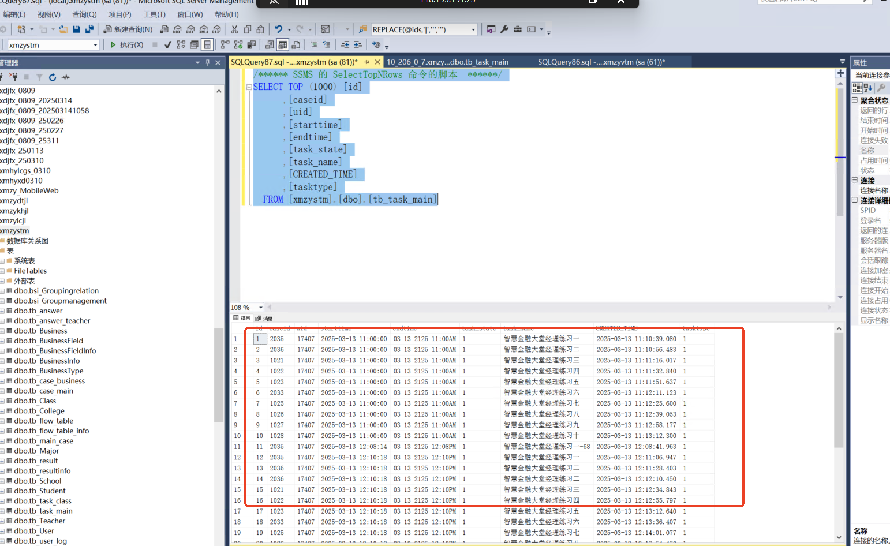
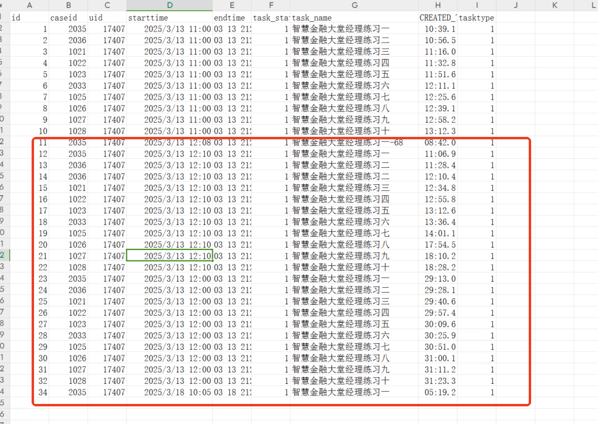
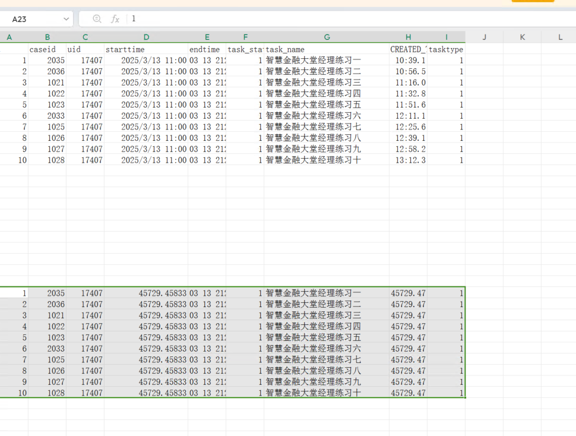

# 智慧金融清理脚本以及机具无法重置

declare [@tablename ](/tablename ) nvarchar(100)   
DECLARE test_Cursor CURSOR LOCAL FOR  
select name from dbo.sysobjects where xtype='u' and (not name LIKE 'dtproperties') and (name like'yw_%' or name like 'zhyw_Exam%') and  name <>'yw_355503' order by name  
open test_Cursor  
FETCH NEXT FROM test_Cursor into [@tablename ](/tablename )   
WHILE  (@@fetch_status=0)  
begin  
exec('truncate table '+ [@tablename) ](/tablename) )   
fetch next from test_Cursor into [@tablename ](/tablename )   
end  
close test_Cursor  
deallocate test_Cursor


/_ɾ���˺�Ǯ��༶��_/  
truncate table dbo.bi_Team  
truncate table dbo.bi_BankTeller  
truncate table dbo.bi_Teller_CashDrawer


truncate table dbo.cps_ExamResult  
truncate table dbo.cps_ExamResult_Detail  
truncate table dbo.dcs_ExamResult  
truncate table dbo.dcs_ExamResult_Detail  
truncate table dbo.dzs_ExamResult  
truncate table dbo.dzs_ExamResult_Detail


/*ɾ���ۺϿ��Գɼ���/  
truncate table zhyw_ExamCurrentTask  
truncate table zhyw_ExamLog  
truncate table zhyw_ExamLog_0  
truncate table zhyw_ExamLog_1  
truncate table zhyw_ExamLog_2  
truncate table zhyw_ExamLog_3  
truncate table zhyw_ExamLog_4  
truncate table zhyw_ExamLog_5  
truncate table zhyw_ExamLog_6  
truncate table zhyw_ExamLog_7  
truncate table zhyw_ExamLog_8  
truncate table zhyw_ExamLog_9


truncate table zhyw_ExamResult  
truncate table zhyw_ExamResult_0  
truncate table zhyw_ExamResult_1  
truncate table zhyw_ExamResult_2  
truncate table zhyw_ExamResult_3  
truncate table zhyw_ExamResult_4  
truncate table zhyw_ExamResult_5  
truncate table zhyw_ExamResult_6  
truncate table zhyw_ExamResult_7  
truncate table zhyw_ExamResult_8  
truncate table zhyw_ExamResult_9


--truncate table zhyw_ExamResultForm  
truncate table zhyw_ExamResultTask  
truncate table zhyw_ExamResultTask_0  
truncate table zhyw_ExamResultTask_1  
truncate table zhyw_ExamResultTask_2  
truncate table zhyw_ExamResultTask_3  
truncate table zhyw_ExamResultTask_4  
truncate table zhyw_ExamResultTask_5  
truncate table zhyw_ExamResultTask_6  
truncate table zhyw_ExamResultTask_7  
truncate table zhyw_ExamResultTask_8  
truncate table zhyw_ExamResultTask_9


truncate table zhyw_ExamResultTaskDetail  
truncate table zhyw_ExamResultTaskDetail_0  
truncate table zhyw_ExamResultTaskDetail_1  
truncate table zhyw_ExamResultTaskDetail_2  
truncate table zhyw_ExamResultTaskDetail_3  
truncate table zhyw_ExamResultTaskDetail_4  
truncate table zhyw_ExamResultTaskDetail_5  
truncate table zhyw_ExamResultTaskDetail_6  
truncate table zhyw_ExamResultTaskDetail_7  
truncate table zhyw_ExamResultTaskDetail_8  
truncate table zhyw_ExamResultTaskDetail_9


--select * from zhyw_ExamResultTaskDetail  
IF NOT EXISTS(SELECT * FROM syscolumns WHERE [ID] = object_id(N'zhyw_ExamResultTaskDetail') AND [NAME] = N'ListMethod')  
alter table zhyw_ExamResultTaskDetail ADD ListMethod nvarchar(100)  NULL


IF NOT EXISTS(SELECT * FROM syscolumns WHERE [ID] = object_id(N'zhyw_ExamResultTask') AND [NAME] = N'ListMethod')  
alter table zhyw_ExamResultTask ADD ListMethod nvarchar(100)  NULL


IF NOT EXISTS(SELECT * FROM syscolumns WHERE [ID] = object_id(N'zhyw_ExamResult') AND [NAME] = N'ListMethod')  
alter table zhyw_ExamResult ADD ListMethod nvarchar(100)  NULL


/_�ֹ����_/  
truncate table cps_ExamResult  
truncate table cps_ExamResult_Detail  
truncate table cps_ExamResult_Detail1


truncate table dzs_ExamResult  
truncate table dzs_ExamResult_Detail


truncate table dcs_ExamResult  
truncate table dcs_ExamResult_Detail


/_����֪ʶ_/  
truncate table YHZS_ExaminationDetails  
truncate table YHZS_ExaminationResult  
truncate table YHZS_ExaminationResult_yx


/_����֪ʶ_/  
truncate table HBZS_ExaminationDetails  
truncate table HBZS_ExaminationResult  
truncate table HBZS_ExaminationResult_yx  
delete from [YHZS_RelationalTable] where [RllT_ADDText] in ('YHZS_Examination')


delete from [HBZS_RelationalTable] where [RllT_ADDText] in ('HBZS_Examination')  
/**/  
truncate table zhyw_Frequency


truncate table FengXianPinGuJieGuo


/_ƾ֤ʹ�ü�¼_/


--truncate table zhyw_FormVoucherNo


### 智慧金融 VTM 和 stm 无法重置
```markdown
/****** SSMS 的 SelectTopNRows 命令的脚本  ******/
SELECT TOP (1000) [id]
      ,[caseid]
      ,[uid]
      ,[starttime]
      ,[endtime]
      ,[task_state]
      ,[task_name]
      ,[CREATED_TIME]
      ,[tasktype]
  FROM [xmzystm].[dbo].[tb_task_main]
```


查看表格，清除数据










> 更新: 2025-03-18 11:37:44  
> 原文: <https://www.yuque.com/lixinsi/kmvnv0/fgwnzgppa04roigk>