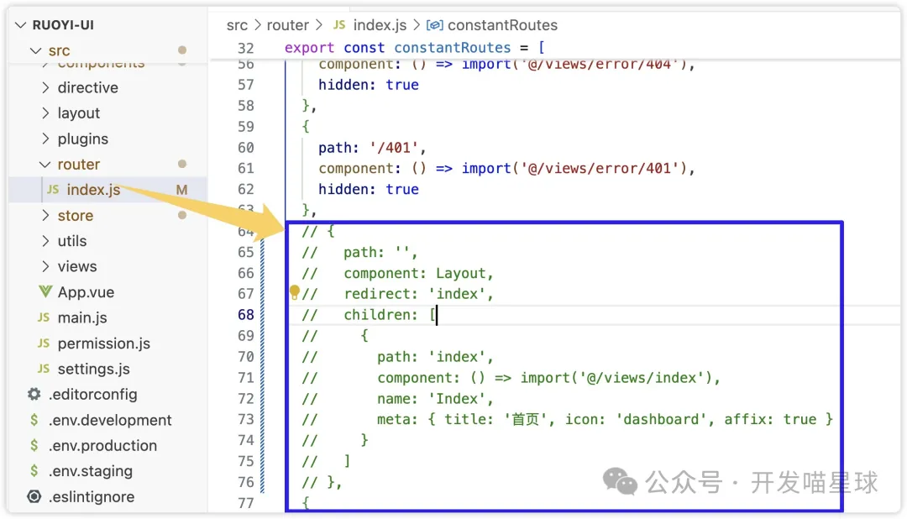
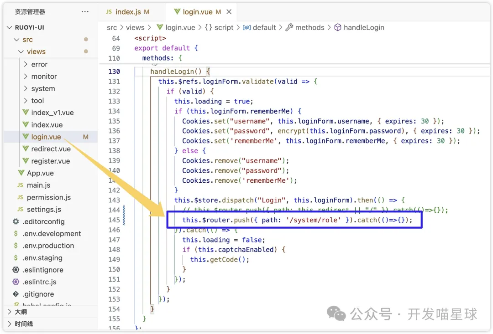
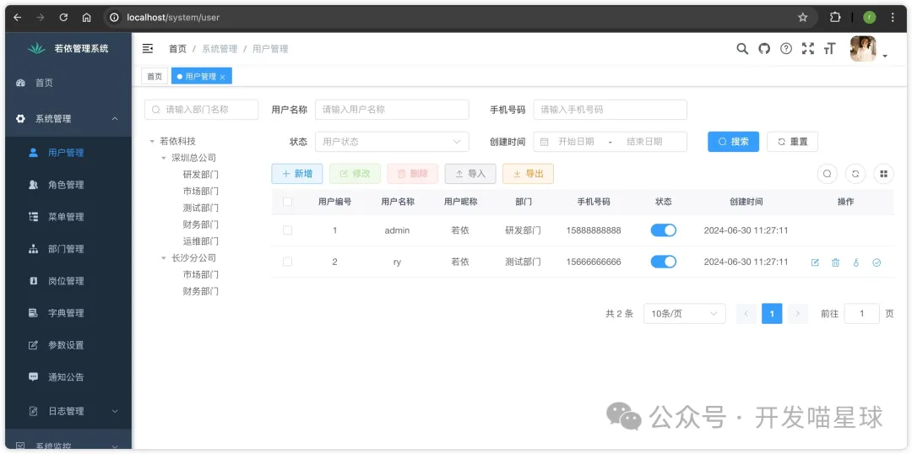
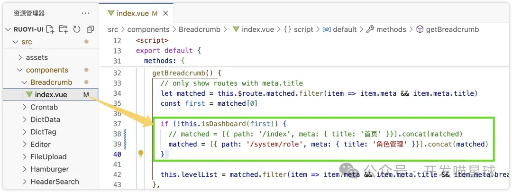
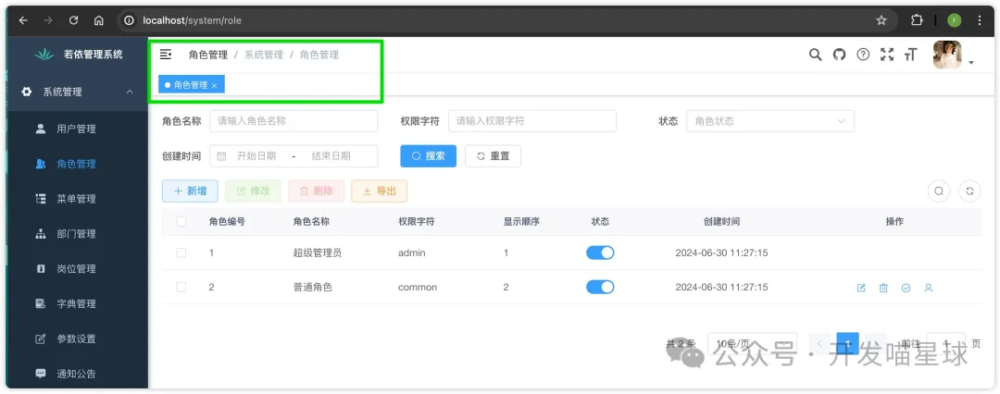

# RuoYi-Vue 中移除或自定义首页

# **<font style="color:rgb(0, 0, 0);background-color:#FFFFFF;">正文开始：</font>**

<font style="color:rgb(99, 99, 99);background-color:#FFFFFF;">在 RuoYi-Vue 中，首页默认指向仪表盘。本文将详细讲解如何移除首页或修改登录后的默认页面跳转，并解决因移除首页而带来的其他问题。</font>

### <font style="color:rgb(5, 149, 191);background-color:#FFFFFF;">步骤 1：注释或删除首页路由配置</font>

<font style="color:rgb(51, 51, 51);background-color:#FFFFFF;">打开 </font><code><font style="color:rgb(9, 132, 79);background-color:#FFFFFF;">router/index.js</font></code><font style="color:rgb(51, 51, 51);background-color:#FFFFFF;"> 文件，找到与首页相关的路由配置并将其注释或删除，以达到移除默认首页的效果。以下是代码示例：</font>

```json
// {
//   path: '',
//   component: Layout,
//   redirect: 'index',
//   children: [
//     {
//       path: 'index',
//       component: () => import('@/views/index'),
//       name: 'Index',
//       meta: { title: '首页', icon: 'dashboard', affix: true }
//     }
//   ]
// },
```

<font style="color:rgb(99, 99, 99);background-color:#FFFFFF;">注释掉这段代码后，系统不再加载默认的首页布局。</font>



### <font style="color:rgb(5, 149, 191);background-color:#FFFFFF;">步骤 2：修改登录后的跳转页面</font>

<font style="color:rgb(51, 51, 51);background-color:#FFFFFF;">为了在用户登录成功后跳转到您自定义的页面，需要编辑 </font><code><font style="color:rgb(9, 132, 79);background-color:#FFFFFF;">login.vue</font></code><font style="color:rgb(51, 51, 51);background-color:#FFFFFF;"> 文件中的登录逻辑。找到负责登录成功跳转的代码，并将跳转路径设为新的页面路径（例如 </font><code><font style="color:rgb(9, 132, 79);background-color:#FFFFFF;">/system/role</font></code><font style="color:rgb(51, 51, 51);background-color:#FFFFFF;">）。</font>

<font style="color:rgb(51, 51, 51);background-color:#FFFFFF;">在 </font><code><font style="color:rgb(9, 132, 79);background-color:#FFFFFF;">login.vue</font></code><font style="color:rgb(51, 51, 51);background-color:#FFFFFF;"> 文件的登录逻辑中进行如下修改：</font>

```plain
this.$router.push({ path: '/system/role' }).catch(() => {});
```

<font style="color:rgb(163, 163, 163);background-color:#FFFFFF;">这样修改后，用户登录成功会自动跳转至角色管理页面或其他您指定的页面。</font>



### <font style="color:rgb(5, 149, 191);background-color:#FFFFFF;">步骤 3：登录后验证跳转效果</font>

<font style="color:rgb(51, 51, 51);background-color:#FFFFFF;">完成上述修改后，尝试登录系统并检查是否成功跳转到指定页面：</font>



### <font style="color:rgb(5, 149, 191);background-color:#FFFFFF;">解决方案：修改面包屑组件中的首页路径</font>

<font style="color:rgb(51, 51, 51);background-color:#FFFFFF;">为避免跳转至 </font><code><font style="color:rgb(9, 132, 79);background-color:#FFFFFF;">404</font></code><font style="color:rgb(51, 51, 51);background-color:#FFFFFF;"> 页面，需要修改面包屑导航的首页路径，使其指向新的页面。打开 </font><code><font style="color:rgb(9, 132, 79);background-color:#FFFFFF;">src/components/Breadcrumb/index.vue</font></code><font style="color:rgb(51, 51, 51);background-color:#FFFFFF;"> 文件，定位 </font><code><font style="color:rgb(9, 132, 79);background-color:#FFFFFF;">getBreadcrumb</font></code><font style="color:rgb(51, 51, 51);background-color:#FFFFFF;"> 方法并找到与首页路径相关的代码。在此处将首页路由替换为自定义路径，例如 </font><code><font style="color:rgb(9, 132, 79);background-color:#FFFFFF;">/system/role</font></code><font style="color:rgb(51, 51, 51);background-color:#FFFFFF;">。</font>

<font style="color:rgb(51, 51, 51);background-color:#FFFFFF;">将 </font><code><font style="color:rgb(9, 132, 79);background-color:#FFFFFF;">getBreadcrumb</font></code><font style="color:rgb(51, 51, 51);background-color:#FFFFFF;"> 方法中的首页路径修改如下：</font>

```json
matched = [{ path: '/system/role', meta: { title: '角色管理' }}].concat(matched);
```



<font style="color:rgb(51, 51, 51);background-color:#FFFFFF;">通过以上更改，点击面包屑中的“首页”时，用户将跳转到角色管理页面或其他自定义页面。</font>

### <font style="color:rgb(5, 149, 191);background-color:#FFFFFF;">最终效果：登录后查看页面跳转和面包屑导航</font>

<font style="color:rgb(51, 51, 51);background-color:#FFFFFF;">在完成所有修改后，登录系统并确认跳转效果及面包屑导航功能是否正常：</font>



### <font style="color:rgb(5, 149, 191);background-color:#FFFFFF;">总结</font>

<font style="color:rgb(51, 51, 51);background-color:#FFFFFF;">通过这三个步骤，可以有效移除 RuoYi-Vue 的默认首页或更改登录后的默认跳转页面，同时处理因首页删除而导致的面包屑导航问题。这一操作对定制化首页或跳转页面的需求非常实用，帮助实现个性化的登录体验。</font>


> 更新: 2024-10-29 09:09:33  
> 原文: <https://www.yuque.com/lixinsi/nxs3x9/ev7w322lul1paath>