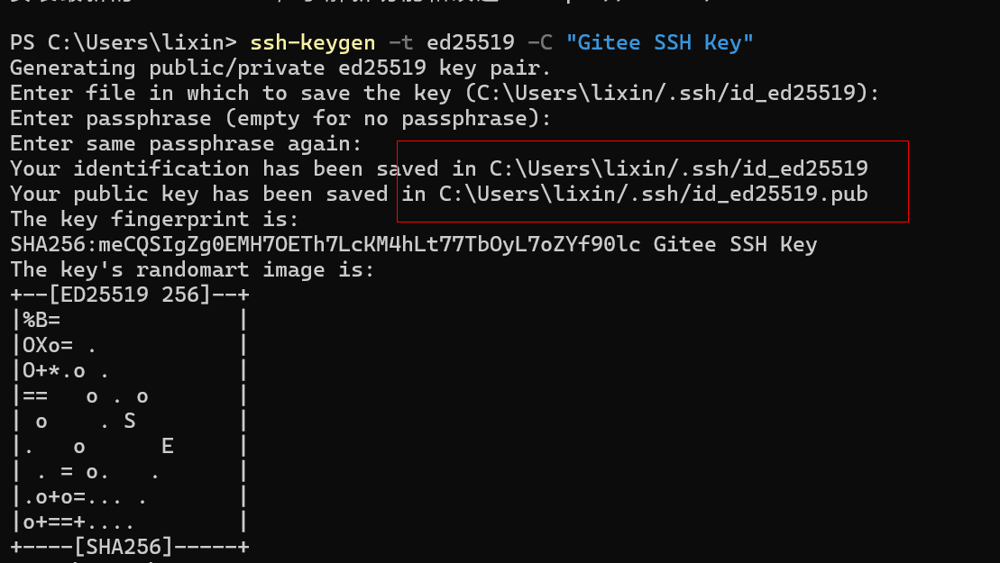
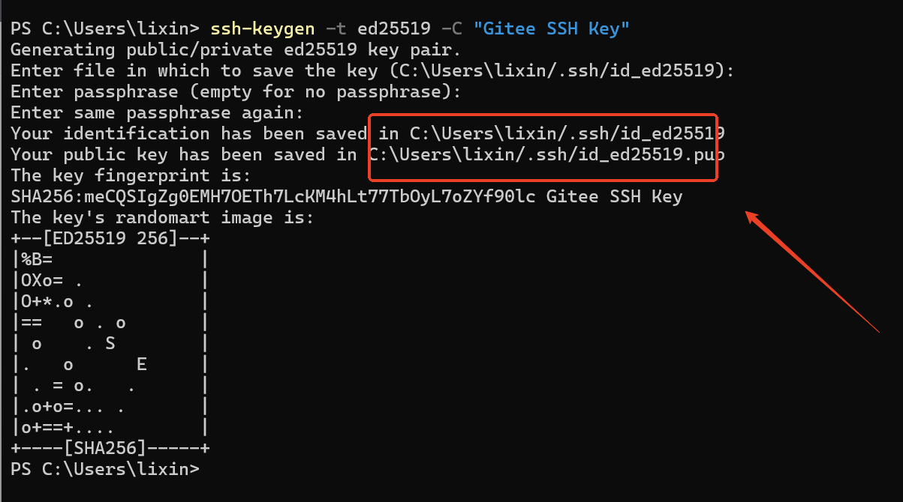
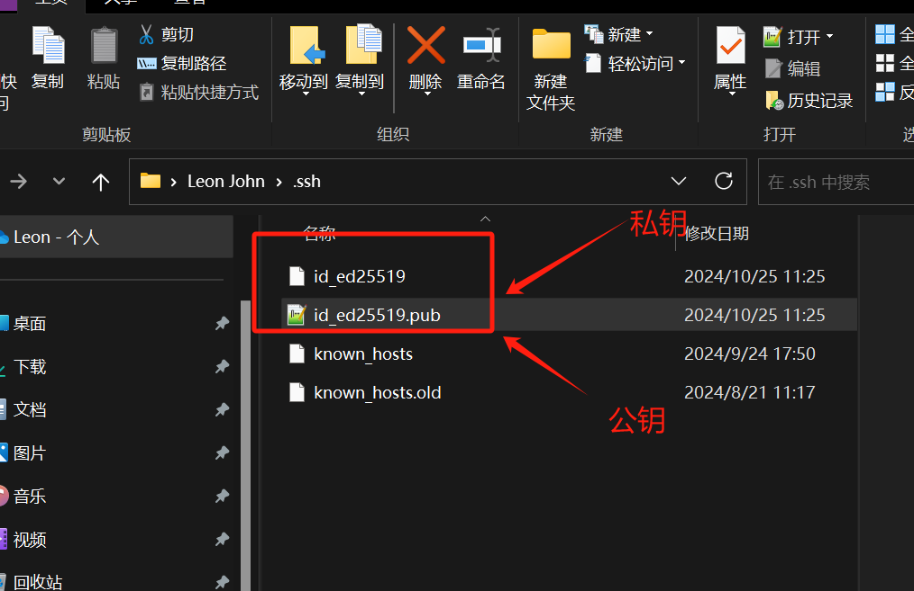
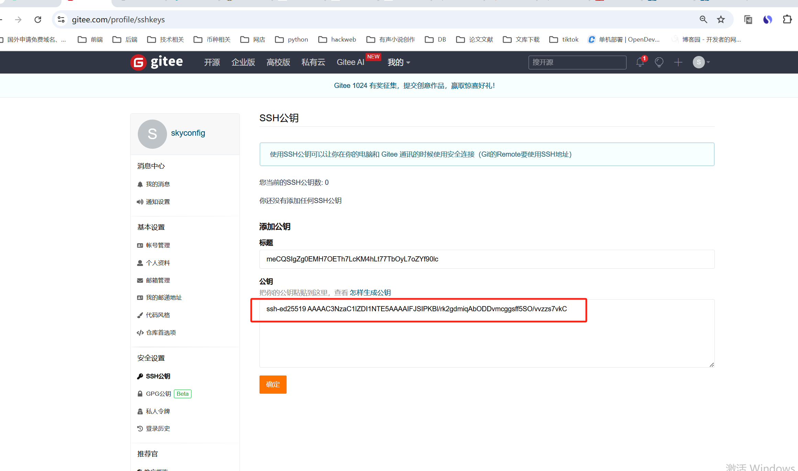
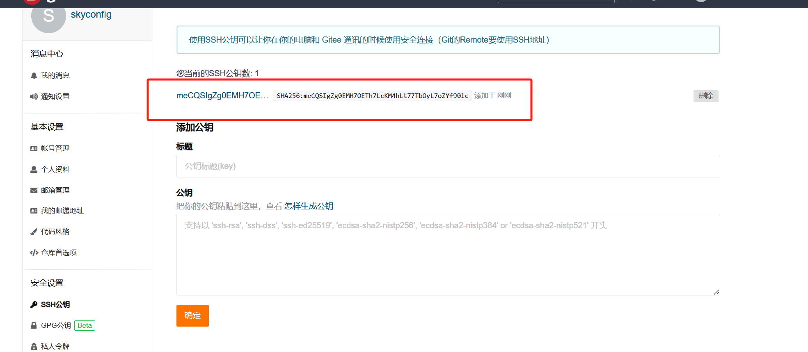

# gitee怎么添加自己的ssh私钥

### 1.打开 powershell 或者 gitbash 执行
```bash
ssh-keygen -t ed25519 -C "Gitee SSH Key"
```




### 2.生成后打开这个路径



### 3. 路径
```bash
C:\Users\lixin\.ssh
```



### 4. 打开公钥文件夹如图所示


### 5.输入密码 lxs19861019
添加成功




> 更新: 2024-10-25 11:34:19  
> 原文: <https://www.yuque.com/lixinsi/nxs3x9/aogloo0h1bgynqkw>