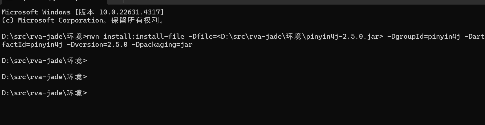

# 更新pinyin4j-2.5.0.jar 版本

要更新本地 Maven 仓库中的 `pinyin4j-2.5.0.jar` 版本，可以通过以下步骤操作：

### 步骤 1: 删除旧的 `pinyin4j` 文件（可选）

首先，如果你想彻底替换掉本地缓存中的 `pinyin4j-2.5.0.jar`，你可以手动删除它。去你本地 Maven 仓库的目录中删除相应的文件：

路径通常在 `~/.m2/repository/pinyin4j/pinyin4j/2.5.0/` 下，你可以删除该目录及其内容：

```plain

rm -rf ~/.m2/repository/pinyin4j/pinyin4j/2.5.0
```

### 步骤 2: 使用 `mvn install:install-file` 更新文件

然后，你可以使用 Maven 的 `install:install-file` 命令将新的 `pinyin4j-2.5.0.jar` 安装到本地 Maven 仓库：

```plain

mvn install:install-file -Dfile=<path-to-new-pinyin4j-2.5.0.jar> -DgroupId=pinyin4j -DartifactId=pinyin4j -Dversion=2.5.0 -Dpackaging=jar
```

* 将 `<path-to-new-pinyin4j-2.5.0.jar>` 替换为你更新后的 JAR 文件的实际路径。
* 这个命令会将 `pinyin4j-2.5.0.jar` 安装到你的本地 Maven 仓库，并覆盖掉原来的版本（如果之前存在的话）。

### 步骤 3: 强制更新项目依赖

完成安装之后，你可以通过以下命令来强制更新项目中的依赖，确保使用的是更新后的 `pinyin4j` 版本：

```plain

mvn clean install -U
```

`-U` 标志会强制 Maven 重新检查并下载最新的依赖版本，尽管它们可能已经被缓存。

### 步骤 4: 验证

最后，你可以验证一下是否更新成功。可以通过以下命令检查依赖：

```plain

mvn dependency:tree
```

这会列出所有项目依赖，并确保 `pinyin4j-2.5.0.jar` 使用的是你更新后的版本。

```shell
mvn install:install-file -Dfile=<D:\src\rva-jade\环境\pinyin4j-2.5.0.jar> -DgroupId=pinyin4j -DartifactId=pinyin4j -Dversion=2.5.0 -Dpackaging=jar
```




> 更新: 2024-11-06 08:43:49  
> 原文: <https://www.yuque.com/lixinsi/nxs3x9/xp897xg8m40b2kau>