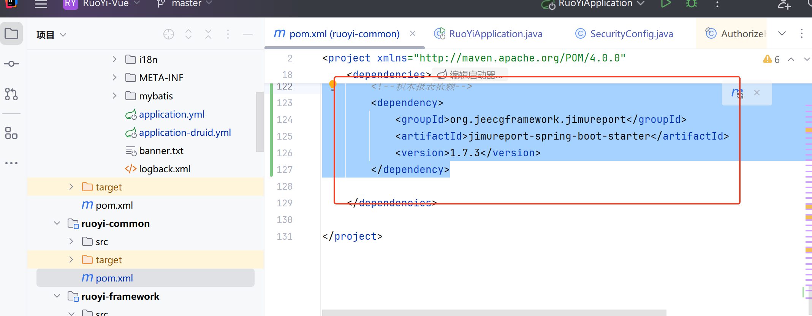
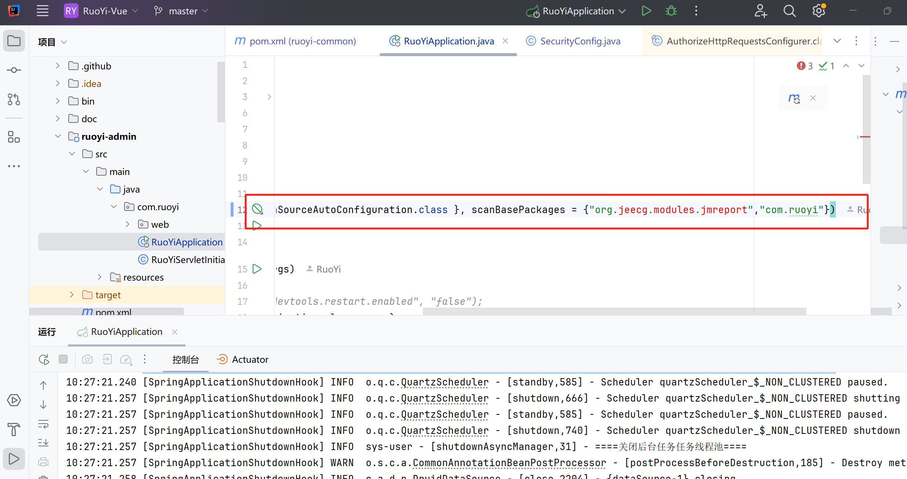
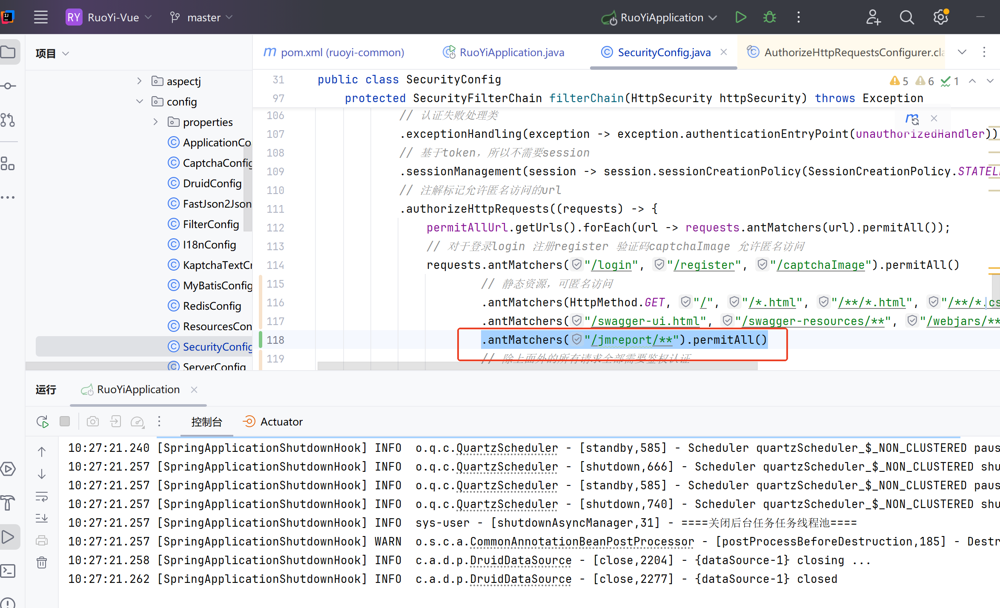
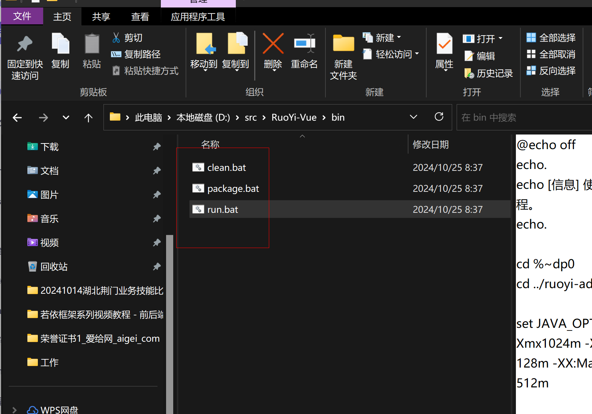
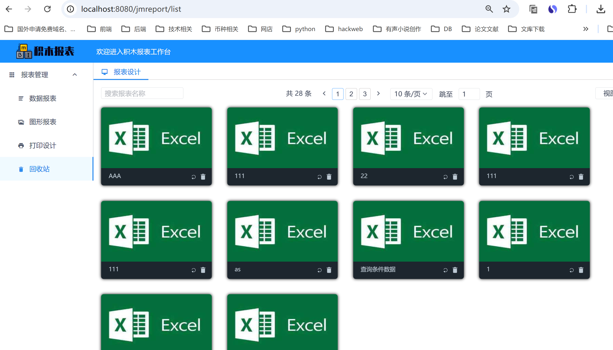
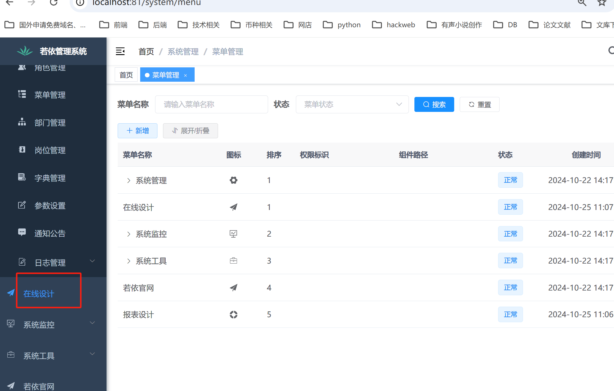
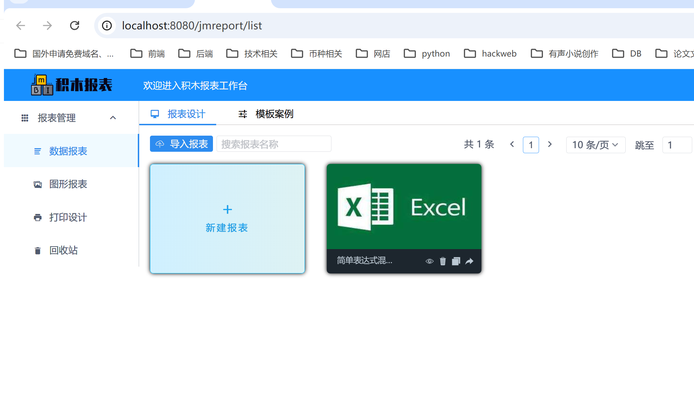

# 若依集成积木报表（后端）

### 1. 关于 JimuReport
JimuReport 是一款报表生成工具，类似于积木搭建的方式。你可以轻松将各类数据与图表模块组合，从而创建出美观且实用的报表。无论是销售、财务等专业报表，还是其他数据展示需求，JimuReport 都能够满足。


它的优势在于极大的简化了报表制作的流程，即便你没有专业的开发背景，也能轻松完成报表设计。同时，所有设计好的报表可以保存、管理，并支持随时查看与分享。JimuReport 就像是你的专属报表助手，显著提高了工作效率。


### 2. 执行初始化 SQL 脚本
为了正确使用积木报表功能，首先需要执行相关的 SQL 脚本。你可以通过以下地址获取所需的 SQL 文件：


[积木报表 SQL 文件]：[https://github.com/jeecgboot/JimuReport/tree/master/db](https://github.com/jeecgboot/JimuReport/tree/master/db)


### 3. 添加依赖
在 ruoyi-common 模块的 pom.xml 文件中引入积木报表的依赖。以下是相关的依赖配置：


<!--积木报表依赖-->

```xml
<!--积木报表依赖-->
<dependency>
  <groupId>org.jeecgframework.jimureport</groupId>
  <artifactId>jimureport-spring-boot-starter</artifactId>
  <version>1.7.3</version>
</dependency>
```

依赖的最新版本号可以从 JimuReport 更新日志 中查找。



### 4. 配置扫描目录
为了让若依项目正确扫描到积木报表相关的组件，需要在 RuoYiApplication 类中配置扫描路径：

```java
@SpringBootApplication(exclude = { DataSourceAutoConfiguration.class }, scanBasePackages = {"org.jeecg.modules.jmreport","com.ruoyi"})
```




### 5. 配置安全过滤
在 SecurityConfig 配置文件中，需要添加对积木报表路径的拦截排除配置。修改文件路径为 ruoyi-framework/src/main/java/com/ruoyi/framework/config/SecurityConfig.java，并添加以下内容：


```java
.antMatchers("/jmreport/**").permitAll()
```

<font style="color:#000000;background-color:#FFFFFF;">下图展示了配置示意：</font>




### 6.执行文件夹下面 D:\src\RuoYi-Vue\bin


### 7. 可选的 MiniDao 配置
在 application.yml 文件中，可以配置 minidao，不过这一步是可选的，具体配置如下：

```xml
minidao:
base-package: org.jeecg.modules.jmreport.desreport.dao*
```


### 8. 启动项目并访问报表页面
项目启动后，若依默认的端口为 8080，你可以根据需求修改端口号。端口号配置路径在 ruoyi-admin/src/main/resources/application.yml。


项目启动成功后，通过浏览器访问以下地址即可查看积木报表：[http://localhost:8080/jmreport/list](http://localhost:8080/jmreport/list)。




### 9. 新增报表菜单
在若依管理系统中，可以为积木报表创建菜单。按照以下步骤操作：

进入系统管理 -> 菜单管理；

新增一个目录（例如：在线设计）；

在此目录下新增菜单项（报表设计）。

如下图所示：






> 更新: 2024-10-25 11:09:27  
> 原文: <https://www.yuque.com/lixinsi/nxs3x9/dzgi9g7dlykerc85>