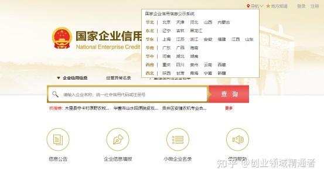
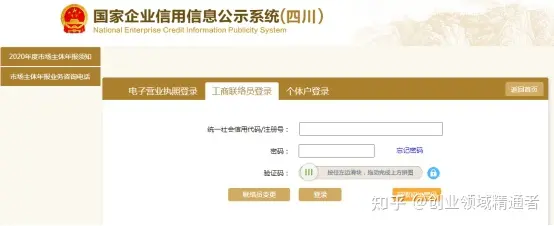
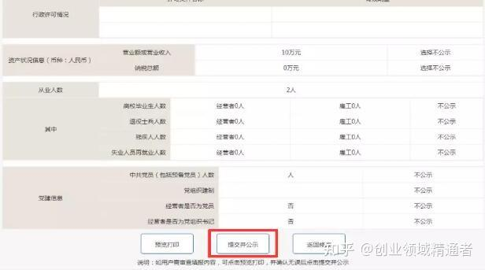

# 个体户工商户营业执照年检（年报）网上申报流程及时间！

我国从2014年将营业执照年检制度改革为年报网上公示，大大地节约了整个社会的人力物力，今天就给大家介绍下2021年个体户工商户营业执照年检网上申报流程及时间!

一、个体户工商户营业执照年检时间

现在已经没有年检这说法，统称网上年报(年审);另外个体工商户营业执照是不需要每年进行年审的，只需要于每年1月1日-6月30日前办理个体工商户《营业执照》年检(年报)。

1、根据《个体工商户年度报告暂行办法》第三条规定：个体工商户应当于每年1月1日至6月30日，通过企业信用信息公示系统或者直接向负责其登记的工商行政管理部门报送上一年度年度报告。

2、根据《企业信息公示暂行条例》第八条规定：企业应当于每年1月1日至6月30日，通过企业信用信息公示系统向工商行政管理部门报送上一年度年度报告，并向社会公示，当年设立登记的企业，自下一年起报送并公示年度报告。

因此个体户工商户营业执照年检时间在2021年1月-6月。注：由于各地的情况不一样，所以具体规定以当地的规定为准。

二、个体户工商户营业执照年检网上申报流程

步骤一：进入网页

1、在百度搜索栏输入“ 国家企业信用信息公示系统”，选择有“官网”认证的(见下图)，或者直接输入官方网址：[http://www.gsxt.gov.cn/index.html](https://link.zhihu.com/?target=http%3A//www.gsxt.gov.cn/index.html)

  

2、进入后在左上角“导航”位置选择您企业所属的省份;

步骤二：企业联络员注册

1、在首次【企业公示信息填报】之前，请先【企业联络员注册】，以后直接登录，我们以四川省为例注册。

  
企业联络员注册：

①首先点击网站下方“企业信息填报”，然后点击页面下方红色框内的“企业联络员注册”

②填写所有带 * 的项目(社会统一代码/注册号就是营业执照右上角的号码，联络员就是经营者本人)。

③点击保存，即注册成功(注册的联络员身份证号、手机号码务必牢记，每次登陆时需要该手机的验证码才可以进入系统)。

步骤三：联络员登录信息填写

1、企业用户进入国家企业信用信息公示系统网站选定所在地区后，点击网站下方“企业信息填报”

2、在“工商联络员登录”界面填写完成带 * 的项目。

3、点击“获取验证码”，并按照手机短信收到的一次性“动态密码”填写“验证码”。

4、点击“登录”。

步骤四：年度报告在线填写

登录之后选择【年报年度】(选择上一年度) → (依次选择页面左边栏需填写的项目，每项内容必填，如无请填“0”) 填写【个人基本信息】，其中“是否有网站或网店”，如无请点否 → 点击【保存】 → 点击【资产状况信息】填写 → 点击【保存】 → 点击【党建或社保信息】填写 → 点击【保存】 → 点击【预览并公示】 → 拉到页面底端点击【提交并公示】完成年报填写。

  

 上就是个体工商户营业执照年报(年审)网上填报流程，希望能帮到您，2020年马上就要过去了，各企业可以开始准备资料进行2021年的年报了。

登入网址：[https://shiming.gsxt.gov.cn/socialuser-use-rllogin.html](https://shiming.gsxt.gov.cn/socialuser-use-rllogin.html)

账号：17352804520   密码：Aa@#4520

现场联络员网址：[联络员注册](http://218.77.183.36:1888/liaisonRegister.jspx)

> 更新: 2024-03-05 16:52:44  
> 原文: <https://www.yuque.com/lixinsi/vycgmi/sqq0ckpxystwrs4i>